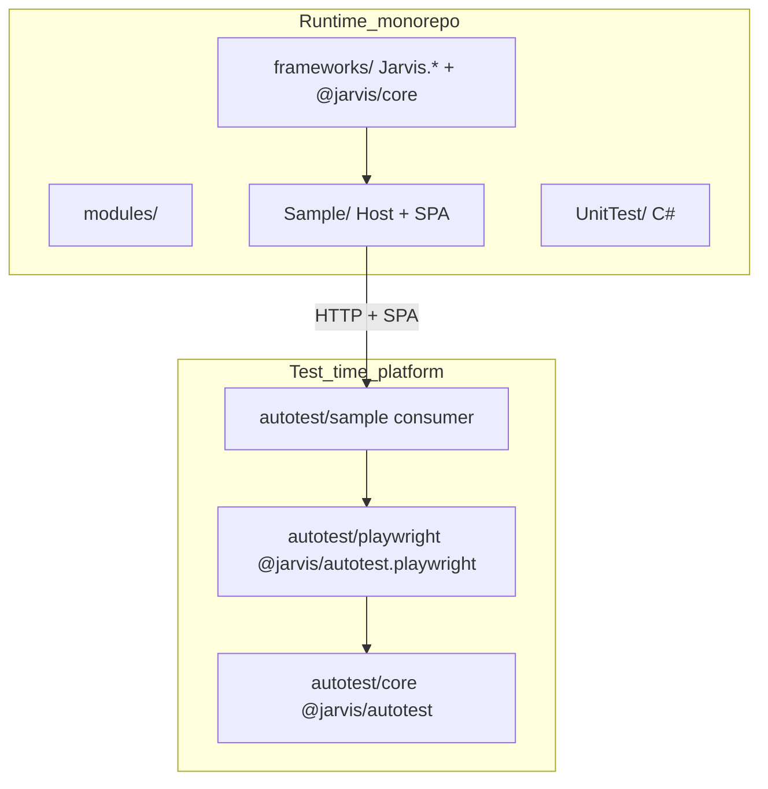

# Tổ chức Automation Test trong Jarvis

## Kết luận

Automation Core **không** thuộc `frameworks/` (NuGet runtime cho Host/Infrastructure) và **không** thuộc `modules/` (bounded context nghiệp vụ). Nó là **platform test-time**, cùng họ với `@jarvis/core` (TypeScript) nhưng vòng đời khác: product app không reference gói này.

Khuyến nghị: **thư mục top-level `autotest/`**, Atomic theo Jarvis:

- **Core** = contract + default (engine-agnostic)
- **Satellite** = driver Playwright (opt-in)
- **Sample** = consumer demo UI + API, layout SAD §17 — không chứa TVAN/invoice/Kafka

`UnitTest/` giữ nguyên: unit/integration **C#** cho `Jarvis.*`. Unit test của core nằm trong package TypeScript (`autotest/core/tests/`).

Không đưa repo TVAN [`autotest`](file:///Volumes/Data/Working/Projects/minvoice/epay/tvan/autotest) vào Jarvis (đã đúng). Chỉ lấy **pattern** SAD §16–§17 và reference implementation [`automation-core`](file:///Volumes/Data/Working/Projects/minvoice/epay/tvan/automation-core).



## Vì sao không đặt trong `frameworks/`

| Tiêu chí [architecture-rules.md](ADRs/architecture-rules.md) | `frameworks/` | Automation core |
|---|---|---|
| Consumer | Host / Infrastructure product | Repo autotest của từng product |
| Artifact | NuGet `Jarvis.*` | NPM `@jarvis/autotest*` |
| Đi vào runtime app | Có | Không |
| Engine | .NET 9 | TypeScript, Playwright optional |

`frameworks/frontend` (`@jarvis/core`) vẫn đúng vì SPA **chạy trong product**. Playwright/API harness không. Nhét vào `frameworks/` sẽ làm mờ ranh giới “package hạ tầng runtime”.

Phương án dự phòng (nếu muốn gom mọi TS kit): `frameworks/autotest/` — chấp nhận được nhưng **không** khuyến nghị.

## Cây thư mục đề xuất

```text
jarvis/
├── Jarvis.sln                          # không thêm project TS
├── frameworks/                         # không đổi vai trò
├── modules/
├── Sample/                             # SUT: API + SPA (clients/web)
├── UnitTest/                           # test C# Jarvis.*
├── autotest/                           # NEW — test-time platform
│   ├── package.json                    # npm workspaces (optional)
│   ├── core/                           # @jarvis/autotest
│   │   ├── src/                        # copy/adapt từ automation-core
│   │   │   ├── core/                   # TestContext, Configuration
│   │   │   ├── ports/                  # IHttpTransport, IBrowserDriver
│   │   │   ├── workflow/               # Workflow<TResult> contract
│   │   │   ├── api/                    # ApiClient, ApiClientError
│   │   │   ├── ui/                     # Page, Component, BrowserManager (base)
│   │   │   ├── composition/            # createTestHarness
│   │   │   ├── authentication/
│   │   │   ├── logging/
│   │   │   ├── reporting/
│   │   │   ├── retry/
│   │   │   ├── test-data/              # IdGenerator generic
│   │   │   └── index.ts                # public API whitelist
│   │   ├── tests/unit/
│   │   └── package.json
│   ├── playwright/                     # @jarvis/autotest.playwright
│   │   └── src/                        # PlaywrightTransport, fixture factory
│   └── sample/                         # consumer — UI + API
│       ├── tests/api/
│       ├── tests/ui/
│       ├── application/                # workflow: auth + open settings/tenant/file
│       ├── integrations/               # API clients chống Sample Host
│       ├── composition/
│       ├── ui/pages/                   # Page Object Sample SPA
│       ├── drivers/playwright/
│       ├── data/
│       ├── config/
│       └── package.json                # depend workspace @jarvis/autotest*
└── ADRs/
```

**Đặt tên:** folder = `autotest/`; NPM = `@jarvis/autotest` + `@jarvis/autotest.playwright` (core + satellite, giống `Jarvis.Caching` / `Jarvis.Caching.Redis`). Consumer demo = `autotest/sample` (chữ thường) — khác `Sample/` host .NET. **Không** dùng `@jarvis/automation*` — keyword `automation` dành cho capability khác (ví dụ Agent/AI làm automation). Không dùng `@minvoice/automation-core`.

**Playwright không nằm trong core.** SAD §16 để `src/drivers/` trong cùng repo core; Jarvis Atomic tách satellite để product chỉ API (không cài Playwright) vẫn dùng core. Sample UI/API cài thêm `@jarvis/autotest.playwright`.

## Không đặt consumer vào `Sample/clients/`

`Sample/clients/` hiện là **app client** của Host ([Sample/clients/README.md](Sample/clients/README.md): `web/` SPA → `wwwroot`; `mobile/` tương lai). Consumer SAD §17 không thuộc nhóm đó.

| Lý do | Chi tiết |
|-------|----------|
| Sai taxonomy | `clients/` = SPA/mobile gọi API. Autotest là harness test-time, không phải client user-facing. |
| Lẫn SUT và test | `Sample/` = app demo. Nhét Playwright/`application/`/`drivers/` vào đó làm Host trông như chứa test platform. Product dễ copy nhầm e2e vào `src/Host/clients/`. |
| NPM khác đời | `web` phụ thuộc `@jarvis/core`; autotest phụ thuộc `@jarvis/autotest*` + Playwright. Gom dưới `clients/` dễ thành một `package.json` kéo Playwright vào SPA. |
| Mẫu copy cho product | Team product cần layout `erp-autotest/` cạnh package core. `autotest/sample` cạnh `core/` + `playwright/` dạy đúng: “đây là consumer”. |

Colocate `Sample/autotest/` (không dưới `clients/`) chỉ thắng ở “gần SUT”; vẫn mờ ranh giới Host vs test-time. **Giữ `autotest/sample`.** SUT vẫn là `Sample/` (API + `clients/web`).

## Core vs Sample — ranh giới cứng

Lấy từ SAD §6 / public API hiện tại [`automation-core/src/index.ts`](file:///Volumes/Data/Working/Projects/minvoice/epay/tvan/automation-core/src/index.ts):

**Core được phép:** `TestContext`, `ApiClient` + `IHttpTransport`, `Workflow` interface, `createTestHarness`, `ApiKeyAuth` *strategy*, `pollUntil`, `RunContext`, `Page`/`Component` **base**, logger.

**Core cấm:** endpoint Sample (`/api/...`), locator SPA, workflow `loginAs` nghiệp vụ, XML/hóa đơn TVAN, Kafka/Mongo mock.

**Sample được phép (SAD §17):** `application/*`, `integrations/sample/`, `ui/pages`, `drivers/playwright`, `tests/api|ui` với tag `@smoke` / `@functional` / `@regression` (không tách folder smoke — khớp ADR-005 tag, tránh hai convention).

Import rule: `application/`, `integrations/`, `composition/` **cấm** `@playwright/test`. Playwright chỉ trong `drivers/playwright/`.

## Sample UI + API nên cover gì (Jarvis, không TVAN)

Chống [Sample/](Sample/) đang chạy (`dotnet run --project Sample` + SPA `Sample/clients/web`):

- **API:** 1–2 workflow mỏng — ví dụ auth probe / Setting HTTP (đã có trên Sample) qua `integrations/` + `ApiClient`.
- **UI (smoke navigation):** login rồi mở các trang **Setting**, **Tenant**, **File** qua sidebar — spec gọi workflow (intent), không locator.
  - Page Object: `LoginPage`, `AdminLayout` (nav), `SettingPage`, `TenantListPage`, `FileManagerPage`.
  - Workflow: `authenticationWorkflow.loginAs(user)` rồi `openSettings()` / `openTenants()` / `openFiles()`.
  - Spec ví dụ: login → assert từng trang load (title/heading), không CRUD sâu.
  - SPA hiện tại ([Sample/clients/web/src/App.tsx](Sample/clients/web/src/App.tsx)): `tenants` và file manager (`FILE_MANAGER_ROUTES`) đã mount; route `settings` đang comment (`SettingPage`). Khi implement: **bật lại** `/settings` (hoặc ổn định nav) để click Cài đặt không 404.
- Fixture inject `app` (composition facade), không `request.get/post` trong spec.

Không clone `modules/invoice` từ repo TVAN autotest. Đó là product, không phải Sample Jarvis.

## Mapping từ reference core → Jarvis

Đã implement trong automation-core (mang nguyên, đổi namespace): `TestContext`, `Configuration`, `IHttpTransport`, `ApiClient`, `Workflow`, `createTestHarness`, `AuthStrategy`/`ApiKeyAuth`, logging, `RunContext`, `pollUntil`, `tests/unit`.

Target khi Sample UI cần (không block API sample): `IBrowserDriver`, `src/ui/*`, Playwright satellite, `IdGenerator`, `CsvExporter` (có thể để Sample `scripts/` trước).

## Việc documentation (khi implement)

- Cập nhật [README.md](README.md):
  - Khối cấu trúc repo (khoảng dòng 66–106): thêm `autotest/` vào cây và bảng vai trò.
  - Thêm **mục Autotest** (cùng cấp Modules / Get started): `@jarvis/autotest` + `@jarvis/autotest.playwright`, `autotest/sample` (API + UI login → setting/tenant/file), SUT = `Sample/`, keyword `automation` dành cho Agent/AI, cách chạy sample (Host + Playwright).
- Ghi vào folder [ADRs/](ADRs/) **đang dùng chung**: ranh giới `autotest/` vs `frameworks/` — bổ sung [architecture-rules.md](ADRs/architecture-rules.md) (§0.2) và mục tham chiếu trên [ADRs/README.md](ADRs/README.md) nếu cần. **Không** tạo `YYYY-MM-DD-adr-jarvis-autotest.md`.
- Không thêm vào `Jarvis.sln`.

## Thứ tự triển khai gợi ý (sau khi approve)

1. Scaffold `autotest/core` từ automation-core (rename package, giữ public API).
2. Satellite `autotest/playwright` (`PlaywrightTransport` implement `IHttpTransport`).
3. `autotest/sample` layout SAD §17: API spec trước, UI spec sau khi có `Page` base + SPA selectors thật.
4. Cập nhật [README.md](README.md): cây thư mục + **mục Autotest** (package, sample UI/API, cách chạy).
5. Cập nhật `ADRs/` hiện có (`architecture-rules.md`); workspace npm dưới `autotest/` (không bắt buộc root workspace — tránh đụng `frameworks/frontend`).
