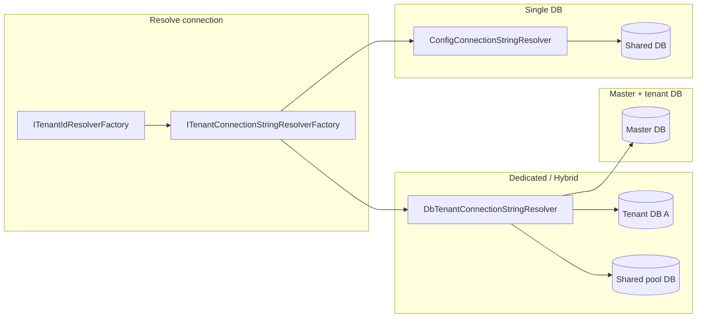

# Entity Framework

## Packages

| Project | PackageId | Ghi chú |
|---|---|---|
| Jarvis.EntityFramework | `Jarvis.EntityFramework` | Core |
| Jarvis.EntityFramework.PostgreSql | — | ProjectReference; marker provider |
| Jarvis.EntityFramework.MySql | — | ProjectReference; placeholder |

**NuGet host (chọn một):** `Npgsql.EntityFrameworkCore.PostgreSQL`, `Pomelo.EntityFrameworkCore.MySql`, …

## Chọn mô hình multitenancy

| Mô hình | Connection | Phân tách dữ liệu | `AddCoreDbContext` |
|---|---|---|---|
| **1. Single DB** | Một connection string cố định (config) | Cột `TenantId` + global query filter (`ITenantEntity`) | `AddCoreDbContext<TDb>` (1 generic) |
| **2. Separate tenant DB** | Mỗi tenant một DB; connection string lưu **Master DB** | Toàn bộ DB thuộc tenant (không bắt buộc `ITenantEntity`) | Master: `AddCoreDbContext<TMaster>`; App: `AddCoreDbContext<TApp, DbTenantConnectionStringResolver<…>>` |
| **3. Hybrid** | Master DB + một số tenant **chung** connection string, một số **riêng** | Tenant chung DB → bắt buộc `ITenantEntity`; tenant DB riêng → tùy chọn | Giống mô hình 2 |



**Luồng khi có tenant (HTTP / `SwitchDbContextAsync`):**

1. **UoW**: `_switchedTenantId` (sau `SwitchDbContextAsync`) → `ITenantIdResolverFactory`. **Không** đọc `ICurrentTenantAccessor` (tránh leak Master/tenant cùng request).
2. **Connection**: `ICurrentTenantAccessor` (sau switch) → `ITenantIdResolverFactory` → `TenantConnectionStringResolverFactory` → keyed resolver → connection string.
3. Overload 2 generic: `TenantDbConnectionInterceptor` gán connection khi connection **mở**.
4. `BaseUnitOfWork` gọi `SetTenantId` trên context (global filter cho `ITenantEntity`).

**Không có tenant trong request:** factory dùng `ConnectionStrings:{DbContextName}` từ config (phù hợp migrate, job chỉ Master, health check).

---

## Thành phần Jarvis

| Thành phần | Layer | Vai trò |
|---|---|---|
| `BaseStorageContext<T>` | EF | Global query filter `TenantId == context.TenantId` cho entity `ITenantEntity` |
| `BaseUnitOfWork<T>` | EF | `IDbContextFactory`, `SetTenantId`, `SwitchDbContextAsync` |
| `ITenantIdResolver` / `ITenantIdResolverFactory` | Domain | Resolve tenant id (keyed: Header, User, Query, Host) |
| `ITenantConnectionStringResolver` | Domain | `GetConnectionStringAsync(name)` — `name` là DbContext name hoặc tenant Guid |
| `TenantConnectionStringResolverFactory` | Domain | Kết hợp tenant id + keyed resolver |
| `ConfigConnectionStringResolver` | Domain | Đọc `IConfiguration.GetConnectionString(name)` |
| `DbTenantConnectionStringResolver<TMaster, TTenant>` | EF | Lookup `ITenantManagementEntity.ConnectionString` từ Master DB |
| `TenantDbConnectionInterceptor` | EF | Ghi đè connection string lúc mở connection (chỉ overload 2 generic) |
| `ITenantManagementEntity` | Domain | Entity registry tenant trên Master (`Id`, `ConnectionString`) |

`builder.AddEntityFramework()` đăng ký repository + keyed `ITenantIdResolver` + `ICurrentTenantAccessor`. **Không** tự chọn mô hình DB — host gọi `AddCoreDbContext` phù hợp.

---

## Chuẩn bị chung

### DbContext & UoW

```csharp
// Kế thừa BaseStorageContext để có global filter + SetTenantId
public class AppDbContext(DbContextOptions<AppDbContext> options)
    : BaseStorageContext<AppDbContext>(options)
{
    public DbSet<Order> Orders => Set<Order>();
}

public class AppUnitOfWork(
    IServiceProvider services,
    IDbContextFactory<AppDbContext> factory,
    ITenantIdResolverFactory tenantIdResolverFactory,
    ICurrentTenantAccessor currentTenantAccessor)
    : BaseUnitOfWork<AppDbContext>(services, factory, tenantIdResolverFactory, currentTenantAccessor),
      IAppUnitOfWork;
```

### Entity tenant (Single DB & Hybrid — tenant chung DB)

```csharp
public class Order : BaseEntity<Guid>, ITenantEntity
{
    public Guid TenantId { get; set; }
    // ...
}
```

### Entity registry trên Master (mô hình 2 & 3)

Implement `ITenantManagementEntity` (kế thừa `BaseEntity<Guid>` hoặc entity base của app):

```csharp
public class Tenant : BaseEntity<Guid>, ITenantManagementEntity
{
    public required string ConnectionString { get; set; }
}

public class MasterDbContext(DbContextOptions<MasterDbContext> options)
    : BaseStorageContext<MasterDbContext>(options)
{
    public DbSet<Tenant> Tenants => Set<Tenant>();
}
```

### Program.cs tối thiểu

```csharp
builder.AddEntityFramework();
builder.AddAppDbContext(); // extension Infrastructure — xem từng mô hình bên dưới
```

### appsettings.json

```json
{
  "ConnectionStrings": {
    "AutoMigrate": "true",
    "AppDbContext": "Host=localhost;...",
    "MasterDbContext": "Host=localhost;...;Database=master",
    "TenantDbContext": "Host=localhost;...;Database=placeholder"
  },
  "TenantHeaderKey": "X-Tenant-Id",
  "TenantQueryName": "tenantId",
  "TenantClaimName": "http://schemas.microsoft.com/ws/2008/06/identity/claims/groupsid"
}
```

`TenantDbContext` trong config là **placeholder** khi dùng interceptor (overload 2 generic); connection thật lấy từ Master hoặc config khi không có tenant.

### Migrate

```csharp
app.EnsureMigrateDb<IMasterUnitOfWork>();  // nếu có Master
app.EnsureMigrateDb<IAppUnitOfWork>();
```

Bật khi `ConnectionStrings:AutoMigrate` = `true`. Với dedicated DB: migrate **từng** database tenant (script/job), không chỉ placeholder.

---

## 1. Single DB (shared database)

Toàn bộ tenant dùng **một** database. Phân tách bằng cột `TenantId` và global query filter.

**Đăng ký DI** — overload **một** generic, connection **cố định**, **không** `TenantDbConnectionInterceptor`:

```csharp
public static IHostApplicationBuilder AddAppDbContext(this IHostApplicationBuilder builder)
{
    builder.Services.AddScoped<IAppUnitOfWork, AppUnitOfWork>();

    builder.Services.AddCoreDbContext<AppDbContext>(options =>
        options.UseNpgsql(builder.Configuration.GetConnectionString("AppDbContext")!));

    return builder;
}
```

**Hành vi:**

- Mọi request dùng cùng connection string.
- Gửi `X-Tenant-Id: {guid}` (hoặc claim/query/host) → `BaseUnitOfWork` set `context.TenantId` → filter `ITenantEntity` chỉ trả row của tenant đó.
- Không gửi tenant → `TenantId` trên context = null → filter `TenantId == null` (thường không thấy dữ liệu tenant; dùng cho admin/migrate nếu cần).

**Khi nào dùng:** SaaS nhỏ/vừa, ops đơn giản, không cần isolate DB per tenant.

**Lưu ý:** Không dùng `DbTenantConnectionStringResolver` / Master DB cho mô hình này trừ khi sau này nâng cấp sang hybrid.

---

## 2. Separate tenant DB (database-per-tenant)

Mỗi tenant một database riêng. **Master DB** chỉ lưu registry (`Tenant.Id`, `Tenant.ConnectionString`).

**Đăng ký DI** — hai DbContext, hai UoW:

```csharp
public static IHostApplicationBuilder AddAppDbContext(this IHostApplicationBuilder builder)
{
    builder.Services.AddScoped<IMasterUnitOfWork, MasterUnitOfWork>();
    builder.Services.AddScoped<IAppUnitOfWork, AppUnitOfWork>();

    // Master: connection cố định, không interceptor
    builder.Services.AddCoreDbContext<MasterDbContext>(options =>
        options.UseNpgsql(builder.Configuration.GetConnectionString("MasterDbContext")!));

    // App data: interceptor + lookup connection từ Master
    builder.Services.AddCoreDbContext<AppDbContext,
        DbTenantConnectionStringResolver<MasterDbContext, Tenant>>(options =>
        options.UseNpgsql(builder.Configuration.GetConnectionString("AppDbContext")!));

    return builder;
}
```

**appsettings:** thêm `MasterDbContext`; `AppDbContext` = placeholder (cùng server hoặc DB mẫu để EF khởi tạo).

**Hành vi:**

1. Request có `X-Tenant-Id` → interceptor resolve `Tenant` trên Master → gán connection string tenant.
2. `DbTenantConnectionStringResolver` parse `name` thành `Guid`, `AsNoTracking` load `ConnectionString`.
3. Thiếu tenant hoặc connection rỗng → `InvalidOperationException` khi mở connection.
4. Entity **không bắt buộc** `ITenantEntity` (cả DB đã thuộc một tenant). Vẫn có thể thêm `TenantId` nếu cần audit.

**Provision tenant mới:**

```csharp
await masterRepo.InsertAsync(new Tenant
{
    Id = tenantGuid,
    ConnectionString = "Host=...;Database=tenant_acme;..."
}, ct);
await masterUow.SaveChangesAsync(ct);
// Chạy migrate trên DB connection string mới
```

**Background job / không có HTTP tenant:**

```csharp
await using var scope = scopeFactory.CreateAsyncScope();
var uow = scope.ServiceProvider.GetRequiredService<IAppUnitOfWork>();
await uow.SwitchDbContextAsync(tenantId, ct); // pin ICurrentTenantAccessor + dispose context cũ
var repo = await uow.GetRepositoryAsync<IRepository<Order>>(ct);
```

Tham khảo Sample: `Sample/HostApplicationBuilderExtension.cs`, `MultitenancyEfTestController`, `MultitenancyEfJobRunner`.

**Batch nhiều tenant (dedicated DB):** mỗi tenant một `CreateAsyncScope` + UoW mới; đọc danh sách từ Master trước vòng lặp. Không dùng chung một UoW cho Master và tenant.

---

## 3. Hybrid multitenancy

Một **Master DB** quản lý connection string; **một số tenant gom chung một DB** (cùng `ConnectionString`), **một số tenant có DB riêng** (connection string khác).

**Đăng ký DI:** giống hệt mô hình 2 (Master + `DbTenantConnectionStringResolver`). Không có API riêng “hybrid” — khác biệt nằm ở **dữ liệu Master** và **entity**.

**Dữ liệu Master ví dụ:**

| TenantId | ConnectionString | Ý nghĩa |
|---|---|---|
| `1111-…` | `Host=…;Database=pool_shared` | Tenant nhỏ — chung pool DB |
| `2222-…` | `Host=…;Database=pool_shared` | Cùng pool với `1111` |
| `3333-…` | `Host=…;Database=enterprise_acme` | DB riêng |

**Quy tắc bắt buộc:**

| Tenant trên | Entity app | Lý do |
|---|---|---|
| DB chung (pool) | **Phải** `ITenantEntity` + set `TenantId` khi ghi | Nhiều tenant cùng schema — cần global filter |
| DB riêng | `ITenantEntity` tùy chọn | Filter vẫn hoạt động nếu có cột `TenantId` |

**Ghi dữ liệu (tenant pool):**

```csharp
var student = await repo.InsertAsync(new Student
{
    Id = id,
    Name = "…",
    TenantId = tenantId, // bắt buộc khi shared DB
}, ct);
```

`BaseUnitOfWork` vẫn gọi `SetTenantId(tenantId)` → filter đọc đúng tenant dù connection string trùng nhau.

**Migrate hybrid:**

- Master: một lần (`EnsureMigrateDb<IMasterUnitOfWork>`).
- Pool shared: migrate **một** database pool (mọi tenant dùng chung connection string đó).
- Dedicated: migrate **từng** connection string riêng (job sau khi insert `Tenant`).

**Resolver tùy chỉnh (tùy chọn):** kế thừa `DbTenantConnectionStringResolver<TMaster, TTenant>` nếu cần fallback (ví dụ connection pool mặc định khi cột trống) — mặc định trả `null` nếu không tìm thấy tenant hoặc `ConnectionString` rỗng.

---

## API `AddCoreDbContext`

| Overload | Interceptor | Connection | Khi dùng |
|---|---|---|---|
| `AddCoreDbContext<TDb>(configure)` | Không | Cố định trong `configure` | Single DB, **Master DB** |
| `AddCoreDbContext<TDb, TResolver>(configure)` | `TenantDbConnectionInterceptor` | Resolve per tenant qua `TResolver` | Tenant app DB, hybrid |

`TResolver` đăng ký keyed: key = `typeof(TDb).Name`. `TDb` phải kế thừa `BaseStorageContext<TDb>`.

**Không** truyền `HeaderTenantIdResolver` vào `AddCoreDbContext` — đó là `ITenantIdResolver`, đã đăng ký trong `AddEntityFramework()`.

`ConfigConnectionStringResolver` đã `TryAddKeyed` trong `AddEntityFramework` (key `nameof(ConfigConnectionStringResolver)`). Overload 1 generic còn đăng ký thêm keyed resolver theo tên `TDb` cho `TenantConnectionStringResolverFactory`.

---

## Extension & interface tham chiếu

| API | Mục đích |
|---|---|
| `AddEntityFramework()` | Repository + multitenancy resolvers |
| `AddCoreDbContext<TDb>(configure)` | Factory, connection cố định |
| `AddCoreDbContext<TDb, TResolver>(configure)` | Factory + interceptor per-tenant connection |
| `EnsureMigrateDb<TUnitOfWork>(app)` | Auto migrate theo UoW |
| `SwitchDbContextAsync(tenantId)` | Job/background: pin tenant, tạo context mới khi cần |
| `ICurrentTenantAccessor.BeginScope` | Set trong `SwitchDbContextAsync` cho interceptor; **UoW không đọc accessor** khi `SetTenantId` (tránh leak giữa Master/tenant UoW cùng request) |

## Checklist chọn mô hình

- [ ] **Single DB:** chỉ `AddCoreDbContext<T>` 1 generic; entity business `ITenantEntity`.
- [ ] **Separate DB:** Master + `DbTenantConnectionStringResolver`; bảng `Tenant` trên Master; migrate từng DB tenant.
- [ ] **Hybrid:** giống separate + tenant pool dùng **cùng** `ConnectionString` + entity pool **bắt buộc** `ITenantEntity`.
- [ ] HTTP: header `X-Tenant-Id` (config `TenantHeaderKey`).
- [ ] Job: `SwitchDbContextAsync` hoặc scope mới per tenant.
- [ ] Không trộn Master UoW và tenant UoW trong một scope xử lý nhiều connection.

## Sample trong repo

| File | Nội dung |
|---|---|
| `Sample/HostApplicationBuilderExtension.cs` | Master + `TenantDbContext` + `DbTenantConnectionStringResolver` |
| `Sample/Entities/Tenant.cs` | `ITenantManagementEntity` / Master registry |
| `Sample/Entities/Student.cs` | `ITenantEntity` (minh họa filter khi cần) |
| `Sample/Controllers/MultitenancyEfTestController.cs` | HTTP + job endpoints |
| `docs/entity-framework-multitenancy.md` | Ghi chú bổ sung (batch job, filter) |
