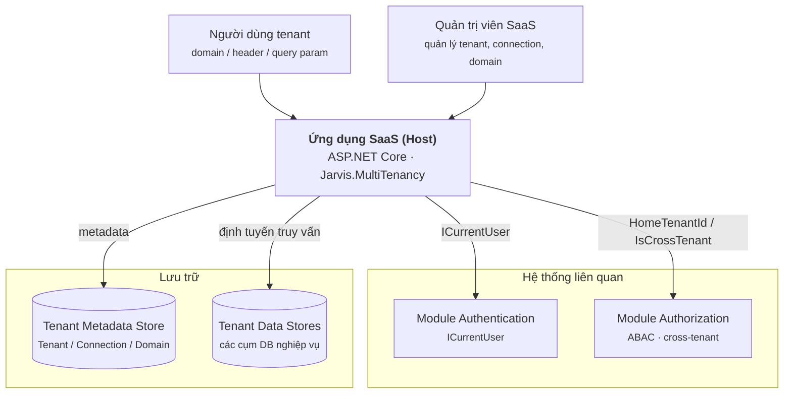
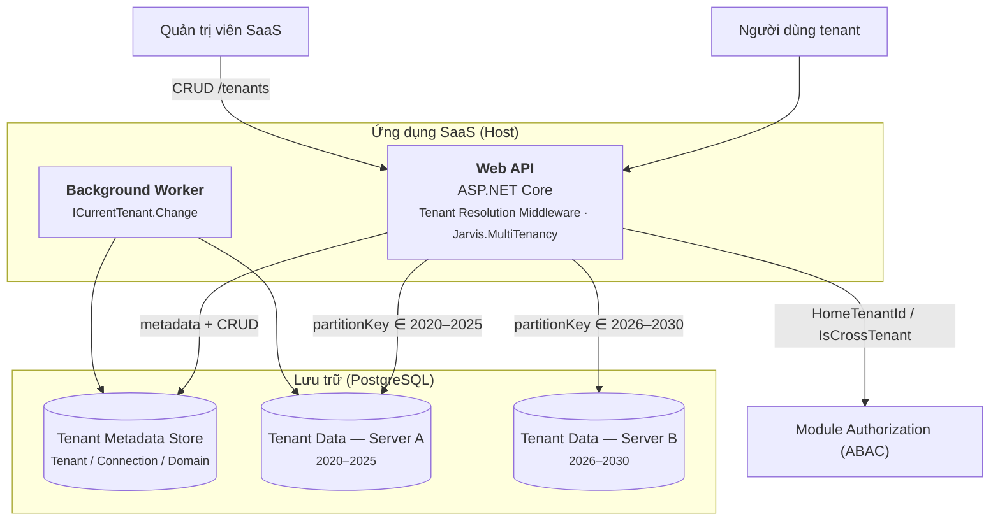
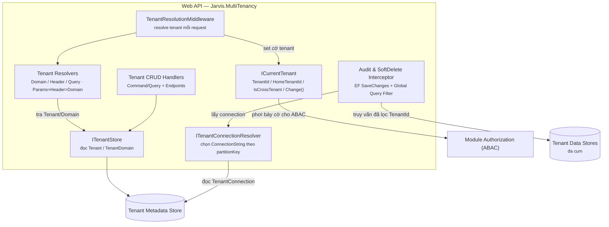

# ADR — Multi-Tenant (Jarvis framework)

> **Trạng thái:** 🔧 Đang thiết kế (Draft chi tiết).
> **Phạm vi:** Module `Jarvis.MultiTenancy` — quản lý `Tenant`, cô lập dữ liệu, đa nguồn dữ liệu (đa cụm server), đa domain, và `ICurrentTenant` để xác định tenant hiện tại. Cấu trúc tổ chức nội bộ (đơn vị, phòng ban) là concern riêng — xem [organization-module.md](./2026-07-19-adr-organization-module.md). ABAC / kiểm tra quyền là concern của module Authorization.
> **Liên quan:** [platform-architecture.md](../rules/platform-architecture.md) (`Jarvis.Platform.Tenants`), [auth-overview.md](./2026-05-21-adr-authentication.md), [organization-module.md](./2026-07-19-adr-organization-module.md).

---

## 1. Bối cảnh

Sản phẩm chạy mô hình **SaaS multi-tenant**: nhiều khách hàng dùng chung hệ thống nhưng dữ liệu cô lập tuyệt đối theo khách hàng. Ngoài ra cần đáp ứng:

- **Reseller:** một khách hàng thuê SaaS rồi cung cấp lại cho đại lý (tenant con).
- **Dữ liệu lớn cần chia tách:** một tenant có thể lưu dữ liệu trên **nhiều cụm server** (chia theo khoảng thời gian) và phục vụ trên **nhiều domain/site**.
- **Xác định tenant linh hoạt:** theo cấu hình tĩnh, theo domain, header, hoặc query param — kèm hỗ trợ truy cập chéo tenant (uỷ quyền cho Authorization).

---

## 2. Yêu cầu

### 2.1 Functional Requirements (FR)

| Mã | Yêu cầu |
|----|---------|
| **FR-01** | Quản lý `Tenant` qua CRUD: tạo, sửa, xoá (mềm), đổi trạng thái, xem chi tiết, liệt kê. |
| **FR-02** | `Tenant` có `Code`, `Name`, `Status` (Active/Inactive) và phân cấp cha–con (`ParentId`) cho mô hình reseller. |
| **FR-03** | Mỗi `Tenant` quản lý **nhiều nguồn dữ liệu** (`TenantConnection`): `ProviderType` + `ConnectionString` + khoảng ngày phân mảnh; CRUD dạng sub-resource. |
| **FR-04** | Mỗi `Tenant` quản lý **nhiều domain** (`TenantDomain`); CRUD dạng sub-resource. |
| **FR-05** | Xác định tenant hiện tại (`ICurrentTenant`) theo 2 chế độ: **Static** (appsettings) và **Automatic** (Domain / Header / Params). |
| **FR-06** | Phơi bày `TenantId` (effective), `HomeTenantId`, `IsCrossTenant` cho các module khác (đặc biệt Authorization). |
| **FR-07** | Cô lập dữ liệu theo `TenantId` bằng global query filter, tự động theo tenant hiện tại. |
| **FR-08** | Định tuyến truy vấn tới đúng cụm server theo `partitionKey` (khoảng ngày), fallback về nguồn mặc định. |
| **FR-09** | Đặt ngữ cảnh tenant thủ công cho background job (không có HTTP request). |
| **FR-10** | Tự động ghi audit (`CreatedAt/By`, `UpdatedAt/By`) và soft-delete (`DeletedId`, `DeletedAt/By`) khi lưu. |
| **FR-11** | Auto-migrate metadata store khi bật cấu hình. |

### 2.2 Business Rules (BR)

| Mã | Quy tắc |
|----|---------|
| **BR-01** | `Tenant.Code` là duy nhất trong nhóm bản ghi **đang sống**; cho phép **tái tạo `Code`** sau khi bản ghi cũ bị xoá mềm (unique tổ hợp `(Code, DeletedId)`). |
| **BR-02** | `Tenant` ở trạng thái `Inactive` **bị từ chối** khi resolve — không phục vụ request. |
| **BR-03** | Thứ tự ưu tiên xác định tenant: **Params > Header > Domain**. Home tenant = Domain (nếu host khớp `TenantDomain`) hoặc Header (nếu dùng chung domain). |
| **BR-04** | Khi `TenantId != HomeTenantId` → `IsCrossTenant = true`. `Jarvis.MultiTenancy` chỉ phơi bày cờ; **kiểm tra quyền (ABAC) do module Authorization** thực hiện. |
| **BR-05** | Mỗi domain (đang sống) chỉ trỏ về **một** tenant. |
| **BR-06** | Chọn `TenantConnection` có `partitionKey ∈ [PartitionFrom, PartitionTo]`; không khớp → dùng bản ghi `IsDefault`. |
| **BR-07** | Mọi bản ghi tenant-scoped **phải có `TenantId`** khi lưu; nếu thiếu → lỗi (trừ khi ở scope suppress / cross-tenant read tường minh). |
| **BR-08** | Mọi thao tác xoá là **soft-delete**, không xoá cứng. |
| **BR-09** | Phân cấp `Tenant` (`ParentId`) chỉ dùng cho **SaaS reseller**, không biểu diễn cấu trúc tổ chức nội bộ. |
| **BR-10** | Tách một tenant thành khách hàng độc lập phải qua **Tenant Separation** (migrate dữ liệu + chuyển ownership), không chỉ đổi `TenantId`. |

---

## 3. Quyết định — tổng quan thành phần

Module `Jarvis.MultiTenancy` gồm các thành phần:

| Thành phần | Vai trò |
|-----------|---------|
| `Tenant` | Thực thể khách hàng SaaS; có `Code`, `Status`, phân cấp reseller, audit + soft-delete |
| `TenantConnection` | Nguồn dữ liệu của tenant: `ProviderType` + `ConnectionString`, chia mảnh theo khoảng ngày (đa cụm server) |
| `TenantDomain` | Các domain định danh tenant (nhiều domain → một tenant) |
| Audit interfaces | `ICreationAudited`, `IModificationAudited`, `ISoftDelete` — dùng chung ở Jarvis core |
| `ICurrentTenant` | Xác định & cung cấp tenant hiện tại (`TenantId` / `HomeTenantId` / `IsCrossTenant`); web + background job |
| Tenant CRUD | Service + Command/Query + API quản trị tenant và sub-resource |

```text
Tenant  (data boundary, phân cấp reseller)
 ├── TenantConnection[]   (đa nguồn dữ liệu — đa cụm server theo khoảng ngày)
 └── TenantDomain[]       (đa domain định danh)
```

---

## 4. Kiến trúc (C4 model)

Mô tả kiến trúc theo 4 mức (theo tinh thần [C4 model](https://c4model.com)): **Context → Container → Component → Code**. Sơ đồ dùng Mermaid flowchart (ưu tiên dễ đọc, không theo style C4 chuẩn).

### 4.1 Level 1 — System Context

Ai dùng hệ thống và hệ thống nói chuyện với gì.



### 4.2 Level 2 — Container

Các khối triển khai bên trong hệ thống SaaS.



### 4.3 Level 3 — Component

Các thành phần bên trong container **Web API** (module `Jarvis.MultiTenancy`).



### 4.4 Level 4 — Code

Mức Code (entity, interface, enum) được đặc tả trực tiếp ở **§5 Mô hình dữ liệu** (`Tenant`, `TenantConnection`, `TenantDomain`, `IFullAudited`) và **§6 `ICurrentTenant`**.

---

## 5. Mô hình dữ liệu

> Kiểu dữ liệu mô tả theo PostgreSQL (DB demo). `Id` dùng `uuid`; enum lưu `smallint`; thời gian dùng `timestamptz`.

### 5.1 `Tenant`

```sql
Tenant
(
    Id            uuid          NOT NULL,   -- PK
    Code          varchar(64)   NOT NULL,   -- mã định danh nghiệp vụ, unique (§5.2)
    Name          varchar(256)  NOT NULL,
    Status        smallint      NOT NULL,   -- TenantStatus: Active | Inactive
    ParentId      uuid          NULL,       -- self-reference: phân cấp SaaS reseller

    -- audit + soft-delete (kế thừa từ interface — §5.2)
    CreatedAt     timestamptz   NOT NULL,
    CreatedBy     varchar(64)   NULL,
    UpdatedAt     timestamptz   NULL,
    UpdatedBy     varchar(64)   NULL,
    DeletedId     uuid          NOT NULL DEFAULT '00000000-0000-0000-0000-000000000000',
    DeletedAt     timestamptz   NULL,
    DeletedBy     varchar(64)   NULL
)
```

- **`Code`** — mã định danh nghiệp vụ của tenant; unique (xem quy tắc index ở §5.2).
- **`Status`** (`enum TenantStatus { Inactive = 0, Active = 1 }`) lưu `smallint`. Tenant `Inactive` bị từ chối khi resolve (§6).
- `ParentId` cho phép **tenant con** (mô hình SaaS reseller). Thuần phân cấp SaaS, không dùng cho cấu trúc tổ chức.

### 5.2 Audit & soft-delete interfaces (Jarvis core)

Các interface dùng chung cho **mọi entity** của framework, không riêng Tenant:

```csharp
public interface ICreationAudited      { DateTime  CreatedAt;  string? CreatedBy; }
public interface IModificationAudited  { DateTime? UpdatedAt;  string? UpdatedBy; }
public interface ISoftDelete           { Guid DeletedId; DateTime? DeletedAt; string? DeletedBy; }

// Gộp sẵn cho tiện dùng
public interface IFullAudited : ICreationAudited, IModificationAudited, ISoftDelete { }
```

- `Tenant`, `TenantConnection`, `TenantDomain` đều implement `IFullAudited`.
- Một **EF `SaveChanges` interceptor** trong core tự điền `CreatedAt/UpdatedAt` (thời gian) và `CreatedBy/UpdatedBy` (đọc từ abstraction `ICurrentUser`).

**Soft-delete bằng `DeletedId` (không dùng cờ `IsDeleted`):**

- Bản ghi **đang sống**: `DeletedId = Guid.Empty` (`00000000-…`).
- Khi **xoá mềm**: interceptor set `DeletedId = Id`, `DeletedAt = now`, `DeletedBy = currentUser`.
- Query filter mặc định lọc `DeletedId = Guid.Empty` để ẩn bản ghi đã xoá.

**Vì sao dùng `DeletedId` thay vì `IsDeleted`:** để dựng **unique index tổ hợp `(Code, DeletedId)`**. Các bản ghi sống đều có `DeletedId = Guid.Empty` nên `Code` phải là duy nhất trong nhóm đang sống; bản ghi đã xoá có `DeletedId = Id` (luôn khác nhau) nên không xung đột. Nhờ đó **một `Code` đã bị xoá vẫn có thể được tạo lại** mà không đụng unique constraint.

```sql
CREATE UNIQUE INDEX ux_tenant_code ON Tenant (Code, DeletedId);
```

### 5.3 `TenantConnection` — đa nguồn dữ liệu, đa cụm server

Mỗi tenant có **một hoặc nhiều** nguồn dữ liệu. Nhiều nguồn dùng cho trường hợp dữ liệu lớn cần chia theo **khoảng ngày** sang các cụm server khác nhau.

```sql
TenantConnection
(
    Id                uuid          NOT NULL,   -- PK
    TenantId          uuid          NOT NULL,   -- FK → Tenant.Id
    ProviderType      smallint      NOT NULL,   -- DbProviderType: Postgres | SqlServer | MySql | ...
    ConnectionString  text          NOT NULL,
    PartitionFrom     date          NULL,       -- đầu khoảng, vd. 2020-01-01
    PartitionTo       date          NULL,       -- cuối khoảng, vd. 2025-12-31
    IsDefault         boolean       NOT NULL,   -- nguồn dùng khi không khớp khoảng nào

    -- audit + soft-delete (IFullAudited)
    CreatedAt timestamptz NOT NULL, CreatedBy varchar(64) NULL,
    UpdatedAt timestamptz NULL,     UpdatedBy varchar(64) NULL,
    DeletedId uuid NOT NULL DEFAULT '00000000-0000-0000-0000-000000000000',
    DeletedAt timestamptz NULL,     DeletedBy varchar(64) NULL
)
```

Ví dụ tenant A:

| ProviderType | PartitionFrom | PartitionTo | ConnectionString |
|--------------|---------------|-------------|------------------|
| Postgres | 2020-01-01 | 2025-12-31 | Host=server-a;Database=tenant_a |
| Postgres | 2026-01-01 | 2030-12-31 | Host=server-b;Database=tenant_a |

- Framework cung cấp `ITenantConnectionResolver.Resolve(tenantId, partitionKey?)` → trả `(ProviderType, ConnectionString)`; chọn connection có khoảng `[PartitionFrom, PartitionTo]` chứa `partitionKey`, nếu không khớp thì dùng `IsDefault`.
- `partitionKey` (kiểu `DateOnly`/`DateTime`) do tầng nghiệp vụ cung cấp khi mở `DbContext` (vd. ngày/năm của dữ liệu truy cập). Framework chỉ định tuyến; ngữ nghĩa khoảng do dự án quyết định.

### 5.4 `TenantDomain` — đa domain định danh

Một tenant có thể phục vụ trên nhiều domain; **mọi domain đều định danh về cùng tenant**.

```sql
TenantDomain
(
    Id          uuid          NOT NULL,   -- PK
    TenantId    uuid          NOT NULL,   -- FK → Tenant.Id
    Domain      varchar(256)  NOT NULL,   -- vd. sample.domain.com, test.domain.com
    IsPrimary   boolean       NOT NULL,

    -- audit + soft-delete (IFullAudited)
    CreatedAt timestamptz NOT NULL, CreatedBy varchar(64) NULL,
    UpdatedAt timestamptz NULL,     UpdatedBy varchar(64) NULL,
    DeletedId uuid NOT NULL DEFAULT '00000000-0000-0000-0000-000000000000',
    DeletedAt timestamptz NULL,     DeletedBy varchar(64) NULL
)
```

- Unique index `(Domain, DeletedId)` — mỗi domain sống chỉ trỏ về một tenant.
- Dùng cho trường hợp dữ liệu lớn cần chia thành các site khác nhau nhưng vẫn thuộc một tenant.

---

## 6. `ICurrentTenant` — xác định tenant hiện tại

`ICurrentTenant` expose tenant hiện tại cho toàn hệ thống:

```csharp
public interface ICurrentTenant
{
    Guid  TenantId      { get; }  // effective — tenant dữ liệu đang phục vụ (query filter dùng cái này)
    Guid  HomeTenantId  { get; }  // tenant gốc của request (danh tính thật của người gọi)
    bool  IsCrossTenant { get; }  // true khi TenantId != HomeTenantId

    IDisposable Change(Guid tenantId);  // đặt ngữ cảnh tenant thủ công (background job)
}
```

Có **hai chế độ** cấp giá trị cho `ICurrentTenant`:

### 6.1 Cấu hình tĩnh (appsettings)

TenantId chỉ định rõ ràng trong config — không resolve từ request. Dùng cho deployment gắn sẵn một tenant hoặc chạy nền không có request.

```json
"Tenant": {
  "Mode": "Static",
  "TenantId": "A"
}
```

- `TenantId = HomeTenantId`, `IsCrossTenant = false` (tenant luôn cố định).

### 6.2 Tự động — resolve theo request

TenantId xác định tự động từ request. Ba phương thức truyền: **Domain**, **Header** (`X-Tenant-Id`), **Params** (query param `tenantId`).

```json
"Tenant": {
  "Mode": "Automatic",
  "HeaderName": "X-Tenant-Id",
  "QueryParam": "tenantId"
}
```

#### Quy tắc resolve — logic cây

```
Xác định tenant hiện tại
│
├─ 1. Xác định HomeTenantId
│   ├── Nếu Host khớp một TenantDomain → Home = Domain đó
│   └── Nếu Host không khớp domain nào → Home = Header (nếu có)
│       └── Nếu không có Header → reject (không xác định được tenant)
│
└─ 2. Xác định TenantId (effective) & IsCrossTenant
    ├── Chỉ 1 phương thức hiện diện (Domain HOẶC Header)
    │   └── TenantId = HomeTenantId → IsCrossTenant = false
    │
    └── Nhiều hơn 1 phương thức hiện diện
        └── TenantId = phương thức ưu tiên cao nhất (Params > Header > Domain)
            └── IsCrossTenant = (TenantId != HomeTenantId)
```

**Ưu tiên:** `Params` > `Header` > `Domain`.

Tenant `Inactive` (§5.1) bị từ chối ở bước resolve.

### 6.3 Cross-tenant & Background job

#### Cross-tenant

Khi `TenantId != HomeTenantId` (có tín hiệu ưu tiên cao hơn nguồn xác định home), `ICurrentTenant.IsCrossTenant = true`. Đây là tín hiệu request muốn xem dữ liệu tenant khác; **việc kiểm tra quyền (ABAC) do module Authorization thực hiện** dựa trên các cờ này, không nằm trong `Jarvis.MultiTenancy`.

| Phương thức hiện diện | HomeTenantId | TenantId (effective) | IsCrossTenant |
|----------------------|--------------|----------------------|---------------|
| Domain + Header + Params | Domain | Params | true |
| Domain + Header | Domain | Header | true |
| Domain + Params | Domain | Params | true |
| Header + Params | Header | Params | true |
| Chỉ Domain | Domain | Domain | false |
| Chỉ Header | Header | Header | false |

#### Background job

Background job không có request → đặt ngữ cảnh trực tiếp qua `Change`. Khi đó `TenantId = HomeTenantId = tenantId`, `IsCrossTenant = false`:

```csharp
using (currentTenant.Change(tenantId))
{
    // chạy trong ngữ cảnh tenant được chỉ định
}
```

### 6.4 Sử dụng

- **Web app:** middleware resolve tenant từ `HttpContext` mỗi request; `ICurrentTenant` là scoped service đọc qua `IHttpContextAccessor`.
- **Background job:** truyền tenant trực tiếp qua `ICurrentTenant.Change(tenantId)` (§6.3).

---

## 7. Service & API CRUD

Thao tác quản trị theo CQRS custom của Jarvis (`ICommandDispatcher` / `IQueryDispatcher`) + endpoint API. Đăng ký qua extension `AddTenantManagement()` / `MapTenantEndpoints()`.

### 7.1 Tenant

| Thao tác | Command / Query | API |
|----------|-----------------|-----|
| Tạo | `CreateTenantCommand` | `POST /tenants` |
| Sửa | `UpdateTenantCommand` | `PUT /tenants/{id}` |
| Xoá (soft) | `DeleteTenantCommand` | `DELETE /tenants/{id}` |
| Đổi trạng thái | `SetTenantStatusCommand` | `PATCH /tenants/{id}/status` |
| Lấy 1 | `GetTenantQuery` | `GET /tenants/{id}` |
| Danh sách | `GetTenantListQuery` | `GET /tenants` |

### 7.2 `TenantConnection` (sub-resource)

| Thao tác | Command / Query | API |
|----------|-----------------|-----|
| Danh sách | `GetTenantConnectionListQuery` | `GET /tenants/{id}/connections` |
| Thêm | `AddTenantConnectionCommand` | `POST /tenants/{id}/connections` |
| Sửa | `UpdateTenantConnectionCommand` | `PUT /tenants/{id}/connections/{connectionId}` |
| Xoá (soft) | `DeleteTenantConnectionCommand` | `DELETE /tenants/{id}/connections/{connectionId}` |

### 7.3 `TenantDomain` (sub-resource)

| Thao tác | Command / Query | API |
|----------|-----------------|-----|
| Danh sách | `GetTenantDomainListQuery` | `GET /tenants/{id}/domains` |
| Thêm | `AddTenantDomainCommand` | `POST /tenants/{id}/domains` |
| Sửa | `UpdateTenantDomainCommand` | `PUT /tenants/{id}/domains/{domainId}` |
| Xoá (soft) | `DeleteTenantDomainCommand` | `DELETE /tenants/{id}/domains/{domainId}` |

> Mọi thao tác xoá là **soft-delete** (§5.2).

---

## 8. Cô lập dữ liệu & phân quyền

- Mọi bản ghi nghiệp vụ mang `TenantId`; truy vấn **được lọc theo `ICurrentTenant.TenantId`** (effective, EF global query filter).
- Scope phân quyền cấp tenant làm điểm neo cho ABAC; module Authorization dùng `HomeTenantId` / `IsCrossTenant` để enforce.

```json
{ "scope": "tenant", "tenant_id": "A" }
```

---

## 9. Tenant Separation — tách khách hàng độc lập

Khi một sub-tenant / đại lý cần trở thành **khách hàng SaaS độc lập**: tạo `Tenant` mới và **migrate dữ liệu + chuyển ownership** sang tenant mới (kèm `TenantConnection`, `TenantDomain` tương ứng). Đây là quy trình migration riêng, không phải thao tác đổi `TenantId` của bản ghi.

---

## 10. Kết luận

```text
Jarvis.MultiTenancy
├── Tenant           (Code, Status, phân cấp reseller, IFullAudited + soft-delete bằng DeletedId)
├── TenantConnection (ProviderType/ConnectionString, chia mảnh đa cụm server theo khoảng ngày)
├── TenantDomain     (đa domain định danh)
├── ICurrentTenant   (Static | Automatic: Params > Header > Domain; TenantId/HomeTenantId/IsCrossTenant; background job)
└── CRUD API         (Tenant + sub-resource Connection/Domain)
```

- **Tenant** = khách hàng SaaS; ranh giới cô lập dữ liệu theo `TenantId`; có `Code`, `Status`, audit + soft-delete (`DeletedId` phục vụ unique index tái tạo `Code`).
- **Đa nguồn dữ liệu** (đa cụm server theo khoảng ngày) và **đa domain** hỗ trợ chia tách dữ liệu lớn.
- **`ICurrentTenant`** xác định tenant theo config tĩnh (§6.1) hoặc tự động từ request (§6.2); phơi bày `TenantId` (effective) / `HomeTenantId` / `IsCrossTenant`; **kiểm tra quyền thuộc module Authorization**.
- Cấu trúc tổ chức nội bộ do module `Organization` đảm nhiệm (xem [organization-module.md](./2026-07-19-adr-organization-module.md)).

---

## 11. Kế hoạch triển khai

> Repo **đã có sẵn** phần lớn hạ tầng multi-tenant trong `Jarvis.Domain/DataStorages`, `Jarvis.EntityFramework/DataStorages` và `Jarvis.EntityFramework/Repositories`. Đây **không** phải greenfield — kế hoạch ưu tiên **mở rộng & tái dùng**, hạn chế viết mới.

### 11.1 Hiện trạng tái dùng

| Hạng mục ADR | Tài sản đã có | Mức tái dùng | Việc cần làm |
|---|---|---|---|
| Ambient current tenant | `ICurrentTenantAccessor` / `CurrentTenantAccessor` (AsyncLocal, `BeginScope`) | **Cao** | Mở rộng thêm `HomeTenantId` / `IsCrossTenant` |
| Resolver theo request | `ITenantIdResolver` (Header/Query/User/Host) + `TenantIdResolverFactory` | **Trung bình** | Viết lại factory theo ưu tiên `Domain < Header < Params` + tách home/effective |
| Static mode (appsettings) | một phần qua `ConfigConnectionStringResolver` | Thấp | Thêm chế độ tenant cố định theo config |
| Audit interfaces | `ILogCreatedEntity`, `ILogUpdatedEntity`, `ILogDeletedEntity<T>` (**đã có `DeletedId`**) | **Cao** | Dùng nguyên; **đổi ADR §5.2 sang các tên này** |
| Soft-delete bằng `DeletedId` | interface có, hành vi chưa | Trung bình | Interceptor: delete → set `DeletedId = Id`; query filter theo `DeletedId`; unique `(Code, DeletedId)` |
| Cô lập `TenantId` + query filter | `BaseStorageContext` (filter `ITenantEntity`), `TenantScopedContextValidation` | **Cao** | Dùng nguyên |
| Định tuyến connection theo tenant | `DbTenantConnectionStringResolver`, `CachingTenantConnectionStringResolver`, `TenantDbConnectionInterceptor`, `TenantConnectionStringResolverFactory`, `AddCoreDbContext<,>` | **Cao** | Mở rộng nhận `partitionKey` |
| `TenantConnection` (ProviderType + partition ngày) | — (hiện `ConnectionString` là 1 cột trên Tenant) | **Mới** | Bảng mới + resolver theo khoảng ngày |
| `TenantDomain` (đa domain) | `HostTenantIdResolver` (host == Guid) | Thấp | Bảng mới + resolver tra domain → tenant |
| Tenant entity (`Code/Name/Status/audit`) | `Tenant : ITenantManagementEntity` (chỉ `ConnectionString`) | Thấp | Mở rộng entity + mapping + migration |
| CRUD API / service | — | **Mới** | Command/Query + endpoints |
| Auto-migrate, repository, UoW, CQRS | `EnsureMigrateDb`, `Base*Repository`, `BaseUnitOfWork`, dispatcher | **Cao** | Dùng nguyên |

**Tổng quan:** tầng kết nối, cô lập dữ liệu, audit interface, repository/UoW ~ tái dùng cao. Phần xây mới tập trung ở: **metadata model** (`Tenant` mở rộng, `TenantConnection`, `TenantDomain`), **home/effective/cross-tenant**, **audit + soft-delete interceptor**, **partition routing**, **CRUD API**.

### 11.2 Phase & tiêu chí verify

1. **Phase 0 — Thống nhất & định vị.** Chốt tái dùng tên có sẵn (`ILog*Entity`, `ICurrentTenantAccessor`); cập nhật ADR §5.2/§6 cho khớp. Quyết định module đích: mở rộng tại chỗ (`Jarvis.Domain` + `Jarvis.EntityFramework`) hay gom vào `Jarvis.MultiTenancy` mới.
   → *verify:* ADR khớp tên code; ranh giới package được ghi rõ.
2. **Phase 1 — Metadata model.** Mở rộng `Tenant` (`Code/Name/Status` + `ILogCreated/Updated/Deleted`); thêm entity `TenantConnection`, `TenantDomain`; migration `MasterDbContext`.
   → *verify:* migration chạy; seed 1 tenant + 2 connection + 2 domain thành công.
3. **Phase 2 — Audit + soft-delete interceptor.** Interceptor `SaveChanges` tự điền `CreatedAt/By`, `UpdatedAt/By`; delete → set `DeletedId = Id` + `DeletedAt/By`; query filter `DeletedId = Guid.Empty`; unique `(Code, DeletedId)`.
   → *verify:* unit test tạo/sửa/xoá mềm; **tạo lại `Code` đã xoá không lỗi unique**.
4. **Phase 3 — Resolve tenant (home/effective/cross).** Mở rộng accessor `HomeTenantId/IsCrossTenant`; `TenantResolutionMiddleware`; viết lại factory ưu tiên `Domain < Header < Params`; thêm resolver tra `TenantDomain`; Static mode; từ chối tenant `Inactive`.
   → *verify:* test đúng bảng quyết định §6.3 (7 tổ hợp) + reject Inactive.
5. **Phase 4 — Connection theo partition.** Mở rộng `ITenantConnectionStringResolver`/factory nhận `partitionKey`; `DbTenantConnectionStringResolver` đọc `TenantConnection` chọn theo khoảng ngày, fallback `IsDefault`.
   → *verify:* test route `2020–2025 → Server A`, `2026–2030 → Server B`, ngoài khoảng → default.
6. **Phase 5 — CRUD API/service.** Command/Query + endpoints cho `Tenant` và sub-resource `TenantConnection`/`TenantDomain`; `AddTenantManagement()` / `MapTenantEndpoints()`.
   → *verify:* Swagger CRUD đầy đủ trên `Sample`; xoá là soft-delete.
7. **Phase 6 — Wire Sample + tài liệu.** Cập nhật `Sample/HostApplicationBuilderExtension.cs`, appsettings; đồng bộ ADR.
   → *verify:* `dotnet run --project Sample` + Swagger chạy; `dotnet test` xanh.

### 11.3 Điểm cần thống nhất trước khi code

- **Đồng bộ tên ADR ↔ code:** dùng `ILog*Entity` thay cho `ICreationAudited/…`, `ICurrentTenantAccessor` thay cho `ICurrentTenant`; `CreatedBy/UpdatedBy` kiểu `Guid` (như code) thay vì `string` (như ADR đang viết).
- **`ConnectionString` trên `Tenant`:** hiện `ITenantManagementEntity.ConnectionString` là cột đơn — khi chuyển sang bảng `TenantConnection` cần quyết định giữ tương thích ngược hay migrate bỏ cột cũ.
- **Vị trí module:** mở rộng tại chỗ hay tách `Jarvis.MultiTenancy` (ảnh hưởng namespace, package, phụ thuộc).
