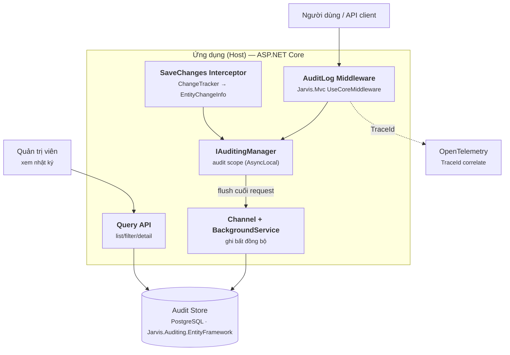
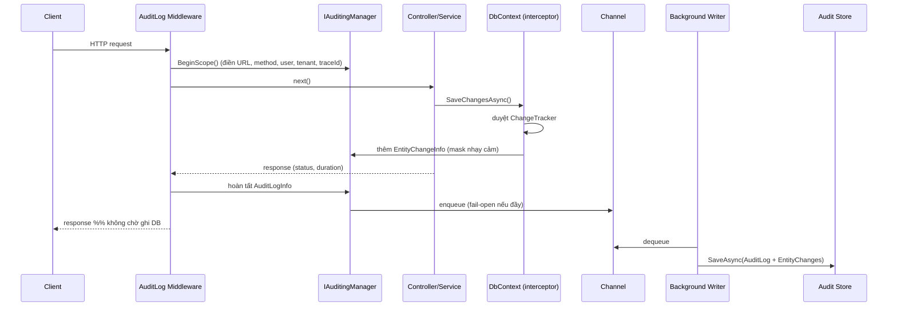

# ADR — Audit Logging (Jarvis framework)

> **Trạng thái:** 📝 Draft — đề xuất giải pháp, chờ trao đổi và chốt các quyết định mở (§10).
> **Phạm vi:** Module `Jarvis.Auditing` (Core) + `Jarvis.Auditing.EntityFramework` (provider lưu trữ). Bắt **request-level audit** (ai gọi API nào, kết quả, thời lượng) và **entity-change history** (thực thể nào bị tạo/sửa/xoá, giá trị cũ→mới). Tham chiếu concept từ [ABP Audit Logging](https://abp.io/modules/audit-logging-ui). **Ngoài scope:** UI admin (Jarvis là backend framework), export Excel, dashboard/widget.
> **Liên quan:** [multi-tenant.md](./2026-07-19-adr-multi-tenant.md) (FR-10: auto audit fields), [organization-module.md](./2026-07-19-adr-organization-module.md), [auth-overview.md](./2026-05-21-adr-authentication.md) (nguồn `ICurrentUser` — chưa hoàn thiện), [platform-architecture.md](../rules/platform-architecture.md); OpenTelemetry (phân định observability vs audit — §9).

---

## 1. Khuyến nghị

Tách **Audit Logging** thành module opt-in theo mẫu Core + Provider của Jarvis, và **phân biệt rõ hai khái niệm hay bị gộp làm một**:

```text
                        ┌─ (A) Audit-field stamping ─────────────┐
                        │  Gán CreatedAt/By, UpdatedAt/By,       │  → thuộc Jarvis.EntityFramework (core, luôn bật)
                        │  DeletedAt/By trên ILog*Entity          │     — lấp khoảng trống FR-10 multi-tenant
                        └────────────────────────────────────────┘
                        ┌─ (B) Audit TRAIL (module này) ─────────┐
   Jarvis.Auditing  ───▶│  Nhật ký bất biến: request entry +     │  → opt-in, ghi bền, bất biến, truy vấn được
                        │  entity-change history (cũ→mới)         │
                        └────────────────────────────────────────┘
```

**(A)** là metadata persistence (cột trên chính bảng nghiệp vụ, ghi đè khi sửa) — cần cho mọi app kể cả không bật audit. **(B)** là *nhật ký kiểm toán* tách rời, bất biến, không xoá khi bản ghi gốc đổi. ABP gộp cả hai dưới "Auditing"; Jarvis nên tách để giữ tính nguyên tử và không ép app phải gánh trail store chỉ để có 4 cột `CreatedAt/By`.

ADR này tập trung vào **(B)**; **(A)** được nêu ở §3 như một quyết định liền kề (nên làm trước, rẻ, độc lập).

---

## 2. Bối cảnh & khoảng trống hiện tại

Khảo sát mã nguồn (2026-07-20):

| Mảnh ghép đã có | Vị trí | Ghi chú cho audit |
|---|---|---|
| `BaseStorageContext<TDbContext>` override cả 4 `SaveChanges*` | [Jarvis.EntityFramework/DataStorages/BaseStorageContext.cs](../Jarvis.EntityFramework/DataStorages/BaseStorageContext.cs) | Hiện chỉ gọi `EnsureTenantIdForSave`. **Điểm hook lý tưởng** cho cả (A) và (B). **Chưa có `SaveChangesInterceptor`.** |
| Audit interfaces: `ILogCreatedEntity` (`CreatedAt`,`CreatedBy`), `ILogUpdatedEntity`, `ILogDeletedEntity<T>` (soft-delete) | `Jarvis.Domain/Entities/ILog*Entity.cs` | Đã định nghĩa nhưng **chưa nơi nào gán giá trị** — đó là (A) chưa làm. |
| `ICurrentTenantAccessor.TenantId` (AsyncLocal, chạy cả background job) | `Jarvis.Domain/DataStorages/CurrentTenantAccessor.cs` | Nguồn `TenantId` cho bản ghi audit. |
| `IWorkContext` (`GetUserId/GetUserName/GetTokenId`) | `Jarvis.Domain/Services/WorkContext.cs` | **Đang là STUB** (trả `Guid.NewGuid()`, `"sample_user"`). Cần hoàn thiện từ `ClaimsPrincipalExtension` để audit ghi đúng "ai". → phụ thuộc [Authentication](./2026-05-21-adr-authentication.md). |
| `UseCoreMiddleware<T>()` + `MiddlewareOption` (`IsEnable`, `Includes/Excludes` regex, `IgnoreMiddlewareAttribute`) | `Jarvis.Mvc/ExceptionHandling/ApplicationBuilderExtension.cs` | **Cơ chế chuẩn** để cắm middleware request-audit; đã có sẵn Includes/Excludes/ignore. |
| `ApiResponseWrapperMiddleware` (buffer body qua `MemoryStream`), `HttpContextExtension` | `Jarvis.Mvc/ExceptionHandling/`, `Jarvis.Mvc/Extensions/` | Mẫu bắt method/URL/status/duration/body. |
| Pattern `AddOptions<T>().BindConfiguration(T.SectionName)` + tách file `Add*`/`Use*` | `Jarvis.HealthChecks`, `Jarvis.OpenTelemetry` | Convention skeleton cho module mới. |
| OTel đủ 3 signal + `TraceId`, `IUserInfoResolver` | `Jarvis.OpenTelemetry/*` | Dùng để **correlate** audit ↔ trace (§9), không thay thế audit. |

**Kết luận:** khung để làm audit đã sẵn; thiếu (1) interceptor duyệt `ChangeTracker`, (2) `ICurrentUser` thật, (3) store bất biến + query. Roadmap README cũng đã ghi *"Rate limit & audit — audit log thao tác admin"*.

---

## 3. Quyết định liền kề — Audit-field stamping (A)

**Đề xuất:** thêm một interceptor tối giản **trong `Jarvis.EntityFramework` core** (luôn bật) để gán:

- `ILogCreatedEntity` → `CreatedAt = now`, `CreatedBy = currentUserId` khi `EntityState.Added`.
- `ILogUpdatedEntity` → `UpdatedAt/UpdatedBy` khi `Modified`.
- `ILogDeletedEntity<T>` → chuyển `Deleted` thành soft-delete (`DeletedAt/By`, set `DeletedId`, đổi state về `Modified`).

Lý do đặt ở core, không đặt trong module Auditing:
- Cần cho **mọi app** (soft-delete, multi-tenant FR-10) kể cả khi không bật trail.
- Rẻ, không I/O, không ảnh hưởng hiệu năng request path.

Module Auditing (B) **không lặp lại** việc này; nó *đọc* cùng `ChangeTracker` để dựng lịch sử. Xem quyết định mở **D3** (§10) về việc gộp hay tách hai lượt duyệt `ChangeTracker`.

---

## 4. Yêu cầu

### 4.1 Functional Requirements (FR)

| Mã | Yêu cầu |
|----|---------|
| **FR-01** | Ghi **AuditLog** cho mỗi HTTP request được chọn: user, tenant, URL, HTTP method, status code, IP, user-agent, thời điểm, thời lượng (ms), exception (nếu có), `TraceId` để correlate. |
| **FR-02** | Ghi **EntityChange** cho mỗi thực thể bị tạo/sửa/xoá trong một request/scope: loại thay đổi, tên type, khóa chính, thời điểm. |
| **FR-03** | Ghi **EntityPropertyChange**: từng property đổi giá trị, lưu `OriginalValue` → `NewValue` (chuỗi hoá). |
| **FR-04** | Gộp AuditLog ↔ EntityChange theo cùng một *audit scope* (một request tạo 1 AuditLog + N EntityChange). |
| **FR-05** | Hỗ trợ audit ngoài HTTP (background job / consumer): mở scope thủ công qua `IAuditingManager.BeginScope()`. |
| **FR-06** | Ghi bền **bất đồng bộ**, không chặn request path (queue in-memory → background writer). |
| **FR-07** | Lọc phạm vi bắt: bật/tắt toàn cục; bao gồm/loại trừ theo path (regex); tuỳ chọn bỏ qua GET; ngưỡng thời lượng tối thiểu. |
| **FR-08** | Loại trừ entity/property khỏi change-history theo cấu hình; **mask** property nhạy cảm (password, token, secret) — không lưu giá trị thật. |
| **FR-09** | Lưu trữ pluggable qua `IAuditLogStore`; provider mặc định `Jarvis.Auditing.EntityFramework` (PostgreSQL). |
| **FR-10** | Truy vấn nhật ký: lọc theo user, khoảng ngày, URL, method, status; xem chi tiết kèm entity-change (backend query — phục vụ UI do host tự dựng). |
| **FR-11** | Retention: tự dọn log quá hạn (theo ngày), cấu hình toàn cục hoặc theo tenant. |

### 4.2 Business Rules (BR)

| Mã | Quy tắc |
|----|---------|
| **BR-01** | Bản ghi audit **bất biến & append-only** — không sửa/xoá theo nghiệp vụ; chỉ retention job được xoá theo hạn. |
| **BR-02** | Audit **không được làm hỏng request**: mọi lỗi khi ghi audit chỉ log-warning, **không** ném ra ngoài (fail-open). |
| **BR-03** | `TenantId` của bản ghi audit lấy từ `ICurrentTenantAccessor` tại thời điểm ghi; audit là dữ liệu tenant-scoped. |
| **BR-04** | Bảng lưu audit **tự loại khỏi** change-history và stamping để tránh đệ quy vô hạn (self-audit). |
| **BR-05** | Property nhạy cảm bị mask **trước khi** rời vùng nhớ request (không bao giờ chạm store ở dạng thô). |
| **BR-06** | Khi queue đầy: theo cấu hình `FullMode` (mặc định `DropWrite` + đếm số bị rớt) — ưu tiên độ ổn định request hơn tính toàn vẹn tuyệt đối của log. |
| **BR-07** | GET request **mặc định không** ghi trail (giảm nhiễu); bật qua `IsEnabledForGetRequests`. |

---

## 5. Quyết định — thành phần & mô hình dữ liệu

### 5.1 Entities (provider EF)

| Entity | Trường chính |
|--------|-------------|
| `AuditLog` | `Id`, `TenantId`, `ApplicationName`, `UserId`, `UserName`, `ClientIpAddress`, `ClientName`(user-agent), `HttpMethod`, `Url`, `HttpStatusCode`, `ExecutionTime`, `ExecutionDuration`(ms), `CorrelationId`/`TraceId`, `Exception`, `Comments` |
| `AuditLogAction` *(phase 2)* | `Id`, `AuditLogId`, `ServiceName`, `MethodName`, `Parameters`(json), `ExecutionTime`, `ExecutionDuration` |
| `EntityChange` | `Id`, `AuditLogId?`, `TenantId`, `ChangeType`(Created/Updated/Deleted), `EntityTypeFullName`, `EntityId`, `ChangeTime` |
| `EntityPropertyChange` | `Id`, `EntityChangeId`, `PropertyName`, `PropertyTypeFullName`, `OriginalValue`, `NewValue` |

> `AuditLogId` trên `EntityChange` **nullable** — thay đổi phát sinh trong background job (không có HTTP request) vẫn ghi được, chỉ không gắn request entry.

### 5.2 Abstractions (Core `Jarvis.Auditing`)

| Kiểu | Vai trò |
|------|---------|
| `IAuditingManager` | Mở/đóng *audit scope* (`BeginScope()` trả `IAuditLogSaveHandle`); truy cập scope hiện tại (AsyncLocal). |
| `IAuditLogScope` / `AuditLogInfo` | Bộ tích luỹ trong-request: header HTTP + `List<EntityChangeInfo>` + `List<AuditLogActionInfo>`. |
| `EntityChangeInfo` / `EntityPropertyChangeInfo` | Model trung gian (chưa gắn EF) do interceptor điền vào scope. |
| `IAuditLogStore` | `SaveAsync(AuditLogInfo)` — hợp đồng lưu trữ; provider hiện thực. |
| `IAuditLogContributor` | Điểm mở rộng: enrich thêm dữ liệu vào scope (vd claim tuỳ biến). |
| `IAuditSerializer` / masking | Chuỗi hoá giá trị property + áp `SensitiveProperties`. |
| `AuditingOptions` | Options bind từ section `"Auditing"` (§7). |

### 5.3 Ranh giới Core vs Provider

| `Jarvis.Auditing` (Core) | `Jarvis.Auditing.EntityFramework` (Provider) |
|---|---|
| `IAuditingManager`, scope AsyncLocal, models info | `AuditingSaveChangesInterceptor` (duyệt `ChangeTracker` → `EntityChangeInfo`) |
| `IAuditLogStore` (hợp đồng), background writer (Channel + `BackgroundService`) | `EfAuditLogStore : IAuditLogStore` — ghi `AuditLog/EntityChange/...` vào Postgres |
| Middleware request-audit (dựa `UseCoreMiddleware`), masking, options | `AuditingDbContext` (hoặc dùng chung app context), EF mapping, retention job |
| `AddJarvisAuditing()` / `UseJarvisAuditing()` | `UseAuditingEntityFrameworkStore()` |

> Core phụ thuộc `Jarvis.Mvc` (middleware HTTP) + `Jarvis.Domain` (current user/tenant). Provider phụ thuộc `Jarvis.EntityFramework` + Core. Phụ thuộc **một chiều**, không nhét EF vào Core. Đối chiếu mẫu `Jarvis.Caching` + `Jarvis.Caching.Redis`.

---

## 6. Kiến trúc (C4 — Mermaid)

### 6.1 Level 2 — Container



### 6.2 Luồng một request có thay đổi dữ liệu



---

## 7. Cấu hình (section `"Auditing"`)

```jsonc
"Auditing": {
  "IsEnabled": true,
  "ApplicationName": "Jarvis.Sample",
  "IsEnabledForGetRequests": false,      // BR-07
  "SaveEntityHistory": true,
  "MinDurationMs": 0,                     // FR-07: chỉ ghi request >= ngưỡng
  "HttpEntry": {                          // tái dùng Includes/Excludes của MiddlewareOption
    "Includes": [ "^/api/" ],
    "Excludes": [ "^/health", "^/swagger" ]
  },
  "IgnoredEntities":   [ "Jarvis.Auditing.EntityFramework.Entities.AuditLog" ], // BR-04
  "IgnoredProperties": [ "RowVersion" ],
  "SensitiveProperties": [ "Password", "Token", "Secret", "ConnectionString" ], // FR-08/BR-05
  "Channel": { "Capacity": 10000, "FullMode": "DropWrite" },  // FR-06/BR-06
  "Store": {
    "Provider": "EntityFramework",
    "Retention": { "Days": 90, "CleanupCron": "0 3 * * *" }   // FR-11
  }
}
```

DI (host, `Program.cs` mỏng):

```csharp
builder.AddJarvisAuditing()                     // core: manager, middleware option, background writer
       .UseAuditingEntityFrameworkStore();      // provider: interceptor + Ef store + retention

app.UseJarvisAuditing();                        // cắm middleware qua UseCoreMiddleware
```

---

## 8. Ánh xạ với ABP Audit Logging (đối chiếu tham khảo)

| ABP | Jarvis (đề xuất) | Ghi chú |
|-----|------------------|---------|
| Audit Log Entry (URL, IP, browser, method, status, duration) | `AuditLog` (FR-01) | Tương đương 1-1. |
| Entity Changes + Property Changes (cũ→mới) | `EntityChange` + `EntityPropertyChange` (FR-02/03) | Tương đương. |
| Actions (controller/app-service + params) | `AuditLogAction` | **Phase 2** — cần hook CQRS dispatcher/action filter. |
| UI: view/filter/analyze | Query API (FR-10), **UI do host dựng** | Jarvis là backend; không kèm Razor/Angular/Blazor. |
| Widget: avg duration/day, error rate | **Không** trong module này → dùng OTel metrics | Tránh trùng observability (§9). |
| Export Excel (background job + email) | **Ngoài scope** (host tự làm nếu cần) | Simplicity First. |
| Retention / auto-cleanup | FR-11 | Tương đương. |
| Multi-tenant + permission | `ICurrentTenantAccessor` + Authorization module | Permission trên Query API là concern của Authorization. |

---

## 9. Phân định với OpenTelemetry (quan trọng)

Dễ nhầm audit với observability. Nguyên tắc tách:

| | OpenTelemetry (đã có) | Audit Logging (module này) |
|---|---|---|
| Mục đích | Vận hành/chẩn đoán (SRE) | Bằng chứng nghiệp vụ/pháp lý ("ai sửa gì") |
| Vòng đời | Ngắn hạn, sampling, có thể mất mẫu | Bền, **không sampling**, append-only |
| Nội dung | Trace/metric/log kỹ thuật | Chủ thể + thay đổi dữ liệu (giá trị cũ→mới) |
| Người đọc | Kỹ sư | Auditor, admin nghiệp vụ |

**Tái dùng, không trùng lặp:** audit lưu `TraceId` để nhảy sang trace tương ứng; **không** tự dựng dashboard hiệu năng (dùng metric OTel). Middleware audit đi **song song** middleware OTel, cùng cơ chế `UseCoreMiddleware`.

---

## 10. Quyết định mở (cần trao đổi)

| Mã | Vấn đề | Khuyến nghị sơ bộ |
|----|--------|-------------------|
| **D1** | Tên module: `Jarvis.Auditing` vs `Jarvis.AuditLogging`? | **`Jarvis.Auditing`** — ngắn, tránh nhầm với "logging" của OTel và `ILog*Entity`. |
| **D2** | Store riêng `AuditingDbContext` hay dùng chung app `BaseStorageContext`? | **DbContext riêng** — cô lập schema audit, dễ đặt sang DB/cụm khác, tránh vòng phụ thuộc migration. |
| **D3** | Stamping (A) và capture (B) — **một** interceptor hay **hai**? | **Hai interceptor tách biệt** (A ở EF core luôn bật, B ở Auditing.EF opt-in). Chấp nhận 2 lượt duyệt `ChangeTracker`; gộp sau nếu đo thấy nóng. |
| **D4** | Ghi bất đồng bộ: `Channel` in-memory hay hàng đợi ngoài (Redis/broker)? | **`Channel` + `BackgroundService`** cho MVP (đơn tiến trình). Multi-node/độ bền cao → provider hàng đợi sau. |
| **D5** | `AuditLogAction` (bắt tham số method) vào MVP hay phase 2? | **Phase 2** — cần hook `ICommandDispatcher/IQueryDispatcher` + xử lý PII tham số; MVP tập trung request + entity-change. |
| **D6** | Chuỗi hoá giá trị property nhạy cảm/lớn: giới hạn độ dài? kiểu? | Mask theo tên (BR-05) + cắt độ dài tối đa (vd 2KB) + bỏ blob/byte[]. Chốt danh sách mặc định. |
| **D7** | Phụ thuộc `ICurrentUser`: chờ Authentication hay tự hoàn thiện `WorkContext` từ claims trước? | Hoàn thiện `WorkContext` từ `ClaimsPrincipalExtension` là **tiền đề** cho cả (A) và (B) — nên làm ở bước 0. |

---

## 11. Lộ trình (phases)

| Phase | Nội dung | Kết quả kiểm chứng |
|-------|----------|--------------------|
| **0** | Hoàn thiện `WorkContext` thật (userId/userName từ claims) + interceptor stamping (A) trong EF core | Test: entity `ILogCreatedEntity` được gán `CreatedAt/By` đúng khi `Added` |
| **1** | Core `Jarvis.Auditing`: `IAuditingManager` + scope AsyncLocal + `AuditingOptions` + masking + Channel writer | Test: `BeginScope`→enqueue→writer gọi `IAuditLogStore.SaveAsync` |
| **2** | Middleware request-audit qua `UseCoreMiddleware` (URL/method/status/duration/IP/traceId) | Test: request khớp `Includes` sinh 1 `AuditLogInfo`; GET bị bỏ theo BR-07 |
| **3** | Provider `Jarvis.Auditing.EntityFramework`: interceptor capture (B) + `EfAuditLogStore` + entities/migration | Test (EF InMemory): create/update/delete sinh `EntityChange` + `EntityPropertyChange` cũ→mới; bảng audit tự loại (BR-04) |
| **4** | Query API (list/filter/detail) + retention job | Test: lọc theo user/ngày/method; retention xoá quá hạn |
| **5** *(sau)* | `AuditLogAction` (hook CQRS), provider hàng đợi/nguồn lưu khác | — |

**Ước tính phase 0–4:** ~5–6 dev days.

---

## 12. Cảnh báo (Simplicity First / Surgical)

1. **Không tự dựng observability** — không widget hiệu năng, không metric; đó là OTel (§9).
2. **Không kèm UI** — chỉ backend + query API; UI là việc của app tiêu thụ.
3. **Fail-open tuyệt đối** — audit hỏng **không** được làm hỏng nghiệp vụ (BR-02); test riêng đường lỗi này.
4. **Đừng audit tất cả** — mặc định loại GET, health, swagger; tránh phình store và nhiễu.
5. **Tách (A) khỏi (B)** — không ép app gánh trail store chỉ để có 4 cột audit-field.

> **Chờ chốt trước khi code:** D1–D7 (§10), đặc biệt D3 (một/hai interceptor) và D7 (nguồn `ICurrentUser`) vì chúng chặn phase 0.
