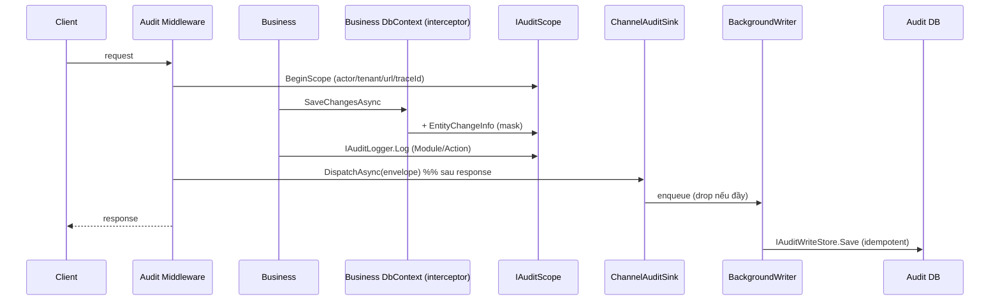
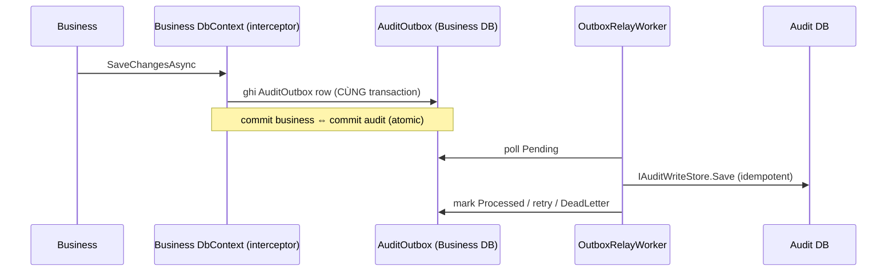
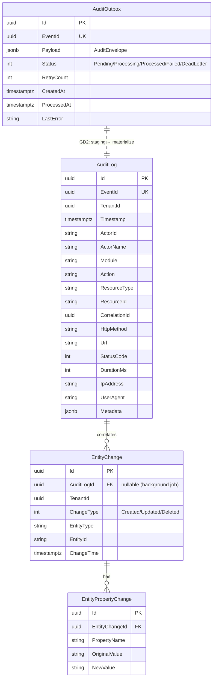

# ADR — Audit (Log + Trail) cho Jarvis framework

> **Trạng thái:** 📝 Draft — giải pháp tổng thể để trao đổi. Tổng hợp từ bản SAD "Audit Module" (Transactional Outbox) + 3 yêu cầu: (1) tách **audit log** vs **audit trail**, (2) API cho **module khác** ghi, (3) **2 giai đoạn** — GĐ1 không outbox, GĐ2 outbox, nhưng GĐ1 phải *ready* cho GĐ2.
> **Phạm vi:** Cụm module `Jarvis.Platform.AuditLog.*` (Producer SDK + Audit Platform). Bắt & lưu bền **hoạt động** (ai làm gì) và **lịch sử thay đổi dữ liệu** (cũ→mới); cung cấp API tra cứu. **Ngoài scope:** UI admin, export Excel, event sourcing, access-log kỹ thuật (thuộc OpenTelemetry — §10).
> **Liên quan:** [platform-architecture.md](../rules/platform-architecture.md) (tier `Jarvis.Platform.*`, `ICommandDispatcher/IQueryDispatcher`), [multi-tenant.md](./2026-07-19-adr-multi-tenant.md) (FR-10 audit-field), [auth-overview.md](./2026-05-21-adr-authentication.md) (`ICurrentUser` — chưa hoàn thiện). Nền tảng bản SAD Audit Module.

---

## 1. Khuyến nghị (tóm tắt 3 câu trả lời)

| Yêu cầu | Trả lời ngắn |
|---|---|
| **1. Log vs Trail** | Tách **2 khái niệm + 2 nhóm bảng**: `AuditLog` (hoạt động — ai/khi/hành động gì) ↔ `EntityChange`+`EntityPropertyChange` (lịch sử dữ liệu — trường nào đổi cũ→mới). Liên kết qua `CorrelationId`/`AuditLogId`. Ngoài ra còn khái niệm thứ 3 dễ nhầm: **audit-field stamping** (§3). |
| **2. Module khác ghi** | Một gói **Producer SDK** + **`IAuditLogger`** (ghi log tường minh) và **interceptor EF** (bắt trail tự động). Cả hai đổ vào **cùng một ambient audit-scope**, cùng một `IAuditSink` → thống nhất. Module chỉ reference `*.Contracts`/`*.Sdk`, không thấy nội bộ Platform. |
| **3. Hai giai đoạn** | Điểm nối duy nhất là **`IAuditSink`** + envelope contract cố định + store idempotent. **GĐ1** = `Channel` in-memory + background writer (không outbox). **GĐ2** = swap sang `OutboxAuditSink` + relay worker. GĐ1 đã cắm interceptor vào business DbContext và định tuyến 100% qua `IAuditSink` → GĐ2 chỉ **đổi 1 implementation + thêm 1 worker**, không sửa Producer. |

---

## 2. Phân biệt Audit Log vs Audit Trail (yêu cầu 1)

> Bản SAD gộp cả hai vào `AuditRecord` (`Module/Action` + `Before/After`). Tách ra vì bản chất, chủ thể và nguồn sinh **khác nhau**.

| | **Audit Log** (hoạt động) | **Audit Trail** (lịch sử dữ liệu) |
|---|---|---|
| Trả lời câu hỏi | *Ai* đã làm *hành động gì*, *khi nào*, kết quả? | *Bản ghi này* đã đổi *ra sao* theo thời gian? |
| Đơn vị | 1 thao tác nghiệp vụ / 1 request | N thay đổi thực thể trong thao tác đó |
| Trung tâm | **Hành động** (`Order.Approve`, `User.Login`, `LoginFailure`) | **Thực thể + trường** (Order.Status: `New`→`Approved`) |
| Nguồn sinh | **Tường minh** — Producer khai báo (không suy ra được) | **Tự động** — suy ra từ EF `ChangeTracker` |
| Có Before/After? | Không bắt buộc (đôi khi không có dữ liệu) | Có — cốt lõi (`OriginalValue`→`NewValue`) |
| Ví dụ không có cái kia | `LoginFailure` (log, không đổi dữ liệu) | Batch job sửa 1000 dòng (trail, không "action" nghiệp vụ) |

**Quan hệ:** một `AuditLog` (hành động) ⟶ 0..N `EntityChange` (thay đổi) ⟶ 1..N `EntityPropertyChange`. Gắn nhau bằng `CorrelationId` + `AuditLogId`.

```text
AuditLog  "User A · Order.Approve · 10:05"
   ├── EntityChange  Order#123 (Updated)
   │      └── PropertyChange  Status: "New" → "Approved"
   └── EntityChange  ApprovalHistory#900 (Created)
          └── PropertyChange  ...
```

---

## 3. Khái niệm thứ 3 — Audit-field stamping (đừng nhầm với Trail)

Có thứ dễ nhầm là **trail** nhưng **không phải**: 4 cột `CreatedAt/By`, `UpdatedAt/By`, `DeletedAt/By` **ngay trên bảng nghiệp vụ**.

| | Audit-field stamping | Audit Trail |
|---|---|---|
| Lưu ở đâu | Cột trên chính bảng gốc | Bảng lịch sử riêng, bất biến |
| Khi update | **Ghi đè** (chỉ giữ trạng thái mới nhất) | **Append** (giữ toàn bộ lịch sử) |
| Thuộc về | `Jarvis.EntityFramework` core, **luôn bật** | Module Audit, **opt-in** |

Hiện repo có sẵn interfaces `ILogCreatedEntity`/`ILogUpdatedEntity`/`ILogDeletedEntity<T>` (`Jarvis.Domain/Entities/`) **nhưng chưa nơi nào gán giá trị** — đây là khoảng trống FR-10 của [multi-tenant](./2026-07-19-adr-multi-tenant.md). **Đề xuất:** stamping làm bằng một interceptor tối giản trong EF core (bước 0, §9), độc lập với module Audit. Module Audit **đọc lại** cùng `ChangeTracker` để dựng Trail, không lặp lại stamping.

---

## 4. Giải pháp cho module khác ghi (yêu cầu 2)

### 4.1 Nguyên tắc Producer ↔ Platform (giữ từ SAD)

| Bên | Trách nhiệm |
|---|---|
| **Producer** (mọi `Jarvis.*` / business module) | Quyết định *khi nào* ghi. Khai báo `Module`/`Action`. Cung cấp context (Actor/Tenant/IP). |
| **Audit Platform** | Nhận → validate → mask → persist → query. **Không** hiểu nghiệp vụ, chỉ lưu đúng những gì nhận. |

### 4.2 Hai đường ghi — thống nhất một ambient scope

```text
                       ┌───────────────────────────────────────────────┐
 (a) TRAIL tự động ────▶  AuditSaveChangesInterceptor (EF ChangeTracker)│
                       │        ↓ EntityChangeInfo (Before/After)       │──┐
 (b) LOG tường minh ───▶  IAuditLogger.Log(module, action, resource…)   │  │  cùng
                       │        ↓ AuditLogEntry                          │──┤ CorrelationId
 (c) LOG khai báo ─────▶  [Audited("Order.Approve")] trên CommandHandler │  │
                       └───────────────────────────────────────────────┘  ▼
                                    IAuditScope (AsyncLocal, per request/UoW)
                                                   │  hoàn tất
                                                   ▼
                                              IAuditSink   ← điểm nối GĐ1/GĐ2 (§5)
```

- **(a) Trail — tự động, zero-code:** entity gắn `[Audited]` (hoặc marker `IAuditedEntity`) đi qua DbContext có interceptor → tự sinh `EntityChange`. Module không viết gì thêm.
- **(b) Log — tường minh:** inject `IAuditLogger`, gọi `Log(...)` cho hành động không suy ra được từ dữ liệu (`LoginFailure`, `Export`, `Approve`).
- **(c) Log — khai báo:** attribute `[Audited("Module.Action")]` trên `ICommandHandler`; decorator quanh `ICommandDispatcher` (`Jarvis.Application`) tự mở scope + ghi log. Giảm boilerplate.

**Chốt quan trọng:** cả (a)(b)(c) đổ vào **cùng `IAuditScope`** → một request "Approve Order" cho ra **1 AuditLog + N EntityChange đã correlate**, không phải nhiều bản ghi rời.

### 4.3 API Producer (public surface)

```csharp
// Đăng ký (host hoặc module tự bootstrap)
builder.AddAuditLogProducer();       // context provider + interceptor + IAuditSink (ph1: Channel)

// Ghi log tường minh trong bất kỳ service nào
public class OrderService(IAuditLogger audit)
{
    public async Task ApproveAsync(Guid id) {
        // ... business ...
        await audit.LogAsync(new AuditLogEntry {
            Module = "Order", Action = "Approve",
            ResourceType = "Order", ResourceId = id.ToString(),
            Metadata = new { reason });
        });   // chỉ nhét vào scope — KHÔNG chạm DB ở đây
    }
}
```

### 4.4 Ownership Matrix (ai điền field)

| Field | Owner |
|---|---|
| `EventId`, `Timestamp`, `CorrelationId` | SDK (tự sinh) |
| `TenantId`, `ActorId`, `IP`, `UserAgent` | SDK ← `ICurrentTenantAccessor` + `IWorkContext`/`ICurrentUser` |
| `Module`, `Action`, `ResourceType`, `ResourceId`, `Metadata` | **Producer** |
| `EntityChange`/`PropertyChange` (Before/After) | SDK interceptor (tự động) |

### 4.5 Chống coupling — chỉ reference Contracts

Module khác **chỉ** reference `Jarvis.Platform.AuditLog.Contracts` (chứa `IAuditLogger`, `AuditLogEntry`, `[Audited]`) — **không** thấy `AuditLog`/store nội bộ Platform. Đúng nguyên tắc "Contracts là public surface" của [platform-architecture](../rules/platform-architecture.md) §2.2.

### 4.6 Các cách thu thập (ngoài `[Audited]`)

`[Audited]` chỉ là **một cách "chọn"**, không phải cơ chế bắt. Mọi collector đều đẩy vào **cùng `IAuditScope`** → thêm cách mới không đụng lưu trữ.

**Chọn entity cho Trail (cơ chế: 1 interceptor EF):**

| Cách | Ghi chú |
|---|---|
| Marker `IAuditedEntity` | Implement interface thay attribute — **khuyến nghị** (refactor-safe) |
| Fluent `AddAuditLogProducer(o => o.Track<Order>())` | Đăng ký tập trung lúc startup |
| Config allowlist/denylist theo type-name | Bật/tắt **không build lại** |
| Opt-out (audit tất cả trừ ignored) | Rủi ro phình — không khuyến nghị mặc định |

**Thu thập Log (hoạt động) — phần lớn không cần attribute:**

| Cách | Bắt ở đâu | Dùng khi |
|---|---|---|
| **Explicit** `IAuditLogger.LogAsync` | Code nghiệp vụ | Hành động không suy ra được (`LoginFailure`, `Export`) |
| **Dispatcher decorator** (convention) | Bọc `ICommandDispatcher` — mọi Command tự audit, opt-out `[DisableAuditing]` | Phủ toàn bộ command — **khuyến nghị chính** |
| **HTTP middleware / EndpointFilter** | `UseCoreMiddleware` — mọi `/api/...` → 1 entry | Audit thô toàn API, zero-code handler |
| **Auth events** | Hook JWT/Cognito/Identity | `LoginSuccess/Failure`, `AccessDenied` |
| **Domain/Integration events** | Subscribe event nghiệp vụ | Kiến trúc event-driven |
| **`ILogger` bridge** | `logger.LogAudit(...)` / custom provider | Tái dùng chỗ đã log |
| **Message bus** | `BaseConsumer`/`BasePublisher` | Luồng async/worker |
| **DB trigger / CDC** (ngoài app) | Postgres logical replication | Bắt cả thay đổi ngoài app — **mất context Actor/Action**, bổ sung chứ không thay thế |

**Mặc định xếp lớp cho Jarvis:** Trail = interceptor + `IAuditedEntity`; Log = HTTP middleware (thô) + dispatcher decorator (command-level) + explicit `IAuditLogger` (đặc biệt) + auth events.

---

## 5. Hai giai đoạn phát triển (yêu cầu 3)

### 5.1 Điểm nối `IAuditSink` — thứ khiến GĐ1 "ready" cho GĐ2

```csharp
// Contract cố định — KHÔNG đổi giữa 2 giai đoạn
public interface IAuditSink {
    Task DispatchAsync(AuditEnvelope envelope, CancellationToken ct = default);
}
```

`AuditEnvelope` = `{ AuditLog + EntityChange[] }` đã gói sẵn (payload duy nhất). Toàn bộ pipeline **luôn** kết thúc bằng `IAuditSink.DispatchAsync` — Producer/interceptor **không bao giờ** gọi thẳng store.

| | **Giai đoạn 1 — không Outbox** | **Giai đoạn 2 — Outbox** |
|---|---|---|
| `IAuditSink` impl | `ChannelAuditSink` → `Channel<AuditEnvelope>` (bounded) | `OutboxAuditSink` → ghi `AuditOutbox` **cùng transaction business** |
| Vận chuyển | `BackgroundWriter` (HostedService) đọc channel → store | `OutboxRelayWorker` poll outbox → store (+retry/deadletter) |
| Độ bền | Best-effort; **crash → mất buffer** (chấp nhận, interim) | **Durable** — commit business ⇒ chắc chắn có audit |
| Nhất quán | Async, có thể mất khi sự cố | Eventual consistency, không mất |
| Chọn bằng | `Auditing:Delivery = "Channel"` | `Auditing:Delivery = "Outbox"` |

> Bản SAD loại "Channel Only" vì rủi ro mất dữ liệu — đúng, nên nó là **giai đoạn 1 (interim)**; GĐ2 đóng khoảng hở đó bằng Outbox mà **không phá** Producer.

### 5.2 Checklist "GĐ1 phải sẵn sàng cho GĐ2"

Code GĐ1 **bắt buộc** đã có sẵn các điểm sau (nếu thiếu → GĐ2 thành rewrite):

| # | Yêu cầu GĐ1 | Vì sao GĐ2 cần |
|---|---|---|
| R1 | **Envelope/contract cố định** (`AuditEnvelope`, `AuditLogEntry`, `EntityChangeInfo`) | Producer & interceptor không đổi khi lên Outbox |
| R2 | **Định tuyến 100% qua `IAuditSink`** — không nơi nào gọi store trực tiếp | GĐ2 chỉ thay implementation của seam |
| R3 | **`EventId` UNIQUE + store idempotent** (`SaveAsync` bỏ qua trùng) ngay từ GĐ1 | GĐ2 at-least-once/retry không cần thêm dedup |
| R4 | **Interceptor đã đăng ký trên business DbContext** ở GĐ1 (cần cho trail) | GĐ2 chỉ đổi hành vi tại `SavingChangesAsync`: push-scope → ghi outbox-row *cùng tx* |
| R5 | **Scope tách rời transport** — scope chỉ "tích luỹ + hoàn tất", không biết Channel hay Outbox | GĐ2 dời điểm flush vào ranh giới UoW/transaction mà không đụng code capture |
| R6 | **`IAuditWriteStore` / `IAuditReadStore` (CQRS) ổn định** | Relay worker GĐ2 tái dùng đúng write-store của background writer GĐ1 |
| R7 | **Actor/Tenant/Correlation lấy qua `IWorkContext`/`ICurrentTenantAccessor`** | Không đổi giữa 2 giai đoạn |
| R8 | **`Delivery` switch bằng config** (DI chọn sink theo option) | Bật Outbox = đổi 1 dòng cấu hình, không build lại Producer |

### 5.3 Luồng — Giai đoạn 1 (Channel)


```mermaid
sequenceDiagram
    participant C as Client
    participant MW as Audit Middleware
    participant APP as Business
    participant DB as Business DbContext (interceptor)
    participant SC as IAuditScope
    participant SK as ChannelAuditSink
    participant W as BackgroundWriter
    participant S as Audit DB

    C->>MW: request
    MW->>SC: BeginScope (actor/tenant/url/traceId)
    APP->>DB: SaveChangesAsync
    DB->>SC: + EntityChangeInfo (mask)
    APP->>SC: IAuditLogger.Log (Module/Action)
    MW->>SK: DispatchAsync(envelope)   %% sau response
    SK->>W: enqueue (drop nếu đầy)
    MW-->>C: response
    W->>S: IAuditWriteStore.Save (idempotent)
```

### 5.4 Luồng — Giai đoạn 2 (Outbox) — *chỉ đổi phần in đậm*


```mermaid
sequenceDiagram
    participant APP as Business
    participant DB as Business DbContext (interceptor)
    participant OB as AuditOutbox (Business DB)
    participant R as OutboxRelayWorker
    participant S as Audit DB

    APP->>DB: SaveChangesAsync
    DB->>OB: ghi AuditOutbox row (CÙNG transaction)
    Note over DB,OB: commit business ⇔ commit audit (atomic)
    R->>OB: poll Pending
    R->>S: IAuditWriteStore.Save (idempotent)
    R->>OB: mark Processed / retry / DeadLetter
```

Producer, `IAuditLogger`, interceptor capture, envelope, store — **giữ nguyên**. Chỉ khác: `IAuditSink` = Outbox, và thêm `OutboxRelayWorker`. Tương lai: `Outbox → Kafka/RabbitMQ → store` (SAD §5) — vẫn không đụng Producer.

---

## 6. Mô hình dữ liệu


```mermaid
erDiagram
    AuditLog ||--o{ EntityChange : correlates
    EntityChange ||--o{ EntityPropertyChange : has
    AuditOutbox ||..|| AuditLog : "GĐ2: staging → materialize"

    AuditLog {
        uuid Id PK
        uuid EventId UK
        uuid TenantId
        timestamptz Timestamp
        string ActorId
        string ActorName
        string Module
        string Action
        string ResourceType
        string ResourceId
        uuid CorrelationId
        string HttpMethod
        string Url
        int    StatusCode
        int    DurationMs
        string IpAddress
        string UserAgent
        jsonb  Metadata
    }
    EntityChange {
        uuid Id PK
        uuid AuditLogId FK "nullable (background job)"
        uuid TenantId
        int  ChangeType "Created/Updated/Deleted"
        string EntityType
        string EntityId
        timestamptz ChangeTime
    }
    EntityPropertyChange {
        uuid Id PK
        uuid EntityChangeId FK
        string PropertyName
        string OriginalValue
        string NewValue
    }
    AuditOutbox {
        uuid Id PK
        uuid EventId UK
        jsonb Payload "AuditEnvelope"
        int  Status "Pending/Processing/Processed/Failed/DeadLetter"
        int  RetryCount
        timestamptz CreatedAt
        timestamptz ProcessedAt
        string LastError
    }
```

- `AuditLog` = **audit log**; `EntityChange`+`EntityPropertyChange` = **audit trail**; hai nhóm bảng riêng, liên kết `AuditLogId`. Khác bản SAD gộp thành `AuditRecord`.
- `AuditOutbox` **chỉ xuất hiện ở GĐ2**, nằm trong **Business DB** (để cùng transaction). GĐ1 không có bảng này.
- Index idempotency (`UX_EventId`) + tra cứu (`TenantId+Timestamp`, `TenantId+ActorId`, `TenantId+Module+Action`, `TenantId+ResourceType+ResourceId`) — như SAD §2.5.

---

## 7. Cấu trúc project (bám tier Platform Jarvis, không copy 6-layer của SAD)

> Adapt SAD về convention Jarvis: **reuse `Jarvis.Domain`/`Jarvis.EntityFramework`**, không tách `*.Domain`/`*.Infrastructure` riêng ([platform-architecture](../rules/platform-architecture.md) §2.2). Còn 4 project.

```text
Jarvis.Platform.AuditLog.Contracts   # PUBLIC — IAuditLogger, AuditLogEntry, AuditEnvelope,
                                   #          EntityChangeInfo, [Audited], IAuditSink,
                                   #          IAuditWriteStore/IAuditReadStore
Jarvis.Platform.AuditLog.Sdk         # PRODUCER — AuditContextProvider, AuditSaveChangesInterceptor,
                                   #            Audit middleware, ChannelAuditSink (ph1),
                                   #            OutboxAuditSink + interceptor outbox (ph2)
Jarvis.Platform.AuditLog             # PLATFORM — entities (AuditLog/EntityChange/…),
                                   #            AuditDbContext, CQRS Write/Read store,
                                   #            BackgroundWriter (ph1) / OutboxRelayWorker (ph2),
                                   #            Validator, Masker, Query handlers
Jarvis.Platform.AuditLog.HttpApi     # thin controllers: GET /api/platform/audit-logs[/{id}], POST …/search
```

| Ai reference gì | |
|---|---|
| Business module (Producer) | → `...Audit.Sdk` (kéo theo `...Contracts`). **Không** thấy `AuditLog`/store. |
| Host | → `AddAuditLogProducer()` + `AddPlatformAuditLog()` + `UsePlatformAuditLog()` |
| `...Audit` (Platform) | → `Jarvis.EntityFramework`, `...Contracts` |

Route API theo chuẩn Platform: `/api/platform/audit-logs` (§2.3 platform-architecture).

---

## 8. Cấu hình (`"Auditing"`)

```jsonc
"Auditing": {
  "IsEnabled": true,
  "Delivery": "Channel",                 // R8: "Channel" (GĐ1) | "Outbox" (GĐ2)
  "ApplicationName": "Jarvis.Sample",
  "IsEnabledForGetRequests": false,
  "Trail": {
    "Enabled": true,
    "IgnoredEntities":   [ "AuditLog", "AuditOutbox" ],       // chống self-audit
    "IgnoredProperties": [ "RowVersion" ],
    "SensitiveProperties": [ "Password", "Token", "Secret", "ConnectionString" ]
  },
  "Http": { "Includes": [ "^/api/" ], "Excludes": [ "^/health", "^/swagger" ] },
  "Channel": { "Capacity": 10000, "FullMode": "DropWrite" },  // chỉ GĐ1
  "Outbox":  { "PollIntervalMs": 1000, "BatchSize": 100, "MaxRetry": 5 }, // chỉ GĐ2
  "Store": {
    // AuditLogDbContext riêng; mặc định connection riêng, có thể trỏ về DB business
    "ConnectionName": "AuditLog",     // key trong ConnectionStrings; đổi = "Default" để dùng chung DB
    "AutoMigrate": true
  },
  "Retention": { "Days": 90, "CleanupCron": "0 3 * * *" }
}
```

`AuditLogDbContext` **luôn là DbContext riêng** (schema audit cô lập, append-only). `ConnectionName` chỉ quyết định nó **trỏ tới đâu**: mặc định connection riêng; đặt trùng connection business → **chung một DB** mà code không đổi. GĐ2: nếu chung DB, `AuditOutbox` + `AuditLog` có thể cùng transaction; nếu tách DB, outbox ở Business DB rồi relay ghi sang Audit DB.

---

## 9. Consequences & rủi ro

**Pros:** Generic, không coupling business; log/trail tách bạch, correlate được; GĐ1 ship nhanh; GĐ2 nâng cấp không phá Producer; idempotent + append-only từ đầu.

**Cons / lưu ý:**
- **GĐ1 có thể mất audit khi crash** (channel in-memory) — nêu rõ với stakeholder, chấp nhận như trạng thái interim; dữ liệu nhạy cảm/pháp lý cao thì rút ngắn thời gian sang GĐ2.
- **Eventual consistency** (cả 2 GĐ): tra cứu audit trễ so với commit business.
- **`ICurrentUser`/`WorkContext` đang là stub** → phải hoàn thiện ở **bước 0**, nếu không `ActorId` sai (ghi random Guid). Chặn cả stamping lẫn audit.
- **Fail-open tuyệt đối:** lỗi ghi audit **không** được làm hỏng request nghiệp vụ (chỉ log-warning).
- **GĐ2 outbox nằm Business DB** → nếu chọn tách hẳn Audit DB, cần chấp nhận outbox ở DB business + relay chuyển sang DB audit (đã tính trong thiết kế).

---

## 10. Phân định với OpenTelemetry (đừng trùng)

| | OpenTelemetry (đã có) | Audit (module này) |
|---|---|---|
| Mục đích | Chẩn đoán vận hành (SRE) | Bằng chứng nghiệp vụ/pháp lý |
| Vòng đời | Ngắn, có sampling, được phép mất | Bền, **không sampling**, append-only |
| Nội dung | Trace/metric/log kỹ thuật | Ai làm gì + dữ liệu cũ→mới |

Tái dùng, không trùng: `AuditLog` lưu `TraceId/CorrelationId` để nhảy sang trace; **không** tự dựng dashboard hiệu năng (dùng metric OTel). Middleware audit chạy song song middleware OTel (cùng cơ chế `UseCoreMiddleware`).

---

## 11. Quyết định mở (chờ chốt)

| Mã | Vấn đề | Khuyến nghị |
|----|--------|-------------|
| ~~D1~~ | Tên cụm module | ✅ **Chốt: `AuditLog`** → `Jarvis.Platform.AuditLog.*` (umbrella, bao cả Trail). |
| ~~D2~~ | Audit DB riêng hay chung? | ✅ **Chốt: `AuditLogDbContext` riêng**, `ConnectionName` cấu hình được — mặc định DB riêng, trỏ trùng = chung DB (§8). |
| **D3** | Trail: mọi entity hay chỉ entity gắn `[Audited]`/`IAuditedEntity`? | **Opt-in theo marker** — tránh phình store, tránh audit bảng hệ thống. |
| **D4** | `[Audited]` trên CommandHandler (đường (c)) làm GĐ1 hay sau? | GĐ1 làm (b) `IAuditLogger` trước; (c) decorator dispatcher có thể GĐ1.5. |
| **D5** | Giá trị property lớn/blob | Mask theo tên + cắt tối đa (~2KB) + bỏ `byte[]`. Chốt danh sách mặc định. |
| **D6** | Stamping (§3) làm chung interceptor với trail hay tách? | **Tách** — stamping ở EF core (luôn bật), trail ở Audit SDK (opt-in). |

---

## 12. Lộ trình

**Bước 0 (nền, chặn mọi thứ):** hoàn thiện `WorkContext`/`ICurrentUser` thật từ claims + interceptor stamping (§3) trong EF core.

**Giai đoạn 1 — không Outbox:**
| # | Nội dung | Verify |
|---|---|---|
| 1 | `...Contracts`: `IAuditLogger`, `AuditEnvelope`, `EntityChangeInfo`, `IAuditSink`, `IAuditWriteStore/ReadStore` (R1,R2,R6) | compile + hợp đồng cố định |
| 2 | `...Sdk`: context provider, middleware, `AuditSaveChangesInterceptor` (đăng ký lên business DbContext — R4), `ChannelAuditSink` (R2) | test: request → 1 AuditLog + N EntityChange correlate |
| 3 | `...Audit`: entities, `AuditDbContext`, CQRS store idempotent (R3), `BackgroundWriter`, mask/validate | test EF InMemory: create/update/delete → trail cũ→mới; EventId trùng bị bỏ |
| 4 | `IAuditLogger.Log` (đường b) + `...HttpApi` query (list/filter/detail) + retention | test: lọc user/ngày/module/action |
| 5 | `Delivery` switch config (R8), Actor/Tenant qua WorkContext (R7) | test: đổi config không đụng Producer |

**Giai đoạn 2 — Outbox:** `OutboxAuditSink` + interceptor ghi `AuditOutbox` cùng tx (R4,R5) + `OutboxRelayWorker` (retry/deadletter/cleanup) + `Delivery="Outbox"`. **Không sửa Producer.** Về sau: outbox → Kafka/RabbitMQ.

> **Cần chốt trước khi code:** Bước 0 (nguồn Actor) và D1–D3, D6. Đặc biệt R2/R4 phải kỷ luật ngay GĐ1 để GĐ2 chỉ là swap.
