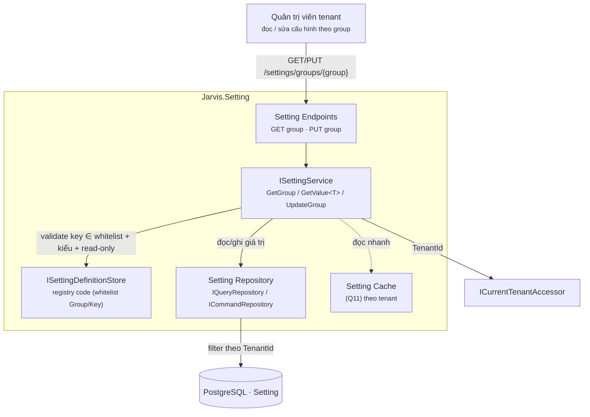

# ADR — Setting Module (Jarvis framework)

> **Trạng thái:** 🔧 Đang thiết kế (Draft để chốt) — chờ trả lời các câu hỏi mục 10.
> **Phạm vi:** Module `Jarvis.Setting` — quản lý cấu hình động theo **Group/Key**, cô lập theo **tenant**, chỉ **Read + Update** (không Create/Delete trên UI). Key/Group **định nghĩa trước trong code**, không cho tạo mới từ UI.
> **Liên quan:** [multi-tenant.md](./2026-07-19-adr-multi-tenant.md) (kế thừa `ITenantEntity` / `ICurrentTenantAccessor`), [`Jarvis.Domain/Entities/ISettingEntity.cs`](../Jarvis.Domain/Entities/ISettingEntity.cs) (interface đã tồn tại), [paged-list-query.md](./2026-07-20-adr-paged-list-query.md) (audit interface `ILog*Entity`), [caching.md](./2026-05-20-adr-done-caching.md) (cache giá trị đọc-nhiều).

---

## 1. Bối cảnh

Cần một module cấu hình động cho phép mỗi **tenant** tùy chỉnh giá trị (vd. thời gian timeout, bật/tắt tính năng, tham số email, theme…) mà **không đổi code, không deploy lại**. Tham chiếu bản cũ ở `jarvis v1.6.5` — [`Setting.cs`](https://github.com/hoangnh2412/jarvis/blob/v1.6.5/Jarvis/Jarvis.Core.Database/Poco/Setting.cs):

```csharp
public class Setting : IEntity<int>, ITenantEntity, ILogCreatedEntity, ILogUpdatedEntity,
                       ILogDeletedEntity, ILogDeletedVersionEntity<int?>, IPermissionEntity
{
    public int Id { get; set; }
    public Guid TenantCode { get; set; }
    // audit kép: CreatedAt + CreatedAtUtc, UpdatedAt + UpdatedAtUtc, DeletedAt + DeletedAtUtc
    public DateTime CreatedAt/CreatedAtUtc; public Guid CreatedBy;
    public DateTime? UpdatedAt/UpdatedAtUtc; public Guid? UpdatedBy;
    public DateTime? DeletedAt/DeletedAtUtc; public Guid? DeletedBy; public int? DeletedVersion;

    public Guid   Code;         // mã dòng (?)
    public string Group;        // nhóm cấu hình
    public string Key;          // khóa
    public string Name;         // nhãn hiển thị
    public string Value;        // giá trị (string)
    public string Options;      // options cho dropdown…
    public int    Type;         // kiểu dữ liệu (magic number)
    public string Description;  // mô tả
    public bool   IsReadOnly;   // khóa sửa
}
```

### 1.1 Phân tích Ưu / Nhược điểm bản cũ

| # | Điểm | Đánh giá | Ghi chú |
|---|------|----------|---------|
| ✅ | Cấu trúc **Group + Key** | **Giữ** | Gom nhóm cấu hình rõ ràng, đúng nhu cầu "update theo group" (YC-4). |
| ✅ | Có **audit + tenant + permission** | **Giữ tinh thần** | Hợp với kiến trúc Jarvis; nhưng cần dùng đúng interface hiện có (§3). |
| ✅ | `Type` + `Options` để mô tả kiểu & lựa chọn | **Giữ (nhưng chuyển chỗ)** | Rất cần cho render UI; nhưng đây là **metadata tĩnh** → thuộc code, không phải DB (§4). |
| ✅ | `IsReadOnly` khóa sửa | **Giữ (chuyển chỗ)** | Cũng là metadata định nghĩa, không phải dữ liệu tenant. |
| ❌ | `Id` kiểu **`int`** | **Bỏ** | Jarvis chuẩn hóa `IEntity<Guid>` (xem multi-tenant dùng `uuid`). `ISettingEntity` hiện tại cũng đã là `Guid`. |
| ❌ | `TenantCode` (đặt tên riêng) | **Đổi** | `ITenantEntity` của Jarvis dùng `Guid TenantId`. Thống nhất tên. |
| ❌ | **Audit kép** `CreatedAt` + `CreatedAtUtc`… | **Bỏ cột Utc** | Trùng lặp, dễ lệch. `ILogCreatedEntity`/`ILogUpdatedEntity` hiện tại chỉ có **một** cột thời gian. Chuẩn hóa lưu UTC. |
| ❌ | `Type` kiểu **`int`** (magic number) | **Đổi** | Khó đọc. Dùng `enum` (hoặc string như `ISettingEntity`) — chốt ở Q6. |
| ❌ | **Soft-delete** (`DeletedAt/By/Version`) | **Bỏ** | Mô hình **RU-only** (YC-1): không tạo/không xóa → toàn bộ bộ máy soft-delete là thừa. |
| ❌ | `Code` (Guid mỗi dòng) | **Bỏ** | Không rõ mục đích; định danh nghiệp vụ đã là `(TenantId, Group, Key)`. |
| ❌ | Lưu **Name/Description/Type/Options/IsReadOnly trong DB** | **Chuyển sang code** | Đây là **định nghĩa tĩnh** của cấu hình. Lưu trong DB → (a) trùng lặp mỗi tenant, (b) cho phép tạo key tùy tiện — **vi phạm YC-3**. |
| ❌ | Ngầm cho phép **INSERT dòng mới** | **Chặn** | YC-3 cấm tạo key trên UI. Model cũ không có cơ chế chặn. |

**Kết luận phân tích:** vấn đề gốc của bản cũ là **trộn "định nghĩa cấu hình" (tĩnh, thuộc code) với "giá trị cấu hình" (động, theo tenant) trong cùng một bảng**. Điều này khiến metadata bị nhân bản theo tenant, cho phép tạo key tùy ý, và kéo theo cả soft-delete không cần thiết.

---

## 2. Yêu cầu

### 2.1 Functional Requirements (FR)

| Mã | Yêu cầu | Nguồn |
|----|---------|-------|
| **FR-01** | **Read**: đọc giá trị 1 key, hoặc toàn bộ key trong 1 group. | YC-1 |
| **FR-02** | **Update**: cập nhật giá trị 1 hoặc **nhiều key trong cùng 1 group** (batch). | YC-1, YC-4 |
| **FR-03** | Không có API/UI **Create** key hay **Delete** key. | YC-1, YC-3 |
| **FR-04** | Mọi giá trị **cô lập theo tenant**; tenant A không thấy/không sửa giá trị tenant B. | YC-2 |
| **FR-05** | Danh mục **Group/Key/kiểu/mặc định/options/read-only định nghĩa trong code**, nạp lúc khởi động. | YC-3 |
| **FR-06** | Update **từ chối key không có trong danh mục code** và key **read-only**. | YC-3 |
| **FR-07** | Giá trị hiệu lực (effective) = giá trị tenant đã lưu, **fallback về mặc định** (code) khi tenant chưa override. | — |
| **FR-08** | Ghi **audit** (CreatedAt/By, UpdatedAt/By) mỗi lần lưu. | Chuẩn Jarvis |
| **FR-09** | API đọc có **typed accessor** `GetValue<T>` (ép kiểu theo định nghĩa). | — |

### 2.2 Business Rules (BR)

| Mã | Quy tắc |
|----|---------|
| **BR-01** | Danh tính một cấu hình = tổ hợp **`(Group, Key)`**, duy nhất trong danh mục code. |
| **BR-02** | Trong DB, một bản ghi giá trị duy nhất theo **`(TenantId, Group, Key)`**. |
| **BR-03** | Update chỉ ghi DB khi giá trị **khác mặc định** (hoặc theo Q8 — luôn ghi). Key chưa từng override → chưa có dòng DB. |
| **BR-04** | Giá trị gửi lên phải **hợp lệ theo kiểu** trong định nghĩa (int/bool/enum/…); sai kiểu → từ chối. |
| **BR-05** | Key `IsReadOnly = true` → chỉ đọc, mọi update bị từ chối (kể cả admin), trừ khi seed từ code. |
| **BR-06** | Update theo group là **all-or-nothing** (transaction): một key sai → cả batch rollback. |

---

## 3. Đối chiếu tài sản đã có trong repo

| Tài sản | Hiện trạng | Việc |
|---|---|---|
| [`ISettingEntity`](../Jarvis.Domain/Entities/ISettingEntity.cs) | Đã có: `ITenantEntity, IEntity<Guid>` + `Key/Value/Type(string)/Options` | **Tái dùng, tinh chỉnh**: bổ sung `Group`; cân nhắc bỏ `Type`/`Options` khỏi entity (chuyển sang definition — Q7). |
| `ITenantEntity` (`Guid TenantId`) | Đã có | Dùng nguyên (thay `TenantCode`). |
| `ILogCreatedEntity` / `ILogUpdatedEntity` (`Guid CreatedBy/UpdatedBy`) | Đã có | Dùng nguyên; **không** dùng `ILogDeletedEntity`. |
| `ICurrentTenantAccessor` | Đã có (AsyncLocal + query filter) | Dùng để cô lập tenant tự động. |
| CQRS `ICommandDispatcher`/`IQueryDispatcher`, `IQueryRepository`/`ICommandRepository`/`IUnitOfWork` | Đã có | Dùng cho service/handler + đọc/ghi. |
| Cache (`Jarvis.Caching`) | Đã có | (Q11) cache giá trị đọc-nhiều theo tenant. |

---

## 4. Quyết định cốt lõi — Tách **Definition (code)** và **Value (DB)**

> Đây là điểm khác biệt lớn nhất so với bản cũ và là chìa khóa đáp ứng YC-3.

```text
┌─────────────────────────────────────┐        ┌──────────────────────────────────┐
│  SettingDefinition  (TĨNH — code)    │        │  Setting  (ĐỘNG — DB, per-tenant)│
│  nguồn sự thật: key nào tồn tại       │  ---   │  chỉ lưu giá trị đã override      │
│  Group, Key, Name, Description,       │ (Group │  TenantId, Group, Key, Value     │
│  Type, DefaultValue, Options,        │  ,Key) │  + audit (Created/Updated)       │
│  IsReadOnly, Validation              │        │                                  │
└─────────────────────────────────────┘        └──────────────────────────────────┘
        registry in-memory                              1 dòng / (Tenant,Group,Key)

Effective(tenant, group, key) = Setting.Value nếu có dòng DB, ngược lại Definition.DefaultValue
```

- **`SettingDefinition`** — danh mục cấu hình khai báo trong code, nạp vào registry lúc khởi động. **Không lưu DB**. Đây là danh sách "trắng" (whitelist) các key hợp lệ ⇒ mọi key ngoài danh mục bị từ chối (thỏa **YC-3 / FR-06**).
- **`Setting`** (entity DB) — chỉ lưu **giá trị override của tenant**, tối giản. Không có Name/Description/Type/Options/IsReadOnly (lấy từ definition), không soft-delete.

**Lợi ích:** metadata không nhân bản theo tenant; không thể tạo key lạ; DB nhẹ; đổi nhãn/mô tả/mặc định chỉ sửa code (versioned); RU-only tự nhiên.

### 4.1 `SettingDefinition` (registry — code)

```csharp
public sealed class SettingDefinition
{
    public string Group { get; }
    public string Key { get; }                 // duy nhất trong Group
    public string Name { get; }                // nhãn UI
    public string? Description { get; }
    public SettingValueType Type { get; }      // enum: String|Int|Bool|Decimal|Enum|Json|DateTime (Q6)
    public string DefaultValue { get; }
    public string? Options { get; }            // JSON cho dropdown/enum
    public bool IsReadOnly { get; }
    // (tùy chọn) Func<string,bool> Validate — kiểm tra giá trị
}

// Đăng ký kiểu fluent, gom theo module:
services.AddSetting(reg =>
{
    reg.Group("Email", g =>
    {
        g.Add("Smtp.Host",    type: String, def: "smtp.local");
        g.Add("Smtp.Port",    type: Int,    def: "587");
        g.Add("Smtp.UseSsl",  type: Bool,   def: "true");
    });
    reg.Group("Security", g =>
    {
        g.Add("Session.TimeoutMinutes", type: Int, def: "30");
        g.Add("Password.MinLength",     type: Int, def: "8", readOnly: true);
    });
});
```

> Registry là **singleton** (`ISettingDefinitionStore`) — tra cứu O(1) theo `(Group, Key)`.

### 4.2 `Setting` (entity DB) — tối giản

```csharp
public class Setting : ISettingEntity   // : ITenantEntity, IEntity<Guid>
                     , ILogCreatedEntity, ILogUpdatedEntity
{
    public Guid   Id { get; set; }
    public Guid   TenantId { get; set; }     // ITenantEntity — cô lập tenant (YC-2)
    public string Group { get; set; }
    public string Key { get; set; }
    public string Value { get; set; }        // luôn lưu dạng string, kiểu suy từ Definition

    public DateTime CreatedAt { get; set; } public Guid CreatedBy { get; set; }
    public DateTime UpdatedAt { get; set; } public Guid UpdatedBy { get; set; }
}
```

Bảng PostgreSQL (DB demo):

```sql
Setting
(
    Id         uuid          NOT NULL,   -- PK
    TenantId   uuid          NOT NULL,   -- cô lập tenant
    "Group"    varchar(128)  NOT NULL,
    Key        varchar(128)  NOT NULL,
    Value      text          NOT NULL,
    CreatedAt  timestamptz   NOT NULL, CreatedBy uuid NOT NULL,
    UpdatedAt  timestamptz   NOT NULL, UpdatedBy uuid NOT NULL
);
CREATE UNIQUE INDEX ux_setting_tenant_group_key ON Setting (TenantId, "Group", Key);  -- BR-02
```

> **Không** dùng soft-delete: RU-only nên không có dòng "đã xóa"; unique index đơn giản theo `(TenantId, Group, Key)`.

---

## 5. Kiến trúc (Component)



**Luồng đọc group:** service lấy danh sách key của group từ `ISettingDefinitionStore` → nạp giá trị override từ DB theo `TenantId` → merge (override ?? default) → trả về kèm metadata (Name/Type/Options/IsReadOnly) để UI render.

**Luồng update group:** với mỗi item → kiểm tra key ∈ whitelist (FR-06), không read-only (BR-05), giá trị hợp kiểu (BR-04) → upsert dòng DB trong **một transaction** (BR-06).

---

## 6. API (RU — thỏa YC-1, YC-4)

Theo CQRS custom Jarvis (`ICommandDispatcher`/`IQueryDispatcher`) + endpoints. Đăng ký qua `AddSetting()` / `MapSettingEndpoints()`.

| Thao tác | Command / Query | API | Ghi chú |
|----------|-----------------|-----|---------|
| Đọc 1 group (merge default+override) | `GetSettingGroupQuery` | `GET /settings/groups/{group}` | Trả list `{ key, value, name, type, options, isReadOnly }`. |
| Đọc 1 key | `GetSettingQuery` | `GET /settings/{group}/{key}` | Giá trị effective. |
| Liệt kê group (metadata) | `GetSettingGroupListQuery` | `GET /settings/groups` | Cho UI dựng menu; **chỉ metadata**, từ registry. |
| **Update nhiều key trong group** | `UpdateSettingGroupCommand` | `PUT /settings/groups/{group}` | Body: `[{ key, value }]`; all-or-nothing (BR-06). |

> **Không expose** `POST` tạo key và `DELETE` xóa key (FR-03) — enforce YC-3 ở tầng API luôn, không chỉ ở service.

Ví dụ body update:

```json
PUT /settings/groups/Email
[
  { "key": "Smtp.Host",   "value": "smtp.corp.com" },
  { "key": "Smtp.Port",   "value": "465" },
  { "key": "Smtp.UseSsl", "value": "true" }
]
```

---

## 7. Enforce YC-3 (không tạo key trên UI)

Ba lớp chặn:
1. **Không có endpoint create** — API chỉ có R + U (FR-03).
2. **Whitelist ở service** — `UpdateSettingGroupCommand` từ chối mọi `key` không có trong `ISettingDefinitionStore` (`400 UnknownSettingKey`).
3. **DB unique + không auto-insert key lạ** — chỉ upsert theo `(TenantId, Group, Key)` đã hợp lệ.

---

## 8. Câu hỏi mở cần chốt

| # | Quyết định | Khuyến nghị | Ghi chú |
|---|-----------|-------------|---------|
| **Q1** | Tách **Definition (code) vs Value (DB)** như §4? | ✅ **Có** | Chìa khóa cho YC-3; giảm trùng lặp; RU-only tự nhiên. |
| **Q2** | Kiểu `Id` | ✅ **`Guid`** | Khớp `ISettingEntity` + chuẩn Jarvis. Bỏ `int`. |
| **Q3** | Đặt tên tenant | ✅ **`TenantId`** (`ITenantEntity`) | Bỏ `TenantCode`. |
| **Q4** | Lưu **1 dòng / key** hay **1 dòng / group** (JSON blob)? | ✅ **1 dòng / key** | Audit & update từng key rõ ràng, unique gọn. (Blob gọn hơn nhưng khó audit/partial-update.) |
| **Q5** | Có **soft-delete** không? | ✅ **Không** | RU-only, không có khái niệm xóa cấu hình. |
| **Q6** | `Type` là **enum** hay **string**? | 🔸 **enum `SettingValueType`** | An toàn hơn cho validate/parse. Nhưng `ISettingEntity` đang khai `string Type` — cần bạn chốt có đổi interface không. |
| **Q7** | `Type`/`Options` nằm ở **Definition (code)** hay cả **entity DB**? | ✅ **Chỉ Definition** | Là metadata tĩnh. ⇒ Cân nhắc **thu hẹp `ISettingEntity`** (bỏ `Type`/`Options`) hoặc giữ để tương thích. |
| **Q8** | Update: **chỉ ghi khi khác default** hay **luôn ghi dòng**? | 🔸 **Luôn ghi (upsert)** | Đơn giản, dễ audit "ai từng set". (Lazy-write tiết kiệm DB nhưng phức tạp hơn.) |
| **Q9** | Có tầng **System/Global default per-host** (ngoài default trong code) mà tenant override? | 🔸 **Chưa cần** | Nếu cần "đổi default không deploy" thì thêm scope Global; mặc định code là đủ cho v1. |
| **Q10** | **Cache** giá trị đọc-nhiều (per-tenant, invalidate khi update)? | 🔸 **Có (phase sau)** | Dùng `Jarvis.Caching`; v1 có thể bỏ qua rồi thêm. |
| **Q11** | Đặt ở **module mới `Jarvis.Setting`** hay nhét vào `Jarvis.Domain`/`Jarvis.EntityFramework`? | ✅ **Module mới `Jarvis.Setting`** | Theo Atomic module, opt-in, NuGet riêng. |
| **Q12** | Phân quyền update setting (ai được sửa group nào)? | 🔸 **Ủy quyền Authorization** | Setting chỉ enforce whitelist/kiểu/read-only; quyền do module Authorization. |

---

## 9. Kết luận (đề xuất chốt)

```text
Jarvis.Setting
├── SettingDefinition        (TĨNH, code): Group/Key/Name/Type/Default/Options/IsReadOnly — whitelist
├── ISettingDefinitionStore  (singleton registry, nạp lúc AddSetting)
├── Setting (entity DB)       (ĐỘNG, per-tenant): TenantId/Group/Key/Value + audit — RU-only, no soft-delete
├── ISettingService          (GetGroup / GetValue<T> / UpdateGroup)
└── API                       (GET group · GET key · GET groups · PUT group)  — KHÔNG có Create/Delete
```

- Tách **định nghĩa (code)** khỏi **giá trị (DB)** ⇒ thỏa **YC-3** một cách cấu trúc, không nhân bản metadata.
- Entity kế thừa **`ITenantEntity`** ⇒ cô lập tenant (**YC-2**) qua `ICurrentTenantAccessor` + query filter.
- Chỉ **R + U** (**YC-1**), update **theo group, all-or-nothing** (**YC-4**).
- Bỏ audit kép, soft-delete, `Code`, `int Id` của bản cũ; dùng đúng `ILog*Entity` hiện có.

---

## 10. Kế hoạch triển khai (sau khi chốt Q1–Q12)

1. **Phase 0 — Chốt ADR.** Trả lời Q1–Q12; quyết định có thu hẹp `ISettingEntity` (Q6/Q7) không.
   → *verify:* ADR khớp tên interface code.
2. **Phase 1 — Definition & registry.** `SettingDefinition`, `SettingValueType`, `ISettingDefinitionStore`, fluent `AddSetting(reg => …)`.
   → *verify:* unit test: đăng ký group/key; tra cứu `(Group,Key)`; trùng key → lỗi.
3. **Phase 2 — Entity + migration.** `Setting : ISettingEntity, ILogCreated/Updated`; mapping + unique `(TenantId,Group,Key)`; migration.
   → *verify:* migration chạy; seed 1 tenant thành công.
4. **Phase 3 — Service RU.** `GetSettingGroup` (merge default+override), `GetValue<T>`, `UpdateSettingGroup` (whitelist + kiểu + read-only + transaction).
   → *verify:* test: đọc group trả default khi chưa override; update key hợp lệ; **update key lạ → từ chối**; update read-only → từ chối; sai kiểu → từ chối; 1 key sai → rollback cả batch.
5. **Phase 4 — API endpoints.** `MapSettingEndpoints()` (GET group/key/groups, PUT group). Không có Create/Delete.
   → *verify:* Swagger trên `Sample` hiển thị đúng RU; cô lập tenant qua header.
6. **Phase 5 — (tùy chọn) Cache.** Cache per-tenant + invalidate khi update (Q10).
   → *verify:* đọc lần 2 hit cache; update → invalidate.
7. **Phase 6 — Wire Sample + tài liệu.** Đăng ký demo group; cập nhật README/ADR.
   → *verify:* `dotnet run --project Sample` + Swagger; `dotnet test` xanh.
