# Jarvis Authentication — Tổng quan & Sơ đồ hoá

Sơ đồ hoá toàn bộ stack authentication gồm 1 package lõi và 3 package vệ tinh:

| Package | Vai trò |
|---------|---------|
| **`Jarvis.Authentication`** | Lõi — entry point `AddJarvisAuthentication`, root options, password policy, composite scheme, hằng số scheme |
| **`Jarvis.Authentication.Basic`** | Satellite — HTTP Basic Auth (handler tự viết) |
| **`Jarvis.Authentication.Jwt`** | Satellite — JWT Bearer (wrap `Microsoft.AspNetCore.Authentication.JwtBearer`) |
| **`Jarvis.Authentication.ApiKey`** | Satellite — API Key header (wrap `AspNetCore.Authentication.ApiKey`) |

**Nguyên tắc kiến trúc:**
- Lõi không phụ thuộc satellite; satellite phụ thuộc lõi (dùng `JarvisAuthenticationSchemes`, options gốc).
- Mỗi satellite là một extension `AddCore*` trên `AuthenticationBuilder` — host tự chọn scheme nào bật.
- Nguồn credential là **extension point generic** (`IBasicCredentialProvider`, `IApiKeyProvider`, `IJwtTokenAccessChecker`) — mặc định đọc config, override được sang DB/Redis/MinIO/vault.
- Cấu hình bind từ section `Authentication` trong `appsettings.json`, validate lúc startup (`ValidateOnStart`).

---

## 1. Sơ đồ package & phụ thuộc

Toàn bộ cạnh chảy **một chiều từ trên xuống** (không có mũi tên bắn ngược lên) nên không đường nào đè lên nhau. Mũi tên **liền** = luồng đăng ký / phụ thuộc external; mũi tên **đứt** = satellite dùng contract của lõi (gom thành *một* đường vào cả cụm).

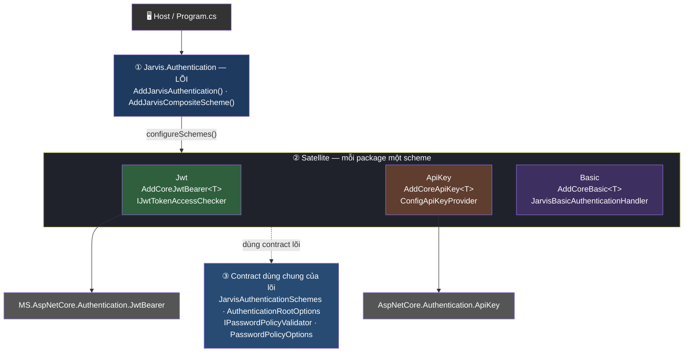

**Đọc sơ đồ (theo chiều xuống):**
- **Host** gọi lõi một lần, rồi lõi mở callback `configureSchemes` để nạp các satellite (② nằm gọn trong 1 cụm — chỉ một mũi tên vào, tránh 3 đường toả ra cắt nhau).
- **Basic tự viết handler** nên không có mũi tên xuống tầng NuGet; chỉ **Jwt → JwtBearer** và **ApiKey → AspNetCore.Authentication.ApiKey**.
- Cả cụm satellite **cùng dùng contract của lõi** (③) — biểu diễn bằng *một* đường đứt xuống dưới, thay cho 3 đường ngược lên như bản cũ.

---

## 2. Đăng ký (DI) — luồng khởi tạo

`AddJarvisAuthentication` là entry point bắt buộc gọi đầu tiên; các `AddCore*` chạy trong callback `configureSchemes`.

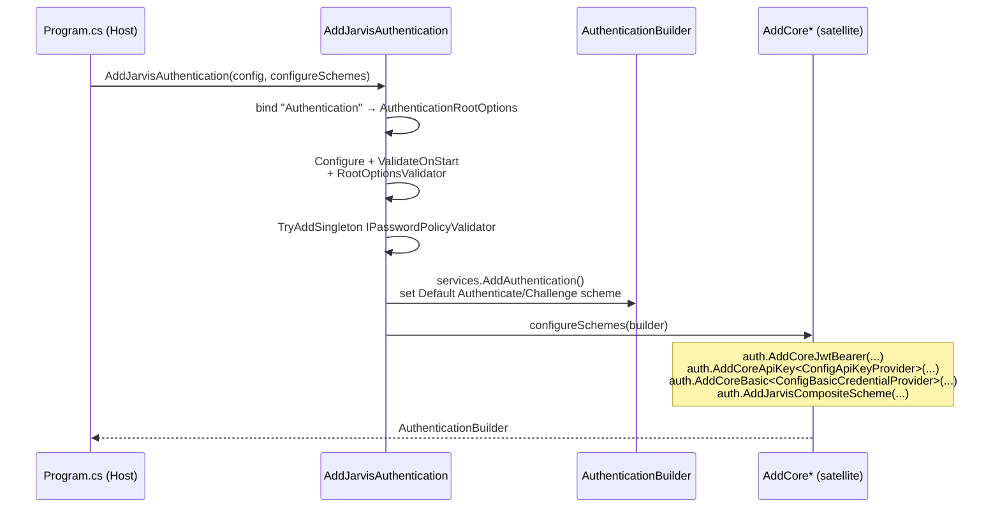

**Ví dụ host:**
```csharp
builder.Services.AddJarvisAuthentication(configuration, auth =>
{
    auth.AddCoreJwtBearer(configuration, "Bearer");
    auth.AddCoreApiKey<ConfigApiKeyProvider>(configuration, JarvisAuthenticationSchemes.ApiKey);
    auth.AddCoreBasic<ConfigBasicCredentialProvider>(configuration);
    auth.AddJarvisCompositeScheme(includeBasic: true);   // gộp nhiều scheme
});
```

---

## 3. Composite scheme — chọn scheme theo request

`AddJarvisCompositeScheme` tạo một **policy scheme** (`"Composite"`) không tự xác thực mà *forward* sang scheme con dựa trên header. Đặt `DefaultAuthenticateScheme = "Composite"` để 1 endpoint chấp nhận nhiều loại credential.

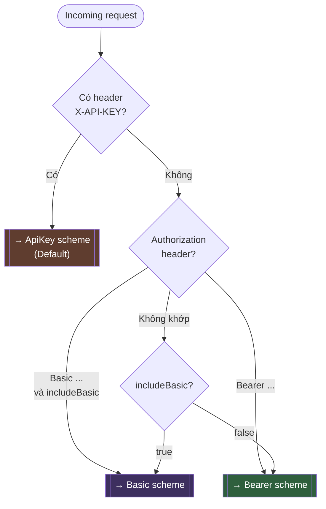

> Thứ tự ưu tiên: **ApiKey header → Basic (nếu bật) → Bearer**. Fallback cuối cùng là Basic (nếu `includeBasic`) hoặc Bearer.

---

## 4. Cấu trúc cấu hình (`appsettings.json`)

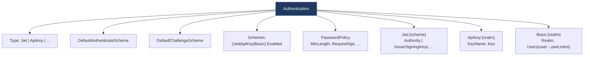

| Section | Bind vào | Ghi chú |
|---------|----------|---------|
| `Authentication` | `AuthenticationRootOptions` | Root — `Type` bắt buộc (validator) |
| `Authentication:Schemes` | `AuthenticationSchemesEnableOptions` | Toggle scheme qua config, không sửa code |
| `Authentication:Jwt:{scheme}` | `AuthenticationJwtOption` | Mỗi scheme là 1 named option |
| `Authentication:ApiKey:{realm}` | `AuthenticationApiKeyOption` | Multi-realm; realm mặc định `Default` |
| `Authentication:Basic:{realm}` | `AuthenticationBasicOption` | `Users` = dictionary username → credential |

---

## 5. JWT Bearer

### 5.1 Sơ đồ thành phần

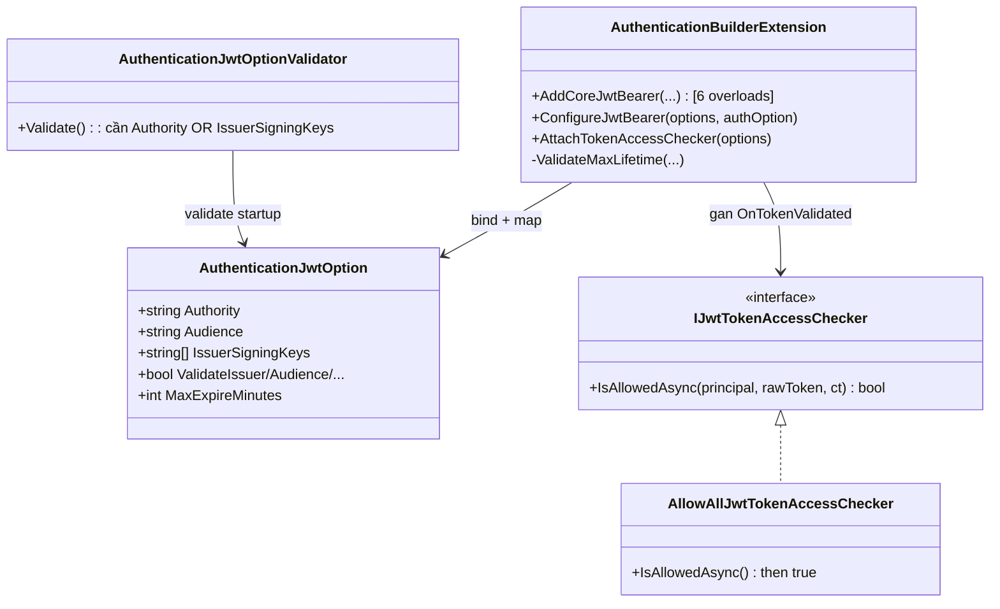

### 5.2 Hai chế độ validate

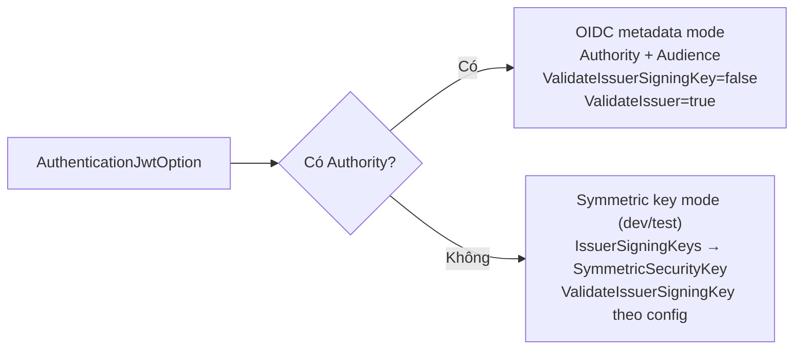

### 5.3 Luồng xác thực token

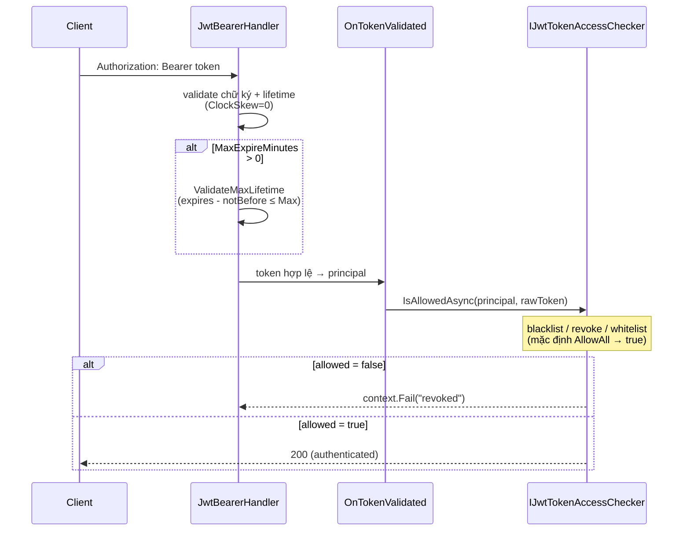

> **Extension point:** `AddCoreJwtBearer<RedisJwtRevocationChecker>(...)` để cắm revoke-list. Checker đăng ký **Singleton** → tra DB dùng `IDbContextFactory`/`IServiceScopeFactory`.

---

## 6. API Key

### 6.1 Sơ đồ thành phần

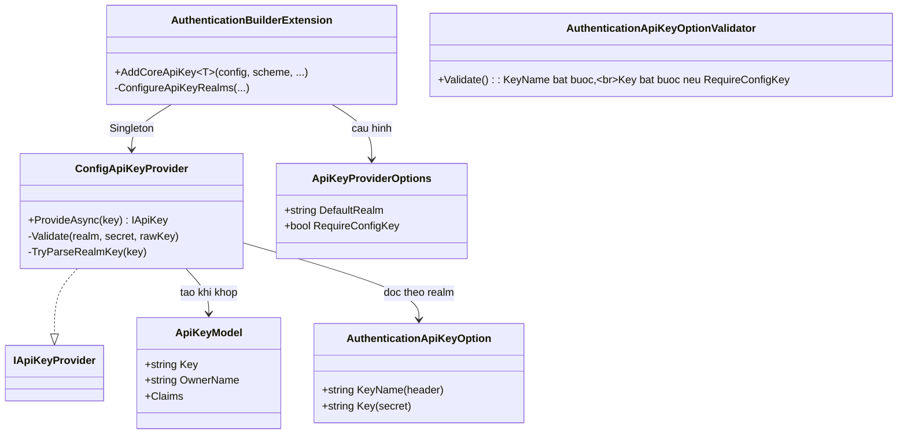

### 6.2 Multi-realm & luồng validate

Header có thể mang prefix `realm:` để chọn realm; không có prefix → realm mặc định (`Default`).

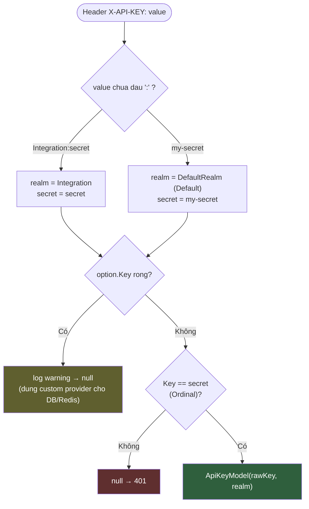

> **`RequireConfigKey`:** tự động `true` khi provider là `ConfigApiKeyProvider` (bắt buộc `Key` trong config). Custom provider (DB/vault) → `false`, chỉ cần `KeyName`.

---

## 7. HTTP Basic

### 7.1 Sơ đồ thành phần

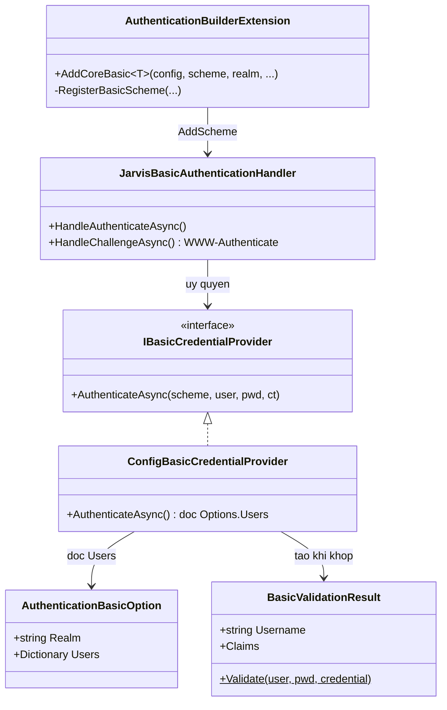

### 7.2 Luồng xác thực

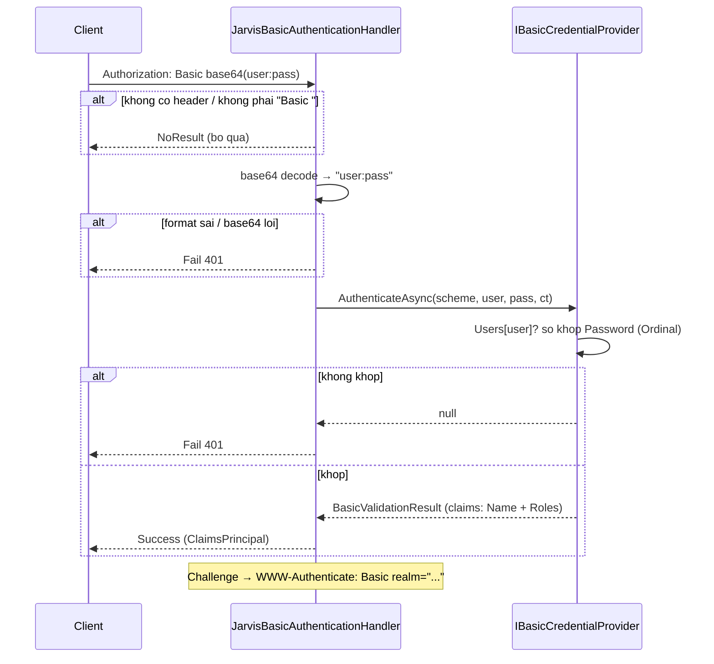

> ⚠️ Basic dùng password **plain-text** trong config (`BasicUserCredential.Password`) → chỉ dùng dev/test hoặc service-to-service nội bộ. Nguồn thật (DB có hash) → implement `IBasicCredentialProvider` riêng.

---

## 8. Extension points — bảng tổng hợp

| Scheme | Interface | Mặc định | Lifetime DI | Override để... |
|--------|-----------|----------|-------------|----------------|
| JWT | `IJwtTokenAccessChecker` | `AllowAllJwtTokenAccessChecker` | Singleton | Revoke list, blacklist, whitelist (Redis/DB) |
| API Key | `IApiKeyProvider` *(external)* | `ConfigApiKeyProvider` | Singleton | Đọc key từ DB, vault, Redis, MinIO |
| Basic | `IBasicCredentialProvider` | `ConfigBasicCredentialProvider` | Singleton | Đọc user từ DB có password hash |
| Password | `IPasswordPolicyValidator` | `DefaultPasswordPolicyValidator` | Singleton (`TryAdd`) | Password history, breach check |

> **Lưu ý Singleton:** không inject scoped `DbContext` trực tiếp — dùng `IDbContextFactory<TContext>` hoặc `IServiceScopeFactory`. Redis/MinIO client thường Singleton-safe.

---

## 9. Password policy (lõi)

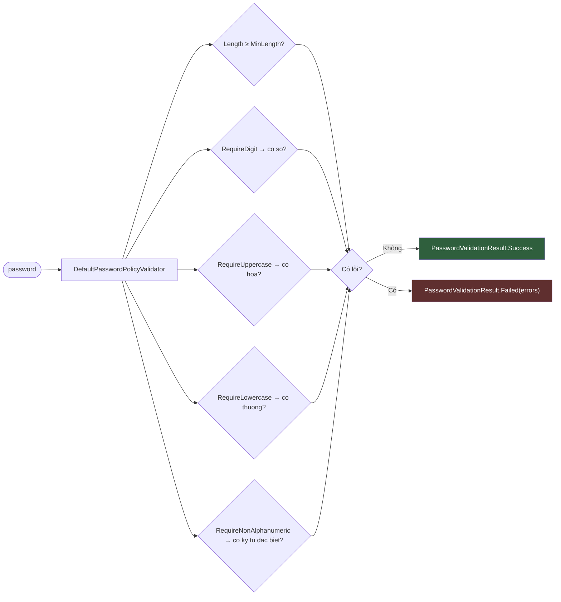

> Validator mặc định chỉ enforce các rule độ mạnh trên. Cần thêm (password history, breach check, hết hạn mật khẩu) → override `IPasswordPolicyValidator` trong DI.

---

## 10. Toàn cảnh runtime — một request qua Composite

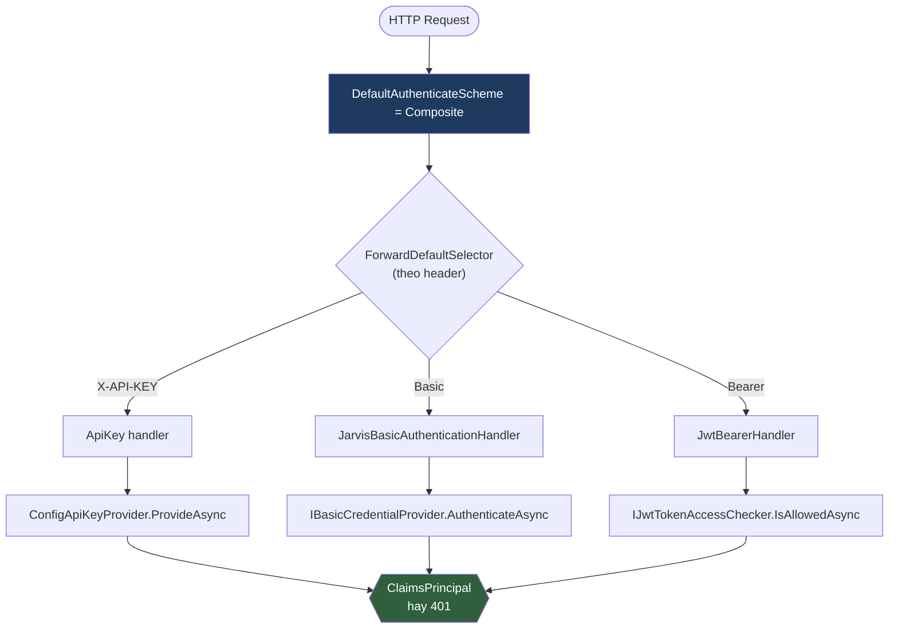

---

## Phụ lục — Bản đồ file → chức năng

| File | Chức năng |
|------|-----------|
| `Jarvis.Authentication/AuthenticationServiceCollectionExtensions.cs` | Entry point `AddJarvisAuthentication` |
| `Jarvis.Authentication/AuthenticationRootOptions.cs` + `...Validator.cs` | Root config + validate `Type` |
| `Jarvis.Authentication/AuthenticationSchemes(Enable)Options.cs` | Toggle scheme qua config |
| `Jarvis.Authentication/JarvisAuthenticationSchemes.cs` | Hằng số scheme (Composite/Default/Basic/Bearer) |
| `Jarvis.Authentication/AuthenticationBuilderExtensions.cs` | `AddJarvisCompositeScheme` (param `bearerScheme`) |
| `Jarvis.Authentication/*Password*.cs`, `IPasswordPolicyValidator.cs` | Password policy |
| `Jarvis.Authentication.Jwt/AuthenticationBuilderExtension.cs` | `AddCoreJwtBearer`, map options, access checker |
| `Jarvis.Authentication.Jwt/AuthenticationJwtOption(Validator).cs` | JWT options + validate |
| `Jarvis.Authentication.Jwt/*JwtTokenAccessChecker.cs` | Revoke/whitelist hook |
| `Jarvis.Authentication.ApiKey/AuthenticationBuilderExtension.cs` | `AddCoreApiKey`, multi-realm |
| `Jarvis.Authentication.ApiKey/ConfigApiKeyProvider.cs` | Validate key từ config |
| `Jarvis.Authentication.ApiKey/ApiKey*Option*.cs`, `ApiKeyModel.cs` | Options + model |
| `Jarvis.Authentication.Basic/AuthenticationBuilderExtension.cs` | `AddCoreBasic` |
| `Jarvis.Authentication.Basic/JarvisBasicAuthenticationHandler.cs` | Handler Basic tự viết |
| `Jarvis.Authentication.Basic/*Credential*.cs`, `BasicValidationResult.cs` | Provider + kết quả validate |
