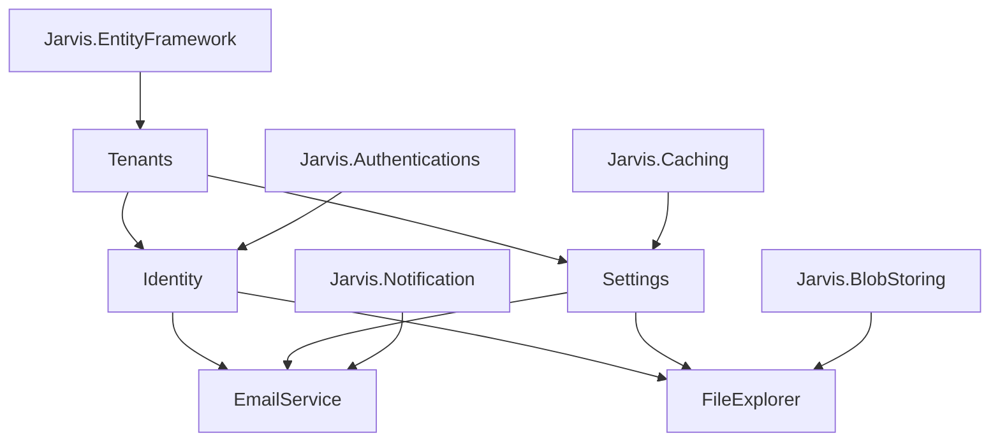

# Jarvis Platform — Kiến trúc module

Tài liệu mô tả cấu trúc source code cho các module nền tảng quản trị (`Jarvis.Platform.*`) **trong repo Jarvis framework** (`Jarvis.sln`). Phạm vi: EmailService, FileExplorer, Settings, Identity và Tenants. Mỗi module có **API độc lập**, **UI độc lập** và có thể được sử dụng bởi bất kỳ hệ thống nào khác thông qua HTTP API, OpenAPI contract hoặc NuGet Contracts.

**Trạng thái:** 📋 Kế hoạch — chưa triển khai code.

**Liên quan:** [README.md](../README.md) (roadmap mục B.4), [solution-structure.md](../.opencode/skills/jarvis-dotnet/reference/solution-structure.md), [CodeBaseSkill.md](../CodeBaseSkill.md).

---

## 1. Bối cảnh

### 1.1 Phạm vi tài liệu

| Trong phạm vi | Ngoài phạm vi |
|--------------|---------------|
| Thêm package `Jarvis.Platform.*` vào **cùng repo** `Jarvis_1` | Tạo solution `Jarvis.Platform.sln` riêng |
| Một `Jarvis.sln`, project phẳng ở root (convention hiện tại) | Scaffold product app 5 layer (`MyApp.Domain`, …) |
| `Sample` làm host demo wire Platform | `Platform.Host` riêng trong framework repo |
| UI trong folder `ui/` (optional, sau API) | UI nhúng trong `.csproj` Platform |

### 1.2 Hiện trạng repo Jarvis

Một solution, **24 project** phẳng ở root, **chưa có** Solution Folder, **chưa có** `Jarvis.Platform.*`:

```text
Jarvis_1/
├── Jarvis.sln
├── Jarvis.Domain.Shared/          # Foundation
├── Jarvis.Domain/
├── Jarvis.Application.Contracts/
├── Jarvis.Application/
├── Jarvis.EntityFramework/
├── Jarvis.Common/
├── Jarvis.Caching/                # Infrastructure (+ Redis, BlobStoring, Notification, …)
├── Jarvis.Mvc/
├── Sample/                        # Host demo
├── UnitTest/
└── docs/
```

Convention đặt tên: `Jarvis.{Module}/Jarvis.{Module}.csproj`. Module infra dùng pattern **Core + Provider** (vd. `Jarvis.BlobStoring` + `Jarvis.BlobStoring.MinIO`). Mỗi package publish NuGet: `PackageId`, `GeneratePackageOnBuild`, `net9.0`.

Theo [CodeBaseSkill.md](../CodeBaseSkill.md): `Jarvis.*` = thư viện hạ tầng; host (`Sample` / app consumer) gọi extension `Add*` / `Use*`. Platform là **tier mới** — business capability ship dưới dạng NuGet, không phải app code trong host.

### 1.3 Hạ tầng Jarvis đã có

| Nhu cầu nghiệp vụ | Hạ tầng Jarvis | Contract chính |
|-------------------|----------------|----------------|
| Gửi email | `Jarvis.Notification`, `Jarvis.Notification.Mailkit` | `IEmailSender` (keyed provider) |
| Lưu file | `Jarvis.BlobStoring`, FileSystem / MinIO / AwsS3 | `IBlobStoringService` (keyed provider) |
| Multitenancy | `Jarvis.EntityFramework` | `MasterDbContext`, `SwitchDbContextAsync`, `ITenantManagementEntity` |
| Xác thực | `Jarvis.Authentications.*` | JWT Bearer, API Key, Cognito |
| CQRS | `Jarvis.Application` | `ICommandDispatcher`, `IQueryDispatcher` |
| Cache | `Jarvis.Caching`, `Jarvis.Caching.Redis` | `ICacheService`, invalidation pub/sub |

### 1.4 Khoảng trống cần bổ sung (Platform tier)

| Module | Phạm vi |
|--------|---------|
| **EmailService** | CRUD email template, render biến, gửi mail qua provider Jarvis hỗ trợ |
| **FileExplorer** | Duyệt / upload / download file; metadata; phân quyền path; bọc `IBlobStoringService` |
| **Settings** | CRUD cài đặt hệ thống (global + tenant-scoped); kiểu Text, Number, DateTime, DateRange, Password |
| **Identity** | CRUD User, Role, Permission; RBAC; bridge JWT |
| **Tenants** | CRUD tenant; cây phân cấp; connection string; provision DB |

Roadmap Jarvis (README mục B.4) đặt tên khối này là `Jarvis.Platform.*`.

---

## 2. Bốn tier trong Jarvis.sln

```text
Tier 1 — Foundation:     Jarvis.Domain, Jarvis.Application, Jarvis.EntityFramework, …
Tier 2 — Infrastructure: Jarvis.Caching, Jarvis.BlobStoring, Jarvis.Notification, …
Tier 3 — Platform (mới): Jarvis.Platform.Tenants, Jarvis.Platform.Identity, …
Tier 4 — Host & Tests:   Sample, UnitTest
```

### 2.1 Mô hình tổng thể

```text
┌─────────────────────────────────────────────────────────────┐
│  Hệ thống khác (MyApp, PartnerApp, Mobile…)                 │
│  → HTTP API / NuGet Contracts / OpenAPI client              │
└──────────────────────────┬──────────────────────────────────┘
                           │
┌──────────────────────────▼──────────────────────────────────┐
│  Host (Sample hoặc app consumer)                            │
│  → AddPlatformTenants(), AddPlatformIdentity(), …           │
│  → reference Jarvis.Platform.*.HttpApi                      │
└──────────────────────────┬──────────────────────────────────┘
                           │
┌──────────────────────────▼──────────────────────────────────┐
│  Jarvis.Platform.* (CQRS handlers, entities, controllers)   │
└──────────────────────────┬──────────────────────────────────┘
                           │
┌──────────────────────────▼──────────────────────────────────┐
│  Jarvis.* Foundation + Infrastructure                       │
└─────────────────────────────────────────────────────────────┘

UI (độc lập, optional):
  ui/platform-shell  +  tenants-admin  +  identity-admin  +  ...
```

### 2.2 Nguyên tắc thiết kế

1. **Mỗi module Platform = một bounded context** — không reference chéo core package giữa các module; giao tiếp qua `*.Contracts` hoặc integration event (tương lai).
2. **Dùng chung Foundation** — `Jarvis.Domain`, `Jarvis.Application`, `Jarvis.EntityFramework`; **không** nhân bản `Jarvis.Platform.X.Domain` riêng.
3. **Contracts là public surface** — DTO, permission constants, `ISettingProvider`; publish NuGet cho consumer.
4. **HttpApi chỉ chứa Controller + DI extension** — không business logic.
5. **UI là SPA riêng** — folder `ui/` tách khỏi solution .NET; consume OpenAPI.
6. **Infra thuần giữ nguyên** — không nhét CRUD template / metadata file vào `Jarvis.Notification` / `Jarvis.BlobStoring`.

### 2.3 Route API chuẩn

| Module | Route prefix | DbContext |
|--------|-------------|-----------|
| Tenants | `/api/platform/tenants` | Master |
| Identity | `/api/platform/identity` | Master (+ tenant scope tùy thiết kế) |
| Settings | `/api/platform/settings` | Master + Tenant |
| Email | `/api/platform/email` | Master hoặc Tenant (configurable) |
| FileExplorer | `/api/platform/files` | Tenant |

---

## 3. Cấu trúc solution đề xuất

### 3.1 Trên disk (khuyến nghị giai đoạn 1)

**Giữ nguyên** path project hiện có. Chỉ **thêm** package Platform mới ở root — cùng convention `Jarvis.Caching/`:

```text
Jarvis_1/
├── Jarvis.sln
│
├── Jarvis.Domain.Shared/              # Foundation — không đổi
├── Jarvis.Domain/
├── Jarvis.Application.Contracts/
├── Jarvis.Application/
├── Jarvis.EntityFramework/
├── Jarvis.Common/
│
├── Jarvis.Caching/                    # Infrastructure — không đổi
├── Jarvis.Caching.Redis/
├── Jarvis.BlobStoring/
├── Jarvis.BlobStoring.FileSystem/
├── Jarvis.BlobStoring.MinIO/
├── Jarvis.BlobStoring.AwsS3/
├── Jarvis.Notification/
├── Jarvis.Notification.Mailkit/
├── Jarvis.Authentication/
├── Jarvis.Authentication.Jwt/
├── Jarvis.Authentication.ApiKey/
├── Jarvis.Authentication.Cognito/
├── Jarvis.Mvc/
├── Jarvis.Swashbuckle/
├── Jarvis.HealthChecks/
├── Jarvis.OpenTelemetry/
│
├── Jarvis.Platform.Tenants.Contracts/           # Platform — MỚI (~20 project)
├── Jarvis.Platform.Tenants/
├── Jarvis.Platform.Tenants.EntityFramework/
├── Jarvis.Platform.Tenants.HttpApi/
├── Jarvis.Platform.Identity.Contracts/
├── Jarvis.Platform.Identity/
├── Jarvis.Platform.Identity.EntityFramework/
├── Jarvis.Platform.Identity.HttpApi/
├── Jarvis.Platform.Settings.Contracts/
├── Jarvis.Platform.Settings/
├── Jarvis.Platform.Settings.EntityFramework/
├── Jarvis.Platform.Settings.HttpApi/
├── Jarvis.Platform.Email.Contracts/
├── Jarvis.Platform.Email/
├── Jarvis.Platform.Email.EntityFramework/
├── Jarvis.Platform.Email.HttpApi/
├── Jarvis.Platform.FileExplorer.Contracts/
├── Jarvis.Platform.FileExplorer/
├── Jarvis.Platform.FileExplorer.EntityFramework/
├── Jarvis.Platform.FileExplorer.HttpApi/
│
├── Sample/                            # Host demo — mở rộng wire Platform
├── UnitTest/                          # Thêm test Platform
├── docs/
└── ui/                                # (optional) SPA admin
```

**Tổng ước tính:** 24 project hiện có + ~20 project Platform ≈ **44 project** trong một `Jarvis.sln`.

### 3.2 Trong Solution Explorer (Solution Folder)

Solution Folder chỉ để **nhóm nhìn** — không đổi path build trên disk:

```text
Jarvis.sln
├── [Foundation]
│   ├── Jarvis.Domain.Shared
│   ├── Jarvis.Domain
│   ├── Jarvis.Application.Contracts
│   ├── Jarvis.Application
│   ├── Jarvis.EntityFramework
│   └── Jarvis.Common
├── [Infrastructure]
│   ├── Jarvis.Caching
│   ├── Jarvis.Caching.Redis
│   ├── Jarvis.BlobStoring
│   ├── Jarvis.BlobStoring.FileSystem
│   ├── Jarvis.BlobStoring.MinIO
│   ├── Jarvis.BlobStoring.AwsS3
│   ├── Jarvis.Notification
│   ├── Jarvis.Notification.Mailkit
│   ├── Jarvis.Authentication
│   ├── Jarvis.Authentication.Jwt
│   ├── Jarvis.Authentication.ApiKey
│   ├── Jarvis.Authentication.Cognito
│   ├── Jarvis.Mvc
│   ├── Jarvis.Swashbuckle
│   ├── Jarvis.HealthChecks
│   └── Jarvis.OpenTelemetry
├── [Platform]
│   ├── Tenants/        → 4 project Jarvis.Platform.Tenants.*
│   ├── Identity/       → 4 project
│   ├── Settings/       → 4 project
│   ├── Email/          → 4 project
│   └── FileExplorer/   → 4 project
└── [Host & Tests]
    ├── Sample
    └── UnitTest
```

Có thể dùng Solution Folder lồng nhau (`[Platform]/Tenants/`) — chỉ tổ chức visual trong IDE.

### 3.3 (Tùy chọn, giai đoạn sau) Di chuyển vật lý theo tier

Chỉ khi muốn disk khớp Solution Explorer — **breaking change** lớn (sửa mọi `ProjectReference`, CI, skill):

```text
foundation/Jarvis.Domain/
infrastructure/Jarvis.Caching/
platform/tenants/Jarvis.Platform.Tenants/
host/Sample/
```

**Khuyến nghị:** giai đoạn 1 **không** di chuyển project cũ.

---

## 4. Cấu trúc chuẩn mỗi module Platform

**Không** nhân bản full 5 layer DDD như product scaffold (`MyApp.Domain` … `MyApp.Host`). Mỗi module Platform gồm **4 package** — tương tự pattern Core + Provider của infra:

```text
Jarvis.Platform.{Name}.Contracts/        ← NuGet public: DTO, permission, I*Provider
Jarvis.Platform.{Name}/                  ← core: entity, repo interface, CQRS handler, Extensions/
Jarvis.Platform.{Name}.EntityFramework/  ← EF config, repository impl
Jarvis.Platform.{Name}.HttpApi/          ← Controller + AddPlatform{Name}HttpApi()
```

### 4.1 Nội dung folder trong package Core

Theo convention [CodeBaseSkill.md](../CodeBaseSkill.md):

```text
Jarvis.Platform.Tenants/
├── Abstractions/
├── Configuration/              # TenantsOptions, SectionName
├── Entities/                   # kế thừa Jarvis.Domain.Entities.BaseEntity
├── Repositories/               # interface only
├── Commands/
├── Queries/
├── Handlers/                   # ICommandHandler / IQueryHandler qua Jarvis.Application
├── Extensions/                 # AddPlatformTenants(IHostApplicationBuilder)
└── Permissions/
```

Entity Platform (`Tenant`, `ApplicationUser`, …) nằm trong package Core — **không** tạo `Jarvis.Platform.Tenants.Domain` riêng.

### 4.2 Dependency giữa các package (trong một module)

```text
Contracts
   ↑
Core          → Jarvis.Application, Jarvis.Domain, Contracts
   ↑
EntityFramework → Jarvis.EntityFramework, Core
   ↑
HttpApi       → Core, Contracts, Jarvis.Mvc
```

### 4.3 Reference giữa các module Platform

Module A **không** reference package Core của module B. Chỉ qua Contracts (vd. `ISettingProvider` trong `Jarvis.Platform.Settings.Contracts`).

### 4.4 Đăng ký DI (Sample / host consumer)

```csharp
// Sample/HostApplicationBuilderExtension.cs (mở rộng)
public static IHostApplicationBuilder AddSampleHost(this IHostApplicationBuilder builder)
{
    builder.AddJarvisCaching();          // trước EF
    builder.AddEntityFramework();
    builder.AddSampleDbContext();

    builder
        .AddPlatformTenants(builder.Configuration)       // thứ tự: Tenants trước
        .AddPlatformIdentity(builder.Configuration)
        .AddPlatformSettings(builder.Configuration)
        .AddPlatformEmail(builder.Configuration)
        .AddPlatformFileExplorer(builder.Configuration);

    return builder;
}
```

Platform ship extension `ApplyPlatformTenantsConfiguration(modelBuilder)`; host gọi trong `OnModelCreating` của DbContext sở hữu.

### 4.5 Tích hợp cho hệ thống bên ngoài

| Cách tích hợp | Deliverable |
|---------------|-------------|
| HTTP API | OpenAPI spec (`/swagger/platform/v1`) |
| Typed client | `Jarvis.Platform.{Module}.Client` (optional, generate từ OpenAPI) |
| Contract-only | NuGet `Jarvis.Platform.{Module}.Contracts` |

Auth: **JWT Bearer** hoặc **API Key** (`Jarvis.Authentications.*`). Permission trong Contracts map sang ASP.NET policy.

---

## 5. Checklist triển khai (chưa làm — tham chiếu khi bắt đầu code)

### 5.1 Bước 1 — Solution Folder (zero risk)

| Việc | Ảnh hưởng |
|------|-----------|
| Thêm Solution Folder `Foundation`, `Infrastructure`, `Host & Tests` trong `Jarvis.sln` | Chỉ file `.sln` |
| Kéo project hiện có vào folder tương ứng | Không đổi build |

### 5.2 Bước 2 — Scaffold Platform packages

Với **mỗi** module (Tenants → Identity → Settings → Email → FileExplorer), tạo 4 classlib + add vào sln:

| Project | Sdk | Reference chính |
|---------|-----|-----------------|
| `*.Contracts` | `Microsoft.NET.Sdk` | `Jarvis.Domain.Shared` (optional) |
| `*` (core) | `Microsoft.NET.Sdk` | `Jarvis.Application`, `Jarvis.Domain`, `*.Contracts` |
| `*.EntityFramework` | `Microsoft.NET.Sdk` | `Jarvis.EntityFramework`, core |
| `*.HttpApi` | `Microsoft.NET.Sdk` | core, `*.Contracts`, `Jarvis.Mvc` |

Mỗi package Platform: `PackageId`, `Version`, `GeneratePackageOnBuild`, `net9.0`, extension `AddPlatformXxx()`.

### 5.3 Bước 3 — Sample (host demo)

- `ProjectReference` tới `*.HttpApi` (hoặc core + EF).
- Gọi `AddPlatform*` trong host extension.
- Entity demo (`Student`) giữ trong Sample; entity Platform trong package `Jarvis.Platform.*`.

### 5.4 Bước 4 — UnitTest

Mở rộng `UnitTest/` hoặc thêm `UnitTest/Platform/{Module}/`. `InternalsVisibleTo` nếu cần test implementation nội bộ.

### 5.5 Bước 5 — Tài liệu & skill

| File | Việc |
|------|------|
| `README.md` | Bảng NuGet Platform |
| `.opencode/skills/` | Skill `platform-tenants-dotnet`, … |
| `CodeBaseSkill.md` | Quy tắc tier Platform |

### 5.6 Bước 6 — CI / publish NuGet

Pipeline build `Jarvis.Platform.*`; `Sample` và `UnitTest` không publish.

### 5.7 Những việc KHÔNG làm

| Việc | Lý do |
|------|-------|
| Tạo `Jarvis.Platform.sln` riêng | Một repo framework = một sln |
| Nhân bản `Jarvis.Domain` per module | Dùng chung Foundation |
| Di chuyển project cũ vào subfolder ngay | Breaking path references |
| Nhét business logic vào `Jarvis.Notification` / `Jarvis.BlobStoring` | Infra tier |
| Tạo `Platform.Host` trong framework repo | `Sample` đủ vai trò host demo |

### 5.8 Thứ tự triển khai code

```text
1. Solution Folder
2. Jarvis.Platform.Tenants.*  + Sample wire + test
3. Jarvis.Platform.Identity.*
4. Jarvis.Platform.Settings.*
5. Jarvis.Platform.Email.*
6. Jarvis.Platform.FileExplorer.*
7. docs + README + skills
8. ui/ (optional, sau API)
```

---

## 6. Module: Tenants

**Vai trò:** Nền tảng multitenancy — mọi module khác phụ thuộc tenant context.

**Packages:** `Jarvis.Platform.Tenants.Contracts`, `.Tenants`, `.Tenants.EntityFramework`, `.Tenants.HttpApi`.

Sample hiện có entity mẫu (`Sample/Entities/Tenant.cs`) implement `ITenantManagementEntity` — sẽ chuyển / formalize trong package Platform.

### 6.1 Core (entities, repositories)

```text
Jarvis.Platform.Tenants/
├── Entities/
│   └── Tenant.cs              # Name, Code, ParentId, Status, ConnectionString, Metadata
├── Repositories/
│   └── ITenantRepository.cs
└── Services/
    └── ITenantProvisioner.cs  # tạo DB tenant, chạy migrate
```

### 6.2 CQRS

| Loại | Use case |
|------|----------|
| Commands | `CreateTenant`, `UpdateTenant`, `DeleteTenant` (soft), `ProvisionTenantDb` |
| Queries | `GetTenant`, `ListTenants`, `GetTenantTree` |

### 6.3 EntityFramework

- `MasterDbContext` integration, `DbSet<Tenant>`.
- `TenantDbProvisioner` — EF migrate dedicated DB (separate-tenant-db).

### 6.4 HttpApi

- `TenantsController` — CRUD + `GET tree`.

### 6.5 UI

- `ui/tenants-admin/` — danh sách, form, cây parent/child.

### 6.6 Lưu ý

- Tenant **luôn** Master DB.
- Xóa tenant: soft delete + deactivate connection.

---

## 7. Module: Identity

**Vai trò:** User, Role, Permission; RBAC; bridge `Jarvis.Authentications.Jwt`.

**Packages:** `Jarvis.Platform.Identity.*` (+ optional `Jarvis.Platform.Identity.Account.HttpApi` cho login/profile).

Sub-domain:

```text
Core/      → User, Role, Permission
Account/   → Login, logout, profile, forgot password (dùng EmailService)
```

### 7.1 Core

```text
Jarvis.Platform.Identity/
├── Entities/
│   ├── ApplicationUser.cs
│   ├── Role.cs
│   ├── Permission.cs          # Code: "email.templates.create"
│   ├── UserRole.cs
│   └── RolePermission.cs
├── Repositories/
└── Services/
    └── IPermissionChecker.cs
```

### 7.2 CQRS

| Loại | Use case |
|------|----------|
| Commands | `CreateUser`, `AssignRoles`, `CreateRole`, `AssignPermissions`, `LockUser` |
| Queries | `ListUsers`, `GetUserPermissions`, `ListRoles` |
| Authorization | `PermissionAuthorizationHandler` |

### 7.3 EntityFramework

- ASP.NET Core Identity (roadmap B.2).
- `JwtTokenService` bridge `Jarvis.Authentications.Jwt`.
- User ↔ Tenant qua FK hoặc `UserTenant`.

### 7.4 HttpApi

- `UsersController`, `RolesController`, `PermissionsController`.
- `AccountController` — login, refresh, forgot password.

### 7.5 Lưu ý

- Permission code trong **Contracts từng module** (seed vào Identity).
- `Jarvis.Authentications.*` = xác thực; Identity Platform = ủy quyền + danh mục.

---

## 8. Module: Settings

**Vai trò:** Cấu hình hệ thống; module khác đọc qua `ISettingProvider` (`Jarvis.Platform.Settings.Contracts`).

### 8.1 Core

```text
Jarvis.Platform.Settings/
├── Entities/
│   └── SettingDefinition.cs   # Key, ValueType, Value, Scope (Global | Tenant)
├── Enums/
│   └── SettingValueType.cs    # Text, Number, DateTime, DateRange, Password
└── Repositories/
```

### 8.2 CQRS

| Loại | Use case |
|------|----------|
| Commands | `UpsertSetting`, `DeleteSetting` |
| Queries | `GetSettingByKey`, `ListSettings` |
| Services | `ISettingCacheInvalidator` — `Jarvis.Caching` pub/sub |

### 8.3 EntityFramework

- Global → Master DB; tenant-scoped → Tenant DB.
- `SettingValueProtector` — mask Password; audit.

### 8.4 HttpApi

- `SettingsController` — CRUD; admin vs read-only.

---

## 9. Module: EmailService

**Vai trò:** CRUD template + orchestration gửi mail. Dùng `IEmailSender` keyed từ `Jarvis.Notification` — **không** mở rộng infra bằng business logic.

```text
Jarvis.Notification.*         → gửi mail thô
Jarvis.Platform.Email.*     → template, render, log, API
```

### 9.1 Core

```text
Jarvis.Platform.Email/
├── Entities/
│   ├── EmailTemplate.cs
│   ├── EmailTemplateVersion.cs   # optional
│   └── EmailSendLog.cs
├── Repositories/
└── Services/
    └── IEmailTemplateRenderer.cs   # Scriban/Liquid
```

### 9.2 CQRS

| Loại | Use case |
|------|----------|
| Commands | CRUD template; `SendEmail`; `SendRawEmail` |
| Queries | Get/List template; send log |
| Handler | render → `[FromKeyedServices(provider)] IEmailSender` |

### 9.3 HttpApi

- `EmailTemplatesController`, `EmailSendController` (`/send`, `/send-raw`, `/preview`).

### 9.4 Lưu ý

- Template global (Master) + tenant override theo `Code`.
- Provider: `providerKey` (`"Mailkit"`, `"AwsSES"`, …).

---

## 10. Module: FileExplorer

**Vai trò:** API duyệt file trên `IBlobStoringService`; hierarchy ảo qua metadata.

```text
Jarvis.BlobStoring.*              → adapter thô
Jarvis.Platform.FileExplorer.*  → metadata, virtual path, ACL, API
```

### 10.1 Core

```text
Jarvis.Platform.FileExplorer/
├── Entities/
│   ├── FileEntry.cs
│   ├── FolderEntry.cs            # optional
│   └── FileAccessGrant.cs
├── Repositories/
└── Services/
    └── IFilePathResolver.cs
```

### 10.2 CQRS

| Loại | Use case |
|------|----------|
| Commands | `UploadFile`, `DeleteFile`, `MoveFile`, `CreateFolder` |
| Queries | `ListFiles`, `GetFileMetadata`, `GetPreviewUrl` |

### 10.3 EntityFramework

- `BlobStorageAdapter` wrap `IBlobStoringService`; path `{tenantId}/root/...`.
- Metadata trên Tenant DB.

### 10.4 HttpApi

- `FilesController`, `FoldersController`, `PreviewController`.

### 10.5 Lưu ý

- Tenant context bắt buộc (`IWorkContext`, `SwitchDbContextAsync`).
- Default provider từ Settings.

---

## 11. Phụ thuộc giữa các module



### 11.1 Phân bổ database

| Module | DbContext | Scope |
|--------|-----------|-------|
| Tenants | Master | Platform |
| Identity | Master (+ optional tenant) | Platform / Tenant |
| Settings | Master + Tenant | Global + per-tenant |
| Email templates | Master hoặc Tenant | Configurable |
| File metadata | Tenant | Per-tenant |

---

## 12. UI độc lập

Jarvis repo hiện chỉ .NET packages — UI **không** nằm trong `.csproj` Platform.

```text
ui/
├── platform-shell/           # layout, auth, menu theo permission
├── tenants-admin/
├── identity-admin/
├── settings-admin/
├── email-admin/
└── file-explorer/
```

- Consume OpenAPI (codegen).
- Shell: Module Federation hoặc lazy route.
- Menu: `GET /api/platform/identity/me/permissions`.

---

## 13. Lộ trình triển khai

| Giai đoạn | Mục tiêu |
|-----------|----------|
| **Phase 1** | Solution Folder + `Jarvis.Platform.Tenants.*` + Sample wire + UnitTest |
| **Phase 2** | Bốn module Platform còn lại; publish NuGet |
| **Phase 3** | UI shell + SPA admin; OpenAPI |
| **Phase 4** | `IJarvisModule` plug-and-play (roadmap F) |
| **Phase 5** | (Tùy chọn) Microservice — tách Host; Contracts sẵn sàng |

---

## 14. Quy tắc không nên vi phạm

1. **Không** đặt CRUD template / metadata file vào `Jarvis.Notification` / `Jarvis.BlobStoring`.
2. **Không** reference core package Platform A từ Platform B — dùng Contracts.
3. **Không** đọc bảng Settings trực tiếp — inject `ISettingProvider`.
4. **Không** lưu `Tenant` trong tenant DB.
5. **Không** tạo `Jarvis.Platform.X.Domain` riêng — entity trong package Core, foundation dùng `Jarvis.Domain`.
6. Giữ **thứ tự DI**: `AddJarvisCaching()` trước `AddEntityFramework()`.

---

## 15. Tham chiếu code hiện có

| Thành phần | Vị trí |
|------------|--------|
| Solution | `Jarvis.sln` (24 project, chưa Platform) |
| Tenant entity mẫu | `Sample/Entities/Tenant.cs` |
| Master DB demo | `Sample/Persistence/MasterDbContext.cs` |
| Host extension mẫu | `Sample/HostApplicationBuilderExtension.cs` |
| `IEmailSender` | `Jarvis.Notification/IEmailSender.cs` |
| `IBlobStoringService` | `Jarvis.BlobStoring/IBlobStoringService.cs` |
| Infra convention | [CodeBaseSkill.md](../CodeBaseSkill.md) |
| Product scaffold (consumer) | [.opencode/skills/jarvis-dotnet/reference/solution-structure.md](../.opencode/skills/jarvis-dotnet/reference/solution-structure.md) |
| Roadmap | [README.md](../README.md) — mục B.4 |

---

*Cập nhật: 2025-06 — align với cấu trúc repo Jarvis thực tế (`Jarvis.sln`, project phẳng, `Sample` làm host demo).*
