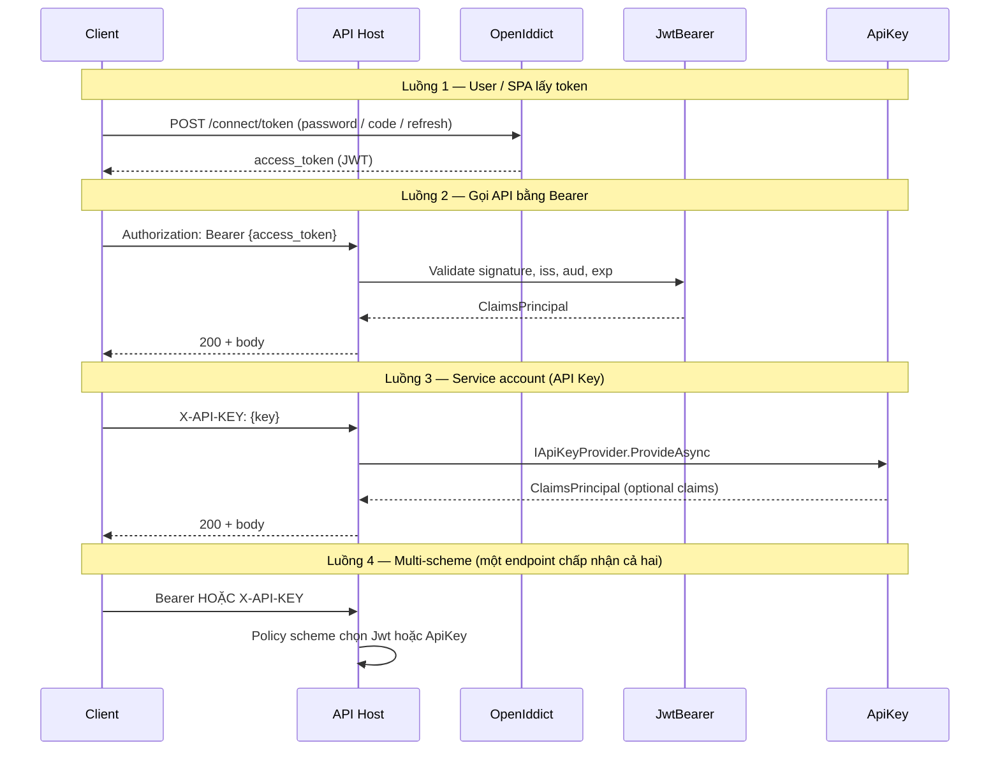

# Refactor Authentication — Thiết kế & Code Review

> **Trạng thái tài liệu:** Phase 0–3, 6 + **Basic** + **JWT access checker**. Base: `AddJarvisAuthentication`, `Composite`, password/cookie options. Satellite: `AddCoreApiKey<T>`, `AddCoreBasic<T>`, `AddCoreJwtBearer<T>` (`IJwtTokenAccessChecker` / `AllowAllJwtTokenAccessChecker`). Sample: `CredentialSource` Config|Database; `SampleJwtTokenAccessChecker`. **Chưa** OpenIddict; Cognito = admin SDK stub. Test: `UnitTest/Authentication`.

## Phạm vi (scope)

| Trong scope (Story Authentication) | Ngoài scope (Story Authorization — riêng) |
|-----------------------------------|---------------------------------------------|
| Xác định **danh tính** request: JWT Bearer, ApiKey, HTTP Basic, OpenIddict (AS/RS — đề xuất), Cognito-as-JWKS | **Quyền**: policies, roles, claims requirements, resource-based auth |
| `AddAuthentication`, schemes, `IApiKeyProvider`, token validation, options (`PasswordPolicy`, `Cookie` cho **login flow**) | `AddAuthorization`, `UseAuthorization`, `[Authorize]`, `IAuthorizationHandler` |
| `UseAuthentication()` trên pipeline | Enforcement `[Authorize]` / policy evaluation |
| Package `Jarvis.Authentication.*` (base, Jwt, ApiKey, Basic; OpenIddict đề xuất) | Package `Jarvis.Authorization.*` (base — chưa thiết kế) |
| Swagger: khai báo scheme (JWT, API_KEY, Basic) | Swagger: gắn policy/scope vào operation (có thể thuộc Authorization story) |

**Phạm vi review code (2026-05-28):** `Jarvis.Authentication`, `Jarvis.Authentication.Jwt`, `Jarvis.Authentication.ApiKey`, `Jarvis.Authentication.Basic`, `Jarvis.Authentication.Cognito`, `Sample/Extensions/SampleAuthenticationExtensions.cs`, `Sample/Program.cs`, `Sample/appsettings.json`, `UnitTest/Authentication`.

**Chuẩn review:** `.opencode/skills/code-review-dotnet/SKILL.md` + Jarvis auth (`.opencode/skills/authentication-dotnet/SKILL.md`).

**Kết luận review (2026-05-28, lần 2 — skill `code-review-dotnet`):** Jwt / ApiKey / Basic **merge-ready**. Sample đã có **mẫu config đầy đủ** (`appsettings.json` + `appsettings.Development.json`), `Composite` default scheme, `ConfigApiKeyProvider` / `ConfigBasicCredentialProvider` khi chạy Development. Production: `Key` / password rỗng — cần user-secrets; Cognito chỉ template (chưa wire DI). **Overall: merge-ready** (libraries + Sample dev); production secrets + Cognito JWT còn việc host.

---

## Đánh giá theo yêu cầu kiến trúc

| # | Yêu cầu | Hiện trạng | Đáp ứng |
|---|---------|------------|---------|
| 1 | `Jarvis.Authentication` là base chung | `AddJarvisAuthentication`, `AuthenticationRootOptions`, `JarvisAuthenticationSchemes`, `AddJarvisCompositeScheme`, `IPasswordPolicyValidator` + `PasswordPolicy` / `Cookie` / `PasswordExpiration` options, `ValidateOnStart` root | **Có** (orchestration scheme vẫn ở Host qua callback) |
| 2 | JWT: `Jarvis.Authentication.Jwt` | `AddCoreJwtBearer` / `AddCoreJwtBearer<T>`, `IJwtTokenAccessChecker`, `AllowAllJwtTokenAccessChecker`, Authority hoặc symmetric keys, `RequireHttpsMetadata` mặc định `true` | **Có** |
| 3 | API Key: `Jarvis.Authentication.ApiKey` | `AddCoreApiKey<T>` only, `ConfigApiKeyProvider`, `Key` per realm, `realm:secret` hoặc secret thuần → `DefaultRealm`, `ValidateOnStart` | **Có** |
| 4 | Customize password / cookie | Options + `DefaultPasswordPolicyValidator`; cookie options bind; **chưa** gắn OpenIddict/login flow | **Một phần** |
| 5 | Basic (mới) | `AddCoreBasic<T>`, `IBasicCredentialProvider.AuthenticateAsync`, `ConfigBasicCredentialProvider`, `BasicValidationResult.Validate`, `AuthenticationBasicOption.DefaultRealm` / `DefaultScheme` | **Có** |

---

## Critical Issues

None — sau cập nhật `Sample/appsettings.json`, `appsettings.Development.json`, và `Config*Provider` trong `SampleAuthenticationExtensions`.

### Đã xử lý (review lần 2 — 2026-05-28)

| # | Mục | Cách xử lý |
|---|-----|------------|
| 1 | `DefaultAuthenticateScheme` lệch Composite | `appsettings.json`: `"Composite"` khi bật ApiKey + Basic |
| 2 | Sample không authenticate | `ConfigApiKeyProvider` + `ConfigBasicCredentialProvider`; dev keys/users trong `appsettings.Development.json` |
| 3 | Cognito bind lệch | `UserPoolIds`, `ClientIds`, `Region`, `Aws` — bỏ `Endpoint` / `UserPools` |

### Còn lưu ý production (không chặn merge library)

| Rủi ro | Chi tiết |
|--------|----------|
| Secret trong repo | `appsettings.Development.json` có key dev — **không** deploy file này; production dùng user-secrets / vault |
| Startup `Key=""` | `ConfigApiKeyProvider` + `Key` rỗng → `ValidateOnStart` fail (cố ý). Custom `IApiKeyProvider` chỉ cần `KeyName` |
| Cognito | Config mẫu only; `CognitoClient` chưa đăng ký trong Sample `Program.cs` |

---

### Đã xử lý (review 2026-05-21 → không còn Critical)

| # | Mục cũ | Trạng thái |
|---|--------|------------|
| — | ApiKey bắt buộc `realm:secret` | **Đã sửa** — secret thuần → default realm; `realm:secret` tùy chọn trong `ConfigApiKeyProvider` |
| — | Lệch scheme `ApiKey` vs `Default` | **Đã sửa** — `JarvisAuthenticationSchemes.ApiKey = "Default"` |
| — | Sample không `UseAuthentication` | **Đã sửa** — `AddSampleAuthentication` + `app.UseAuthentication()` |
| — | JWT `RequireHttpsMetadata = false` mặc định | **Đã sửa** — `?? true` trong `ConfigureJwtBearer` |
| — | JWT thiếu signing keys im lặng | **Đã sửa** — `AuthenticationJwtOptionValidator` + `ValidateOnStart` |
| — | API key plaintext trong `appsettings.json` | **Đã sửa** — `Keys: []`; test `CFG_01` grep repo |

## Custom credential source (DB / Redis / MinIO)

Jarvis **không** ship store cụ thể — host implement provider/checker:

| Scheme | Contract | Built-in | Custom (DB/Redis/MinIO) |
|--------|----------|----------|-------------------------|
| ApiKey | `IApiKeyProvider` | `ConfigApiKeyProvider` | `AddCoreApiKey<T>` |
| Basic | `IBasicCredentialProvider` | `ConfigBasicCredentialProvider` | `AddCoreBasic<T>` |
| Jwt | `IJwtTokenAccessChecker` | `AllowAllJwtTokenAccessChecker` | `AddCoreJwtBearer<T>` — blacklist/whitelist **sau** validate chữ ký |

**Lifetime:** Singleton. Không inject scoped `DbContext` — dùng `IDbContextFactory<T>` / `IServiceScopeFactory`. Redis / MinIO client thường Singleton-safe.

**ApiKey `Key` trong config:** bắt buộc chỉ khi `T` = `ConfigApiKeyProvider` (`ApiKeyProviderOptions.RequireConfigKey`). Custom `T` chỉ cần `KeyName`.

**JWT:** không load user/password từ DB. `IJwtTokenAccessChecker.IsAllowedAsync` chạy trong `OnTokenValidated` — thường check `jti` (hoặc hash token) trên Redis/DB revoke list. `false` → Fail `"Token is revoked or not allowed."`

**Sample:** `Authentication:CredentialSource` = `Config` | `Database` cho ApiKey/Basic. JWT Sample dùng `SampleJwtTokenAccessChecker` (allow-all stub).

```csharp
auth.AddCoreApiKey<MyDbApiKeyProvider>(configuration);
auth.AddCoreBasic<MyDbBasicCredentialProvider>(configuration);
auth.AddCoreJwtBearer<MyRedisJwtRevocationChecker>(configuration);
```

## Suggestions

### `Jarvis.Authentication` — `Authentication.Type` chỉ dùng ở Sample, không trong base

**Issue:** `AddJarvisAuthentication` bind `AuthenticationRootOptions.Type` nhưng **không** tự bật scheme theo `Type`; `SampleAuthenticationExtensions` mới đọc `Type` / `Schemes:*:Enabled`.

**Impact:** Host khác copy chỉ gọi `AddJarvisAuthentication` mà quên callback → không có scheme.

**Suggested fix:** Document bắt buộc callback; hoặc optional đọc `Schemes` flags trong base (tránh reference vòng package).

---

### `Jarvis.Authentication.Basic` — So sánh password plain text

**File:** `Jarvis.Authentication.Basic/BasicValidationResult.cs` (`Validate` static)

**Issue:** `string.Equals(..., Ordinal)` — không constant-time; `ConfigBasicCredentialProvider` đọc password plain từ config.

**Impact:** Chấp nhận **dev/test**; production implement `IBasicCredentialProvider` với hash (bcrypt/Argon2).

**Suggested fix:** Document “dev only”; custom provider so hash trong `AuthenticateAsync`.

---

### `Jarvis.Authentication.Jwt` — `ClockSkew = TimeSpan.Zero`

**File:** `Jarvis.Authentication.Jwt/AuthenticationBuilderExtension.cs`

**Impact:** Token sát `exp` dễ fail khi lệch giờ.

**Suggested fix:** Expose `ClockSkew` trên `AuthenticationJwtOption`.

---

### `Jarvis.Authentication.ApiKey` — Integration realm `Key` rỗng bị bỏ qua bind

**File:** `Jarvis.Authentication.ApiKey/AuthenticationBuilderExtension.cs` — `ConfigureApiKeyRealms`

**Issue:** Realm con có `Key` rỗng (trừ primary scheme) không bind / không `ValidateOnStart` — dễ hiểu nhầm realm “Integration” hoạt động khi chưa set key.

**Suggested fix:** Document; hoặc fail startup nếu section tồn tại nhưng `Key` rỗng.

---

### `Jarvis.Authentication.Cognito` — Stub (giữ từ review trước)

**Suggested fix:** Admin SDK tách biệt; Bearer qua `AddCoreJwtBearer(Authority=...)` + JWKS.

---

### Swagger vs runtime

**Suggested fix:** Phase 7 — derive security schemes từ schemes đã enable (`swashbuckle-dotnet`).

---

### Đã xử lý (không còn Suggestion)

| Mục cũ | Trạng thái |
|--------|------------|
| ApiKey `Keys[]` / `ApiKeyMode` | **`Key` string** + `ConfigApiKeyProvider` |
| `AddCoreApiKey` / `AddCoreBasic` non-generic | Chỉ **`AddCoreApiKey<T>`**, **`AddCoreBasic<T>`** |
| `BasicCredentialValidation` / `ProvideAsync` credential | **`IBasicCredentialProvider.AuthenticateAsync`** → `BasicValidationResult` |
| `AwsOption` trong base | **`Jarvis.Authentication.Cognito`** |
| `Task.Yield` trong `ProvideAsync` | **`Task.FromResult`** |
| Thiếu `AddSingleton<IApiKeyProvider>` | **Có** trong `AddCoreApiKey<T>` |

---

## Best Practices & Improvements

### Kiến trúc đề xuất (đáp ứng 4 yêu cầu)

```text
Jarvis.Authentication                    ← contracts, root options, password/cookie policy options, validation
    ↑
    ├── Jarvis.Authentication.Jwt        ← AddCoreJwtBearer (optional package)
    ├── Jarvis.Authentication.ApiKey     ← AddCoreApiKey (optional package)
    ├── Jarvis.Authentication.Cognito    ← SDK + JwtBearer từ User Pool (optional)
    ├── Jarvis.Authentication.Basic        ← AddCoreBasic (đã có)
    ├── Jarvis.Authentication.OpenIddict   ← AS + validation (optional)
    └── Cognito-as-Jwt-Authority qua Jwt Authority
```

**Base (`Jarvis.Authentication`) nên có:**

| Thành phần | Mục đích |
|------------|----------|
| `AuthenticationRootOptions` | `Type`, default scheme, forward scheme |
| `PasswordPolicyOptions` | Min length, complexity, history — cho Basic/local account |
| `PasswordExpirationOptions` | Max age, warn days — hook `IPasswordExpirationValidator` |
| `JarvisCookieAuthenticationOptions` | Name, HttpOnly, SameSite, sliding expiration — mirror cookie middleware |
| `IAuthenticationCustomizer` / `IPostConfigureOptions<T>` | Extension point không sửa library |
| Options validation (`IValidateOptions<T>`) | Fail fast lúc startup |

**Host wiring mẫu (đề xuất):**

```csharp
builder.Services
    .AddAuthentication()
    .AddCoreApiKey(builder.Configuration);

app.UseAuthentication();
// UseAuthorization() → Story Authorization
```

**Config mẫu thống nhất:**

```json
"Authentication": {
  "Type": "ApiKey",
  "DefaultAuthenticateScheme": "Default",
  "ApiKey": {
    "Default": {
      "KeyName": "X-API-KEY",
      "Mode": "SingleKey",
      "Keys": []
    }
  },
  "Jwt": {
    "Bearer": { "IssuerSigningKeys": [], "ValidateIssuer": true }
  },
  "PasswordPolicy": { "MinLength": 12 },
  "Cookie": { "LoginPath": "/login" }
}
```

### Concurrency / deadlock / memory

| Chủ đề | Đánh giá |
|--------|----------|
| Deadlock | **Không thấy** — `ApiKeyProvider`/`Basic` dùng `Task.FromResult`; DB lookup Basic dùng async scope |
| Thread safety | `ApiKeyProvider` stateless; Cognito client **chưa** đăng ký DI singleton — cần khi dùng thật |
| Memory | JWT `SaveToken = true` — chấp nhận; `KeySet` build một lần lúc post-configure |
| Bottleneck | API Key O(1) `HashSet`; Basic DB lookup mỗi request — cache nếu load cao |
| NativeAOT | Chưa xét; AWS SDK + IdentityModel cần kiểm tra riêng |

### Tái sử dụng & mở rộng

- **Đúng hướng:** Tách package theo scheme; `Action<JwtBearerOptions>?` / `Action<ApiKeyOptions>?` cho override.
- **Thiếu:** Policy-based authorization helpers, claims transformation chung, multi-scheme (`Jwt` + `ApiKey`), và **extension points** cho password/cookie như yêu cầu #4.
- **Đặt tên:** Folder `Jarvis.Authentication.*` vs NuGet `Jarvis.Authentications.*` — document một lần trong README base để tránh nhầm package.

### Test (khi implement)

Chi tiết: mục [Test cases (Authentication story)](#test-cases-authentication-story).

---

## Summary

| Project | Nhận xét ngắn |
|---------|----------------|
| `Jarvis.Authentication` | Base đủ dùng: `AddJarvisAuthentication`, root/cookie/password options, `Composite`, validators |
| `Jarvis.Authentication.Jwt` | Production-ready cho RS symmetric/OIDC Authority; HTTPS metadata + startup validation |
| `Jarvis.Authentication.ApiKey` | `AddCoreApiKey<T>`, `ConfigApiKeyProvider`, `Key` per realm, `ValidateOnStart` |
| `Jarvis.Authentication.Basic` | `IBasicCredentialProvider`, `ConfigBasicCredentialProvider`, validate trong provider |
| `Jarvis.Authentication.Cognito` | **Chưa sẵn sàng** — `AwsOption` + `CognitoClient` stub; config bind lệch |
| `Sample` | Config mẫu + Development secrets; `Config*Provider`; Composite OK |

**Overall:** **merge-ready** (packages + Sample dev). Production: user-secrets, Cognito JWT, OpenIddict.

**Test:** `dotnet test UnitTest/UnitTest.csproj --filter "FullyQualifiedName~UnitTest.Authentication"` — **29/29 passed**.

Thứ tự tiếp theo (Authentication story):

1. ~~Sửa Sample `DefaultAuthenticateScheme`~~ — **done**; production: user-secrets override `Key` / Basic password.
2. Phase 4 — `Jarvis.Authentication.OpenIddict` (xem [Luồng chung](#luồng-chung-openiddict--jwt--apikey)).
3. Cognito: thu hẹp phạm vi hoặc `AddCognitoJwtBearer` + fix bind.
4. Phase 7–8 — Swagger đồng bộ scheme; bổ sung test còn thiếu (`MIX-I-02` Bearer-only Composite, OIDC-*).
5. **Story khác** — Authorization (`UseAuthorization`, policies).

---

## Phụ lục: Ma trận file hiện có

| File / area | Vai trò |
|-------------|---------|
| `AuthenticationServiceCollectionExtensions.cs` | `AddJarvisAuthentication` |
| `AuthenticationRootOptions.cs` | Type, default schemes, Schemes flags, Password/Cookie |
| `AuthenticationBuilderExtensions.cs` | `AddJarvisCompositeScheme` |
| `JarvisAuthenticationSchemes.cs` | `Composite`, `Default` (ApiKey), `Basic` |
| `DefaultPasswordPolicyValidator.cs` | `IPasswordPolicyValidator` |
| `Jarvis.Authentication.Cognito/AwsOption.cs` | AWS credentials (Cognito package) |
| `AuthenticationJwtOption.cs` + `AuthenticationJwtOptionValidator.cs` | JWT options + startup validation |
| `AuthenticationBuilderExtension.cs` (Jwt) | `AddCoreJwtBearer` / `<T>`, `IJwtTokenAccessChecker`, `AllowAllJwtTokenAccessChecker` |
| `AuthenticationApiKeyOption.cs` (`Key`, `KeyName`) + `Validator` | ApiKey per realm |
| `ConfigApiKeyProvider.cs` | Config lookup + realm prefix |
| `AuthenticationBuilderExtension.cs` (ApiKey) | `AddCoreApiKey<T>` only |
| `AuthenticationBasicOption.cs` (`DefaultRealm`, `DefaultScheme`, `Realm`) + handler | HTTP Basic |
| `IBasicCredentialProvider` + `ConfigBasicCredentialProvider` | Validate trong provider |
| `BasicValidationResult.cs` | Claims + `Validate` helper |
| `SampleApiKeyProvider` / `SampleBasicAuthCredentialProvider` | DB providers (Sample); `CredentialSource=Database` |
| `CognitoOption.cs` / `CognitoClient.cs` | Stub AWS admin client |
| `SampleAuthenticationExtensions.cs` | Host wiring theo config |
| `Sample/Controllers/AuthProbeController.cs` | E2E probe `whoami` |

*Review date: 2026-05-28 — skill `.opencode/skills/code-review-dotnet/SKILL.md`*

---

## Luồng chung: OpenIddict + JWT + ApiKey

Phần này mở rộng kiến trúc để **một host/API** có thể dùng đồng thời:

| Thành phần | Vai trò trong hệ thống |
|------------|------------------------|
| **OpenIddict** | Authorization Server (AS): phát token, login (password/cookie), client credentials, refresh; lưu application/scope/authorization |
| **JWT (JwtBearer)** | Resource Server (RS): **xác thực** access token trên request API (`Authorization: Bearer`) — token do OpenIddict (hoặc IdP khác) ký |
| **ApiKey** | Machine-to-machine / partner / webhook: header tĩnh, **không** qua OAuth; chạy **song song** JWT, không thay thế |

Nguyên tắc: **OpenIddict ≠ JWT package**. OpenIddict **cấp** token; `Jarvis.Authentication.Jwt` **kiểm** token. ApiKey là scheme độc lập cho client không dùng OAuth.

### Mô hình triển khai khuyến nghị

```text
┌─────────────────────────────────────────────────────────────────┐
│  Host (Sample / Product API)                                     │
│                                                                  │
│  ┌──────────────────┐     issues tokens      ┌───────────────┐ │
│  │ OpenIddict       │ ──────────────────────►│ Access JWT    │ │
│  │ (Server + Store) │   /connect/token       │ (Bearer)      │ │
│  └────────┬─────────┘                        └───────┬───────┘ │
│           │ login UI / cookie                         │         │
│           │                                           ▼         │
│  ┌────────▼─────────┐   validates Bearer      ┌───────────────┐ │
│  │ Password policy  │                       │ JwtBearer      │ │
│  │ Cookie options   │                       │ middleware     │ │
│  └──────────────────┘                       └───────┬───────┘ │
│                                                     │         │
│  ┌──────────────────┐   X-API-KEY header            │         │
│  │ ApiKey middleware│ ◄─────────────────────────────┼── API   │
│  └──────────────────┘                               ▼         │
│                                            Controllers / APIs  │
└─────────────────────────────────────────────────────────────────┘
     ※ [Authorize] / policies → Story Authorization (không thuộc doc này)
```

**Hai topology thường gặp:**

| Topology | Khi nào dùng | Jarvis packages |
|----------|--------------|-----------------|
| **A — Combined** | Monolith: API + AS cùng process | Base + OpenIddict + Jwt + ApiKey (optional) |
| **B — Split** | AS riêng, nhiều API | API chỉ Jwt (+ ApiKey); Authority trỏ AS | Base + Jwt + ApiKey |

Jarvis nên hỗ trợ **cả A và B** qua cùng config key `Authentication:Jwt:*:Authority` / `Issuer`.

### Luồng request (runtime)



### Cấu trúc package (mục tiêu)

```text
Jarvis.Authentication
  ├── Options/AuthenticationRootOptions.cs
  ├── Options/PasswordPolicyOptions.cs
  ├── Options/JarvisCookieAuthenticationOptions.cs
  ├── Abstractions/IAuthenticationModule.cs
  ├── Extensions/AuthenticationServiceCollectionExtensions.cs   ← AddJarvisAuthentication
  └── Validation/...

Jarvis.Authentication.OpenIddict          ← NEW (optional NuGet)
  ├── OpenIddictServerOptions.cs          ← bind Authentication:OpenIddict:Server
  ├── OpenIddictValidationOptions.cs      ← bind Authentication:OpenIddict:Validation
  └── Extensions/AddCoreOpenIddict(...)

Jarvis.Authentication.Jwt                 ← đã có; mở rộng Authority/JWKS
  └── AddCoreJwtBearer(...)               ← RS: validate token từ OpenIddict

Jarvis.Authentication.ApiKey              ← đã có; sửa provider + scheme
  └── AddCoreApiKey(...)
```

**Dependency:**

- `OpenIddict` → reference `Jarvis.Authentication` (options chung: password, cookie).
- `Jwt` → reference `Jarvis.Authentication`; **không** reference OpenIddict package (tránh kéo server vào API thuần RS).
- Host topology A: reference cả `OpenIddict` + `Jwt` + `ApiKey`.

### Cấu hình thống nhất (`appsettings`)

```json
{
  "Authentication": {
    "DefaultAuthenticateScheme": "Composite",
    "DefaultChallengeScheme": "Composite",
    "Schemes": {
      "OpenIddict": { "Enabled": true },
      "Jwt": { "Enabled": true },
      "ApiKey": { "Enabled": true }
    },

    "OpenIddict": {
      "Server": {
        "Issuer": "https://localhost:5001/",
        "Endpoints": {
          "Token": "/connect/token",
          "Authorization": "/connect/authorize",
          "Logout": "/connect/logout"
        },
        "AllowPasswordFlow": true,
        "AllowClientCredentialsFlow": true,
        "AllowRefreshTokenFlow": true
      },
      "Validation": {
        "Issuer": "https://localhost:5001/",
        "Audience": "sample-api"
      },
      "Signing": {
        "Type": "Development",
        "CertificatePath": null
      }
    },

    "Jwt": {
      "Bearer": {
        "Authority": "https://localhost:5001/",
        "Audience": "sample-api",
        "ValidateIssuer": true,
        "ValidateAudience": true,
        "RequireHttpsMetadata": true
      }
    },

    "ApiKey": {
      "Default": {
        "KeyName": "X-API-KEY",
        "Mode": "SingleKey",
        "Keys": []
      }
    },

    "PasswordPolicy": {
      "MinLength": 12,
      "RequireDigit": true,
      "RequireUppercase": true,
      "RequireLowercase": true,
      "RequireNonAlphanumeric": true,
      "MaxFailedAttempts": 5
    },

    "PasswordExpiration": {
      "MaxAgeDays": 90,
      "WarnBeforeDays": 14
    },

    "Cookie": {
      "LoginPath": "/account/login",
      "LogoutPath": "/account/logout",
      "ExpireTimeSpan": "01:00:00",
      "SlidingExpiration": true,
      "HttpOnly": true,
      "SameSite": "Lax"
    }
  }
}
```

**Ghi chú binding:**

- `DefaultAuthenticateScheme` = **`Composite`** khi bật **cả** Jwt + ApiKey (policy scheme forward). Chỉ Jwt → `Bearer`; chỉ ApiKey → `Default` (scheme ApiKey).
- Topology **A**: `OpenIddict:Validation` và `Jwt:Bearer` dùng **cùng** `Issuer`/`Audience` — JwtBearer có thể lấy signing keys từ OpenIddict validation handler hoặc `Authority` metadata.
- Topology **B**: tắt `OpenIddict:Server:Enabled`; chỉ `Jwt:Bearer:Authority` trỏ AS bên ngoài.
- `PasswordPolicy` / `Cookie`: bind ở **base**, implement trong `Jarvis.Authentication.OpenIddict` (custom `IOpenIddict*Handler` / ASP.NET Identity nếu có).

### API Host — wiring chung (đề xuất, chưa implement)

```csharp
using Jarvis.Authentication;                    // đề xuất — package base
using Jarvis.Authentication.OpenIddict.Extensions; // đề xuất — package mới
using Jarvis.Authentication.Jwt;
using Jarvis.Authentication.ApiKey;

var builder = WebApplication.CreateBuilder(args);

builder.Services
    .AddJarvisAuthentication(builder.Configuration, auth =>
    {
        if (builder.Configuration.GetValue("Authentication:Schemes:OpenIddict:Enabled", false))
            auth.AddCoreOpenIddict(builder.Configuration);

        if (builder.Configuration.GetValue("Authentication:Schemes:Jwt:Enabled", true))
            auth.AddCoreJwtBearer(builder.Configuration, JwtBearerDefaults.AuthenticationScheme);

        if (builder.Configuration.GetValue("Authentication:Schemes:ApiKey:Enabled", false))
            auth.AddCoreApiKey(builder.Configuration, "Default");
    });
// ※ AddAuthorization() → Story Authorization riêng

var app = builder.Build();

app.UseAuthentication();
// ※ app.UseAuthorization() → Story Authorization riêng
app.MapControllers();
```

**`AddJarvisAuthentication`** (đề xuất, trong `Jarvis.Authentication`) — trách nhiệm:

1. `services.AddAuthentication()` + bind `AuthenticationRootOptions`.
2. Đặt `DefaultAuthenticateScheme` / `DefaultChallengeScheme` từ config.
3. Gọi `Action<AuthenticationBuilder>` do host/satellite đăng ký scheme.
4. `ValidateOnStart` cho options bắt buộc.
5. **Không** reference OpenIddict/Jwt package — chỉ delegate; satellite register qua extension methods.
6. **Không** gọi `AddAuthorization()` — thuộc Story Authorization.

### Multi-scheme: một API chấp nhận Bearer **hoặc** ApiKey

ASP.NET Core mặc định chỉ authenticate **một** scheme mỗi request. Pattern khuyến nghị: policy scheme **`Composite`** — ghép nhiều cách xác thực (tương tự *composite* trong DB), **chỉ forward** sang scheme thật, không tự validate credential.

> **Đặt tên:** policy = `Composite`; scheme ApiKey = `Default`; Jwt = `Bearer`. Tránh dùng `Default` làm policy vì trùng scheme ApiKey `Default`.

```csharp
// AuthenticationRootOptions — khi Jwt + ApiKey cùng bật
// DefaultAuthenticateScheme = "Composite"
// DefaultChallengeScheme = "Composite"

services.AddAuthentication("Composite")
    .AddPolicyScheme("Composite", "JWT or ApiKey", options =>
    {
        options.ForwardDefaultSelector = context =>
        {
            if (context.Request.Headers.ContainsKey("X-API-KEY"))
                return "Default"; // ApiKey scheme
            return JwtBearerDefaults.AuthenticationScheme;
        };
    })
    .AddCoreJwtBearer(configuration, JwtBearerDefaults.AuthenticationScheme)
    .AddCoreApiKey(configuration, schemeName: "Default");
```

| Endpoint style | `[Authorize]` | Hành vi |
|----------------|---------------|---------|
| Chỉ user OAuth | default `Composite` | Forward → `Bearer` (token OpenIddict) |
| Chỉ integration | `[Authorize(AuthenticationSchemes = "Default")]` | Chỉ scheme ApiKey `Default` |
| Cả hai | `DefaultAuthenticateScheme` = `Composite` | Header quyết định forward |

### OpenIddict + JWT + ApiKey — `Composite` hoạt động thế nào

| Thành phần | Có trong policy `Composite`? | Request |
|------------|------------------------------|---------|
| **OpenIddict Server** | Không | `/connect/token`, authorize — **phát** JWT |
| **JwtBearer** (`Bearer`) | Có — nhánh forward | `/api/*` + `Authorization: Bearer` |
| **ApiKey** (`Default`) | Có — nhánh forward | `/api/*` + `X-API-KEY` |

```text
POST /connect/token     → OpenIddict Server (ngoài Composite)
GET  /api/... + Bearer  → Composite → Bearer → Jwt (Authority = OpenIddict)
GET  /api/... + ApiKey  → Composite → Default → IApiKeyProvider
```

**Swagger** (`Jarvis.Swashbuckle`): giữ `SecuritySchemes: ["JWT", "API_KEY"]`; operation có `[Authorize]` không scheme → filter thêm **cả hai** requirement (OR semantics phía client — user chọn một).

### `Jarvis.Authentication.OpenIddict` — thiết kế chi tiết

| Module | Extension | Mô tả |
|--------|-----------|-------|
| Server | `AddCoreOpenIddictServer(configuration)` | `AddOpenIddict().AddServer(...)` — token endpoint, flows, signing cert |
| Validation | `AddCoreOpenIddictValidation(configuration)` | `AddValidation(...)` — tích hợp ASP.NET Core authentication (có thể **thay** hoặc **bổ sung** JwtBearer tùy topology) |
| Store | `UseEfCoreStore` / custom | Application, authorization, scope, token — **ở Host/Infrastructure**, không hard-code trong library |
| Customize | `IPasswordPolicyValidator`, `IPasswordExpirationValidator` | Gọi từ custom handler trước `SignIn` / token password grant |

**Quan hệ với `Jarvis.Authentication.Jwt`:**

| Cách | Ưu | Nhược |
|------|-----|-------|
| Chỉ **OpenIddict Validation** | Một pipeline, ít trùng config | API thuần RS external IdP vẫn cần Jwt package |
| Chỉ **JwtBearer** + `Authority` | Chuẩn OIDC, JWKS tự động | Hai nơi cấu hình issuer nếu vừa có OpenIddict server |
| **Cả hai** (không khuyến nghị cùng scheme) | — | Trùng validate, khó debug |

**Khuyến nghị Jarvis:**

- Topology **A** (combined): `AddCoreOpenIddictServer` + `AddCoreOpenIddictValidation` **hoặc** `AddCoreJwtBearer` với `Authority = OpenIddict:Server:Issuer` — **chọn một** làm default authenticate, không bật song song trùng chức năng.
- Topology **B** (split): API chỉ `AddCoreJwtBearer`.

**Password / cookie (yêu cầu #4):**

```csharp
// Ví dụ extension point — implement ở Host hoặc Infrastructure
public interface IPasswordPolicyValidator
{
    Task<PasswordValidationResult> ValidateAsync(string password, CancellationToken ct = default);
}

// OpenIddict password grant / Identity SignInManager
// → gọi validator trước khi cho phép token
```

Cookie options (`JarvisCookieAuthenticationOptions`) map sang `CookieAuthenticationOptions` cho interactive login (authorization code + cookie session), tách khỏi Bearer API.

### `Jarvis.Authentication.Jwt` — điều chỉnh cho OpenIddict

Bổ sung vào `AuthenticationJwtOption`:

| Property | Mục đích |
|----------|----------|
| `Authority` | URL AS (OpenIddict) — bật OIDC metadata + JWKS |
| `Audience` | Resource audience |
| `MapInboundClaims` | Đồng bộ claim types với OpenIddict |
| `RequireHttpsMetadata` | Production = true |

Khi `Authority` có giá trị → **không** dùng `IssuerSigningKeys` tĩnh (symmetric dev only).

Config mẫu khi AS là OpenIddict local:

```json
"Jwt": {
  "Bearer": {
    "Authority": "https://localhost:5001/",
    "Audience": "sample-api",
    "ValidateIssuer": true,
    "ValidateAudience": true
  }
}
```

### `Jarvis.Authentication.ApiKey` — trong luồng chung

- Scheme name = **`Default`** (section `Authentication:ApiKey:Default`), không hard-code `ApiKeyDefaults.AuthenticationScheme` cho config path.
- `Mode`: `SingleKey` | `RealmKey` — xem Critical Issues #1–2.
- Claims: `ApiKeyModel` nhận claims từ config hoặc `IApiKeyProvider` custom (gán role `integration` cho policy).
- **Không** dùng ApiKey thay OAuth cho user-facing app; document trong skill.

### Claims mapping (Authentication → input cho Authorization sau)

Authentication story chỉ cần **`ClaimsPrincipal` nhất quán** trên `HttpContext.User`. Story Authorization sẽ dùng claims đó cho policies.

Đề xuất helper `JarvisClaimTypes` (package base):

| Nguồn | Claim gợi ý |
|-------|-------------|
| OpenIddict JWT | `sub`, `role`, `scope` |
| ApiKey | `sub` = owner, `role` = `integration` |

### Checklist triển khai

| Phase | Việc làm | Trạng thái |
|-------|-----------|------------|
| **0** | ApiKey scheme, mode, DI, HashSet | **Done** |
| **1** | `AuthenticationRootOptions`, `AddJarvisAuthentication`, Composite | **Done** |
| **2** | Jwt Authority, HTTPS metadata, validators | **Done** |
| **3** | `AddCoreApiKey(configuration)` | **Done** |
| **3b** | `Jarvis.Authentication.Basic` | **Done** |
| **4** | `Jarvis.Authentication.OpenIddict` | **Chưa** |
| **5** | Password/cookie hooks trong OpenIddict flow | **Một phần** (validator có, chưa gắn OIDC) |
| **6** | Sample wire + `AuthProbeController` | **Done** (sửa Composite default — pending) |
| **7** | Swagger đồng bộ scheme | **Chưa** |
| **8** | Tests P0/P1 | **29/29 pass** (`UnitTest/Authentication`); thiếu OIDC-* |

### Sample `Program.cs` (đề xuất — topology A, Authentication only)

```csharp
builder.Services
    .AddJarvisAuthentication(builder.Configuration, auth =>
    {
        auth.AddCoreOpenIddict(builder.Configuration);
        auth.AddCoreJwtBearer(builder.Configuration, "Bearer");
        auth.AddCoreApiKey(builder.Configuration, "Default");
    });

var app = builder.Build();
app.UseAuthentication();
// UseAuthorization + [Authorize] → Story Authorization
```

### Rủi ro cần tránh khi gộp ba scheme

| Rủi ro | Cách tránh |
|--------|------------|
| Validate JWT hai lần (OpenIddict Validation + JwtBearer) | Một default scheme; document rõ topology |
| ApiKey và Bearer cùng header | Chỉ Composite forward; ưu tiên `X-API-KEY` trong doc |
| Signing key dev lên production | `Authentication:OpenIddict:Signing:Type` = Certificate + vault |
| OpenIddict store blocking startup | EF migrate riêng; health check AS |
| Secret trong appsettings | User secrets / env (giữ Critical #7) |

### Cập nhật đánh giá yêu cầu kiến trúc (sau implement 2026-05-28)

| # | Yêu cầu | Hiện trạng code |
|---|---------|-----------------|
| 1 | Base chung | **Đạt** — `AddJarvisAuthentication`, Composite, shared options |
| 2 | JWT đơn giản | **Đạt** — `AddCoreJwtBearer` + Authority/symmetric |
| 3 | ApiKey đơn giản | **Đạt** — `AddCoreApiKey<ConfigApiKeyProvider>` |
| 4 | Customize | **Một phần** — options + `IPasswordPolicyValidator`; OpenIddict flow chưa |
| 5 | Basic | **Đạt** — `AddCoreBasic<T>` + provider pattern; Sample provider stub |

**Overall (target):** Phase 0–3/6 + Basic **done**; OpenIddict + Cognito JWKS + Swagger sync **còn lại**. **Authorization story** tách riêng.

---

## Test cases (Authentication story)

> **Trạng thái:** `UnitTest/Authentication` — **29 tests**, pass (2026-05-28). OIDC-* chưa có package.  
> **Không** gồm test Authorization (`[Authorize]`, policy pass/fail) — story riêng.  
> **Có thể** dùng endpoint `[AllowAnonymous]` hoặc assert `HttpContext.User.Identity.IsAuthenticated` / claims.

### Phân loại & vị trí project đề xuất

| Loại | Project | Công cụ |
|------|---------|---------|
| Unit | `UnitTest/Authentication` (Base, ApiKey, Jwt, Basic, Integration) | xUnit + `WebApplicationFactory` / options |
| Integration | `Sample.Tests` hoặc `Jarvis.Authentication.IntegrationTests` | `WebApplicationFactory<Program>`, `HttpClient` |
| Config / startup | Unit hoặc integration | `ValidateOnStart`, host build |

**Ký hiệu:** `P0` = bắt buộc trước merge Authentication; `P1` = nên có; `P2` = sau hoặc topology tùy chọn.

---

### A. `Jarvis.Authentication` (base)

| ID | Phase | P | Given | When | Then |
|----|-------|---|-------|------|------|
| AUTH-B-01 | 1 | P0 | Config hợp lệ `Authentication:Type` | `AddJarvisAuthentication` + build host | Host start OK; `AuthenticationRootOptions` bind đúng |
| AUTH-B-02 | 1 | P0 | `Authentication:Type` rỗng | ValidateOnStart / build | Fail startup; message chỉ rõ `Authentication:Type` |
| AUTH-B-03 | 1 | P1 | `DefaultAuthenticateScheme` = `Bearer` | `AddAuthentication` callback | `AuthenticationOptions.DefaultAuthenticateScheme` == `Bearer` |
| AUTH-B-04 | 1 | P1 | Bật Jwt + ApiKey; `DefaultAuthenticateScheme` = `Composite` | Request có `X-API-KEY` | Forward scheme `Default` |
| AUTH-B-05 | 1 | P1 | Như trên | Request chỉ có `Authorization: Bearer` | Forward scheme `Bearer` |
| AUTH-B-06 | 1 | P2 | `PasswordPolicy.MinLength` = 12 | `IPasswordPolicyValidator` default impl | Password 11 ký tự → fail; 12 → pass |
| AUTH-B-07 | 5 | P2 | `PasswordExpiration.MaxAgeDays` = 90, user đổi pass 91 ngày trước | Hook expiration (host) | Login/token password bị từ chối theo rule host |

---

### B. `Jarvis.Authentication.ApiKey`

| ID | Phase | P | Given | When | Then |
|----|-------|---|-------|------|------|
| AK-U-01 | 0 | P0 | `Key=secret`, scheme `Default` | `ProvideAsync("secret")` | `IApiKey`; `OwnerName` = `Default` |
| AK-U-02 | 0 | P0 | `Key=secret` | `ProvideAsync("wrong")` | `null` |
| AK-U-03 | 0 | P0 | `Key=secret` | `ProvideAsync("Default:secret")` | `IApiKey` hợp lệ |
| AK-U-04 | 0 | P0 | `Key=s1` | `ProvideAsync("Default:s1")` | `IApiKey` hợp lệ |
| AK-U-06 | 0 | P0 | Realm `Other` không config | `ProvideAsync("Other:s1")` | `null` |
| AK-U-08 | 0 | P1 | `Key=""` | `AuthenticationApiKeyOptionValidator` | Fail; message `Key is required` |
| AK-U-09 | 0 | P1 | Thiếu `KeyName` | ValidateOnStart | Startup fail |
| AK-U-10 | 0 | P1 | Multi-realm Default + Integration | `ProvideAsync` từng realm | Đúng key từng realm |
| AK-E-02 | 0 | P0 | Section `Authentication:ApiKey:Default` | `AddCoreApiKey<ConfigApiKeyProvider>(config, "Default", ...)` | Bind `KeyName` đúng |
| AK-I-03 | 6 | P1 | `AddCoreApiKey<T>` | Resolve `IApiKeyProvider` | Instance type = `T` (**đã có** `AK_I_04`) |
| AK-I-04 | 6 | P1 | `AddCoreApiKey<ConfigApiKeyProvider>` | DI | `ConfigApiKeyProvider` registered |

---

### C. `Jarvis.Authentication.Jwt`

| ID | Phase | P | Given | When | Then |
|----|-------|---|-------|------|------|
| JWT-U-01 | 2 | P0 | `Authority` set, `ValidateIssuerSigningKey=true` | Build `TokenValidationParameters` | Không set `IssuerSigningKeys` symmetric; dùng metadata |
| JWT-U-02 | 2 | P0 | Không `Authority`, `IssuerSigningKeys=["key"]` | Validate token ký đúng key | Authenticated |
| JWT-U-03 | 2 | P0 | Không `Authority`, không `IssuerSigningKeys`, `ValidateIssuerSigningKey=true` | ValidateOnStart | Startup fail (message rõ) |
| JWT-U-04 | 2 | P0 | `RequireHttpsMetadata` null, Production env | Configure JwtBearer | `RequireHttpsMetadata == true` |
| JWT-U-05 | 2 | P1 | `RequireHttpsMetadata: false` trong config | Configure JwtBearer | `false` (override) |
| JWT-U-06 | 2 | P1 | `MaxExpireMinutes=60`, token lifetime 90 phút | Validate lifetime | Reject / exception theo custom rule |
| JWT-U-07 | 2 | P1 | `MaxExpireMinutes=0` | Token hết hạn chuẩn | Reject bởi framework `ValidateLifetime` |
| JWT-I-01 | 6 | P0 | Symmetric dev key; endpoint protected chỉ authentication | Bearer token hợp lệ | `IsAuthenticated == true`; claim `sub` có |
| JWT-I-02 | 6 | P0 | Như trên | Bearer sai / hết hạn | `IsAuthenticated == false` |
| JWT-I-03 | 6 | P1 | Topology A: OpenIddict phát token; `Jwt:Bearer:Authority` = issuer | Token từ `/connect/token` + Bearer API | API authenticated |
| JWT-I-04 | 2 | P1 | **Regression Critical #4** — Production, không override config | Default metadata | HTTPS metadata bật (không hard-code `false`) |

---

### D. `Jarvis.Authentication.OpenIddict` (sau Phase 4)

| ID | Phase | P | Given | When | Then |
|----|-------|---|-------|------|------|
| OIDC-I-01 | 4 | P0 | Server enabled; client credentials configured | `POST /connect/token` (client_credentials) | 200; `access_token` non-empty |
| OIDC-I-02 | 4 | P0 | Password flow + user hợp lệ | `POST /connect/token` (password) | 200 + access token |
| OIDC-I-03 | 4 | P0 | Password flow; password yếu | Token request | 400; không cấp token (`IPasswordPolicyValidator`) |
| OIDC-I-04 | 4 | P1 | Refresh token đã cấp | `grant_type=refresh_token` | Token mới; refresh rotation theo cấu hình |
| OIDC-I-05 | 4 | P1 | Chỉ bật Server + Jwt Bearer (không OpenIddict Validation) | Một request API Bearer | JwtBearer validate **một lần** (không double handler) |
| OIDC-I-06 | 4 | P2 | Authorization code + Cookie config | Login redirect | Cookie `HttpOnly` / `SameSite` theo `Authentication:Cookie` |
| OIDC-I-07 | 4 | P2 | Topology B: Server tắt; Authority trỏ AS ngoài | API chỉ Jwt | Token từ AS ngoài vẫn validate |

---

### E. Kết hợp Jwt + ApiKey (policy scheme `Composite`)

| ID | Phase | P | Given | When | Then |
|----|-------|---|-------|------|------|
| MIX-I-01 | 1+6 | P1 | Policy `Composite`; Jwt + ApiKey bật | Chỉ `X-API-KEY` hợp lệ | Authenticated qua scheme `Default` |
| MIX-I-02 | 1+6 | P1 | Như trên | Chỉ Bearer hợp lệ | Authenticated qua `Bearer` |
| MIX-I-03 | 1+6 | P1 | Như trên | Cả hai header (hiếm) | Ưu tiên ApiKey nếu forward selector ưu tiên `X-API-KEY` |
| MIX-I-04 | 1+6 | P2 | Không header nào | GET API | `IsAuthenticated == false` |

---

### F. Config, bảo mật, Swagger (Authentication liên quan)

| ID | Phase | P | Given | When | Then |
|----|-------|---|-------|------|------|
| CFG-01 | 1 | P0 | `appsettings.json` không chứa API key thật | Review / CI grep | Key chỉ ở User Secrets / Development |
| CFG-02 | 7 | P1 | `Schemes:ApiKey:Enabled=false` | Sample start | Không register ApiKey scheme |
| CFG-03 | 7 | P1 | Swagger `SecuritySchemes: JWT, API_KEY`; runtime chỉ ApiKey | OpenAPI document | Cả hai definition; runtime chỉ enforce scheme đã add |
| CFG-04 | 6 | P1 | Sample trước refactor: không `UseAuthentication` | **Regression** sau wire | `UseAuthentication` có trong pipeline |

---

### G. Cognito (phạm vi hẹp — nếu giữ package)

| ID | Phase | P | Given | When | Then |
|----|-------|---|-------|------|------|
| COG-01 | — | P2 | `appsettings` dùng `UserPools` | Bind `CognitoOption` | Map đúng `UserPoolIds` hoặc document breaking rename |
| COG-02 | — | P2 | Chỉ dùng Cognito JWKS làm Authority | `AddCoreJwtBearer(Authority=cognito)` | API validate token Cognito; **không** cần `CognitoClient` cho Bearer |

---

### H. Ngoài scope (không viết trong Authentication test suite)

| Mục | Lý do |
|-----|--------|
| Policy `AdminOnly` pass/fail | Story Authorization |
| `[Authorize(Roles="x")]` 403 vs 401 | Authorization + authentication tách bước |
| Resource-based authorization | Story Authorization |
| Rate limit / lockout sau `MaxFailedAttempts` | Có thể integration riêng; hook ở host |

---

### Ma trận traceability (Phase → test tối thiểu)

| Phase | Test ID tối thiểu trước merge |
|-------|------------------------------|
| 0 — ApiKey | AK-U-01..06, AK-E-01..02, AK-I-01..02 |
| 1 — Base | AUTH-B-01..03, MIX-I-01..02 (nếu `Composite`) |
| 2 — Jwt | JWT-U-01..03, JWT-I-01..02, JWT-I-04 |
| 4 — OpenIddict | OIDC-I-01..03, OIDC-I-05 |
| 6 — Sample E2E | AK-I-*, JWT-I-03, CFG-04 |
| 7 — Swagger | CFG-03 |
| 8 — Hoàn tất | Toàn bộ `P0`; ≥ 80% `P1` theo topology đã chọn |

### Gợi ý triển khai test (không bắt buộc ngay)

```text
tests/
├── Jarvis.Authentication.ApiKey.Tests/
│   └── ConfigApiKeyProviderTests.cs    # AK-U-*
├── Jarvis.Authentication.Jwt.Tests/
│   └── AuthenticationJwtOptionValidatorTests.cs
└── Sample.Tests/
    └── Authentication/
        ├── ApiKeyAuthenticationTests.cs   # AK-I-*
        ├── JwtAuthenticationTests.cs      # JWT-I-*
        └── OpenIddictTokenTests.cs        # OIDC-I-* (Phase 4)
```

Endpoint integration mẫu (host):

```csharp
[ApiController]
[Route("api/_auth-test")]
public class AuthProbeController : ControllerBase
{
    [HttpGet("whoami")]
    [AllowAnonymous]
    public IActionResult WhoAmI() =>
        Ok(new {
            Authenticated = User.Identity?.IsAuthenticated ?? false,
            Scheme = User.Identity?.AuthenticationType,
            Name = User.Identity?.Name
        });
}
```

Chỉ dùng trong Sample/test environment; không expose production.

---

## Liên kết Story Authorization (placeholder)

Khi bắt đầu Story Authorization, tách doc riêng (ví dụ `docs/refactor-authorization.md`) và chỉ **phụ thuộc** output của Authentication:

- `HttpContext.User` đã authenticated
- Claim types thống nhất (`JarvisClaimTypes`)
- Scheme names ổn định: policy `Composite`, `Bearer`, ApiKey `Default` — cho Story Authorization

Authentication doc **không** định nghĩa policy names hay role matrix — tránh trùng scope.

---

*Cập nhật: 2026-05-28 — code review `code-review-dotnet`; Phase 0–3/6 + Basic done; OpenIddict/Cognito pending*
