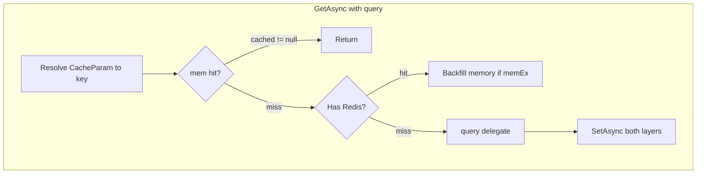
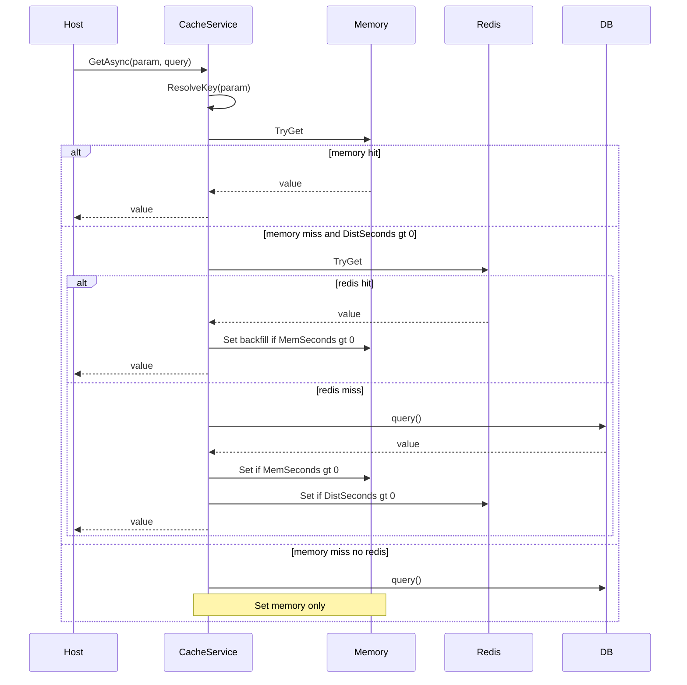
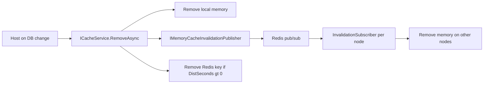

# Refactor Jarvis.Caching — Plan Document

Tài liệu kế hoạch refactor module cache Jarvis. **Trạng thái: hoàn tất** (merge-ready).

---

## 1. Mục tiêu và phạm vi

### 1.1 Mục tiêu nghiệp vụ

| # | Yêu cầu | Mô tả |
|---|---------|--------|
| 1 | Đa cụm cache | Nhiều cluster Redis (vd. Default / Auth / Big) với `InstanceName` riêng; item chọn cluster qua `DistGroup` |
| 2 | Phân tầng mặc định | **Memory luôn là tầng đầu**; Redis chỉ khi item bật distributed; DB qua delegate `Func<Task<T>>` |
| 3 | Invalidation memory | Khi dữ liệu nguồn (DB) đổi, host publish → các node xóa memory cache (cross-instance) |
| 4 | Key có placeholder | Config key dạng `Product:{tenantId}:{id}`; runtime bind qua `CacheParam.WithParam` |

### 1.2 Phạm vi refactor

- **In scope:** `Jarvis.Caching`, `Jarvis.Caching.Redis`, config `Cache`, Sample wiring, unit tests, skill `.opencode/skills/caching-dotnet/`
- **Phase 5 (done):** `CachingTenantConnectionStringResolver`, OTEL distributed Redis — xem §7
- **Out of scope:** CouchBase/Memcached providers

### 1.3 Chuẩn tham chiếu

- Review checklist: `.opencode/skills/code-review/SKILL.md`
- Style / structure: `refactoring-rules.md` (HealthChecks / EF / OTEL patterns)
- Module skill: `.opencode/skills/caching-dotnet/SKILL.md`

---

## 2. Hiện trạng trước refactor (lưu lịch sử)

*Mục 3–9 mô tả trạng thái sau refactor; phần dưới giữ để đối chiếu as-is.*

### 2.1 Cấu trúc project (trước refactor)

```
Jarvis.Caching/           # Core: CacheService, options, AddJarvisCaching, MsMemoryCacheAdapter
Jarvis.Caching.Redis/     # RedisCache, invalidation pub/sub, RedisConnectionManager
```

*(Lịch sử refactor: trước đây có `CachingBuilder` + `Jarvis.Caching.Memory`; đã gỡ — chỉ còn `AddJarvisCaching`.)*

### 2.2 Luồng đọc/ghi hiện tại



**Đúng hướng** cho overload `GetAsync(param, query)` nhưng bị phá bởi bug resolve config (mục 3).

### 2.3 Config (`Sample/appsettings.json`)

- `DistGroups:Redis:Default|Auth|Big` — mỗi group: `Configuration`, `InstanceName` (đa cụm qua prefix key)
- `Items.*`: `Key`, `MemSeconds`, `DistSeconds`, `DistGroup` — hầu hết **không có** `DistType`
- `DefaultDistgroup` — **không bind** vào `CacheOption.DefaultDistributedGroup` (tên property sai)
- `DefaultDistType: Redis` — trái mental model “memory mặc định”

---

## 3. Bug và gap — trạng thái sau refactor

*Review theo `.opencode/skills/code-review/SKILL.md` — branch `refactor-cache`, phạm vi `Jarvis.Caching`, `Jarvis.Caching.Redis`, `UnitTest/Caching`, Sample wiring.*

### 3.1 Critical — đã xử lý

| ID | Vấn đề (as-is) | Trạng thái | Ghi chú triển khai |
|----|----------------|------------|-------------------|
| C1 | Early return khi `distType`/`distGroup` rỗng trước default | **Done** | `CacheEntryOption.GetConfigValues` + `CacheEntryConfigValues.ToItemResolution`: default chỉ khi `UseDistributed` (`DistributedSeconds > 0`) |
| C2 | `DefaultDistgroup` ≠ `DefaultDistributedGroup` | **Done** | `JarvisCacheOptions.DefaultDistributedGroup`; Sample/UnitTest bind `Cache:DefaultDistributedGroup` |
| C3 | `if (cached != null)` / `if (data == null)` | **Done** (có ngoại lệ API) | `CacheValue<T>.HasValue` + `TryGetAsync`; `GetOrSetAsync` dùng `TryGetCore`. Xem **O1** bên dưới |
| C4 | `RedisConnectionManager` race | **Done** | `ConcurrentDictionary` + `Lazy<IConnectionMultiplexer>` |

### 3.2 Suggestions — đã xử lý

| ID | Vấn đề | Trạng thái | Ghi chú |
|----|--------|------------|---------|
| S1 | Memory cache không share DI host | **Done** | `AddMemoryCache` + `MsMemoryCacheAdapter` |
| S2 | Invalidation gắn Redis | **Done** | `IMemoryCacheInvalidationPublisher` / `IMemoryCacheInvalidationSubscriber` trong core; Redis impl + hosted subscriber |
| S3 | Placeholder thiếu param | **Done** | `CacheKeyResolver.EnsureNoUnresolvedPlaceholders` |
| S4 | `ConfigureAwait(false)` | **Done** | `CacheService`, Redis cache/invalidation |
| S5 | Serializer pub/sub lệch | **Done** | STJ publish + subscribe |
| S6 | Không có unit test | **Done** | `UnitTest/Caching/` — 12 tests (`dotnet test --filter UnitTest.Caching`) |

### 3.3 Review follow-up — đã đóng (2026-05-20)

Không còn hạng mục mở. Kết quả review bổ sung sau phase chính:

| ID | Trạng thái | Kết quả |
|----|------------|---------|
| O1 | Done | `ICacheService.GetAsync` có XML cảnh báo; read path dùng `TryGetAsync` + `HasValue` |
| O2 | Dropped | Không alias `DefaultDistgroup` / `Dist*` — appsettings chỉ schema mới (§9) |
| O3 | Done | `CacheServiceMultiTierTests` — memory hit, Redis backfill, loader một lần |
| O4 | Done | Interface file `IMemoryCacheInvalidationPublisher.cs` |
| O5 | Done | `ThrowIfCancellationRequested` trong `RedisCache` và invalidation pub/sub |

---

## 4. Kiến trúc đích (to-be)

### 4.1 Core vs Host-owned

| Jarvis (core) | Host (Sample / app) |
|---------------|---------------------|
| `AddJarvisCaching`, options bind, `ICacheService` | Gọi `AddJarvisCaching` + optional `UseRedisDistributedCache` |
| Memory layer (mặc định) | `GetAsync` + query delegate → DB/repo |
| Redis dist cache theo `DistGroups` | Readiness check Redis (đã có pattern trong Sample health) |
| Pub/sub invalidation (Redis impl) | Sau save/delete: `ICacheService.RemoveAsync` hoặc publish invalidation |
| `CacheParam` + key template | Giá trị param cụ thể (`tenantId`, `id`, …) |

### 4.2 Sentinel TTL (theo [refactoring-rules.md](./refactoring-rules.md) §1.3)

| Config | Ý nghĩa |
|--------|---------|
| `MemSeconds: 0` hoặc không set | Không **ghi** memory (vẫn **đọc** memory nếu có backfill từ Redis) |
| `MemSeconds > 0` | Ghi/đọc memory với TTL |
| `DistSeconds: 0` hoặc không set | **Không dùng** Redis cho item đó |
| `DistSeconds > 0` | Bật tầng Redis; yêu cầu resolve được `DistType` + `DistGroup` (hoặc default) |

**Mặc định hành vi:** Mọi item có `Key` hợp lệ đều có thể dùng memory khi `MemSeconds > 0`. Redis là opt-in qua `DistSeconds > 0`, không phải qua `DefaultDistType: Redis`.

### 4.3 Luồng Get/Set/Remove



### 4.4 Cache hit semantics (fix C3)

- `CacheValue<T>` với `HasValue` — phân biệt miss vs giá trị `null`/default value type.

### 4.5 Invalidation



---

## 5. Cấu trúc project sau refactor

```
Jarvis.Caching/
├── Abstractions/          # ICacheService, IMemoryCache, IDistributedCache, invalidation
├── Configuration/         # JarvisCacheOptions, CacheEntryOption
├── Extensions/            # AddJarvisCaching
├── Services/              # CacheService
├── Models/                # CacheParam, CacheValue, invalidation message
└── Internal/              # CacheKeyResolver, CacheItemResolution

Jarvis.Caching.Redis/Extensions/ + Invalidation/
```

**DI API mục tiêu (host):**

```csharp
builder.AddJarvisCaching(configure: o => { })
    .UseRedisDistributedCache()
    .UseRedisMemoryCacheInvalidation();
```

---

## 6. Thay đổi config schema

| Cũ (appsettings) | Mới (bind) |
|------------------|------------|
| `DefaultDistgroup` | `DefaultDistributedGroup` |
| `DefaultDistType` | `DefaultDistributedType` |
| `DistGroups` | `DistributedGroups` |
| `DistSeconds` / `DistGroup` / `DistType` (item) | `DistributedSeconds` / `DistributedGroup` / `DistributedType` |

---

## 7. Lộ trình triển khai (phases)

| Phase | Nội dung | Trạng thái |
|-------|----------|------------|
| 0 | Document + test harness | Done |
| 1 | Bugfix core (C1–C3, sentinel, key resolver) | Done |
| 2 | `AddJarvisCaching`, cấu trúc thư mục | Done |
| 3 | Redis thread-safe, STJ, `ConfigureAwait` | Done |
| 4 | Sample `Program.cs` wiring + skill caching + unit tests (12) | Done |
| 5 | Cache mặc định cho connection string + OTEL distributed Redis | Done |
| — | Code review follow-up (O1, O3–O5); O2 dropped | Done (2026-05-20) |

**Effort ước tính phase 0–4:** ~4.5 dev days.

---

## 8. Test plan

| Test (kế hoạch) | Test thực tế | Trạng thái |
|-----------------|--------------|------------|
| `CacheOptions_BindsFromConfiguration` | `CacheOptionsBindingTests.Binds_DefaultDistributedGroup_And_DistributedGroups` | Done |
| Memory invalidation config | `CacheOptionsBindingTests.Binds_MemoryInvalidation_Redis_Configuration` | Done |
| Memory-only resolve | `CacheServiceResolutionTests.Resolve_MemoryOnly_DoesNotRequireDistributedGroup` | Done |
| Distributed + defaults | `CacheServiceResolutionTests.Resolve_Distributed_AppliesDefaults` | Done |
| Placeholder fail-fast | `CacheServiceResolutionTests.Resolve_ThrowsWhenPlaceholderMissing` | Done |
| Value type zero | `CacheServiceValueTypeTests.GetAsync_CachesValueTypeZero` | Done |
| GetOrSet single loader | `CacheServiceGetOrSetTests.GetOrSetAsync_InvokesQueryOnceOnMiss_ThenHitsCache` | Done |
| TryGet miss/hit | `CacheServiceGetOrSetTests.TryGetAsync_*` | Done |
| Memory → Redis → query | `CacheServiceMultiTierTests` (3 cases) | Done |

```bash
dotnet test UnitTest/UnitTest.csproj --filter "FullyQualifiedName~UnitTest.Caching"
```

---

## 9. Breaking changes & migration

| Thay đổi | Migration |
|----------|-----------|
| Config keys | Dùng `DefaultDistributedGroup`, `DistributedGroups`, `DistributedSeconds` (không còn tên `Dist*` / `DefaultDistgroup`) |
| Cache-aside loader | `GetOrSetAsync(param, async ct => ...)` — không dùng `GetAsync(param, Func<Task<T>>)` |
| Memory-only items | Bắt đầu hoạt động (fix) |
| `CachingBuilder` / `Jarvis.Caching.Memory` | Đã gỡ; dùng `AddJarvisCaching` |
| Null-hit semantics | `CacheValue<T>`; read path ưu tiên `TryGetAsync` (O1, §3.3) |
| Config / code legacy | Không alias key cũ (O2 dropped) |
