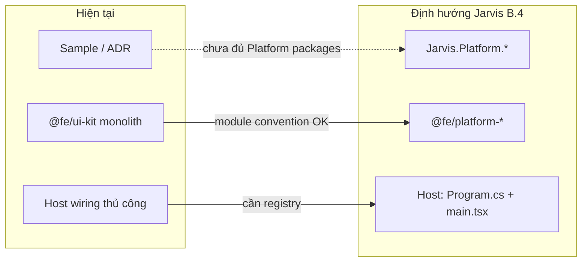
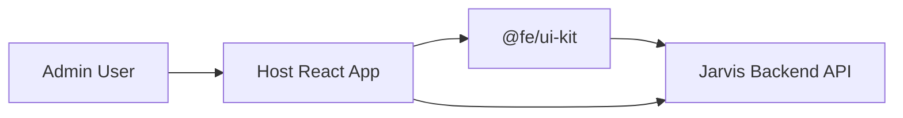
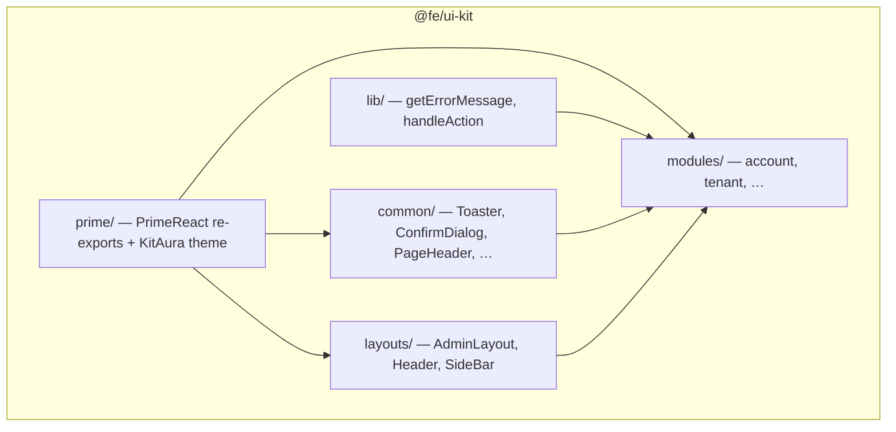
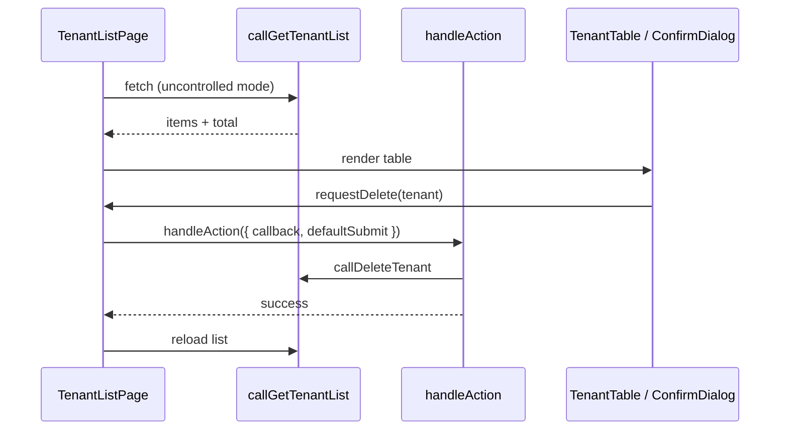

# SAD — Frontend (Jarvis)

> **Trạng thái:** 📝 Draft — mô tả kiến trúc từ code hiện tại trong `Frontend/ui-kit`.
> **Phạm vi:** Lớp frontend của hệ sinh thái Jarvis — package `@fe/ui-kit` (React UI-kit publishable), cách tích hợp vào host app, và quy ước mở rộng module UI.
> **Liên quan:** [README roadmap B.4](../README.md) (Platform admin), [multi-tenant ADR](../ADRs/2026-07-19-adr-multi-tenant.md), [authentication ADR](../ADRs/2026-05-21-adr-authentication.md), [platform-architecture](../rules/platform-architecture.md), [ui-kit README](./ui-kit/README.md).

---

## 1. Bối cảnh

Jarvis là framework backend modular cho ASP.NET Core. Phía frontend không phải một ứng dụng sản phẩm cố định mà là **thư viện UI tái sử dụng** (`@fe/ui-kit`), cung cấp:

- **Primitives** — re-export PrimeReact 11 + preset theme Aura (teal).
- **Layouts** — shell quản trị (`AdminLayout`, `Header`, `SideBar`).
- **Feature modules** — mỗi module domain (Account, Tenant, …) gồm pages, forms, validation, API client, routes, permission keys, i18n.
- **Common helpers** — toast, confirm dialog, form actions, xử lý lỗi, pattern callback action.

Host app (Vite + React Router) chỉ cần wiring: provider, router, env API, và (tuỳ chọn) override callback/slot UI. Kit **tự fetch** hoặc cho phép **controlled mode** (app truyền data từ bên ngoài).

```text
┌─────────────────────────────────────────────────────────┐
│  Host App (Vite + React Router)                         │
│  ├── PrimeReactProvider + Toaster                       │
│  ├── BrowserRouter + route definitions                  │
│  ├── env: VITE_API_URL_ACCOUNT, VITE_API_URL_TENANT     │
│  └── import pages/layouts từ @fe/ui-kit                 │
└──────────────────────────┬──────────────────────────────┘
                           │ npm / file: link
┌──────────────────────────▼──────────────────────────────┐
│  @fe/ui-kit (Frontend/ui-kit)                           │
│  prime │ common │ layouts │ lib │ modules/*             │
└──────────────────────────┬──────────────────────────────┘
                           │ HTTPS (axios, withCredentials)
┌──────────────────────────▼──────────────────────────────┐
│  Jarvis Backend API (Sample / Platform.*)               │
│  Account API │ Tenant API │ …                           │
└─────────────────────────────────────────────────────────┘
```

---

## 2. Mục tiêu & phạm vi

### 2.1 Mục tiêu

| Mã | Mục tiêu |
|----|----------|
| **G-01** | Cung cấp UI chuẩn cho các module backend Jarvis (bắt đầu: Account, Multi-Tenancy). |
| **G-02** | Publish dưới dạng NPM package (`@fe/ui-kit`) — host app opt-in từng page/module. |
| **G-03** | Tách **presentation** (kit) khỏi **integration** (host): kit có API client mặc định nhưng cho override qua `callback`. |
| **G-04** | Đồng bộ contract với backend ADR (enum `TenantStatus`, `DbProviderType`, audit fields, soft-delete). |
| **G-05** | Hỗ trợ tuỳ biến UI qua **content slot** mà không fork component. |

### 2.2 Non-goals (hiện tại)

- Không quản lý global auth state / token storage — host app chịu trách nhiệm session (cookie `withCredentials`).
- Không có state management library (Redux, Zustand) — page-local state + React Hook Form.
- Không embed business logic phức tạp — validation form cơ bản (Zod), không ABAC runtime.
- `CrudPage` generic được nhắc trong README nhưng **chưa có trong codebase** — xem §13 Roadmap.

---

## 3. Đánh giá đối chiếu định hướng Jarvis Platform (B.4)

Roadmap Jarvis ([README §B.4](../README.md)) định hình **Platform admin** (`Jarvis.Platform.*`) gồm Settings, Tenants, Permissions, Roles, Users, Account — mỗi khối là module độc lập, host chỉ reference và đăng ký. Ba nguyên tắc dưới đây là **chuẩn mục tiêu**; phần còn lại đánh giá `@fe/ui-kit` hiện tại so với chuẩn đó.

### 3.1 Ba nguyên tắc định hướng

| # | Nguyên tắc (Jarvis) | Backend (mục tiêu) | Frontend (mục tiêu tương đương) |
|---|---------------------|--------------------|---------------------------------|
| **P-1** | Mỗi module có đủ FE + BE | `Jarvis.Platform.{Name}.*` (Contracts, Core, EF, HttpApi) | Package hoặc subpath `@fe/platform-{name}` — pages, forms, API client, routes, permission keys |
| **P-2** | Host chỉ reference + đăng ký | `builder.AddPlatformTenants()` / `AddPlatformIdentity()` trong `Program.cs` | Một lần gọi `registerPlatformModule(...)` ở `main.tsx` — routes, menu, env API, navigate |
| **P-3** | Module cho phép customize | Handler/policy override, options, Contracts tách surface | Slot UI, `callback` logic, export hooks/forms, hoặc thay toàn bộ page/component |

```text
Đối chiếu hai phía host:

  Program.cs (BE)                    main.tsx (FE — mục tiêu)
  ─────────────────                  ─────────────────────────
  builder.AddPlatformTenants()  ↔    registerPlatformModule(tenantModule)
  builder.AddPlatformIdentity() ↔    registerPlatformModule(identityModule)
  app.UsePlatformTenants()      ↔    (routes đã mount qua module registry)
```

### 3.2 Ma trận module Platform admin

| Module (B.4) | BE (`Jarvis.Platform.*`) | FE (`@fe/ui-kit`) | Đánh giá |
|--------------|--------------------------|-------------------|----------|
| **Settings** | 📋 Chưa build | ❌ Chưa có | Cần module mới cả hai phía; kiểu field (Text, Number, DateRange, Password) đòi hỏi form component riêng |
| **Tenants** | 📋 Kế hoạch (`platform-architecture` §4); demo một phần ở `Sample` | ✅ `modules/tenant` — list/form/detail/connections/domains | **FE đi trước BE**; DTO/enum đã align ADR multi-tenant |
| **Permissions** | 📋 Trong khối Identity | ❌ Chỉ export `TENANT_PERMISSIONS` / `ACCOUNT_PERMISSIONS` | Thiếu CRUD UI; keys là mảnh permission, chưa module quản trị |
| **Roles** | 📋 Trong khối Identity | ❌ Chưa có | Cần gán permission, list role — phụ thuộc Permissions |
| **Users** | 📋 Trong khối Identity | ❌ Chưa có | Cần lock/unlock, gán role & tenant; `AdminLayout` đã có nav placeholder `/users` |
| **Account** | 📋 Platform Account API | ✅ `modules/account` — login/register/forgot/profile/change-password | Khớp phạm vi roadmap; OTP/email reset phụ thuộc `Jarvis.Notification` (BE) |

**Kết luận ngắn:** Kiến trúc **feature module** trong ui-kit (Account, Tenant) là nền đúng hướng **P-1**, nhưng đang gói trong **một** NPM package thay vì một package / bounded context per `Jarvis.Platform.{Name}`.

### 3.3 P-1 — Mỗi module đủ FE + BE

#### Định hướng Jarvis

Theo [platform-architecture](../rules/platform-architecture.md): mỗi bounded context Platform = 4 package .NET + (giai đoạn 3) SPA admin riêng trong `ui/{name}-admin/`. UI consume OpenAPI, không nhúng vào `.csproj`.

#### Hiện trạng ui-kit

| Khía cạnh | Khớp | Chưa khớp |
|-----------|------|-----------|
| Cấu trúc nội bộ module | ✅ `pages`, `services`, `validation`, `routes`, `permission`, `menu`, `localization` | — |
| Contract với BE | ✅ `types/` mirror DTO/enum ADR | Route prefix chưa chuẩn hoá `/api/platform/*` (env `VITE_API_URL_*` tùy host) |
| Packaging | — | ❌ Một `@fe/ui-kit` chứa nhiều module; chưa `@fe/platform-tenants` riêng |
| Phủ module B.4 | 2/6 (Account, Tenants) | Settings, Permissions, Roles, Users |

#### Khuyến nghị

```text
Giai đoạn hiện tại (chấp nhận được):
  Frontend/ui-kit/src/modules/{account|tenant}/  →  sau này tách NPM

Giai đoạn align Platform:
  @fe/platform-shell          ← layouts, registerModule, auth guard
  @fe/platform-tenants        ← peer: shell, primereact, …
  @fe/platform-identity       ← users + roles + permissions (hoặc 3 package nhỏ)
  @fe/platform-settings
```

Mỗi package FE map 1:1 với cluster `Jarvis.Platform.{Name}.*` — giữ **cùng tên module** để host reference song song (csproj + package.json).

### 3.4 P-2 — Host reference + đăng ký một dòng

#### Định hướng Jarvis (BE)

Host (`Sample` / app consumer) thêm project reference `Jarvis.Platform.Tenants.HttpApi`, gọi extension trong `Program.cs` — không copy controller/handler vào host.

#### Hiện trạng ui-kit (FE)

Host app **phải tự**:

1. Cài `@fe/ui-kit`, cấu hình Tailwind + `PrimeReactProvider`.
2. Khai báo từng `<Route>` map tới `TenantListPage`, `LoginPage`, …
3. Gọi `configureTenantNavigate(navigate)` (chỉ Tenant).
4. Set env `VITE_API_URL_ACCOUNT`, `VITE_API_URL_TENANT`.
5. Gộp `tenantMenuItems` / `accountMenuItems` vào `AdminLayout` thủ công.

| Thành phần đăng ký | BE (`AddPlatform*`) | FE (hiện tại) | FE (mục tiêu) |
|--------------------|---------------------|---------------|---------------|
| API surface | HttpApi + route prefix | `BASE_URL_*` per module | Module export `apiBasePath` + axios factory |
| Routes | Controller attribute | `TENANT_ROUTES`, host `<Route>` | `tenantModule.routes` → spread vào router |
| Menu | (tương lai) permission API | `tenantMenuItems` | `tenantModule.menuItems` + filter theo permission |
| DI / side-effect | `IServiceCollection` | `configureTenantNavigate` | `registerPlatformModule({ id, routes, menu, onRegister })` |

**Mức độ khớp P-2: ~40%** — đã có metadata (`routes`, `menu`, `get*RouteList`) nhưng **chưa có composition root FE** tương đương `Program.cs`.

#### Hình mục tiêu (đăng ký module)

```tsx
// main.tsx — tương đương Program.cs
import { createPlatformApp } from '@fe/platform-shell'
import { tenantModule } from '@fe/platform-tenants'
import { accountModule } from '@fe/platform-account'
import { identityModule } from '@fe/platform-identity'

createPlatformApp({
  modules: [
    accountModule,   // public routes: /login, /register, …
    tenantModule,    // admin: /tenants/*
    identityModule,  // admin: /users, /roles, /permissions
  ],
  layout: AdminLayout,
  api: { baseUrl: import.meta.env.VITE_API_URL },
})
```

`tenantModule` export descriptor (không render):

```ts
export const tenantModule = {
  id: 'tenants',
  routes: getTenantRouteList(),      // đã có
  menu: tenantMenuItems,             // đã có
  permissions: TENANT_PERMISSIONS,   // đã có
  configure: (ctx) => {
    configureTenantNavigate(ctx.navigate)
    // ctx.setHttpBaseUrl, ctx.setLocale, …
  },
}
```

### 3.5 P-3 — Customize UI, logic, hook, hoặc override toàn bộ component

Jarvis yêu cầu module **không khóa cứng** — consumer có thể chỉnh từng phần hoặc thay hẳn. ui-kit đã thiết kế **thang tuỳ biến** (từ nhẹ đến nặng):

| Mức | Cơ chế ui-kit | Ví dụ | Khớp P-3 |
|-----|---------------|-------|----------|
| **L1 — Tuỳ UI trong page** | Prop `content` (slot) + `*ContentContext` | `TenantListPage content={(ctx) => <>{ctx.DefaultTable}</>}` | ✅ |
| **L2 — Tuỳ shell / layout** | `withShell={false}` | Nhúng form vào wizard host | ✅ |
| **L3 — Override logic / API** | `callback` + `handleAction` | `callback.onSubmit` thay `callLogin`; `before` return `false` hủy | ✅ |
| **L4 — Controlled data** | Truyền `items`, `loading`, `onQueryChange` | Host dùng React Query, kit chỉ render | ✅ |
| **L5 — Dùng building blocks** | Export `TenantTable`, `useTenantForm`, schemas | Host tự compose page, không dùng `TenantListPage` | ✅ |
| **L6 — Thay toàn bộ component** | Host không import page; chỉ dùng `types` + `call*` hoặc tự viết | UI hoàn toàn custom | ✅ (contract-level) |
| **L7 — Registry swap** | ❌ Chưa có | `components: { ListPage: MyTenantList }` trong module descriptor | ❌ |

**Mức độ khớp P-3: ~85%** — L1–L6 đã cover; thiếu **L7** (khai báo override tập trung khi đăng ký module, tương tự DI `Replace(ServiceDescriptor)`).

#### Ví dụ ba mức dùng thực tế

```tsx
// L3 — Override API login, giữ UI mặc định
<LoginPage
  callback={{
    onSubmit: (data) => myAuthService.login(data),
    success: () => analytics.track('login'),
  }}
/>

// L1 + L5 — Custom toolbar, table mặc định
<TenantListPage
  content={(ctx) => (
    <>
      <MyToolbar onSearch={ctx.setSearchInput} />
      {ctx.DefaultTable}
      {ctx.DefaultPagination}
    </>
  )}
/>

// L6 — Override toàn bộ: chỉ lấy contract + service
import { callGetTenantList, type Tenant } from '@fe/ui-kit'
function MyTenantList() { /* UI 100% của host */ }
```

#### Gaps P-3 cần bổ sung

| Gap | Mô tả | Hướng xử lý |
|-----|--------|-------------|
| Không có component registry | Override L7 phải fork import, không swap qua `registerModule` | Thêm `overrides?: Partial<ModuleComponents>` trong descriptor |
| Permission chưa gắn UI | `hasPermission` có sẵn nhưng page không ẩn nút theo quyền | Page nhận `permissions[]`; ẩn create/delete theo `TENANT_PERMISSIONS` |
| Menu vs permission | `AdminLayout` nav tĩnh | Lọc `menuItems` theo permission từ host (sau khi có Identity API) |
| Storybook / contract test | Khó verify slot không breaking | Export `ContentContext` type làm contract |

### 3.6 Tổng hợp mức độ align

| Nguyên tắc | Mức align | Điểm mạnh hiện tại | Việc cần làm |
|------------|-----------|-------------------|--------------|
| **P-1** FE + BE per module | 🟡 Trung bình | Convention folder module; 2 module mẫu đầy đủ | Tách NPM theo Platform; build 4 module B.4 còn lại; chuẩn hoá `/api/platform/*` |
| **P-2** Đăng ký tại host | 🟠 Thấp–trung bình | `routes`, `menu`, `configureTenantNavigate` rời | `createPlatformApp` + `PlatformModuleDescriptor`; auto-mount routes/menu |
| **P-3** Customize / override | 🟢 Cao | Slot, callback, controlled, export hooks/components | Component registry; permission-aware UI; tài liệu thang L1–L7 |



### 3.7 Lộ trình đề xuất (FE align Platform)

| Bước | Việc | Phục vụ nguyên tắc |
|------|------|-------------------|
| 1 | Giữ `modules/{name}` trong ui-kit; không đổi pattern page | P-1, P-3 |
| 2 | Thêm `@fe/platform-shell` với `registerPlatformModule` / `createPlatformApp` | P-2 |
| 3 | Tách export: `@fe/ui-kit/tenant`, `@fe/ui-kit/account` (subpath) trước khi tách repo | P-1 |
| 4 | Module Identity (Users, Roles, Permissions) sau khi `Jarvis.Platform.Identity.*` có Contracts | P-1 |
| 5 | `overrides` + `permissions` trên descriptor; pages đọc permission ẩn action | P-3, P-2 |
| 6 | Settings module — form động theo kiểu field B.4 | P-1 |

---

## 4. Công nghệ

| Thành phần | Lựa chọn | Ghi chú |
|------------|----------|---------|
| Runtime | React ≥ 19 | Peer dependency |
| UI primitives | PrimeReact 11 + `@primeuix/themes` (Aura) | Re-export qua `src/prime`; form controls dùng `unstyled` + Tailwind |
| Styling | Tailwind CSS ≥ 3.4 (preset kit) | Token `ink`, `mute`, `paper`, `accent`; layer `primereact` |
| Forms | react-hook-form + Zod 4 + `@hookform/resolvers` | Mỗi module có `validation/` + `hooks/use*Form` |
| HTTP | axios | Mỗi module một instance (`accountHttp`, `tenantHttp`) |
| Routing | react-router-dom ≥ 7 | Layout dùng `Outlet`; module export path constants |
| Icons | lucide-react | Peer dependency |
| Toast | react-toastify | Wrapper `notify.*` + `<Toaster />` |
| Build | tsup | ESM + CJS + `.d.ts` → `dist/` |

---

## 5. Kiến trúc (C4)

### 5.1 Level 1 — System Context



- **Admin User** dùng console quản trị qua trình duyệt.
- **Host App** mount router, provider, env; có thể gọi API trực tiếp ngoài kit.
- **@fe/ui-kit** render UI feature; mặc định gọi API qua axios instance module.
- **Jarvis Backend** phục vụ REST theo module (`/login`, `/tenants`, …).

### 5.2 Level 2 — Container (trong package)



| Container | Trách nhiệm |
|-----------|-------------|
| `prime/` | Re-export component PrimeReact; `kitPrimeReactConfig` (preset Aura + teal, `cssLayer`) |
| `common/` | Widget dùng chung, không gắn domain |
| `layouts/` | Shell admin: sidebar, header, outlet |
| `lib/` | Utility cross-cutting (error message, action pipeline) |
| `modules/{name}/` | Feature module độc lập — pattern cố định (§5.3) |

### 5.3 Level 3 — Component (feature module)

Mỗi feature module (`account`, `tenant`) có cùng cấu trúc thư mục:

```text
modules/{module}/
├── pages/           # Smart pages: fetch, submit, navigate, slot
├── components/      # Presentational + form fields
├── hooks/           # use*Form (react-hook-form + zodResolver)
├── validation/      # Zod schemas + FormData types
├── services/        # axios instance + call* API functions
├── routes/          # path constants, navigate helper, route list
├── permission/      # PERMISSIONS keys + hasPermission()
├── menu/            # sidebar menu items metadata
├── localization/    # vi/en message bundles
├── theme/           # module-specific design tokens (optional)
├── constants/       # BASE_URL, re-export routes
├── types/           # DTO khớp backend
└── utils/           # resolveContent, apiData unwrap
```

**Luồng dữ liệu trong một Page (ví dụ `TenantListPage`):**



---

## 6. Pattern thiết kế

### 6.1 Smart Page + Content Slot

Mỗi `*Page` export:

- **Props** — `locale`, `title`, `callback`, `content`, `withShell`, `useRoutes`, …
- **ContentContext** — toàn bộ state/handler để custom UI qua slot.

Slot nhận `ReactNode` hoặc render function:

```ts
type TenantSlotContent<TContext> =
  | ReactNode
  | ((ctx: TContext) => ReactNode)
```

`resolveTenantContent(content, ctx, fallback)` — nếu không truyền `content`, dùng UI mặc định của kit.

**`withShell`:** `true` (mặc định) bọc `TenantPageShell` / `AuthShell`; `false` để embed vào layout host.

### 6.2 Controlled vs Uncontrolled data

| Mode | Cách nhận biết | Hành vi |
|------|----------------|---------|
| **Uncontrolled** | Không truyền `items` (list) hoặc page tự gọi API | Page fetch qua `call*` mặc định |
| **Controlled** | Truyền `items`, `loading`, `total` + `onQueryChange` | Page chỉ render; host fetch |

Ví dụ `TenantListPage`: `controlled = itemsProp != null`.

### 6.3 Action callback (`handleAction`)

Pattern tương tự jQuery `$.ajax` — cho phép host chèn logic mà không fork page:

```text
before → onSubmit (API) → onSuccess (page: reload/navigate) → success → complete
         ↳ lỗi: error → complete
before return false → cancelled (không gọi API)
```

- `defaultSubmit`: API mặc định của kit (`callLogin`, `callDeleteTenant`, …).
- `callback.onSubmit`: thay thế hoàn toàn API call.
- `onSuccess` (page-owned): reload list, `navigate('/')` sau login.

### 6.4 Form pipeline

```text
validation/*Schema (Zod)
    ↓
hooks/use*Form (zodResolver, mode: onChange)
    ↓
components/*Form (fields, errors)
    ↓
pages/*Page (handleSubmit → handleAction → notify)
```

### 6.5 Routing

- Mỗi module định nghĩa `*_ROUTES` constant (`paths.ts`).
- Helper `get*Path(id)` build URL có tham số.
- **Tenant** có `configureTenantNavigate(fn)` — gắn `useNavigate` của React Router một lần ở root; fallback `history.pushState` nếu chưa configure.
- **Account** pages dùng `useNavigate` trực tiếp trong component.

Host app khai báo `<Route>` map tới page component export từ kit.

### 6.6 Permission keys

Kit chỉ export **chuỗi permission** và helper `hasPermission(permissions[], key)` — **không** fetch quyền. Host app truyền mảng permission từ backend (sau auth) và ẩn/hiện UI.

| Module | Ví dụ key |
|--------|-----------|
| Account | `account.profile.view`, … |
| Tenant | `tenant.view`, `tenant.create`, `tenant.connection.manage`, … |

### 6.7 Localization

- `getTenantMessages(locale)`, `getAccountMessages(locale)` — `vi` | `en`.
- Page nhận prop `locale` (mặc định `vi`).
- Chưa có i18n framework (react-i18next) — message object tĩnh per module.

---

## 7. Styling & Theme

### 7.1 PrimeReact + Tailwind

- Theme: `KitAura` = Aura preset + primary teal (`src/prime/config.ts`).
- `kitPrimeReactConfig` set `cssLayer: { name: 'primereact', order: 'theme, base, primereact, utilities' }` — utilities Tailwind thắng khi cần.
- Form controls trong module dùng `unstyled` + class Tailwind (`fieldInputClass`, `btnPrimaryClass` trong `fieldStyles.ts`).

### 7.2 Tailwind preset

Package export:

- `@fe/ui-kit/tailwind.preset.cjs` — colors, animations (`account-auth-in`, …).
- `@fe/ui-kit/theme.css` — keyframes + CSS variables.
- `@fe/ui-kit/styles.css` — button skins, autofill, ẩn license badge PrimeUI.

Host app **bắt buộc**:

1. Include preset / `@source` dist kit trong Tailwind config.
2. Import `theme.css` + `styles.css`.
3. **Không** dùng full `@import "tailwindcss"` (v4) — preflight đè Aura.

### 7.3 Provider bắt buộc ở root host

```tsx
import { PrimeReactProvider } from '@primereact/core'
import { kitPrimeReactConfig, Toaster } from '@fe/ui-kit'
import '@fe/ui-kit/styles.css'

createRoot(...).render(
  <PrimeReactProvider {...kitPrimeReactConfig}>
    <App />
    <Toaster />
  </PrimeReactProvider>,
)
```

---

## 8. Tích hợp API backend

### 8.1 Axios instance per module

| Module | Instance | Base URL env |
|--------|----------|--------------|
| Account | `accountHttp` | `VITE_API_URL_ACCOUNT` |
| Tenant | `tenantHttp` | `VITE_API_URL_TENANT` |

Cấu hình chung: `withCredentials: true` (cookie session). Response interceptor normalize lỗi: `error.response?.data ?? error`.

### 8.2 API surface (Tenant — khớp ADR Multi-Tenant)

| Operation | Method | Path |
|-----------|--------|------|
| List tenants | GET | `/` + query `page`, `size`, `search`, `status` |
| Get tenant | GET | `/{id}` |
| Create | POST | `/` |
| Update | PUT | `/{id}` |
| Delete (soft) | DELETE | `/{id}` |
| Set status | PATCH | `/{id}/status` |
| Connections CRUD | * | `/{tenantId}/connections` |
| Domains CRUD | * | `/{tenantId}/domains` |

DTO TypeScript (`Tenant`, `TenantConnection`, `TenantDomain`) mirror backend: `TenantStatus`, `DbProviderType`, `AuditedFields` (created/updated/deleted).

### 8.3 API surface (Account)

| Operation | Path |
|-----------|------|
| Register | POST `/register` |
| Login | POST `/login` |
| Current user | GET `/current` |
| Profile | PUT `/profile` |
| Password | PUT `/password` |
| Forgot password | POST `/forgot-password` |
| Logout | POST `/logout` |

---

## 9. Layout quản trị

`AdminLayout` — shell chính cho console:

- **SideBar** — `mainNav` + `secondaryNav` (mặc định có mục Tenant → `/tenants`).
- **Header** — title theo route active, search, notification, user menu.
- **Outlet** — render child routes.
- Props: `user`, `onLogout`, `profilePath`, override nav items.

Logout mặc định: gọi `onLogout` (nếu có) → navigate `ACCOUNT_ROUTES.login`.

---

## 10. Module hiện có

### 10.1 Account

| Page | Mô tả |
|------|-------|
| `LoginPage` | Đăng nhập |
| `RegisterPage` | Đăng ký |
| `ForgotPasswordPage` | Quên mật khẩu |
| `AccountProfilePage` | Hồ sơ |
| `ChangePasswordPage` | Đổi mật khẩu |

Shell: `AuthShell` (variant login/register/forgot) — layout 2 cột, animation `account-auth-in`.

### 10.2 Tenant

| Page | Mô tả |
|------|-------|
| `TenantListPage` | Danh sách + filter + pagination |
| `TenantFormPage` | Tạo / sửa (`mode: create \| edit`) |
| `TenantDetailPage` | Chi tiết read-only |
| `TenantConnectionsPage` | CRUD connection strings |
| `TenantDomainsPage` | CRUD domains |

Components: `TenantTable`, `TenantForm`, `ConnectionTable`, `DomainTable`, `TenantStatusBadge`, `FieldSelect`.

---

## 11. Build, phân phối & phát triển local

### 11.1 Build

```bash
cd Frontend/ui-kit
npm install
npm run build   # → dist/ (ESM, CJS, .d.ts, sourcemap)
```

`tsup` external hoá peer deps (react, primereact, zod, …) — không bundle vào package.

### 11.2 Cài trong host app

```bash
# monorepo / local
npm i file:../Frontend/ui-kit

# sau publish
npm i @fe/ui-kit
```

**Local link:** Vite host cần `resolve.dedupe` + alias `react`/`react-dom`/`primereact` về một `node_modules` — tránh `Invalid hook call`.

### 11.3 Peer dependencies (host phải cài)

`react`, `react-dom`, `react-router-dom`, `primereact`, `@primeuix/themes`, `@primereact/core`, `tailwindcss`, `zod`, `react-hook-form`, `@hookform/resolvers`, `lucide-react`, `axios`, `react-toastify`.

---

## 12. Quy ước mở rộng module mới

Khi thêm module UI cho backend Jarvis mới (vd. Organization, Audit):

1. Tạo `src/modules/{name}/` theo cấu trúc §5.3.
2. Định nghĩa `types/` khớp DTO/enum backend ADR.
3. `services/req.ts` + `call*` functions; `BASE_URL_{NAME}` từ `import.meta.env.VITE_API_URL_{NAME}`.
4. Export public API qua `src/modules/{name}/index.ts` → `src/modules/index.ts` → `src/index.ts`.
5. Thêm `permission/keys.ts`, `routes/paths.ts`, `localization/`, `menu/items.ts`.
6. Page tuân pattern: `callback`, `content` slot, `withShell`, controlled/uncontrolled khi có list.
7. Cập nhật `tailwind` content path nếu host scan dist.
8. Document trong README module + cập nhật SAD này.

---

## 13. Roadmap & khoảng trống

| Hạng mục | Trạng thái | Ghi chú |
|----------|------------|---------|
| Account module | ✅ | 5 pages + forms |
| Tenant module | ✅ | Full CRUD + sub-resources |
| AdminLayout | ✅ | |
| PrimeReact re-exports | ✅ | |
| Generic `CrudPage` | ❌ | README liệt kê nhưng chưa implement |
| `examples/App.tsx` | ❌ | README tham chiếu, file chưa có |
| Global auth context | ❌ | Host responsibility |
| i18n framework | ❌ | Message object thủ công |
| Unit/E2E tests frontend | ❌ | Chưa có test project |
| Storybook | ❌ | |
| `createPlatformApp` / module registry (P-2) | ❌ | Xem §3.4, §3.7 |
| Component override registry L7 (P-3) | ❌ | Xem §3.5 |
| Settings / Users / Roles / Permissions UI | ❌ | 4/6 module B.4 chưa có FE |

---

## 14. Sơ đồ phụ thuộc host app (tham khảo)

```text
main.tsx
├── PrimeReactProvider (kitPrimeReactConfig)
├── BrowserRouter
│   ├── Route /login          → LoginPage
│   ├── Route /register       → RegisterPage
│   ├── Route /tenants        → AdminLayout
│   │     ├── /tenants        → TenantListPage
│   │     ├── /tenants/create → TenantFormPage (mode=create)
│   │     └── /tenants/:id/…  → Detail / Edit / Connections / Domains
│   └── Route /profile        → AccountProfilePage
├── Toaster
└── useEffect: configureTenantNavigate(navigate)
```

Env mẫu (`.env` host):

```env
VITE_API_URL_ACCOUNT=https://localhost:7006/api/account
VITE_API_URL_TENANT=https://localhost:7006/api/tenants
```

---

## 15. Tóm tắt quyết định kiến trúc

| Quyết định | Lý do |
|------------|-------|
| Package UI-kit tách khỏi host app | Tái sử dụng across sản phẩm; version độc lập |
| PrimeReact 11 unstyled + Tailwind | Kiểm soát visual; đồng bộ design token |
| Không MediatR/state lib phía FE | Giữ đơn giản; pattern giống backend CQRS nhưng page-local |
| Module folder convention cố định | Onboard module mới nhất quán với Account/Tenant |
| `handleAction` callback | Override API/flow không cần fork page |
| Content slot per page | Custom UI giữ logic fetch/submit của kit |
| Permission chỉ export keys | ABAC/runtime auth thuộc host + backend |
| axios per module + env base URL | Align với atomic module backend |
| Thang tuỳ biến L1–L6 (slot, callback, controlled, building blocks) | Đáp ứng P-3 customize/override; registry L7 là bước tiếp |
| Monolith `@fe/ui-kit` tạm thời | Convention module sẵn sàng tách `@fe/platform-*` khi BE Platform ổn định (P-1) |

---

*Tài liệu phản ánh `Frontend/ui-kit` tại thời điểm khảo sát. Khi thêm module hoặc đổi pattern, cập nhật §3, §10–§13 tương ứng.*
