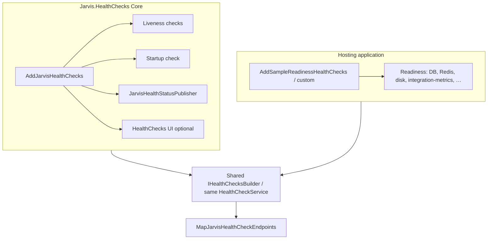
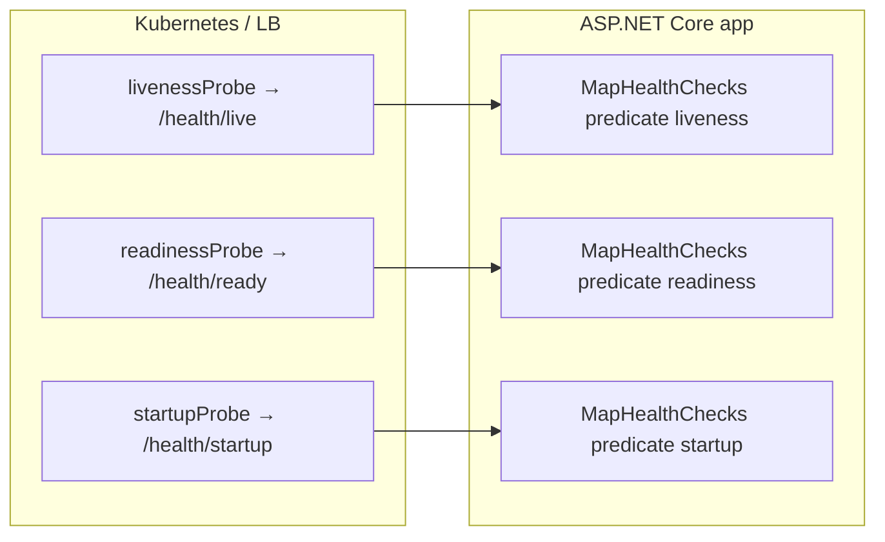
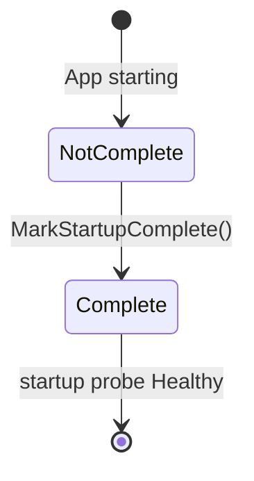
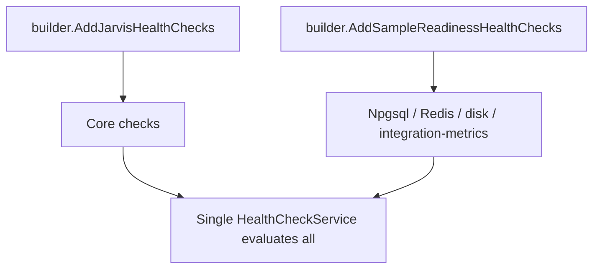

# Jarvis.HealthChecks — Kiến trúc và vận hành

Tài liệu mô tả module **Jarvis.HealthChecks**: luồng đăng ký DI, các endpoint HTTP, phân tách **Core / host**, và gợi ý Kubernetes. Phần tiếng Anh ngắn kèm theo trong ngoặc hoặc đoạn song song.

---

## 1. Vai trò của Core và ứng dụng host

**Jarvis.HealthChecks (Core)** chỉ đăng ký mặc định:

- **Liveness**: tiến trình (CPU/bộ nhớ tùy cấu hình + tùy chọn giới hạn bộ nhớ CLR đã cấp phát).
- **Startup**: cờ hoàn tất khởi tạo nặng (`IStartupCompletionNotifier`).
- **Tùy chọn**: HealthChecks **UI** (InMemory), **Prometheus** exporter middleware, publisher log (`IHealthCheckPublisher`).

**Readiness** (SQL, Redis, đĩa, metric tích hợp, HTTP phụ thuộc, …) **không** nằm trong Core — do **ứng dụng host** gọi thêm `AddHealthChecks()` và đăng ký check có tag `readiness`.

*(Jarvis.HealthChecks Core registers only liveness + startup + optional UI/Prometheus/publisher. Readiness checks are owned by the hosting app.)*



---

## 2. Tags và endpoint HTTP

Các hằng số tag nằm trong `HealthCheckTags` (`liveness`, `readiness`, `startup`, `detailed`, `integration`). Middleware map endpoint theo **predicate trên tag**.

| Endpoint | Tag lọc | Mục đích / Purpose |
|----------|---------|-------------------|
| `GET /health/live` | `liveness` | Probe **sống** — không phụ thuộc DB/MQ bên ngoài trong Core. |
| `GET /health/ready` | `readiness` | Probe **sẵn sàng traffic** — chỉ có ý nghĩa đầy đủ sau khi host đăng ký readiness. |
| `GET /health/startup` | `startup` | Probe **khởi động xong** (migration, warm-up…). |
| `GET /health` | Tất cả | JSON chi tiết (UI.Client); có thể khóa bằng header nếu cấu hình API key. |

Phản hồi tối giản cho `/health/live`, `/health/ready`, `/health/startup`: JSON dạng `{ "status": "Healthy" | "Degraded" | "Unhealthy" }`.

*(Minimal JSON for public probes; detailed `/health` uses UI-compatible writer.)*



---

## 3. Luồng đăng ký trong Core (`AddJarvisHealthChecks`)

*(Registration flow inside Core.)*

```mermaid
sequenceDiagram
    participant Host as IHostApplicationBuilder
    participant Opt as JarvisHealthCheckOptions
    participant DI as IServiceCollection
    participant HC as AddHealthChecks

    Host->>Opt: BindConfiguration("HealthChecks")
    Host->>DI: AddMemoryCache()
    Host->>DI: IStartupCompletionNotifier
    Host->>DI: ProcessResourceLivenessHealthCheck, StartupCompletionHealthCheck
    Host->>DI: JarvisHealthStatusPublisher + HealthCheckPublisherOptions.Delay ≈ 10s
    Host->>HC: AddCheck process-resources (tags: liveness)
    Host->>HC: AddCheck startup-completion (tags: startup)
    opt ProcessAllocatedMemoryMegabytesCeiling greater than 0
        Host->>HC: AddProcessAllocatedMemoryHealthCheck (tags: liveness)
    end
    opt Ui.Enabled
        Host->>DI: HealthChecks UI + AddInMemoryStorage
    end
```

**Ghi chú / Notes:**

- **`HealthCheckPublisherOptions.Delay`**: trì hoãn gọi publisher (mặc định ~10 giây nếu chưa cấu hình) để tránh spam log khi health chạy thường xuyên.
- **`AddMemoryCache()`**: an toàn khi gọi trùng — `AddMemoryCache` dùng `TryAddSingleton` cho `IMemoryCache`.

---

## 4. Startup probe và `IStartupCompletionNotifier`

Sau khi hoàn tất tác vụ khởi tạo (ví dụ migrate DB), host gọi **`MarkStartupComplete()`**. Probe `/health/startup` chuyển sang **Healthy**.

*(Call `MarkStartupComplete()` after heavy startup work so the startup endpoint succeeds.)*



---

## 5. Readiness phía host (ví dụ Sample)

Ứng dụng **Sample** dùng `AddSampleReadinessHealthChecks()`:

- `AddJarvisIntegrationMetricsReadinessCheck` — metric tích hợp qua `IJarvisHealthIntegrationMetricsProvider`.
- **PostgreSQL / Redis / đĩa** — cấu hình trong `Sample:ReadinessHealthChecks` (appsettings).

*(Second `AddHealthChecks()` chain appends registrations to the same health pipeline.)*



---

## 6. Prometheus và HealthChecks UI

- **`UseJarvisHealthChecksPrometheusExporter`**: bật khi `EnablePrometheusMetrics` — endpoint scrape (mặc định path trong options, ví dụ `/health/prometheus`). Có thể song song với OTLP (Jarvis.OpenTelemetry).
- **`MapHealthChecksUI`**: bật khi `HealthChecks:Ui:Enabled` — SPA dashboard; lịch sử lưu **InMemory** (EF Core in-memory). Cần cấu hình `Endpoints` với **URI tuyệt đối** trỏ tới JSON health (thường `…/health`).

---

## 7. Gợi ý Kubernetes (HTTP)

Tham số điển hình (điều chỉnh theo SLA):

```yaml
livenessProbe:
  httpGet:
    path: /health/live
    port: http
  periodSeconds: 10
  failureThreshold: 3
  successThreshold: 1
readinessProbe:
  httpGet:
    path: /health/ready
    port: http
  periodSeconds: 5
  failureThreshold: 3
  successThreshold: 1
startupProbe:
  httpGet:
    path: /health/startup
    port: http
  initialDelaySeconds: 60
  periodSeconds: 10
  failureThreshold: 3
  successThreshold: 1
```

---

## 8. `IHealthCheckPublisher`

**`JarvisHealthStatusPublisher`** nhận **`HealthReport`** định kỳ (sau `Delay`) và ghi **log** cho các entry không `Healthy` — phục vụ giám sát/alert (Azure Monitor, Loki, …). Không thay thế endpoint HTTP probe.

*(Publishers decouple “notify observability” from individual `IHealthCheck` implementations.)*

---

## 9. Cấu hình chính (section `HealthChecks`)

Tham khảo `JarvisHealthCheckOptions`: ngưỡng CPU/bộ nhớ liveness, TTL cache liveness, trần MB bộ nhớ CLR, khóa `/health`, Prometheus, mục `Ui`.

*(See `JarvisHealthCheckOptions.SectionName` = `"HealthChecks"` in appsettings.)*

---

## 10. Tệp tham chiếu trong repo

| Thành phần | File gợi ý |
|------------|------------|
| Đăng ký Core | `Jarvis.HealthChecks/JarvisHealthCheckServiceExtensions.cs` |
| Map endpoint | `Jarvis.HealthChecks/JarvisHealthCheckWebApplicationExtensions.cs` |
| Metric readiness (opt-in) | `Jarvis.HealthChecks/JarvisIntegrationMetricsHealthCheckExtensions.cs` |
| UI InMemory | `Jarvis.HealthChecks/HealthChecksUiThirdPartyRegistration.cs` |
| Ví dụ readiness host | `Sample/Health/SampleReadinessHealthCheckExtensions.cs` |
