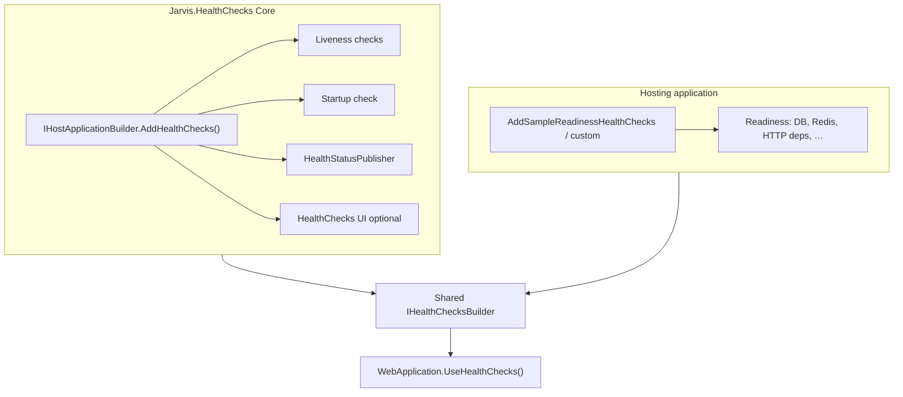
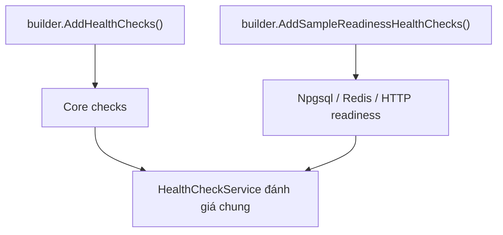

# Jarvis.HealthChecks — Kiến trúc và vận hành

Tài liệu mô tả module **Jarvis.HealthChecks**: luồng đăng ký DI, HTTP endpoint, phân tách **Core / host**, cấu hình `HealthChecks:System`, và gợi ý Kubernetes. Đoạn tiếng Anh ngắn kèm trong ngoặc hoặc song song.

Chi tiết thao tác từng bước (thiết lập app, thêm readiness) nằm trong [`healthcheck-skill.md`](healthcheck-skill.md).

---

## 1. Vai trò của Core và ứng dụng host

**Jarvis.HealthChecks (Core)** đăng ký mặc định:

- **Liveness**: `process-resources` (CPU/bộ nhớ tiến trình so với ngưỡng cấu hình), cộng thêm các check tùy chọn từ gói **AspNetCore.HealthChecks.System** khi `HealthChecks:System` có giới hạn/đường dẫn hợp lệ, và tùy chọn `process-allocated-memory` khi `ProcessAllocatedMemoryMegabytesCeiling > 0`.
- **Startup**: `startup-completion` — phụ thuộc `IStartupCompletionNotifier`. Mặc định `HealthChecks:MarkStartupCompleteOnApplicationStarted` = `true`: `UseHealthChecks` gọi `MarkStartupComplete()` khi `ApplicationStarted` (không cần dòng trong `Program.cs`). Đặt `false` nếu phải gọi tay sau bước bất đồng bộ.
- **Hạ tầng**: `IHealthCheckPublisher` (`HealthStatusPublisher`) ghi log khi có entry không `Healthy`; **HealthChecks UI** (InMemory) và middleware **Prometheus** theo options.

**Readiness** (PostgreSQL, Redis, HTTP phụ thuộc, …) **không** do Core đăng ký. Host gọi thêm `AddHealthChecks()` trên cùng `IServiceCollection` (chuỗi `IHealthChecksBuilder` dùng chung) và gắn tag `HealthCheckTags.Readiness`.

*(Core registers liveness + startup + optional System + UI/Prometheus/publisher. Readiness is host-owned.)*



---

## 2. Tags và endpoint HTTP

Các hằng số tag nằm trong `HealthCheckTags`: `liveness`, `readiness`, `startup`. Endpoint map theo **predicate** trên `Tags`.

| Endpoint | Tag lọc | Mục đích / Purpose |
|----------|---------|-------------------|
| `GET /health/live` | `liveness` | Probe **sống** — Core không phụ thuộc DB/Redis tại đây. |
| `GET /health/ready` | `readiness` | Probe **sẵn sàng traffic** — chỉ đầy đủ sau khi host đăng ký readiness. |
| `GET /health/startup` | `startup` | Probe **khởi động xong** (migration, warm-up…). |
| `GET /health` | Tất cả | JSON chi tiết (UI.Client); có thể khóa bằng header nếu cấu hình API key. |
| `GET {PrometheusMetricsPath}` | — | Scrape Prometheus khi `EnablePrometheusMetrics` bật (mặc định `/health/prometheus`). |

Phản hồi `/health/live`, `/health/ready`, `/health/startup` dùng `UIResponseWriter`: có **cấu trúc chi tiết theo từng check**, không chỉ `{ "status": "..." }` tối giản.

---

## 3. Luồng đăng ký trong Core (`AddHealthChecks`)

```mermaid
sequenceDiagram
    participant Host as IHostApplicationBuilder
    participant Opt as JarvisHealthCheckOptions
    participant DI as IServiceCollection
    participant HC as AddHealthChecks

    Host->>Opt: BindConfiguration("HealthChecks")
    Host->>DI: AddMemoryCache, IStartupCompletionNotifier, liveness/startup checks (singleton)
    Host->>DI: HealthStatusPublisher + HealthCheckPublisherOptions.Delay ≈ 10s
    Host->>HC: AddCheck process-resources (tags: liveness)
    Host->>HC: AddCheck startup-completion (tags: startup)
    Host->>HC: RegisterAspNetCoreSystemHealthChecks (optional System package)
    opt Ui.Enabled
        Host->>DI: AddHealthChecksUI + AddInMemoryStorage
    end
```

**Ghi chú:**

- **`HealthCheckPublisherOptions.Delay`**: trì hoãn publisher (mặc định ~10 giây) để giảm spam log.
- **`DefaultTimeoutSeconds`**: được bind vào `JarvisHealthCheckOptions` nhưng **Core không** dùng cho readiness; host nên đọc giá trị này (hoặc `HealthChecks:DefaultTimeoutSeconds`) khi thêm Npgsql/Redis/HTTP (xem Sample).

---

## 4. Liveness từ `RegisterAspNetCoreSystemHealthChecks` (`HealthCheckServiceExtensions`)

Trong `AddHealthChecks()`, sau `process-resources` và `startup-completion`, Core gọi **`RegisterAspNetCoreSystemHealthChecks`**: đăng ký thêm các check của gói **AspNetCore.HealthChecks.System** (và một check CLR) — **tất cả đều tag `liveness`**, timeout nội bộ **500 ms** mỗi check.

*(All rows below appear on `GET /health/live` and full `GET /health`.)*

### 4.1 Điều kiện chung

- **`HealthChecks:ProcessAllocatedMemoryMegabytesCeiling`**: nằm ở **gốc** section `HealthChecks` (không phải `System`).
- Các key còn lại: **`HealthChecks:System:…`** → class `JarvisHealthCheckSystemOptions`.
- Với các giới hạn kiểu số: **`0`** = **không** đăng ký check đó.
- Với danh sách (`DiskDrives`, `MonitorFolders`, `MonitorFiles`): không có phần tử hợp lệ (path rỗng bị lọc) → **không** đăng ký.
- **`ProcessName`** / **`WindowsServiceName`**: `null` = hành vi mặc định; chuỗi **`""`** (rỗng, property không null) = **tắt hẳn** check tương ứng.

### 4.2 Bảng: tên check, cấu hình, ý nghĩa

| Tên check (trong report) | Key JSON (appsettings) | Điều kiện đăng ký | Mô tả / ý nghĩa |
|---------------------------|------------------------|-------------------|-----------------|
| **`process-allocated-memory`** | `HealthChecks:ProcessAllocatedMemoryMegabytesCeiling` | Giá trị **> 0** | Dùng `AddProcessAllocatedMemoryHealthCheck`: so sánh **bộ nhớ đã cấp phát của CLR** (managed heap) với **trần megabyte** đã cấu hình. Bổ sung cho `process-resources` (vốn dùng `GC.GetTotalMemory` và cùng trần làm mẫu số tỷ lệ trong check Jarvis). Đặt `0` để **tắt** check này (không đổi logic `process-resources` ngoài việc mẫu số tỷ lệ — xem `JarvisHealthCheckOptions`). |
| **`system-private-memory`** | `HealthChecks:System:PrivateMemoryMegabytesMaximum` | **> 0** (mặc định 8192) | Giới hạn **private memory** của tiến trình (byte = MB × 1024²). Vượt trần → **Unhealthy**. |
| **`system-working-set`** | `HealthChecks:System:WorkingSetMegabytesMaximum` | **> 0** (mặc định 8192) | Giới hạn **working set** (RAM vật lý ước lượng process đang dùng). |
| **`system-virtual-memory-size`** | `HealthChecks:System:VirtualMemorySizeMegabytesMaximum` | **> 0** (mặc định rất lớn) | Giới hạn **virtual memory size** báo cáo của OS cho process. |
| **`system-disk-storage`** | `HealthChecks:System:DiskDrives` (mảng) | Ít nhất một phần tử có `Path` không rỗng | Mỗi phần tử: **`Path`** (ổ/mount, ví dụ `/` hoặc `C:\`), **`MinimumFreeMegabytes`**. Đủ dung lượng trống trên từng ổ được khai báo → Healthy. Mặc định code: `/` + 256 MB — **Windows** thường cần đổi `Path` (ví dụ `C:\`). |
| **`system-folder`** | `HealthChecks:System:MonitorFolders`, `FolderCheckAll` | Danh sách folder sau khi lọc không rỗng (mặc định `["."]`) | Kiểm tra tồn tại/khả năng truy cập thư mục. **`FolderCheckAll`**: nếu `true`, mọi folder trong list phải pass. |
| **`system-file`** | `HealthChecks:System:MonitorFiles`, `FileCheckAll` | Danh sách file sau khi lọc không rỗng (mặc định `["appsettings.json"]`) | Kiểm tra file tồn tại (đường dẫn tương đối theo working directory). **`FileCheckAll`**: nếu `true`, mọi file phải pass. |
| **`system-process`** | `HealthChecks:System:ProcessName` | Không bị tắt bằng `""` | **`null`** hoặc whitespace: lấy tên tiến trình hiện tại; **giá trị cụ thể**: tên process (không extension) phải có ít nhất một instance. **`ProcessName` = `""`** (và `!= null`): không đăng ký check. |
| **`system-windows-service`** | `HealthChecks:System:WindowsServiceName`, `WindowsServiceMachineName` | Chỉ khi **`OperatingSystem.IsWindows()`** và không tắt bằng `""` | **`WindowsServiceName`**: `null` hoặc whitespace → mặc định kiểm dịch vụ **`RpcSs`**; tên khác → service short name. **`WindowsServiceMachineName`**: máy đích (mặc định `.`). Trạng thái phải **Running**. `WindowsServiceName` = `""`: không đăng ký. |

### 4.3 Ví dụ `appsettings` (rút gọn)

```json
"HealthChecks": {
  "ProcessAllocatedMemoryMegabytesCeiling": 4096,
  "System": {
    "PrivateMemoryMegabytesMaximum": 8192,
    "WorkingSetMegabytesMaximum": 8192,
    "VirtualMemorySizeMegabytesMaximum": 1048576,
    "DiskDrives": [
      { "Path": "C:\\", "MinimumFreeMegabytes": 256 }
    ],
    "MonitorFolders": [ "." ],
    "FolderCheckAll": false,
    "MonitorFiles": [ "appsettings.json" ],
    "FileCheckAll": false,
    "ProcessName": null,
    "WindowsServiceName": null,
    "WindowsServiceMachineName": "."
  }
}
```

Để **giảm số liveness check** (ví dụ container chỉ cần tối thiểu): đặt các `*MegabytesMaximum` = **0**, `DiskDrives` / `MonitorFolders` / `MonitorFiles` = **[]**, `ProcessName` = **`""`**, và trên Windows `WindowsServiceName` = **`""`**.

---

## 5. Startup probe và `IStartupCompletionNotifier`

`/health/startup` chuyển **Healthy** sau khi **`MarkStartupComplete()`** chạy (gọi nhiều lần vẫn an toàn).

**Mặc định (Jarvis):** `HealthChecks:MarkStartupCompleteOnApplicationStarted` = **`true`**. `UseHealthChecks` đăng ký `IHostApplicationLifetime.ApplicationStarted` và gọi `MarkStartupComplete()` — không cần thêm dòng trong `Program.cs`. Thứ tự điển hình: code đồng bộ trước `Run()` (ví dụ `EnsureMigrateDb`) vẫn chạy xong trước khi host báo started; callback chạy ngay khi ứng dụng bắt đầu lắng nghe.

**Khi đặt `false`:** host tự gọi `GetRequiredService<IStartupCompletionNotifier>().MarkStartupComplete()` sau mọi việc cần chờ (ví dụ khởi tạo bất đồng bộ trong hosted service).

**Lưu ý:** So với gọi tay ngay trước `Run()`, chuyển sang Healthy nhờ `ApplicationStarted` xảy ra **sau** khi server sẵn sàng nhận kết nối — thường **phù hợp** startup probe HTTP vì probe cần endpoint đang lắng nghe.

---

## 6. Readiness phía host (ví dụ Sample)

`AddSampleReadinessHealthChecks()`:

- Đọc **`HealthChecks:Readiness:Database`** / **`Redis`** như **đường dẫn key đầy đủ** trong `IConfiguration` (ví dụ `ConnectionStrings:SampleDbContext`), rồi `configuration[keyPath]`.
- Đăng ký `IHealthCheck` tùy chỉnh (HTTP tới API mẫu) với tag `readiness`.



---

## 7. Prometheus và HealthChecks UI

- **`UseHealthChecks`** (Jarvis): nếu `EnablePrometheusMetrics`, gọi `UseHealthChecksPrometheusExporter` với `PrometheusMetricsPath`.
- **`MapHealthChecksUI`**: khi `HealthChecks:Ui:Enabled` — SPA dashboard; lịch sử **InMemory**. `Endpoints` cần **URI tuyệt đối** trỏ JSON health (thường `https://localhost:{port}/health`).

---

## 8. Gợi ý Kubernetes (HTTP)

```yaml
livenessProbe:
  httpGet:
    path: /health/live
    port: http
  periodSeconds: 10
  failureThreshold: 3
readinessProbe:
  httpGet:
    path: /health/ready
    port: http
  periodSeconds: 5
  failureThreshold: 3
startupProbe:
  httpGet:
    path: /health/startup
    port: http
  initialDelaySeconds: 60
  periodSeconds: 10
  failureThreshold: 3
```

---

## 9. `IHealthCheckPublisher`

**`HealthStatusPublisher`** nhận `HealthReport` định kỳ (sau `Delay`) và ghi log cho entry không `Healthy`. Không thay thế HTTP probe.

---

## 10. Cấu hình chính (`HealthChecks`)

| Nhóm | Class / key | Ý nghĩa |
|------|-------------|--------|
| Lõi | `JarvisHealthCheckOptions` | Ngưỡng memory/CPU liveness, cache TTL, CLR ceiling, khóa `/health`, Prometheus, `MarkStartupCompleteOnApplicationStarted`, `Ui`, `System`. |
| UI | `JarvisHealthCheckUiOptions` | `Enabled`, `UIPath`, `ApiPath`, `Endpoints`, `Webhooks`. |
| System | `JarvisHealthCheckSystemOptions` | Private/working/virtual memory, disk, folder, file, process, Windows service. |

Section name: `JarvisHealthCheckOptions.SectionName` = `"HealthChecks"`.

---

## 11. Tệp tham chiếu trong repo

| Thành phần | File |
|------------|------|
| Đăng ký Core (DI) | `Jarvis.HealthChecks/HealthCheckServiceExtensions.cs` |
| Map HTTP | `Jarvis.HealthChecks/HealthCheckWebApplicationExtensions.cs` |
| Tags | `Jarvis.HealthChecks/HealthCheckTags.cs` |
| Liveness tiến trình | `Jarvis.HealthChecks/ProcessResourceLivenessHealthCheck.cs` |
| Startup | `Jarvis.HealthChecks/IStartupCompletionNotifier.cs`, `StartupCompletionHealthCheck.cs` |
| UI InMemory | `Jarvis.HealthChecks/HealthChecksUiThirdPartyRegistration.cs` |
| Ví dụ readiness host | `Sample/Health/SampleReadinessHealthCheckExtensions.cs` |
| Hướng dẫn thao tác | `docs/healthcheck-skill.md` |
