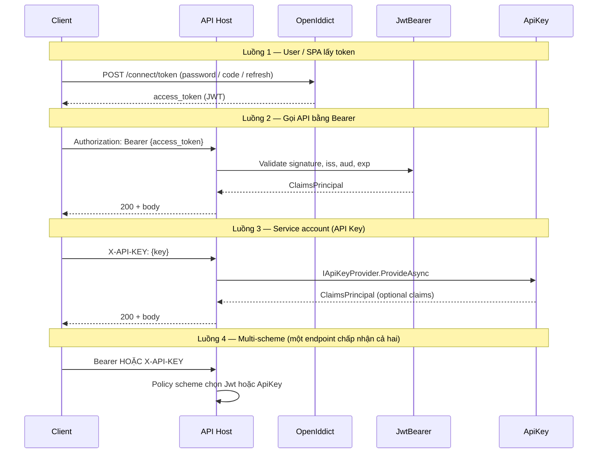

# Refactor Authentication — Thiết kế & Code Review

> **Trạng thái tài liệu:** Đã implement Phase 0–3, 6 (ApiKey, Jwt, base `Composite`, Sample wire). **Chưa** có `Jarvis.Authentication.OpenIddict` (test OIDC-* chưa áp dụng). Test: `tests/Jarvis.Authentication.Tests` — 24 tests P0/P1.

## Phạm vi (scope)

| Trong scope (Story Authentication) | Ngoài scope (Story Authorization — riêng) |
|-----------------------------------|---------------------------------------------|
| Xác định **danh tính** request: JWT Bearer, ApiKey, OpenIddict (AS/RS), Cognito-as-JWKS, Basic (sau) | **Quyền**: policies, roles, claims requirements, resource-based auth |
| `AddAuthentication`, schemes, `IApiKeyProvider`, token validation, options (`PasswordPolicy`, `Cookie` cho **login flow**) | `AddAuthorization`, `UseAuthorization`, `[Authorize]`, `IAuthorizationHandler` |
| `UseAuthentication()` trên pipeline | Enforcement `[Authorize]` / policy evaluation |
| Package `Jarvis.Authentication.*` (base, Jwt, ApiKey, OpenIddict đề xuất) | Package `Jarvis.Authorization.*` (base — chưa thiết kế) |
| Swagger: khai báo scheme (JWT, API_KEY) | Swagger: gắn policy/scope vào operation (có thể thuộc Authorization story) |

**Phạm vi review code:** `Jarvis.Authentication`, `Jarvis.Authentication.Jwt`, `Jarvis.Authentication.ApiKey`, `Jarvis.Authentication.Cognito`, cấu hình `Sample/appsettings.json` (Authentication + Swagger), tích hợp thực tế trong `Sample/Program.cs` (hiện **chưa** wire authentication).

**Chuẩn review:** `.opencode/skills/code-review/SKILL.md` + mục tiêu kiến trúc Jarvis (`.opencode/skills/jarvis-dotnet/modules/authentication/SKILL.md` — cập nhật khi implement).

**Kết luận review (hiện trạng repo):** Các package là **khung mỏng / chưa đủ vai trò base**; JWT và API Key có extension DI nhưng **chưa chạy end-to-end** trong Sample và có **lỗi cấu hình–runtime** với API Key. Cognito gần như **stub**. Chưa đáp ứng yêu cầu mở rộng (password policy, cookie, OpenIddict). **Overall: blocked** — cần refactor trước khi coi là production-ready.

---

## Đánh giá theo yêu cầu kiến trúc

| # | Yêu cầu | Hiện trạng | Đáp ứng |
|---|---------|------------|---------|
| 1 | `Jarvis.Authentication` là base chung (Basic, Bearer JWT, Cognito, OpenId, …) | Chỉ có `AuthenticationOption.Type` (string) và `AwsOption`; không có extension `AddAuthentication`, abstraction scheme, options chung, pipeline helper | **Không** |
| 2 | JWT: thêm `Jarvis.Authentication.Jwt`, khai báo đơn giản | Có `AddCoreJwtBearer(configuration)` + bind `Authentication:Jwt:{scheme}`; thiếu validation config, `RequireHttpsMetadata = false`, không gắn `Authentication.Type` | **Một phần** |
| 3 | API Key: thêm `Jarvis.Authentication.ApiKey` | Có `AddCoreApiKey<T>`; provider mặc định **không khớp** appsettings Sample; host phải tự register `T` | **Một phần (có bug)** |
| 4 | Mở rộng customize (password complexity, expire, cookie, …) | Không có options/hook/interface cho policy hoặc cookie | **Không** |

---

## Critical Issues

### 1. API Key: format key bắt buộc `realm:secret` — Sample/config không tương thích

**File:** `Jarvis.Authentication.ApiKey/ApiKeyProvider.cs`

```20:29:Jarvis.Authentication.ApiKey/ApiKeyProvider.cs
    public virtual async Task<IApiKey?> ProvideAsync(string key)
    {
        await Task.Yield();

        var splited = key.Split(":");
        if (splited.Length != 2)
        {
            _logger.LogError($"API KEY do not contains REALM");
            return null;
        }
```

**Scenario:** Client gửi header `X-API-KEY: ZofkXgxwiO6F2s1JJCX5L6Wa7JctPmpO` (đúng với `appsettings.json`). `Split(":")` → length 1 → luôn `null` → **401 mọi request**.

**Impact:** Mọi host dùng config “key thuần” như Sample sẽ **không authenticate được** dù key đúng trong config.

**Suggested fix:** Hỗ trợ hai mode (cấu hình): `SingleKey` (so khớp trực tiếp) và `RealmKey` (`realm:secret`); hoặc đổi provider mặc định khớp skill/doc (`Keys[]` không bắt buộc prefix).

---

### 2. API Key: lệch tên scheme giữa config, named options và `IOptionsFactory.Create(realm)`

**Files:** `AuthenticationBuilderExtension.cs`, `ApiKeyProvider.cs`, `Sample/appsettings.json`

| Thành phần | Giá trị thực tế |
|------------|-----------------|
| `AddCoreApiKey` (overload mặc định) | `authenticationScheme` = `ApiKeyDefaults.AuthenticationScheme` → thường là `"ApiKey"` |
| Section bind | `Authentication:ApiKey:Default` |
| Sample config | `Authentication:ApiKey:Default` |
| Provider lookup | `_options.Create(realm)` với `realm` từ prefix key → `"Default"` |

**Scenario:** Gọi `AddCoreApiKey<ApiKeyProvider>(configuration)` + config Sample.

1. `GetSection("Authentication:ApiKey:ApiKey")` (library default) → **rỗng** khi config là `ApiKey:Default`.
2. Header `Default:Zofk...` (RealmKey) → `Create("Default")` phải khớp named options đã register.

**Impact:** Cấu hình trong `appsettings` **không được load**; xác thực fail kép với issue #1.

**Suggested fix:** Thống nhất scheme ApiKey = **`Default`**: section `Authentication:ApiKey:Default`, `AddCoreApiKey(..., "Default")`. Policy multi-scheme = **`Composite`** (tách tên, tránh trùng `Default`).

---

### 3. Sample: reference auth packages nhưng không đăng ký pipeline

**File:** `Sample/Program.cs`

Không có `AddAuthentication()`, `AddCoreJwtBearer` / `AddCoreApiKey`, `UseAuthentication()`, `UseAuthorization()`.

**Impact:** Cấu hình `Authentication` trong `appsettings.json` **không có tác dụng**; Swagger vẫn khai báo `JWT` / `API_KEY` nhưng runtime **anonymous** — lệch doc/skills và dễ hiểu nhầm khi test bảo mật.

**Suggested fix:** Thêm `builder.Services.AddAuthentication(...)` theo `Authentication:Type` hoặc đăng ký tường minh từng scheme; bật middleware sau `UseCoreCors`.

---

### 4. JWT: `RequireHttpsMetadata = false` mặc định

**File:** `Jarvis.Authentication.Jwt/AuthenticationBuilderExtension.cs` (dòng 32)

**Scenario:** Deploy production quên override `configureOptions` → metadata issuer có thể bị thay đổi qua HTTP (tùy môi trường).

**Impact:** Rủi ro bảo mật **cao** trên môi trường không terminate TLS đúng chuẩn.

**Suggested fix:** Mặc định `true`; chỉ `false` trong Development qua `IHostEnvironment` hoặc config `Authentication:Jwt:*:RequireHttpsMetadata`.

---

### 5. JWT: thiếu config → `IssuerSigningKeys` null, validation không rõ ràng

**File:** `AuthenticationBuilderExtension.cs` — `authOption?.IssuerSigningKeys.Select(...)`.

**Scenario:** Thiếu section `Authentication:Jwt:{scheme}` → `authOption` null → `IssuerSigningKeys` null trên `TokenValidationParameters`.

**Impact:** Mọi token fail hoặc hành vi phụ thuộc version IdentityModel — **khó debug**, dễ coi là “JWT hỏng” thay vì “chưa cấu hình”.

**Suggested fix:** `ValidateOnStart` / throw `OptionsValidationException` khi `ValidateIssuerSigningKey` và không có key; document section bắt buộc.

---

### 6. Cognito: binding config sai tên property

**Files:** `CognitoOption.cs`, `Sample/appsettings.json`

| appsettings | `CognitoOption` |
|-------------|-----------------|
| `UserPools` | `UserPoolIds` |
| `Endpoint` | *(không có)* |

**Impact:** `UserPools` / `Endpoint` **không bind** → client AWS khởi tạo với pool/endpoint sai hoặc rỗng.

---

### 7. Secret trong repo (Sample)

**File:** `Sample/appsettings.json` — API key plaintext.

**Impact:** Lộ credential nếu commit/public repo; vi phạm security checklist.

**Suggested fix:** User secrets / env / secret manager; key mẫu chỉ trong `appsettings.Development.json` hoặc placeholder.

---

## Suggestions

### `Jarvis.Authentication` — Base quá mỏng, `Authentication.Type` không được dùng

**Issue:** `AuthenticationOption` chỉ có `Type`; không có `AddJarvisAuthentication(IConfiguration)` đọc `Type` và gọi module tương ứng.

**Impact:** Host phải biết từng package; không đạt mục tiêu “base chung”.

**Suggested fix:** Trong base (chỉ abstractions + options root, không reference JWT package):

- `AuthenticationRootOptions` với `AuthenticationType` (enum).
- `IAuthenticationModule` hoặc extension method từng satellite đăng ký qua `TryAddEnumerable`.
- Optional: `AddJarvisAuthentication(configuration, Action<AuthenticationBuilder>?)` orchestration ở **Host**, tránh circular package ref.

---

### `Jarvis.Authentication.ApiKey` — Hiệu năng lookup key

**Issue:** `options.Keys.Contains(apikey)` — `string[]`, O(n) mỗi request.

**Impact:** Bottleneck khi danh sách key lớn (multi-tenant, rotate key).

**Suggested fix:** Build `HashSet<string>` (case-sensitive hoặc ordinal ignore case tùy policy) lúc bind options / `IPostConfigureOptions`.

---

### `Jarvis.Authentication.ApiKey` — `await Task.Yield()` không cần thiết

**Issue:** `ProvideAsync` luôn yield rồi xử lý đồng bộ.

**Impact:** Allocation + context switch vô ích trên hot path.

**Suggested fix:** `return Task.FromResult(...)` hoặc `ValueTask`; chỉ `async` khi gọi DB/external.

---

### `Jarvis.Authentication.ApiKey` — Không đăng ký `ApiKeyProvider` mặc định

**Issue:** `AddCoreApiKey<T>` yêu cầu `T : IApiKeyProvider` nhưng không `AddSingleton<IApiKeyProvider, T>()`.

**Impact:** Host quên register → fail lúc resolve (lỗi DI, không phải 401 rõ ràng).

**Suggested fix:** `builder.Services.AddSingleton<IApiKeyProvider, T>()` trong extension; overload không generic dùng `ApiKeyProvider` built-in.

---

### `Jarvis.Authentication.Jwt` — Custom `LifetimeValidator` trùng framework

**Issue:** Copy logic validate lifetime (~40 dòng) trong khi JwtBearer đã có `ValidateLifetime`.

**Impact:** Chi phí bảo trì khi nâng `Microsoft.IdentityModel.*`; khó tái sử dụng cho OpenId (issuer khác).

**Suggested fix:** Dùng `ValidateLifetime` + `TokenValidationParameters.ClockSkew`; chỉ giữ `MaxExpireMinutes` qua `LifetimeValidator` nhỏ hoặc `ISecurityTokenValidator` tùy biến.

---

### `Jarvis.Authentication.Cognito` — Stub, không tích hợp ASP.NET Core Authentication

**Issue:** `IAuthenticationService` rỗng; `CognitoClient` chỉ new `AmazonCognitoIdentityProviderClient`; field public, không `IDisposable` wrapper.

**Impact:** Không dùng được như Bearer/Cognito JWT middleware; không tái sử dụng cho login/sign-up flow.

**Suggested fix:** Tách `Jarvis.Authentication.Cognito` thành: (a) admin API client + options, (b) `AddCognitoJwtBearer` (validate token qua JWKS user pool) — hoặc document rõ package chỉ là **AWS SDK helper**, không phải auth scheme.

---

### `AwsOption` trong base

**Issue:** Credential AWS nằm `Jarvis.Authentication` trong khi chỉ Cognito dùng.

**Impact:** Base package ô nhiễm AWS; host chỉ cần JWT vẫn kéo concept AWS nếu bind nhầm section.

**Suggested fix:** Chuyển `AwsOption` sang `Jarvis.Authentication.Cognito` hoặc `Jarvis.Authentication.Aws` nhỏ.

---

### Swagger vs runtime

**Issue:** `Swagger:SecuritySchemes` = `JWT`, `API_KEY` nhưng không `AddSecurityRequirement` đồng bộ với scheme đã `AddAuthentication`.

**Impact:** Swagger “có nút Authorize” nhưng API không enforce — false sense of security khi demo.

**Suggested fix:** Đăng ký auth trước Swagger; hoặc derive `SecuritySchemes` từ schemes đã add.

---

## Best Practices & Improvements

### Kiến trúc đề xuất (đáp ứng 4 yêu cầu)

```text
Jarvis.Authentication                    ← contracts, root options, password/cookie policy options, validation
    ↑
    ├── Jarvis.Authentication.Jwt        ← AddCoreJwtBearer (optional package)
    ├── Jarvis.Authentication.ApiKey     ← AddCoreApiKey (optional package)
    ├── Jarvis.Authentication.Cognito    ← SDK + JwtBearer từ User Pool (optional)
    ├── Jarvis.Authentication.OpenIddict   ← AS + validation (optional)
    └── (tương lai) .Basic, Cognito-as-Jwt-Authority
```

**Base (`Jarvis.Authentication`) nên có:**

| Thành phần | Mục đích |
|------------|----------|
| `AuthenticationRootOptions` | `Type`, default scheme, forward scheme |
| `PasswordPolicyOptions` | Min length, complexity, history — cho Basic/local account |
| `PasswordExpirationOptions` | Max age, warn days — hook `IPasswordExpirationValidator` |
| `JarvisCookieAuthenticationOptions` | Name, HttpOnly, SameSite, sliding expiration — mirror cookie middleware |
| `IAuthenticationCustomizer` / `IPostConfigureOptions<T>` | Extension point không sửa library |
| Options validation (`IValidateOptions<T>`) | Fail fast lúc startup |

**Host wiring mẫu (đề xuất):**

```csharp
builder.Services
    .AddAuthentication()
    .AddCoreApiKey(builder.Configuration);

app.UseAuthentication();
// UseAuthorization() → Story Authorization
```

**Config mẫu thống nhất:**

```json
"Authentication": {
  "Type": "ApiKey",
  "DefaultAuthenticateScheme": "Default",
  "ApiKey": {
    "Default": {
      "KeyName": "X-API-KEY",
      "Mode": "SingleKey",
      "Keys": []
    }
  },
  "Jwt": {
    "Bearer": { "IssuerSigningKeys": [], "ValidateIssuer": true }
  },
  "PasswordPolicy": { "MinLength": 12 },
  "Cookie": { "LoginPath": "/login" }
}
```

### Concurrency / deadlock / memory

| Chủ đề | Đánh giá |
|--------|----------|
| Deadlock | **Không thấy** — không lock/`Wait()`; Cognito ctor sync một lần |
| Thread safety | `AmazonCognitoIdentityProviderClient` thread-safe nếu **singleton** DI; hiện chưa register lifetime |
| Memory | JWT `SaveToken = true` giữ token trên `HttpContext` — chấp nhận được; tránh cache token lớn custom |
| Bottleneck | API Key linear scan + `Task.Yield` (xem Suggestions) |
| NativeAOT | Chưa xét; AWS SDK + IdentityModel thường cần kiểm tra riêng nếu bật AOT |

### Tái sử dụng & mở rộng

- **Đúng hướng:** Tách package theo scheme; `Action<JwtBearerOptions>?` / `Action<ApiKeyOptions>?` cho override.
- **Thiếu:** Policy-based authorization helpers, claims transformation chung, multi-scheme (`Jwt` + `ApiKey`), và **extension points** cho password/cookie như yêu cầu #4.
- **Đặt tên:** Folder `Jarvis.Authentication.*` vs NuGet `Jarvis.Authentications.*` — document một lần trong README base để tránh nhầm package.

### Test (khi implement)

Chi tiết: mục [Test cases (Authentication story)](#test-cases-authentication-story).

---

## Summary

| Project | Nhận xét ngắn |
|---------|----------------|
| `Jarvis.Authentication` | Chưa là base: thiếu orchestration, shared options, extension DI; `AwsOption` lệch scope |
| `Jarvis.Authentication.Jwt` | Có `AddCoreJwtBearer`, bind config tốt một phần; cần harden HTTPS/metadata, validate options, giảm custom validator |
| `Jarvis.Authentication.ApiKey` | **Blocked** — provider/config/scheme lệch Sample; perf và DI chưa hoàn chỉnh |
| `Jarvis.Authentication.Cognito` | Stub — binding sai, không auth middleware; cần thiết kế lại vai trò |
| `Sample` | Config + Swagger gợi ý auth nhưng **Program.cs không wire** |

**Overall:** **blocked** cho production (review hiện trạng); lộ trình **đề xuất** xem [Luồng chung](#luồng-chung-openiddict--jwt--apikey) và checklist Phase 0–8 — **chờ phê duyệt trước khi code**.

Thứ tự triển khai đề xuất (Authentication story only):

1. Phase 0 — Sửa ApiKey (blocker).
2. Phase 1–3 — Base `AddJarvisAuthentication` + Jwt + ApiKey.
3. Phase 4–5 — Package `Jarvis.Authentication.OpenIddict` + password/cookie hooks.
4. Phase 6–8 — Sample `UseAuthentication`, Swagger schemes, tests.
5. (Song song / sau) Cognito hoặc thu hẹp phạm vi package hiện tại.
6. **Story khác** — Authorization base (`AddAuthorization`, policies, `UseAuthorization`).

---

## Phụ lục: Ma trận file hiện có

| File | Vai trò |
|------|---------|
| `AuthenticationOption.cs` | Chỉ `Type` string |
| `AwsOption.cs` | AWS credentials (nên thuộc Cognito) |
| `AuthenticationJwtOption.cs` | JWT validation flags |
| `AuthenticationBuilderExtension.cs` (Jwt) | `AddCoreJwtBearer` |
| `AuthenticationApiKeyOption.cs` | `KeyName`, `Keys[]` |
| `ApiKeyProvider.cs` | Validate realm:key |
| `AuthenticationBuilderExtension.cs` (ApiKey) | `AddCoreApiKey<T>` |
| `CognitoOption.cs` | Region, pools, clients |
| `CognitoClient.cs` | AWS client factory |
| `IAuthenticationService.cs` | Empty marker |

*Review date: 2026-05-21*

---

## Luồng chung: OpenIddict + JWT + ApiKey

Phần này mở rộng kiến trúc để **một host/API** có thể dùng đồng thời:

| Thành phần | Vai trò trong hệ thống |
|------------|------------------------|
| **OpenIddict** | Authorization Server (AS): phát token, login (password/cookie), client credentials, refresh; lưu application/scope/authorization |
| **JWT (JwtBearer)** | Resource Server (RS): **xác thực** access token trên request API (`Authorization: Bearer`) — token do OpenIddict (hoặc IdP khác) ký |
| **ApiKey** | Machine-to-machine / partner / webhook: header tĩnh, **không** qua OAuth; chạy **song song** JWT, không thay thế |

Nguyên tắc: **OpenIddict ≠ JWT package**. OpenIddict **cấp** token; `Jarvis.Authentication.Jwt` **kiểm** token. ApiKey là scheme độc lập cho client không dùng OAuth.

### Mô hình triển khai khuyến nghị

```text
┌─────────────────────────────────────────────────────────────────┐
│  Host (Sample / Product API)                                     │
│                                                                  │
│  ┌──────────────────┐     issues tokens      ┌───────────────┐ │
│  │ OpenIddict       │ ──────────────────────►│ Access JWT    │ │
│  │ (Server + Store) │   /connect/token       │ (Bearer)      │ │
│  └────────┬─────────┘                        └───────┬───────┘ │
│           │ login UI / cookie                         │         │
│           │                                           ▼         │
│  ┌────────▼─────────┐   validates Bearer      ┌───────────────┐ │
│  │ Password policy  │                       │ JwtBearer      │ │
│  │ Cookie options   │                       │ middleware     │ │
│  └──────────────────┘                       └───────┬───────┘ │
│                                                     │         │
│  ┌──────────────────┐   X-API-KEY header            │         │
│  │ ApiKey middleware│ ◄─────────────────────────────┼── API   │
│  └──────────────────┘                               ▼         │
│                                            Controllers / APIs  │
└─────────────────────────────────────────────────────────────────┘
     ※ [Authorize] / policies → Story Authorization (không thuộc doc này)
```

**Hai topology thường gặp:**

| Topology | Khi nào dùng | Jarvis packages |
|----------|--------------|-----------------|
| **A — Combined** | Monolith: API + AS cùng process | Base + OpenIddict + Jwt + ApiKey (optional) |
| **B — Split** | AS riêng, nhiều API | API chỉ Jwt (+ ApiKey); Authority trỏ AS | Base + Jwt + ApiKey |

Jarvis nên hỗ trợ **cả A và B** qua cùng config key `Authentication:Jwt:*:Authority` / `Issuer`.

### Luồng request (runtime)



### Cấu trúc package (mục tiêu)

```text
Jarvis.Authentication
  ├── Options/AuthenticationRootOptions.cs
  ├── Options/PasswordPolicyOptions.cs
  ├── Options/JarvisCookieAuthenticationOptions.cs
  ├── Abstractions/IAuthenticationModule.cs
  ├── Extensions/AuthenticationServiceCollectionExtensions.cs   ← AddJarvisAuthentication
  └── Validation/...

Jarvis.Authentication.OpenIddict          ← NEW (optional NuGet)
  ├── OpenIddictServerOptions.cs          ← bind Authentication:OpenIddict:Server
  ├── OpenIddictValidationOptions.cs      ← bind Authentication:OpenIddict:Validation
  └── Extensions/AddCoreOpenIddict(...)

Jarvis.Authentication.Jwt                 ← đã có; mở rộng Authority/JWKS
  └── AddCoreJwtBearer(...)               ← RS: validate token từ OpenIddict

Jarvis.Authentication.ApiKey              ← đã có; sửa provider + scheme
  └── AddCoreApiKey(...)
```

**Dependency:**

- `OpenIddict` → reference `Jarvis.Authentication` (options chung: password, cookie).
- `Jwt` → reference `Jarvis.Authentication`; **không** reference OpenIddict package (tránh kéo server vào API thuần RS).
- Host topology A: reference cả `OpenIddict` + `Jwt` + `ApiKey`.

### Cấu hình thống nhất (`appsettings`)

```json
{
  "Authentication": {
    "DefaultAuthenticateScheme": "Composite",
    "DefaultChallengeScheme": "Composite",
    "Schemes": {
      "OpenIddict": { "Enabled": true },
      "Jwt": { "Enabled": true },
      "ApiKey": { "Enabled": true }
    },

    "OpenIddict": {
      "Server": {
        "Issuer": "https://localhost:5001/",
        "Endpoints": {
          "Token": "/connect/token",
          "Authorization": "/connect/authorize",
          "Logout": "/connect/logout"
        },
        "AllowPasswordFlow": true,
        "AllowClientCredentialsFlow": true,
        "AllowRefreshTokenFlow": true
      },
      "Validation": {
        "Issuer": "https://localhost:5001/",
        "Audience": "sample-api"
      },
      "Signing": {
        "Type": "Development",
        "CertificatePath": null
      }
    },

    "Jwt": {
      "Bearer": {
        "Authority": "https://localhost:5001/",
        "Audience": "sample-api",
        "ValidateIssuer": true,
        "ValidateAudience": true,
        "RequireHttpsMetadata": true
      }
    },

    "ApiKey": {
      "Default": {
        "KeyName": "X-API-KEY",
        "Mode": "SingleKey",
        "Keys": []
      }
    },

    "PasswordPolicy": {
      "MinLength": 12,
      "RequireDigit": true,
      "RequireUppercase": true,
      "RequireLowercase": true,
      "RequireNonAlphanumeric": true,
      "MaxFailedAttempts": 5
    },

    "PasswordExpiration": {
      "MaxAgeDays": 90,
      "WarnBeforeDays": 14
    },

    "Cookie": {
      "LoginPath": "/account/login",
      "LogoutPath": "/account/logout",
      "ExpireTimeSpan": "01:00:00",
      "SlidingExpiration": true,
      "HttpOnly": true,
      "SameSite": "Lax"
    }
  }
}
```

**Ghi chú binding:**

- `DefaultAuthenticateScheme` = **`Composite`** khi bật **cả** Jwt + ApiKey (policy scheme forward). Chỉ Jwt → `Bearer`; chỉ ApiKey → `Default` (scheme ApiKey).
- Topology **A**: `OpenIddict:Validation` và `Jwt:Bearer` dùng **cùng** `Issuer`/`Audience` — JwtBearer có thể lấy signing keys từ OpenIddict validation handler hoặc `Authority` metadata.
- Topology **B**: tắt `OpenIddict:Server:Enabled`; chỉ `Jwt:Bearer:Authority` trỏ AS bên ngoài.
- `PasswordPolicy` / `Cookie`: bind ở **base**, implement trong `Jarvis.Authentication.OpenIddict` (custom `IOpenIddict*Handler` / ASP.NET Identity nếu có).

### API Host — wiring chung (đề xuất, chưa implement)

```csharp
using Jarvis.Authentication;                    // đề xuất — package base
using Jarvis.Authentication.OpenIddict.Extensions; // đề xuất — package mới
using Jarvis.Authentication.Jwt;
using Jarvis.Authentication.ApiKey;

var builder = WebApplication.CreateBuilder(args);

builder.Services
    .AddJarvisAuthentication(builder.Configuration, auth =>
    {
        if (builder.Configuration.GetValue("Authentication:Schemes:OpenIddict:Enabled", false))
            auth.AddCoreOpenIddict(builder.Configuration);

        if (builder.Configuration.GetValue("Authentication:Schemes:Jwt:Enabled", true))
            auth.AddCoreJwtBearer(builder.Configuration, JwtBearerDefaults.AuthenticationScheme);

        if (builder.Configuration.GetValue("Authentication:Schemes:ApiKey:Enabled", false))
            auth.AddCoreApiKey(builder.Configuration, "Default");
    });
// ※ AddAuthorization() → Story Authorization riêng

var app = builder.Build();

app.UseAuthentication();
// ※ app.UseAuthorization() → Story Authorization riêng
app.MapControllers();
```

**`AddJarvisAuthentication`** (đề xuất, trong `Jarvis.Authentication`) — trách nhiệm:

1. `services.AddAuthentication()` + bind `AuthenticationRootOptions`.
2. Đặt `DefaultAuthenticateScheme` / `DefaultChallengeScheme` từ config.
3. Gọi `Action<AuthenticationBuilder>` do host/satellite đăng ký scheme.
4. `ValidateOnStart` cho options bắt buộc.
5. **Không** reference OpenIddict/Jwt package — chỉ delegate; satellite register qua extension methods.
6. **Không** gọi `AddAuthorization()` — thuộc Story Authorization.

### Multi-scheme: một API chấp nhận Bearer **hoặc** ApiKey

ASP.NET Core mặc định chỉ authenticate **một** scheme mỗi request. Pattern khuyến nghị: policy scheme **`Composite`** — ghép nhiều cách xác thực (tương tự *composite* trong DB), **chỉ forward** sang scheme thật, không tự validate credential.

> **Đặt tên:** policy = `Composite`; scheme ApiKey = `Default`; Jwt = `Bearer`. Tránh dùng `Default` làm policy vì trùng scheme ApiKey `Default`.

```csharp
// AuthenticationRootOptions — khi Jwt + ApiKey cùng bật
// DefaultAuthenticateScheme = "Composite"
// DefaultChallengeScheme = "Composite"

services.AddAuthentication("Composite")
    .AddPolicyScheme("Composite", "JWT or ApiKey", options =>
    {
        options.ForwardDefaultSelector = context =>
        {
            if (context.Request.Headers.ContainsKey("X-API-KEY"))
                return "Default"; // ApiKey scheme
            return JwtBearerDefaults.AuthenticationScheme;
        };
    })
    .AddCoreJwtBearer(configuration, JwtBearerDefaults.AuthenticationScheme)
    .AddCoreApiKey(configuration, schemeName: "Default");
```

| Endpoint style | `[Authorize]` | Hành vi |
|----------------|---------------|---------|
| Chỉ user OAuth | default `Composite` | Forward → `Bearer` (token OpenIddict) |
| Chỉ integration | `[Authorize(AuthenticationSchemes = "Default")]` | Chỉ scheme ApiKey `Default` |
| Cả hai | `DefaultAuthenticateScheme` = `Composite` | Header quyết định forward |

### OpenIddict + JWT + ApiKey — `Composite` hoạt động thế nào

| Thành phần | Có trong policy `Composite`? | Request |
|------------|------------------------------|---------|
| **OpenIddict Server** | Không | `/connect/token`, authorize — **phát** JWT |
| **JwtBearer** (`Bearer`) | Có — nhánh forward | `/api/*` + `Authorization: Bearer` |
| **ApiKey** (`Default`) | Có — nhánh forward | `/api/*` + `X-API-KEY` |

```text
POST /connect/token     → OpenIddict Server (ngoài Composite)
GET  /api/... + Bearer  → Composite → Bearer → Jwt (Authority = OpenIddict)
GET  /api/... + ApiKey  → Composite → Default → IApiKeyProvider
```

**Swagger** (`Jarvis.Swashbuckle`): giữ `SecuritySchemes: ["JWT", "API_KEY"]`; operation có `[Authorize]` không scheme → filter thêm **cả hai** requirement (OR semantics phía client — user chọn một).

### `Jarvis.Authentication.OpenIddict` — thiết kế chi tiết

| Module | Extension | Mô tả |
|--------|-----------|-------|
| Server | `AddCoreOpenIddictServer(configuration)` | `AddOpenIddict().AddServer(...)` — token endpoint, flows, signing cert |
| Validation | `AddCoreOpenIddictValidation(configuration)` | `AddValidation(...)` — tích hợp ASP.NET Core authentication (có thể **thay** hoặc **bổ sung** JwtBearer tùy topology) |
| Store | `UseEfCoreStore` / custom | Application, authorization, scope, token — **ở Host/Infrastructure**, không hard-code trong library |
| Customize | `IPasswordPolicyValidator`, `IPasswordExpirationValidator` | Gọi từ custom handler trước `SignIn` / token password grant |

**Quan hệ với `Jarvis.Authentication.Jwt`:**

| Cách | Ưu | Nhược |
|------|-----|-------|
| Chỉ **OpenIddict Validation** | Một pipeline, ít trùng config | API thuần RS external IdP vẫn cần Jwt package |
| Chỉ **JwtBearer** + `Authority` | Chuẩn OIDC, JWKS tự động | Hai nơi cấu hình issuer nếu vừa có OpenIddict server |
| **Cả hai** (không khuyến nghị cùng scheme) | — | Trùng validate, khó debug |

**Khuyến nghị Jarvis:**

- Topology **A** (combined): `AddCoreOpenIddictServer` + `AddCoreOpenIddictValidation` **hoặc** `AddCoreJwtBearer` với `Authority = OpenIddict:Server:Issuer` — **chọn một** làm default authenticate, không bật song song trùng chức năng.
- Topology **B** (split): API chỉ `AddCoreJwtBearer`.

**Password / cookie (yêu cầu #4):**

```csharp
// Ví dụ extension point — implement ở Host hoặc Infrastructure
public interface IPasswordPolicyValidator
{
    Task<PasswordValidationResult> ValidateAsync(string password, CancellationToken ct = default);
}

// OpenIddict password grant / Identity SignInManager
// → gọi validator trước khi cho phép token
```

Cookie options (`JarvisCookieAuthenticationOptions`) map sang `CookieAuthenticationOptions` cho interactive login (authorization code + cookie session), tách khỏi Bearer API.

### `Jarvis.Authentication.Jwt` — điều chỉnh cho OpenIddict

Bổ sung vào `AuthenticationJwtOption`:

| Property | Mục đích |
|----------|----------|
| `Authority` | URL AS (OpenIddict) — bật OIDC metadata + JWKS |
| `Audience` | Resource audience |
| `MapInboundClaims` | Đồng bộ claim types với OpenIddict |
| `RequireHttpsMetadata` | Production = true |

Khi `Authority` có giá trị → **không** dùng `IssuerSigningKeys` tĩnh (symmetric dev only).

Config mẫu khi AS là OpenIddict local:

```json
"Jwt": {
  "Bearer": {
    "Authority": "https://localhost:5001/",
    "Audience": "sample-api",
    "ValidateIssuer": true,
    "ValidateAudience": true
  }
}
```

### `Jarvis.Authentication.ApiKey` — trong luồng chung

- Scheme name = **`Default`** (section `Authentication:ApiKey:Default`), không hard-code `ApiKeyDefaults.AuthenticationScheme` cho config path.
- `Mode`: `SingleKey` | `RealmKey` — xem Critical Issues #1–2.
- Claims: `ApiKeyModel` nhận claims từ config hoặc `IApiKeyProvider` custom (gán role `integration` cho policy).
- **Không** dùng ApiKey thay OAuth cho user-facing app; document trong skill.

### Claims mapping (Authentication → input cho Authorization sau)

Authentication story chỉ cần **`ClaimsPrincipal` nhất quán** trên `HttpContext.User`. Story Authorization sẽ dùng claims đó cho policies.

Đề xuất helper `JarvisClaimTypes` (package base):

| Nguồn | Claim gợi ý |
|-------|-------------|
| OpenIddict JWT | `sub`, `role`, `scope` |
| ApiKey | `sub` = owner, `role` = `integration` |

### Checklist triển khai (sau khi được phê duyệt — chưa bắt đầu)

| Phase | Việc làm | Package |
|-------|-----------|---------|
| **0** | Sửa ApiKey (scheme, mode, DI, HashSet) — blocker hiện tại | ApiKey |
| **1** | `AuthenticationRootOptions`, `AddJarvisAuthentication`, validation startup | Authentication |
| **2** | Jwt: `Authority`, HTTPS metadata theo env, bỏ duplicate lifetime validator | Jwt |
| **3** | ApiKey: overload `AddCoreApiKey(configuration)` không generic | ApiKey |
| **4** | Tạo `Jarvis.Authentication.OpenIddict`: Server + Validation extensions, options bind | OpenIddict (new) |
| **5** | Password/cookie options + `IPasswordPolicyValidator` hook | Authentication + OpenIddict |
| **6** | Sample: topology A demo — token endpoint + API Bearer + ApiKey header | Sample |
| **7** | Swagger đồng bộ scheme đã enable | Swashbuckle |
| **8** | Tests: token flow, Bearer 401/200, ApiKey 401/200, Composite forward | tests |

### Sample `Program.cs` (đề xuất — topology A, Authentication only)

```csharp
builder.Services
    .AddJarvisAuthentication(builder.Configuration, auth =>
    {
        auth.AddCoreOpenIddict(builder.Configuration);
        auth.AddCoreJwtBearer(builder.Configuration, "Bearer");
        auth.AddCoreApiKey(builder.Configuration, "Default");
    });

var app = builder.Build();
app.UseAuthentication();
// UseAuthorization + [Authorize] → Story Authorization
```

### Rủi ro cần tránh khi gộp ba scheme

| Rủi ro | Cách tránh |
|--------|------------|
| Validate JWT hai lần (OpenIddict Validation + JwtBearer) | Một default scheme; document rõ topology |
| ApiKey và Bearer cùng header | Chỉ Composite forward; ưu tiên `X-API-KEY` trong doc |
| Signing key dev lên production | `Authentication:OpenIddict:Signing:Type` = Certificate + vault |
| OpenIddict store blocking startup | EF migrate riêng; health check AS |
| Secret trong appsettings | User secrets / env (giữ Critical #7) |

### Cập nhật đánh giá yêu cầu kiến trúc (sau thiết kế luồng chung)

| # | Yêu cầu | Sau thiết kế này |
|---|---------|------------------|
| 1 | Base chung | `AddJarvisAuthentication` + shared options; OpenIddict/Jwt/ApiKey là satellite |
| 2 | JWT đơn giản | `AddCoreJwtBearer` + `Authority` trỏ OpenIddict |
| 3 | ApiKey đơn giản | `AddCoreApiKey(configuration, "Default")` sau khi sửa phase 0 |
| 4 | Customize | `PasswordPolicy` / `Cookie` / `IPasswordPolicyValidator` gắn OpenIddict flow |

**Overall (target):** sau Phase 0–6 (Authentication story) → host có OAuth nội bộ + ApiKey; **Authorization story** bổ sung policies sau.

---

## Test cases (Authentication story)

> **Trạng thái:** Đặc tả test — chạy sau khi implement được phê duyệt.  
> **Không** gồm test Authorization (`[Authorize]`, policy pass/fail) — story riêng.  
> **Có thể** dùng endpoint `[AllowAnonymous]` hoặc assert `HttpContext.User.Identity.IsAuthenticated` / claims.

### Phân loại & vị trí project đề xuất

| Loại | Project | Công cụ |
|------|---------|---------|
| Unit | `Jarvis.Authentication.Tests`, `Jarvis.Authentication.ApiKey.Tests`, `Jarvis.Authentication.Jwt.Tests`, `Jarvis.Authentication.OpenIddict.Tests` | xUnit + `Microsoft.Extensions.Options` |
| Integration | `Sample.Tests` hoặc `Jarvis.Authentication.IntegrationTests` | `WebApplicationFactory<Program>`, `HttpClient` |
| Config / startup | Unit hoặc integration | `ValidateOnStart`, host build |

**Ký hiệu:** `P0` = bắt buộc trước merge Authentication; `P1` = nên có; `P2` = sau hoặc topology tùy chọn.

---

### A. `Jarvis.Authentication` (base)

| ID | Phase | P | Given | When | Then |
|----|-------|---|-------|------|------|
| AUTH-B-01 | 1 | P0 | Config hợp lệ `Authentication:Type` | `AddJarvisAuthentication` + build host | Host start OK; `AuthenticationRootOptions` bind đúng |
| AUTH-B-02 | 1 | P0 | `Authentication:Type` rỗng | ValidateOnStart / build | Fail startup; message chỉ rõ `Authentication:Type` |
| AUTH-B-03 | 1 | P1 | `DefaultAuthenticateScheme` = `Bearer` | `AddAuthentication` callback | `AuthenticationOptions.DefaultAuthenticateScheme` == `Bearer` |
| AUTH-B-04 | 1 | P1 | Bật Jwt + ApiKey; `DefaultAuthenticateScheme` = `Composite` | Request có `X-API-KEY` | Forward scheme `Default` |
| AUTH-B-05 | 1 | P1 | Như trên | Request chỉ có `Authorization: Bearer` | Forward scheme `Bearer` |
| AUTH-B-06 | 1 | P2 | `PasswordPolicy.MinLength` = 12 | `IPasswordPolicyValidator` default impl | Password 11 ký tự → fail; 12 → pass |
| AUTH-B-07 | 5 | P2 | `PasswordExpiration.MaxAgeDays` = 90, user đổi pass 91 ngày trước | Hook expiration (host) | Login/token password bị từ chối theo rule host |

---

### B. `Jarvis.Authentication.ApiKey`

| ID | Phase | P | Given | When | Then |
|----|-------|---|-------|------|------|
| AK-U-01 | 0 | P0 | `Mode=SingleKey`, `Keys=["secret"]`, scheme `Default` | `ProvideAsync("secret")` | Trả về `IApiKey`; `OwnerName` = `Default` |
| AK-U-02 | 0 | P0 | `Mode=SingleKey` | `ProvideAsync("wrong")` | `null` |
| AK-U-03 | 0 | P0 | `Mode=SingleKey` | `ProvideAsync("Default:secret")` | `null` (không bắt buộc format realm) |
| AK-U-04 | 0 | P0 | `Mode=RealmKey`, scheme `Default`, `Keys=["s1"]` | `ProvideAsync("Default:s1")` | `IApiKey` hợp lệ |
| AK-U-05 | 0 | P0 | `Mode=RealmKey` | `ProvideAsync("s1")` (không có `:`) | `null` |
| AK-U-06 | 0 | P0 | `Mode=RealmKey` | `ProvideAsync("Other:s1")` | `null` nếu scheme `Other` không cấu hình |
| AK-U-07 | 0 | P1 | 100 keys trong config | `PostConfigure` / bind | `KeySet` là `HashSet`; lookup O(1) |
| AK-U-08 | 0 | P1 | `Keys=[]` | ValidateOnStart | Startup fail; message `Keys must contain at least one key` |
| AK-U-09 | 0 | P1 | Thiếu `KeyName` | ValidateOnStart | Startup fail |
| AK-E-01 | 0 | P0 | **Regression Critical #1** — config Sample: key thuần, `Mode=SingleKey` | Header `X-API-KEY: {key}` | Authenticated (không cần `ApiKey:key`) |
| AK-E-02 | 0 | P0 | **Regression Critical #2** — section `Authentication:ApiKey:Default` | `AddCoreApiKey(config, "Default")` | Bind `KeyName` đúng; không đọc nhầm `ApiKey:ApiKey` |
| AK-I-01 | 6 | P0 | Sample + ApiKey enabled; endpoint test `[AllowAnonymous]` + middleware log user | GET + header hợp lệ | `User.Identity?.IsAuthenticated == true` |
| AK-I-02 | 6 | P0 | Như trên | GET không header / key sai | `IsAuthenticated == false` |
| AK-I-03 | 6 | P1 | Custom `IApiKeyProvider` đăng ký qua `AddCoreApiKey<T>` | Resolve `IApiKeyProvider` | Instance type = `T` |
| AK-I-04 | 6 | P1 | `AddCoreApiKey` không generic | DI container | `ApiKeyProvider` registered; host start OK |

---

### C. `Jarvis.Authentication.Jwt`

| ID | Phase | P | Given | When | Then |
|----|-------|---|-------|------|------|
| JWT-U-01 | 2 | P0 | `Authority` set, `ValidateIssuerSigningKey=true` | Build `TokenValidationParameters` | Không set `IssuerSigningKeys` symmetric; dùng metadata |
| JWT-U-02 | 2 | P0 | Không `Authority`, `IssuerSigningKeys=["key"]` | Validate token ký đúng key | Authenticated |
| JWT-U-03 | 2 | P0 | Không `Authority`, không `IssuerSigningKeys`, `ValidateIssuerSigningKey=true` | ValidateOnStart | Startup fail (message rõ) |
| JWT-U-04 | 2 | P0 | `RequireHttpsMetadata` null, Production env | Configure JwtBearer | `RequireHttpsMetadata == true` |
| JWT-U-05 | 2 | P1 | `RequireHttpsMetadata: false` trong config | Configure JwtBearer | `false` (override) |
| JWT-U-06 | 2 | P1 | `MaxExpireMinutes=60`, token lifetime 90 phút | Validate lifetime | Reject / exception theo custom rule |
| JWT-U-07 | 2 | P1 | `MaxExpireMinutes=0` | Token hết hạn chuẩn | Reject bởi framework `ValidateLifetime` |
| JWT-I-01 | 6 | P0 | Symmetric dev key; endpoint protected chỉ authentication | Bearer token hợp lệ | `IsAuthenticated == true`; claim `sub` có |
| JWT-I-02 | 6 | P0 | Như trên | Bearer sai / hết hạn | `IsAuthenticated == false` |
| JWT-I-03 | 6 | P1 | Topology A: OpenIddict phát token; `Jwt:Bearer:Authority` = issuer | Token từ `/connect/token` + Bearer API | API authenticated |
| JWT-I-04 | 2 | P1 | **Regression Critical #4** — Production, không override config | Default metadata | HTTPS metadata bật (không hard-code `false`) |

---

### D. `Jarvis.Authentication.OpenIddict` (sau Phase 4)

| ID | Phase | P | Given | When | Then |
|----|-------|---|-------|------|------|
| OIDC-I-01 | 4 | P0 | Server enabled; client credentials configured | `POST /connect/token` (client_credentials) | 200; `access_token` non-empty |
| OIDC-I-02 | 4 | P0 | Password flow + user hợp lệ | `POST /connect/token` (password) | 200 + access token |
| OIDC-I-03 | 4 | P0 | Password flow; password yếu | Token request | 400; không cấp token (`IPasswordPolicyValidator`) |
| OIDC-I-04 | 4 | P1 | Refresh token đã cấp | `grant_type=refresh_token` | Token mới; refresh rotation theo cấu hình |
| OIDC-I-05 | 4 | P1 | Chỉ bật Server + Jwt Bearer (không OpenIddict Validation) | Một request API Bearer | JwtBearer validate **một lần** (không double handler) |
| OIDC-I-06 | 4 | P2 | Authorization code + Cookie config | Login redirect | Cookie `HttpOnly` / `SameSite` theo `Authentication:Cookie` |
| OIDC-I-07 | 4 | P2 | Topology B: Server tắt; Authority trỏ AS ngoài | API chỉ Jwt | Token từ AS ngoài vẫn validate |

---

### E. Kết hợp Jwt + ApiKey (policy scheme `Composite`)

| ID | Phase | P | Given | When | Then |
|----|-------|---|-------|------|------|
| MIX-I-01 | 1+6 | P1 | Policy `Composite`; Jwt + ApiKey bật | Chỉ `X-API-KEY` hợp lệ | Authenticated qua scheme `Default` |
| MIX-I-02 | 1+6 | P1 | Như trên | Chỉ Bearer hợp lệ | Authenticated qua `Bearer` |
| MIX-I-03 | 1+6 | P1 | Như trên | Cả hai header (hiếm) | Ưu tiên ApiKey nếu forward selector ưu tiên `X-API-KEY` |
| MIX-I-04 | 1+6 | P2 | Không header nào | GET API | `IsAuthenticated == false` |

---

### F. Config, bảo mật, Swagger (Authentication liên quan)

| ID | Phase | P | Given | When | Then |
|----|-------|---|-------|------|------|
| CFG-01 | 1 | P0 | `appsettings.json` không chứa API key thật | Review / CI grep | Key chỉ ở User Secrets / Development |
| CFG-02 | 7 | P1 | `Schemes:ApiKey:Enabled=false` | Sample start | Không register ApiKey scheme |
| CFG-03 | 7 | P1 | Swagger `SecuritySchemes: JWT, API_KEY`; runtime chỉ ApiKey | OpenAPI document | Cả hai definition; runtime chỉ enforce scheme đã add |
| CFG-04 | 6 | P1 | Sample trước refactor: không `UseAuthentication` | **Regression** sau wire | `UseAuthentication` có trong pipeline |

---

### G. Cognito (phạm vi hẹp — nếu giữ package)

| ID | Phase | P | Given | When | Then |
|----|-------|---|-------|------|------|
| COG-01 | — | P2 | `appsettings` dùng `UserPools` | Bind `CognitoOption` | Map đúng `UserPoolIds` hoặc document breaking rename |
| COG-02 | — | P2 | Chỉ dùng Cognito JWKS làm Authority | `AddCoreJwtBearer(Authority=cognito)` | API validate token Cognito; **không** cần `CognitoClient` cho Bearer |

---

### H. Ngoài scope (không viết trong Authentication test suite)

| Mục | Lý do |
|-----|--------|
| Policy `AdminOnly` pass/fail | Story Authorization |
| `[Authorize(Roles="x")]` 403 vs 401 | Authorization + authentication tách bước |
| Resource-based authorization | Story Authorization |
| Rate limit / lockout sau `MaxFailedAttempts` | Có thể integration riêng; hook ở host |

---

### Ma trận traceability (Phase → test tối thiểu)

| Phase | Test ID tối thiểu trước merge |
|-------|------------------------------|
| 0 — ApiKey | AK-U-01..06, AK-E-01..02, AK-I-01..02 |
| 1 — Base | AUTH-B-01..03, MIX-I-01..02 (nếu `Composite`) |
| 2 — Jwt | JWT-U-01..03, JWT-I-01..02, JWT-I-04 |
| 4 — OpenIddict | OIDC-I-01..03, OIDC-I-05 |
| 6 — Sample E2E | AK-I-*, JWT-I-03, CFG-04 |
| 7 — Swagger | CFG-03 |
| 8 — Hoàn tất | Toàn bộ `P0`; ≥ 80% `P1` theo topology đã chọn |

### Gợi ý triển khai test (không bắt buộc ngay)

```text
tests/
├── Jarvis.Authentication.ApiKey.Tests/
│   └── ApiKeyProviderTests.cs          # AK-U-*
├── Jarvis.Authentication.Jwt.Tests/
│   └── AuthenticationJwtOptionValidatorTests.cs
└── Sample.Tests/
    └── Authentication/
        ├── ApiKeyAuthenticationTests.cs   # AK-I-*
        ├── JwtAuthenticationTests.cs      # JWT-I-*
        └── OpenIddictTokenTests.cs        # OIDC-I-* (Phase 4)
```

Endpoint integration mẫu (host):

```csharp
[ApiController]
[Route("api/_auth-test")]
public class AuthProbeController : ControllerBase
{
    [HttpGet("whoami")]
    [AllowAnonymous]
    public IActionResult WhoAmI() =>
        Ok(new {
            Authenticated = User.Identity?.IsAuthenticated ?? false,
            Scheme = User.Identity?.AuthenticationType,
            Name = User.Identity?.Name
        });
}
```

Chỉ dùng trong Sample/test environment; không expose production.

---

## Liên kết Story Authorization (placeholder)

Khi bắt đầu Story Authorization, tách doc riêng (ví dụ `docs/refactor-authorization.md`) và chỉ **phụ thuộc** output của Authentication:

- `HttpContext.User` đã authenticated
- Claim types thống nhất (`JarvisClaimTypes`)
- Scheme names ổn định: policy `Composite`, `Bearer`, ApiKey `Default` — cho Story Authorization

Authentication doc **không** định nghĩa policy names hay role matrix — tránh trùng scope.

---

*Cập nhật: 2026-05-21 — policy `Composite`; scheme ApiKey `Default`; OpenIddict + JWT + ApiKey; chưa implement code*
