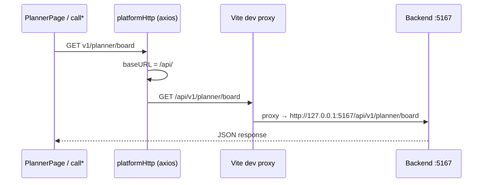

# Hướng dẫn tích hợp & sử dụng API — HTTP thật & giả lập (Sample)

> **App mẫu:** `Sample/clients/web` · **Kit:** `@platform/core` (`frameworks/frontend`)

Mọi feature trong kit gọi backend qua **axios instance dùng chung**. Host app cấu hình `baseURL` một lần; các service `call*` trong kit chỉ cần path tương đối `v1/...`.

---

## 1. Phương án chính — Gọi API HTTP thật

Đây là cách tích hợp **production** và cách chạy Sample khi đã có backend (.NET Sample hoặc API riêng).

### 1.1 Luồng request



- FE luôn gọi **same-origin** `/api/...` (tránh CORS khi dev).
- Vite **proxy** chuyển tiếp sang BE thật.
- Kit không biết URL BE — host app quyết định qua env + proxy.

### 1.2 Bootstrap HTTP (bắt buộc, một lần)

```ts
// Sample/clients/web/src/constants/index.ts
import { configurePlatformHttp } from '@platform/core'

export function configureSampleHttp() {
  configurePlatformHttp({
    baseURL: import.meta.env.VITE_API_URL,       // '/api/'
    apiKey: import.meta.env.VITE_API_KEY,
    apiKeyHeader: import.meta.env.VITE_API_KEY_NAME,
  })
}
```

```tsx
// Sample/clients/web/src/main.tsx
import { configureSampleHttp } from './constants'

configureSampleHttp() // trước createRoot(...)
```

`configurePlatformHttp` gán `baseURL`, header API key (nếu có), và `withCredentials: true` cho mọi `call*`.

### 1.3 Biến môi trường — API thật

```env
# Sample/clients/web/.env.development
VITE_API_URL=/api/
VITE_USE_MOCK=false
VITE_API_PROXY_TARGET=http://127.0.0.1:5167

# Tuỳ chọn — nếu BE yêu cầu API key
# VITE_API_KEY=your-key
# VITE_API_KEY_NAME=X-Api-Key
```

| Biến | Vai trò |
|------|---------|
| `VITE_API_URL` | Base axios. Sample dùng `/api/` (same-origin). Production có thể `https://api.company.com/` |
| `VITE_API_PROXY_TARGET` | BE dev khi chạy `vite` — proxy `/api` → target này |
| `VITE_USE_MOCK` | `false` → **tắt** Vite mock middleware (Planner/Timesheet), mọi request đi qua proxy sang BE |

### 1.4 Vite proxy (Sample)

```ts
// Sample/clients/web/vite.config.ts
server: {
  proxy: {
    '/api': {
      target: env.VITE_API_PROXY_TARGET ?? 'http://127.0.0.1:5167',
      changeOrigin: true,
      secure: false,
    },
  },
},
```

Khi `VITE_USE_MOCK=false`, **không** có middleware chặn request — axios gọi thẳng BE qua proxy.

### 1.5 Chạy dev với BE thật

```bash
# Terminal 1 — Sample backend
cd Sample
dotnet run
# Lắng nghe http://localhost:5167

# Terminal 2 — Frontend
cd Sample/clients/web
npm run dev
# FE: http://127.0.0.1:5173
```

Kiểm tra: mở DevTools → Network → request `XHR` tới `/api/v1/...` phải trả JSON từ BE (status 200), không phải từ middleware mock.

### 1.6 Dùng service `call*` (mặc định của kit)

Page kit **tự gọi** service axios khi host không override `callback`:

```tsx
import { PlannerPage, PLANNER_ROUTES, configurePlannerNavigate } from '@platform/core'

// Không truyền callback → PlannerPage gọi callGetPlannerBoard, callCreatePlannerItem, ...
<Route path={PLANNER_ROUTES.page} element={<PlannerPage locale="vi" />} />
```

Ví dụ service (kit):

```ts
// frameworks/frontend/src/features/planner/services/planner.ts
export const callGetPlannerBoard = async (query?: PlannerBoardQuery) => {
  return await instance.get<PlannerBoardResult>('v1/planner/board', { params: ... })
}
```

URL thực tế: `{baseURL}v1/planner/board` → `/api/v1/planner/board`.

### 1.7 Auth — Bearer token (Sample)

Account API cần JWT sau login. Sample gắn interceptor **ở host app** (không nằm trong kit):

```ts
// Sample/clients/web/src/auth/setupAccountAuth.ts
import { accountHttp } from '@platform/core'

accountHttp.interceptors.request.use((config) => {
  const token = getAccessToken()
  if (token) config.headers.Authorization = `Bearer ${token}`
  return config
})
```

Gọi `setupSampleAccountAuth()` trong `main.tsx` cùng lúc với `configureSampleHttp()`.

Login qua BE:

```tsx
import { callLogin } from '@platform/core'

<LoginPage
  callback={{
    onSubmit: async (payload) => {
      const response = await callLogin(payload)
      const token = extractAccessToken(response) // host parse theo contract BE
      setAccessToken(token)
      return response.data
    },
  }}
/>
```

Xem chi tiết endpoint Account: [integration-and-usage.md](../src/features/account/docs/integration-and-usage.md).

### 1.8 Override API qua `callback` (tuỳ chọn)

Khi contract BE khác kit, hoặc cần bọc thêm logic:

```tsx
<PlannerPage
  callback={{
    list: { onSubmit: (query) => callGetPlannerBoard(query) },
    create: { onSubmit: (data) => callCreatePlannerItem(data) },
  }}
/>
```

Pattern giống mọi feature: `callback.<action>.onSubmit`.

### 1.9 Production build

Production **không** dùng Vite proxy. Cấu hình một trong hai:

**A — API cùng origin (ASP.NET serve wwwroot + API):**

```env
VITE_API_URL=/api/
```

**B — API domain riêng:**

```env
VITE_API_URL=https://api.company.com/
```

Cần CORS trên BE nếu FE và API khác origin. Sample build ra `Sample/wwwroot` — thường dùng phương án A.

---

## 2. Phương án thay thế — Giả lập API (dev / demo)

Dùng khi **chưa có BE** hoặc cần demo UI nhanh. Sample mặc định bật mock cho Planner và Timesheet.

### 2.1 Bật mock (Sample)

```env
# Sample/clients/web/.env.development
VITE_API_URL=/api/
VITE_USE_MOCK=true
```

Vite plugin đăng ký **middleware** (không dùng MSW Service Worker — tránh treo DevTools Network):

| Plugin | Path intercept | Seed JSON |
|--------|----------------|-----------|
| `vite.plugins/plannerApiMock.ts` | `/api/v1/planner/*` | `features/planner/mocks/get-board.json` |
| `vite.plugins/timesheetApiMock.ts` | `/api/v1/timesheet/*` | `features/timesheet/mocks/get-board.json`, `get-options.json` |

Middleware chạy **trước** proxy — request Planner/Timesheet không tới BE dù BE đang chạy.

```ts
// vite.config.ts — plugin chỉ bật khi VITE_USE_MOCK ≠ 'false'
const useMock = String(env.VITE_USE_MOCK ?? 'true').toLowerCase() !== 'false'

plannerApiMockPlugin({ boardJsonPath: plannerBoardMockJson, enabled: useMock }),
timesheetApiMockPlugin({ boardJsonPath: ..., optionsJsonPath: ..., enabled: useMock }),
```

Axios vẫn gọi HTTP bình thường → Network tab hiện XHR `/api/v1/planner/board` — chỉ khác là response do middleware trả về.

### 2.2 Login mock (Account — Sample)

Riêng Account, Sample có **tài khoản demo** không cần BE:

```ts
// Sample/clients/web/src/constants/index.ts
// Email: admin@gmail.com / Password: Admin@123
export const MOCK_ACCOUNT = { ... }
```

```tsx
// Sample/clients/web/src/App.tsx — GuestLoginPage
if (isMockAccountCredentials(payload)) {
  return mockLogin(payload) // không gọi HTTP
}
const response = await callLogin(payload) // API thật
```

Đây là **hybrid**: demo nhanh bằng mock account, user thật vẫn qua `callLogin` → BE.

### 2.3 Mock in-memory / localStorage (feature khác)

Một số feature **chưa nối BE mặc định** — dữ liệu giả trong FE:

| Feature | Cơ chế mock | Chuyển sang HTTP |
|---------|-------------|------------------|
| Role | `mockGetRoleList` in-memory | `callback.list.onSubmit` → `callGetRoleList` |
| File Manager | `mock*` in-memory | Override callback tương tự |
| Import | Service mock | Override `ImportPage` callback |
| Dynamic Form | `localStorage` (`dynamicFormStore`) | Implement `call*` trong services |
| Dashboard | Fallback fake khi API lỗi/rỗng | BE implement `GET v1/dashboard/charts` |
| Craft PDF | Memory khi chưa set baseURL riêng | `configureCraftPdfHttp` + BE |

Seed JSON tham chiếu contract: `frameworks/frontend/src/features/<feature>/mocks/*.json`.

### 2.4 Khi nào dùng phương án nào?

| Tình huống | Khuyến nghị |
|------------|-------------|
| Tích hợp production / QA với BE | **HTTP thật** — `VITE_USE_MOCK=false`, proxy hoặc URL production |
| Dev UI Planner/Timesheet chưa có API | **Vite mock** — `VITE_USE_MOCK=true` |
| Demo login không cần BE | **mockLogin** (Sample) — vẫn giữ `callLogin` cho user thật |
| Feature chưa có endpoint BE | Mock in-memory / localStorage + `callback` override |

---

## 3. Bảng endpoint theo feature

Contract REST chuẩn kit (prefix `v1/` tương đối `VITE_API_URL`):

| Feature | Service ví dụ | Method | Path |
|---------|---------------|--------|------|
| Account | `callLogin` | POST | `v1/account/login` |
| Account | `callGetCurrentUser` | GET | `v1/account/current` |
| Tenant | `callGetTenantList` | GET | `v1/tenants` |
| Planner | `callGetPlannerBoard` | GET | `v1/planner/board` |
| Planner | `callCreatePlannerItem` | POST | `v1/planner/items` |
| Timesheet | `callGetTimesheetBoard` | GET | `v1/timesheet/board` |
| Timesheet | `callSaveTimesheet` | POST | `v1/timesheet/save` |
| Role | `callGetRoleList` | GET | `v1/roles` |
| Dashboard | `callGetDashboardChartCatalog` | GET | `v1/dashboard/charts` |

Chi tiết từng feature: xem tài liệu riêng trong [README.md](./README.md).

---

## 4. Checklist tích hợp Sample

### API thật (khuyến nghị)

- [ ] `configureSampleHttp()` gọi trong `main.tsx`
- [ ] `setupSampleAccountAuth()` nếu dùng Account JWT
- [ ] `.env`: `VITE_USE_MOCK=false`, `VITE_API_PROXY_TARGET` trỏ BE
- [ ] BE chạy (`dotnet run` trong `Sample/`)
- [ ] Vite proxy `/api` → BE (đã có sẵn trong `vite.config.ts`)
- [ ] Mount page + NavigateBridge (xem [integration-and-usage.md](./integration-and-usage.md))
- [ ] Network tab: `/api/v1/...` trả data từ BE

### Demo mock (tuỳ chọn)

- [ ] `VITE_USE_MOCK=true` cho Planner/Timesheet
- [ ] Login demo: `admin@gmail.com` / `Admin@123` (không cần BE)
- [ ] Role / File Manager / Import: chấp nhận mock in-memory hoặc override callback

---

## 5. Xử lý lỗi

Kit axios normalize lỗi:

```ts
// response interceptor → reject { Status, Message }
```

Page kit hiển thị toast qua `notify.error(getErrorMessage(err))`. Host app có thể bắt thêm trong `callback.onError`.

---

## 6. Tài liệu liên quan

| Nội dung | File |
|----------|------|
| Quy trình tích hợp feature | [integration-and-usage.md](./integration-and-usage.md) |
| Account + JWT | [integration-and-usage.md](../src/features/account/docs/integration-and-usage.md) |
| Planner endpoints | [integration-and-usage.md](../src/features/planner/docs/integration-and-usage.md) |
| Timesheet endpoints | [integration-and-usage.md](../src/features/timesheet/docs/integration-and-usage.md) |
| Sample App routes | `Sample/clients/web/src/App.tsx` |
| HTTP bootstrap Sample | `Sample/clients/web/src/constants/index.ts` |
| Vite mock plugins | `Sample/clients/web/vite.plugins/` |
