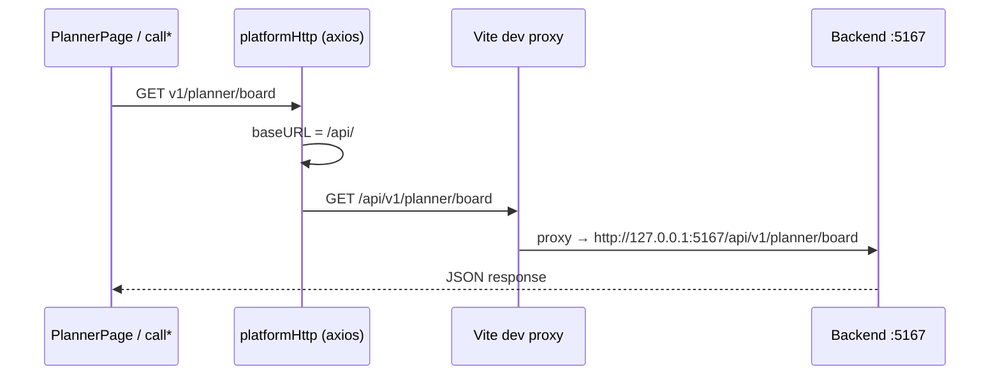
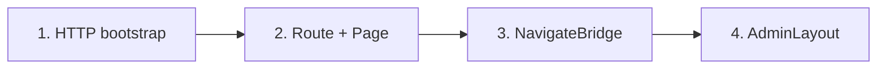

# Hướng dẫn tích hợp & sử dụng feature FE (`@platform/core`)

> **Package:** `@platform/core` · **Source:** `frameworks/frontend` · **App mẫu:** `Sample/clients/web`  
> Tài liệu dành cho dev tích hợp kit vào app host. **Đọc mục 5 trước** — quy trình chung áp dụng cho mọi feature; các mục trước là cài đặt, cấu hình host, gọi API; các mục sau là menu, Sample, và tùy biến.

Để biết **chuẩn cấu trúc folder bên trong kit**, xem thêm [SAD-fe-module-structure.md](./SAD-fe-module-structure.md).

---

## 1. `@platform/core` là gì?

`@platform/core` là **thư viện UI + feature pages** React — không phải app chạy độc lập. App host (ví dụ `Sample/clients/web`) chịu trách nhiệm:


| Host app                    | Kit (`@platform/core`)                 |
| --------------------------- | -------------------------------------- |
| Env (API URL, API key)      | Pages, form, table, layout             |
| Router (`react-router-dom`) | Constants route + `configure*Navigate` |
| Compose routes + menu       | Gọi API qua `call`* services           |
| Tailwind scan + import CSS  | PrimeReact theme, Toaster, helpers     |


Import mọi thứ qua một entry:

```ts
import {
  AdminLayout,
  TenantListPage,
  configurePlatformHttp,
  TENANT_ROUTES,
} from '@platform/core'
```

---

## 2. Cài đặt

### 2.1 Trong monorepo (dev local)

**Bước 1 — Build kit lần đầu**

```bash
cd frameworks/frontend
npm install
npm run build
```

**Bước 2 — Cài vào app host**

Cách A — dùng CLI (khuyến nghị):

```bash
cd Sample/clients/web   # hoặc thư mục app host của bạn
npm install file:../../../frameworks/frontend
```

> Điều chỉnh path `file:` theo vị trí app so với `frameworks/frontend`.  
> Ví dụ Sample: `Sample/clients/web` → `../../../frameworks/frontend`.

Cách B — sửa `package.json` rồi install:

```json
{
  "dependencies": {
    "@platform/core": "file:../../../frameworks/frontend"
  }
}
```

```bash
npm install
```

**Bước 3 — Cài peer dependencies**

Xem mục **2.2** — app host phải có đủ peer trước khi chạy dev.

**Bước 4 — Sau khi sửa kit**

```bash
cd frameworks/frontend
npm run build
```

Rồi **restart** `npm run dev` ở app host.

**Lưu ý:**

- Chưa build kit → import `@platform/core` lỗi hoặc thiếu `dist/`.
- Link `file:` + Vite → cần cấu hình dedupe (mục **3.5**).
- Tham chiếu đầy đủ: `Sample/clients/web/package.json`.

### 2.2 Peer dependencies bắt buộc

App host phải cài đủ peer (xem `frameworks/frontend/package.json`). Tối thiểu:

```bash
npm i react react-dom react-router-dom primereact @primereact/core @primeuix/themes
npm i axios zod react-hook-form @hookform/resolvers lucide-react react-toastify tailwindcss
```

Một số module cần thêm peer khi dùng:


| Module                          | Peer thêm                                       |
| ------------------------------- | ----------------------------------------------- |
| CraftPdf                        | `react-rnd`, `react-pdf`, `pdfjs-dist`, `quill` |
| Dashboard                       | `gridstack`, `chart.js`, `react-chartjs-2`      |
| QueryBuilder (trong TenantList) | `react-querybuilder`, `@react-querybuilder/dnd` |


Sample đã khai báo đủ trong `Sample/clients/web/package.json`.

---

## 3. Cấu hình app host

Luồng khởi tạo chuẩn (tham chiếu `Sample/clients/web`).

### 3.1 Biến môi trường

Tạo file `.env` trong app host (ví dụ):

```env
VITE_API_URL=/api/
VITE_API_KEY=your-api-key
VITE_API_KEY_NAME=X-Api-Key
VITE_API_PROXY_TARGET=http://localhost:5167
```

- `VITE_API_URL`: base URL axios (Sample dùng `/api/` + Vite proxy).
- `VITE_API_PROXY_TARGET`: BE dev khi chạy `vite` (tránh CORS).

### 3.2 Cấu hình HTTP (một lần lúc startup)

```ts
// Sample/clients/web/src/constants/index.ts
import { configurePlatformHttp } from '@platform/core'

export function configureSampleHttp() {
  configurePlatformHttp({
    baseURL: import.meta.env.VITE_API_URL,
    apiKey: import.meta.env.VITE_API_KEY,
    apiKeyHeader: import.meta.env.VITE_API_KEY_NAME,
  })
}
```

Gọi trong `main.tsx` **trước** render:

```tsx
import { configureSampleHttp } from './constants'
configureSampleHttp()
```

Mọi feature dùng chung axios instance (`platformHttp` / `call*`). Không cần `configureTenantHttp` riêng (deprecated). Chi tiết HTTP thật, mock, endpoint — xem **mục 4**.

**Hướng dẫn đầy đủ gọi API:** [api-integration-and-usage.md](./api-integration-and-usage.md) — phương án chính (HTTP → BE thật) và phương án giả lập (Vite mock / in-memory trong Sample).

### 3.2.1 API HTTP thật vs giả lập (Sample)

| Mục đích | Cấu hình |
|----------|----------|
| **Production / QA với BE** | `VITE_USE_MOCK=false`, chạy `dotnet run` trong `Sample/`, proxy `/api` → `:5167` |
| **Demo UI không cần BE** | `VITE_USE_MOCK=true` — Planner/Timesheet dùng Vite middleware mock |
| **Login demo nhanh** | Tài khoản `admin@gmail.com` / `Admin@123` → `mockLogin` (Sample); user khác vẫn `callLogin` |

Luồng HTTP thật:

```
PlannerPage → callGetPlannerBoard → axios baseURL /api/
  → GET /api/v1/planner/board → Vite proxy → http://127.0.0.1:5167
```

Luồng giả lập (Planner/Timesheet):

```
call* → axios GET /api/v1/planner/board → Vite middleware mock → JSON seed
(middleware chạy trước proxy — request không tới BE)
```

### 3.3 PrimeReact + Router + Toast

```tsx
// Sample/clients/web/src/main.tsx
import { StrictMode } from 'react'
import { createRoot } from 'react-dom/client'
import { BrowserRouter } from 'react-router-dom'
import { PrimeReactProvider } from '@primereact/core'
import { kitPrimeReactConfig, Toaster } from '@platform/core'
import App from './App'

createRoot(document.getElementById('root')!).render(
  <StrictMode>
    <BrowserRouter>
      <PrimeReactProvider {...kitPrimeReactConfig}>
        <App />
        <Toaster />
      </PrimeReactProvider>
    </BrowserRouter>
  </StrictMode>,
)
```

### 3.4 Tailwind + CSS kit

```css
/* Sample/clients/web/src/index.css */
@layer theme, base, primereact, utilities;

@import "tailwindcss/theme.css" layer(theme);
@import "tailwindcss/utilities.css" layer(utilities);

/* Dev monorepo: scan source kit trực tiếp */
@source "../../../../frameworks/frontend/src";
@source "./";

@import "@platform/core/theme.css";
@import "@platform/core/styles.css";
@import "@platform/core/dashboard.css";
```

**Lưu ý:** Thiếu `@source` / thiếu import CSS → UI trắng, thiếu token màu.

### 3.5 Vite (local link)

Khi link `file:…/frameworks/frontend`, cần dedupe React/Prime để tránh *Invalid hook call*:

```ts
// Sample/clients/web/vite.config.ts — resolve.dedupe + alias react, @primereact/core
// proxy '/api' → BE dev
```

CraftPdf / `react-rnd` có thể cần:

```ts
define: {
  'process.env.DRAGGABLE_DEBUG': 'undefined',
}
```

---

## 4. Gọi API — HTTP thật & giả lập

Mọi feature trong kit gọi backend qua **axios instance dùng chung**. Host app cấu hình `baseURL` một lần (mục 3.2); các service `call*` trong kit chỉ cần path tương đối `v1/...`.

### 4.1 Phương án chính — Gọi API HTTP thật

Đây là cách tích hợp **production** và cách chạy Sample khi đã có backend (.NET Sample hoặc API riêng).

#### 4.1.1 Luồng request



- FE luôn gọi **same-origin** `/api/...` (tránh CORS khi dev).
- Vite **proxy** chuyển tiếp sang BE thật.
- Kit không biết URL BE — host app quyết định qua env + proxy.

#### 4.1.2 Biến môi trường — API thật

```env
# Sample/clients/web/.env.development
VITE_API_URL=/api/
VITE_USE_MOCK=false
VITE_API_PROXY_TARGET=http://127.0.0.1:5167

# Tuỳ chọn — nếu BE yêu cầu API key
# VITE_API_KEY=your-key
# VITE_API_KEY_NAME=X-Api-Key
```

| Biến | Vai trò |
|------|---------|
| `VITE_API_URL` | Base axios. Sample dùng `/api/` (same-origin). Production có thể `https://api.company.com/` |
| `VITE_API_PROXY_TARGET` | BE dev khi chạy `vite` — proxy `/api` → target này |
| `VITE_USE_MOCK` | `false` → **tắt** Vite mock middleware (Planner/Timesheet), mọi request đi qua proxy sang BE |

#### 4.1.3 Vite proxy (Sample)

```ts
// Sample/clients/web/vite.config.ts
server: {
  proxy: {
    '/api': {
      target: env.VITE_API_PROXY_TARGET ?? 'http://127.0.0.1:5167',
      changeOrigin: true,
      secure: false,
    },
  },
},
```

Khi `VITE_USE_MOCK=false`, **không** có middleware chặn request — axios gọi thẳng BE qua proxy.

#### 4.1.4 Chạy dev với BE thật

```bash
# Terminal 1 — Sample backend
cd Sample
dotnet run
# Lắng nghe http://localhost:5167

# Terminal 2 — Frontend
cd Sample/clients/web
npm run dev
# FE: http://127.0.0.1:5173
```

Kiểm tra: mở DevTools → Network → request `XHR` tới `/api/v1/...` phải trả JSON từ BE (status 200), không phải từ middleware mock.

#### 4.1.5 Dùng service `call*` (mặc định của kit)

Page kit **tự gọi** service axios khi host không override `callback`:

```tsx
import { PlannerPage, PLANNER_ROUTES, configurePlannerNavigate } from '@platform/core'

// Không truyền callback → PlannerPage gọi callGetPlannerBoard, callCreatePlannerItem, ...
<Route path={PLANNER_ROUTES.page} element={<PlannerPage locale="vi" />} />
```

Ví dụ service (kit):

```ts
// frameworks/frontend/src/features/planner/services/planner.ts
export const callGetPlannerBoard = async (query?: PlannerBoardQuery) => {
  return await instance.get<PlannerBoardResult>('v1/planner/board', { params: ... })
}
```

URL thực tế: `{baseURL}v1/planner/board` → `/api/v1/planner/board`.

#### 4.1.6 Auth — Bearer token (Sample)

Account API cần JWT sau login. Sample gắn interceptor **ở host app** (không nằm trong kit):

```ts
// Sample/clients/web/src/auth/setupAccountAuth.ts
import { accountHttp } from '@platform/core'

accountHttp.interceptors.request.use((config) => {
  const token = getAccessToken()
  if (token) config.headers.Authorization = `Bearer ${token}`
  return config
})
```

Gọi `setupSampleAccountAuth()` trong `main.tsx` cùng lúc với `configureSampleHttp()`.

Login qua BE:

```tsx
import { callLogin } from '@platform/core'

<LoginPage
  callback={{
    onSubmit: async (payload) => {
      const response = await callLogin(payload)
      const token = extractAccessToken(response) // host parse theo contract BE
      setAccessToken(token)
      return response.data
    },
  }}
/>
```

Xem chi tiết endpoint Account: [integration-and-usage.md](../src/features/account/docs/integration-and-usage.md).

#### 4.1.7 Override API qua `callback` (tuỳ chọn)

Khi contract BE khác kit, hoặc cần bọc thêm logic:

```tsx
<PlannerPage
  callback={{
    list: { onSubmit: (query) => callGetPlannerBoard(query) },
    create: { onSubmit: (data) => callCreatePlannerItem(data) },
  }}
/>
```

Pattern giống mọi feature: `callback.<action>.onSubmit`.

#### 4.1.8 Production build

Production **không** dùng Vite proxy. Cấu hình một trong hai:

**A — API cùng origin (ASP.NET serve wwwroot + API):**

```env
VITE_API_URL=/api/
```

**B — API domain riêng:**

```env
VITE_API_URL=https://api.company.com/
```

Cần CORS trên BE nếu FE và API khác origin. Sample build ra `Sample/wwwroot` — thường dùng phương án A.

### 4.2 Phương án thay thế — Giả lập API (dev / demo)

Dùng khi **chưa có BE** hoặc cần demo UI nhanh. Sample mặc định bật mock cho Planner và Timesheet.

#### 4.2.1 Bật mock (Sample)

```env
# Sample/clients/web/.env.development
VITE_API_URL=/api/
VITE_USE_MOCK=true
```

Vite plugin đăng ký **middleware** (không dùng MSW Service Worker — tránh treo DevTools Network):

| Plugin | Path intercept | Seed JSON |
|--------|----------------|-----------|
| `vite.plugins/plannerApiMock.ts` | `/api/v1/planner/*` | `features/planner/mocks/get-board.json` |
| `vite.plugins/timesheetApiMock.ts` | `/api/v1/timesheet/*` | `features/timesheet/mocks/get-board.json`, `get-options.json` |

Middleware chạy **trước** proxy — request Planner/Timesheet không tới BE dù BE đang chạy.

```ts
// vite.config.ts — plugin chỉ bật khi VITE_USE_MOCK ≠ 'false'
const useMock = String(env.VITE_USE_MOCK ?? 'true').toLowerCase() !== 'false'

plannerApiMockPlugin({ boardJsonPath: plannerBoardMockJson, enabled: useMock }),
timesheetApiMockPlugin({ boardJsonPath: ..., optionsJsonPath: ..., enabled: useMock }),
```

Axios vẫn gọi HTTP bình thường → Network tab hiện XHR `/api/v1/planner/board` — chỉ khác là response do middleware trả về.

#### 4.2.2 Login mock (Account — Sample)

Riêng Account, Sample có **tài khoản demo** không cần BE:

```ts
// Sample/clients/web/src/constants/index.ts
// Email: admin@gmail.com / Password: Admin@123
export const MOCK_ACCOUNT = { ... }
```

```tsx
// Sample/clients/web/src/App.tsx — GuestLoginPage
if (isMockAccountCredentials(payload)) {
  return mockLogin(payload) // không gọi HTTP
}
const response = await callLogin(payload) // API thật
```

Đây là **hybrid**: demo nhanh bằng mock account, user thật vẫn qua `callLogin` → BE.

#### 4.2.3 Mock in-memory / localStorage (feature khác)

Một số feature **chưa nối BE mặc định** — dữ liệu giả trong FE:

| Feature | Cơ chế mock | Chuyển sang HTTP |
|---------|-------------|------------------|
| Role | `mockGetRoleList` in-memory | `callback.list.onSubmit` → `callGetRoleList` |
| File Manager | `mock*` in-memory | Override callback tương tự |
| Import | Service mock | Override `ImportPage` callback |
| Dynamic Form | `localStorage` (`dynamicFormStore`) | Implement `call*` trong services |
| Dashboard | Fallback fake khi API lỗi/rỗng | BE implement `GET v1/dashboard/charts` |
| Craft PDF | Memory khi chưa set baseURL riêng | `configureCraftPdfHttp` + BE |

Seed JSON tham chiếu contract: `frameworks/frontend/src/features/<feature>/mocks/*.json`.

#### 4.2.4 Khi nào dùng phương án nào?

| Tình huống | Khuyến nghị |
|------------|-------------|
| Tích hợp production / QA với BE | **HTTP thật** — `VITE_USE_MOCK=false`, proxy hoặc URL production |
| Dev UI Planner/Timesheet chưa có API | **Vite mock** — `VITE_USE_MOCK=true` |
| Demo login không cần BE | **mockLogin** (Sample) — vẫn giữ `callLogin` cho user thật |
| Feature chưa có endpoint BE | Mock in-memory / localStorage + `callback` override |

### 4.3 Bảng endpoint theo feature

Contract REST chuẩn kit (prefix `v1/` tương đối `VITE_API_URL`):

| Feature | Service ví dụ | Method | Path |
|---------|---------------|--------|------|
| Account | `callLogin` | POST | `v1/account/login` |
| Account | `callGetCurrentUser` | GET | `v1/account/current` |
| Tenant | `callGetTenantList` | GET | `v1/tenants` |
| Planner | `callGetPlannerBoard` | GET | `v1/planner/board` |
| Planner | `callCreatePlannerItem` | POST | `v1/planner/items` |
| Timesheet | `callGetTimesheetBoard` | GET | `v1/timesheet/board` |
| Timesheet | `callSaveTimesheet` | POST | `v1/timesheet/save` |
| Role | `callGetRoleList` | GET | `v1/roles` |
| Dashboard | `callGetDashboardChartCatalog` | GET | `v1/dashboard/charts` |

Chi tiết từng feature: xem tài liệu riêng trong [README.md](./README.md).

### 4.4 Checklist tích hợp API (Sample)

**API thật (khuyến nghị):**

- [ ] `configureSampleHttp()` gọi trong `main.tsx`
- [ ] `setupSampleAccountAuth()` nếu dùng Account JWT
- [ ] `.env`: `VITE_USE_MOCK=false`, `VITE_API_PROXY_TARGET` trỏ BE
- [ ] BE chạy (`dotnet run` trong `Sample/`)
- [ ] Vite proxy `/api` → BE (đã có sẵn trong `vite.config.ts`)
- [ ] Mount page + NavigateBridge (xem mục 5)
- [ ] Network tab: `/api/v1/...` trả data từ BE

**Demo mock (tuỳ chọn):**

- [ ] `VITE_USE_MOCK=true` cho Planner/Timesheet
- [ ] Login demo: `admin@gmail.com` / `Admin@123` (không cần BE)
- [ ] Role / File Manager / Import: chấp nhận mock in-memory hoặc override callback

### 4.5 Xử lý lỗi

Kit axios normalize lỗi:

```ts
// response interceptor → reject { Status, Message }
```

Page kit hiển thị toast qua `notify.error(getErrorMessage(err))`. Host app có thể bắt thêm trong `callback.onError`.

---

## 5. Cách sử dụng, tích hợp feature (quy trình chung)

Mọi feature trong kit (`tenant`, `role`, `craftPdf`, …) đều export theo **cùng một quy ước tên**. Host app không cần đọc source từng module — chỉ cần biết pattern dưới đây.

### 5.1 Bảng export — đọc tên là biết việc

Thay `{Feature}` bằng prefix thực tế (Tenant → `TENANT_`, `TenantListPage`, `configureTenantNavigate`, …):


| Export trong `@platform/core` | Dùng để làm gì                          | Ví dụ (tenant)                     |
| ----------------------------- | --------------------------------------- | ---------------------------------- |
| `{Feature}*Page`              | Màn hình mount vào `<Route>`            | `TenantListPage`                   |
| `{FEATURE}_ROUTES`            | Path cố định, không hard-code string    | `TENANT_ROUTES.list` → `/tenants`  |
| `get{Feature}*Path(id?)`      | Path có `:id`                           | `getTenantDetailPath('abc')`       |
| `configure{Feature}Navigate`  | Inject `navigate` từ host               | `configureTenantNavigate`          |
| `navigate{Feature}`           | Điều hướng trong page kit               | `navigateTenant('list')`           |
| `call`*                       | Gọi API (axios chung)                   | `callGetTenantList`                |
| `{feature}MenuItems`          | Metadata menu (path, label, permission) | `tenantMenuItems`                  |
| `get{Feature}Messages`        | Text UI `vi` / `en`                     | `getTenantMessages('vi')`          |
| `{FEATURE}_PERMISSIONS`       | Key quyền                               | `TENANT_PERMISSIONS.tenantView`    |
| `has{Feature}Permission`      | Kiểm tra quyền                          | `hasTenantPermission(grants, key)` |


Tra cứu đầy đủ: gõ tên feature trong autocomplete import từ `@platform/core`, hoặc mở `frameworks/frontend/src/index.ts`.

### 5.2 Bốn bước tích hợp tối thiểu




**Bước 1 — HTTP (một lần cho cả app)**  
Đã làm ở mục 3: `configurePlatformHttp`. Mọi `call`* của mọi feature dùng chung instance này.

**Bước 2 — Khai báo route + mount page**

```tsx
import {
  TENANT_ROUTES,
  TenantListPage,
  TenantFormPage,
} from '@platform/core'

<Route element={<AdminLayout />}>
  <Route path={TENANT_ROUTES.list} element={<TenantListPage />} />
  <Route
    path={TENANT_ROUTES.create}
    element={<TenantFormPage mode="create" />}
  />
</Route>
```

Quy tắc:

- Luôn dùng `*_ROUTES` / `get*Path` — path trong kit và menu mặc định phải khớp nhau.
- Route có `:id` → bọc wrapper đọc `useParams()`, truyền prop (`tenantId`, `templateId`, …).

**Bước 3 — NavigateBridge (nếu feature có `configure*Navigate`)**

Page kit gọi `navigateTenant(...)` bên trong (nút Tạo, Sau khi lưu, …). Kit **không** import `react-router` cứng — host inject:

```tsx
import { useEffect } from 'react'
import { useNavigate } from 'react-router-dom'
import { configureTenantNavigate } from '@platform/core'

function TenantNavigateBridge() {
  const navigate = useNavigate()
  useEffect(() => {
    configureTenantNavigate((to) => navigate(to))
  }, [navigate])
  return null
}

// Trong App — đặt cùng cấp <Routes>, trước hoặc trong fragment:
<>
  <TenantNavigateBridge />
  <Routes>...</Routes>
</>
```


| Feature                | Cần bridge?                                   |
| ---------------------- | --------------------------------------------- |
| Tenant, CraftPdf, Role | Có — `configure*Navigate`                     |
| Account                | Không — dùng `Link` / `useNavigate` trực tiếp |
| Dashboard              | Không                                         |


Mỗi feature dùng bridge → thêm một component tương tự (Sample: `TenantNavigateBridge`, `CraftPdfNavigateBridge`, `RoleNavigateBridge`).

**Bước 4 — Chọn layout**


| Loại page                             | Gợi ý                                         |
| ------------------------------------- | --------------------------------------------- |
| List / form / detail trong admin      | Child của `<Route element={<AdminLayout />}>` |
| Login / register / editor full-screen | Route **ngoài** `AdminLayout`                 |


Sample: auth + CraftPdf editor ngoài layout; tenant, dashboard, role trong layout.

### 5.3 Mẫu tích hợp tối thiểu (copy & đổi tên feature)

```tsx
// App.tsx — pattern chung cho feature "X"
import { useEffect } from 'react'
import { Route, Routes, useNavigate, useParams } from 'react-router-dom'
import {
  AdminLayout,
  XListPage,
  XFormPage,
  X_ROUTES,
  configureXNavigate,
} from '@platform/core'

function XNavigateBridge() {
  const navigate = useNavigate()
  useEffect(() => {
    configureXNavigate((to) => navigate(to))
  }, [navigate])
  return null
}

function XEditRoute() {
  const { id = '' } = useParams()
  return <XFormPage mode="edit" xId={id} />
}

export default function App() {
  return (
    <>
      <XNavigateBridge />
      <Routes>
        <Route element={<AdminLayout />}>
          <Route path={X_ROUTES.list} element={<XListPage />} />
          <Route path={X_ROUTES.create} element={<XFormPage mode="create" />} />
          <Route path={X_ROUTES.edit} element={<XEditRoute />} />
        </Route>
      </Routes>
    </>
  )
}
```

### 5.4 Tùy chọn — không bắt buộc để chạy được


| Prop / API | Khi nào dùng |
|------------|--------------|
| `locale="vi" \| "en"` | Đổi ngôn ngữ UI |
| `callback` | Thay API / bọc logic (`before`, `onSubmit`, `success`, `error`, `complete`) |
| `content` | Thay hoặc ghép UI — `ReactNode` hoặc `(ctx) => ReactNode` |
| `withShell={false}` | Bỏ layout page (AuthShell, PageShell) — host tự bọc |
| `items` / `logs` / `columns` + … | Controlled mode — host tự fetch, page không gọi API |
| `defaultValues` / props id | Prefill form, route detail |
| `headerActions`, `title`, `logo` | Tuỳ biến header / auth shell |

Chi tiết theo feature: mục **Tùy biến** trong [integration-and-usage.md](../src/features/account/docs/integration-and-usage.md), [integration-and-usage.md](../src/features/tenant/docs/integration-and-usage.md), [integration-and-usage.md](../src/features/planner/docs/integration-and-usage.md), …

Ví dụ override API:

```tsx
<TenantFormPage
  mode="create"
  callback={{
    onSubmit: async (data) => {
      const res = await callCreateTenant(data)
      return res.data
    },
  }}
/>
```

Ví dụ ghép UI (chèn banner, giữ bảng mặc định):

```tsx
<TenantListPage
  content={(ctx) => (
    <>
      <MyBanner total={ctx.total} />
      {ctx.DefaultToolbar}
      {ctx.DefaultTable}
      {ctx.DefaultPagination}
    </>
  )}
/>
```

Type `*PageProps` và `*PageContentContext` export kèm page — dùng khi viết slot `content`.

### 5.5 Checklist nhanh trước khi bàn giao

- `configurePlatformHttp` đã gọi ở bootstrap
- Route dùng `*_ROUTES`, không copy path tay
- `configure*Navigate` + bridge nếu page có nút điều hướng nội bộ
- Page nằm đúng trong / ngoài `AdminLayout`
- Menu sidebar trỏ đúng path (mặc định hoặc override — mục 6.2)
- Build kit + restart dev sau khi đổi `@platform/core`

---

## 6. Layout admin & menu

### 6.1 `AdminLayout`

Shell gồm `SideBar` + `Header` + `<Outlet />` cho child routes.

Sample **không override menu** — chỉ cần:

```tsx
<Route element={<AdminLayout />}>
  <Route path={TENANT_ROUTES.list} element={<TenantListPage />} />
  <Route path={ROLE_ROUTES.list} element={<RoleListPage locale="vi" />} />
</Route>
```

Nav mặc định (`DEFAULT_ADMIN_MAIN_NAV`) — đã gồm các module kit hay dùng:


| id        | Label      | Path         |
| --------- | ---------- | ------------ |
| dashboard | Tổng quan  | `/dashboard` |
| users     | Người dùng | `/users`     |
| templates | Biểu mẫu   | `/templates` |
| tenants   | Tenant     | `/tenants`   |
| documents | Tài liệu   | `/documents` |
| roles     | Vai trò    | `/roles`     |


Secondary (`DEFAULT_ADMIN_SECONDARY_NAV`): `/settings`, `/help`.

**Quan trọng:** Sidebar chỉ là link — page **chỉ hiện** khi host đã khai báo `<Route>` tương ứng. Menu có mục `/tenants` nhưng thiếu route → click vào sẽ trống hoặc 404.

### 6.2 Menu — mặc định và khi nào cần chỉnh

#### Dùng mặc định (đủ cho Sample và hầu hết demo)

```tsx
<Route element={<AdminLayout />}>
  {/* routes của bạn */}
</Route>
```

Không cần `mainNav` custom nếu app dùng đúng path chuẩn của kit và chấp nhận menu demo (kể cả placeholder `/users`, `/templates`).

#### Override khi app production cần khác demo

Truyền `mainNav` / `secondaryNav` vào `AdminLayout`:

```tsx
import { Building2, LayoutDashboard, Shield } from 'lucide-react'
import {
  AdminLayout,
  TENANT_ROUTES,
  ROLE_ROUTES,
  type AdminNavItem,
} from '@platform/core'

const mainNav: AdminNavItem[] = [
  { id: 'home', label: 'Trang chủ', icon: LayoutDashboard, path: '/dashboard' },
  { id: 'tenants', label: 'Khách hàng', icon: Building2, path: TENANT_ROUTES.list },
  { id: 'roles', label: 'Phân quyền', icon: Shield, path: ROLE_ROUTES.list },
]

<AdminLayout mainNav={mainNav} secondaryNav={[]} />
```

Các trường hợp thường override:

- Ẩn module không dùng (bỏ `users`, `templates`, …)
- Đổi label / icon / thứ tự
- App có route riêng, không trùng `DEFAULT_ADMIN_MAIN_NAV`

#### Gắn menu theo quyền (`*MenuItems`)

Mỗi feature export `{feature}MenuItems`: `{ path, label, permission }`. Map sang `AdminNavItem` và lọc theo grants user:

```tsx
import {
  tenantMenuItems,
  roleMenuItems,
  hasTenantPermission,
  hasRolePermission,
  type AdminNavItem,
} from '@platform/core'
import { Building2, LayoutDashboard, Shield } from 'lucide-react'

const ICONS: Record<string, AdminNavItem['icon']> = {
  '/tenants': Building2,
  '/roles': Shield,
}

function hasMenuPermission(grants: string[], permission: string, path: string) {
  if (path.startsWith('/tenants')) return hasTenantPermission(grants, permission)
  if (path.startsWith('/roles')) return hasRolePermission(grants, permission)
  return true
}

function buildMainNav(grants: string[]): AdminNavItem[] {
  return [...tenantMenuItems, ...roleMenuItems]
    .filter((item) => hasMenuPermission(grants, item.permission, item.path))
    .map((item) => ({
      id: item.path,
      label: item.label,
      path: item.path,
      icon: ICONS[item.path] ?? LayoutDashboard,
    }))
}

<AdminLayout mainNav={buildMainNav(userGrants)} />
```

Icon không nằm trong `*MenuItems` — host chọn icon (lucide-react) khi map.

---

## 7. `Sample/clients/web` — sơ đồ tích hợp đầy đủ

```
Sample/clients/web/
├── src/
│   ├── main.tsx          # PrimeReact + Router + Toaster + configureSampleHttp
│   ├── index.css         # Tailwind @source kit + import CSS
│   ├── constants/        # configurePlatformHttp từ VITE_*
│   └── App.tsx           # Routes + NavigateBridge + AdminLayout
├── vite.config.ts        # dedupe, proxy /api, build → Sample/wwwroot
└── package.json          # @platform/core file:../../../frameworks/frontend
```

**Luồng route trong `App.tsx`:**


| Nhóm                  | Routes                                                              |
| --------------------- | ------------------------------------------------------------------- |
| Auth (no layout)      | `/login`, `/register`, `/forgot-password`                           |
| CraftPdf (no layout)  | `/craft-pdf`, `/craft-pdf/:id/editor`                               |
| Admin (`AdminLayout`) | `/`, `/dashboard`, `/tenants/`*, `/profile`, `/roles`, placeholders |


Placeholders (`users`, `templates`, …) là `<PlaceholderPage />` — thay bằng page module thật khi có.

<<<<<<<< HEAD:frameworks/frontend/docs/integration-and-usage.md
**Chạy dev (API thật — khuyến nghị):**

```bash
# Terminal 1 — BE
cd Sample && dotnet run

# Terminal 2 — FE
cd Sample/clients/web && npm install && npm run dev
```

`.env.development`:

```env
VITE_API_URL=/api/
VITE_USE_MOCK=false
VITE_API_PROXY_TARGET=http://127.0.0.1:5167
```

FE: `http://127.0.0.1:5173` · API qua proxy `/api` → BE `:5167`.

**Chạy dev (demo mock — không cần BE cho Planner/Timesheet):**

```env
VITE_USE_MOCK=true
```

Chỉ cần `npm run dev` — Planner/Timesheet dùng Vite middleware mock. Account demo: `admin@gmail.com` / `Admin@123`.

Xem chi tiết: [api-integration-and-usage.md](./api-integration-and-usage.md).
========
**Chạy dev:** xem **mục 4.1.4** (API thật) và **mục 4.2.1** (demo mock Planner/Timesheet).
>>>>>>>> 536d280 (feat: dynamic form):frameworks/frontend/docs/DOCS-integration-and-usage.md

---

## 8. Tùy biến nâng cao (không fork kit)

Pattern chung — chi tiết theo feature xem mục **Tùy biến** trong tài liệu từng module.

<<<<<<<< HEAD:frameworks/frontend/docs/integration-and-usage.md
### 7.1 Slot `content` — tùy biến giao diện
========
### 8.1 Slot `content` — tùy biến giao diện
>>>>>>>> 536d280 (feat: dynamic form):frameworks/frontend/docs/DOCS-integration-and-usage.md

`content` là `ReactNode` **hoặc** `(ctx) => ReactNode`. Context (`*PageContentContext`) expose data, handlers, và `Default*` (toolbar, table, form, …).

```tsx
<TenantListPage
  content={(ctx) => (
    <>
      {ctx.DefaultToolbar}
      <ExportButton items={ctx.items} />
      {ctx.DefaultTable}
      {ctx.DefaultPagination}
    </>
  )}
/>
```

Thay toàn bộ form login, giữ validate + submit:

```tsx
<LoginPage
  content={(ctx) => (
    <form onSubmit={ctx.submit}>
      {ctx.DefaultContent}
    </form>
  )}
/>
```

`withShell={false}` — bỏ layout page, chỉ render `content`.

<<<<<<<< HEAD:frameworks/frontend/docs/integration-and-usage.md
### 7.2 Action callback — tùy biến logic
========
### 8.2 Action callback — tùy biến logic
>>>>>>>> 536d280 (feat: dynamic form):frameworks/frontend/docs/DOCS-integration-and-usage.md

Luồng: `before` → `onSubmit` → side-effect page → `success` → `complete`.

```tsx
<TenantFormPage
  mode="create"
  callback={{
    before: async () => {
      if (!canCreate) return false
    },
    onSubmit: async (data) => {
      const res = await callCreateTenant(data)
      return res.data
    },
    success: ({ result }) => trackEvent('tenant_created', result.id),
  }}
/>
```

<<<<<<<< HEAD:frameworks/frontend/docs/integration-and-usage.md
### 7.3 Controlled mode — host tự quản data
========
### 8.3 Controlled mode — host tự quản data
>>>>>>>> 536d280 (feat: dynamic form):frameworks/frontend/docs/DOCS-integration-and-usage.md

```tsx
<PlannerPage columns={columns} items={items} loading={isLoading} />
<TimesheetPage logs={logs} />
<TenantListPage items={items} total={total} onQueryChange={fetchTenants} />
```

<<<<<<<< HEAD:frameworks/frontend/docs/integration-and-usage.md
### 7.4 Layout admin & menu

Xem mục **5.2** — `AdminLayout` với `mainNav`, `notificationSlot`, `onLogout`, …

Sample: `SampleAdminLayout` trong `App.tsx`.

### 7.5 Permission & locale
========
### 8.4 Layout admin & menu

Xem mục **6.2** — `AdminLayout` với `mainNav`, `notificationSlot`, `onLogout`, …

Sample: `SampleAdminLayout` trong `App.tsx`.

### 8.5 Permission & locale
>>>>>>>> 536d280 (feat: dynamic form):frameworks/frontend/docs/DOCS-integration-and-usage.md

```tsx
import { hasTenantPermission, TENANT_PERMISSIONS, getTenantMessages } from '@platform/core'

if (hasTenantPermission(grants, TENANT_PERMISSIONS.delete)) { … }

const t = getTenantMessages('vi')
```

<<<<<<<< HEAD:frameworks/frontend/docs/integration-and-usage.md
### 7.6 Thông báo
========
### 8.6 Thông báo
>>>>>>>> 536d280 (feat: dynamic form):frameworks/frontend/docs/DOCS-integration-and-usage.md

```tsx
import { notify } from '@platform/core'

notify.success('Đã lưu')
notify.error(getErrorMessage(err, 'Lỗi không xác định'))
```

---

## 9. Tài liệu liên quan


| Nội dung                        | File                                                       |
| ------------------------------- | ---------------------------------------------------------- |
<<<<<<<< HEAD:frameworks/frontend/docs/integration-and-usage.md
| **Gọi API HTTP & mock Sample**  | [api-integration-and-usage.md](./api-integration-and-usage.md)                 |
| Tùy biến theo feature           | Mục **Tùy biến** trong `src/features/*/docs/integration-and-usage.md`      |
========
| Tùy biến theo feature           | Mục **Tùy biến** trong `src/features/*/docs/integration-and-usage.md`      |
| SearchableSelect / MultiSelect  | [SearchableSelect-integration-and-usage.md](./SearchableSelect-integration-and-usage.md) |
>>>>>>>> 536d280 (feat: dynamic form):frameworks/frontend/docs/DOCS-integration-and-usage.md
| Cấu trúc folder feature         | [SAD-fe-module-structure.md](./SAD-fe-module-structure.md) |
| Routing mẫu                     | `Sample/clients/web/src/App.tsx`                           |
| Feature chuẩn (tham chiếu code) | `frameworks/frontend/src/features/tenant/`                 |
| README package                  | `frameworks/frontend/README.md`                            |


---

