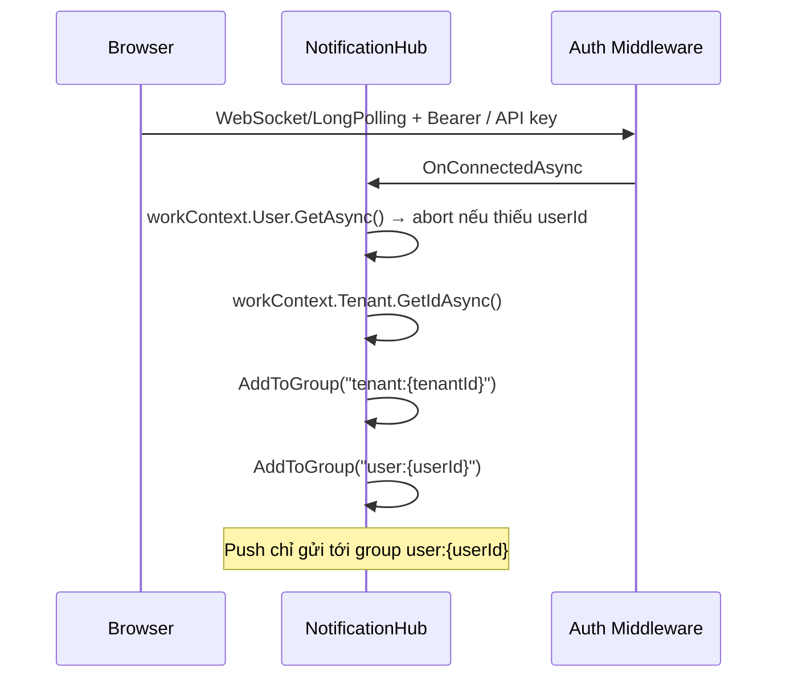
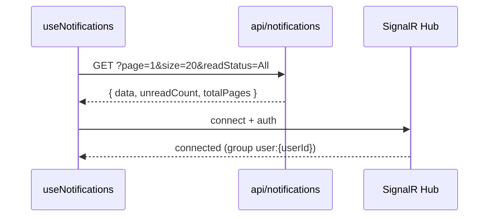

# Notifications Module

Module thông báo realtime cho Jarvis: lưu lịch sử trên Redis, đẩy sự kiện qua SignalR, và cung cấp UI React (`@jarvis/notifications`) để người dùng xem, lọc, đánh dấu đã đọc.

**Boundary ADR (hiện hành):** [2026-08-12-adr-jarvis-realtime-inbox-boundary](../../ADRs/2026-08-12-adr-jarvis-realtime-inbox-boundary.md) — Framework = `Jarvis.Realtime` / `.SignalR`; Module = inbox (Phase 3 move).

## Tổng quan kiến trúc

```
┌─────────────────────────────────────────────────────────────────────────┐
│                         Host Application (Sample)                         │
├─────────────────────────────────────────────────────────────────────────┤
│  Business code ──► INotificationAppService.NotifyUserAsync(message)     │
│                           │                                             │
│                           ▼                                             │
│              ┌────────────────────────────┐                             │
│              │   NotificationAppService   │  ← IWorkContext<CurrentUserInfo> │
│              └─────────────┬──────────────┘                             │
│                            │                                            │
│              ┌─────────────┴──────────────┐                             │
│              ▼                            ▼                             │
│     RedisNotificationStore          HubRealtimeNotifier                 │
│              │                            │                             │
│              ▼                            ▼                             │
│           Redis                   NotificationHub                       │
│     (persist + index)             (group user:{userId})               │
└─────────────────────────────────────────────────────────────────────────┘
              ▲                            │
              │ REST                       │ WebSocket / Long Polling
              │                            ▼
┌─────────────┴───────────────────────────────────────────────────────────┐
│                    Frontend (@jarvis/notifications)                   │
│  useNotifications ──► REST /api/notifications                           │
│                    ──► SignalR /hubs/notifications (event: notification)  │
│  NotificationBell / NotificationCenter                                  │
└─────────────────────────────────────────────────────────────────────────┘
```


### Thành phần


| Package / Assembly                   | Đường dẫn                                    | Vai trò                                                 |
| ------------------------------------ | -------------------------------------------- | ------------------------------------------------------- |
| `Jarvis.Realtime`                  | `frameworks/Jarvis.Realtime/`              | Options, `AddCoreRealtime`, `IRealtimeNotifier`         |
| `Jarvis.Realtime.SignalR`          | `frameworks/Jarvis.Realtime.SignalR/`      | Hub, `UseSignalR`, `MapRealtimeHub`, backplane          |
| `Jarvis.Notifications`             | `frameworks/Jarvis.Notifications/`         | Inbox contracts + `NotificationAppService` (tạm Phase 2)|
| `Jarvis.Notifications.Redis`       | `frameworks/Jarvis.Notifications.Redis/`   | `RedisNotificationStore`, `UseRedisStore` (tạm)         |
| `Jarvis.Modules.Notifications.Api` | `Jarvis.Modules.Notifications.Api/`        | REST `api/notifications`, `AddNotificationModule()`     |
| `@jarvis/notifications`            | `frontend/`                                  | Hook React, API client, UI bell/center                  |


Namespace C#: `Jarvis.Realtime.*`, `Jarvis.Notifications.*` (inbox), `Module.Notifications.*`.

---


## Cấu trúc thư mục

```
modules/notifications/
├── Docs/
│   ├── ADR.md
│   └── SAD.md
├── Jarvis.Modules.Notifications.Api/   # REST controller + module registration
│   ├── Controllers/NotificationsController.cs
│   ├── Extensions/NotificationModuleExtensions.cs
│   └── Models/
└── frontend/                             # npm @jarvis/notifications
    └── src/features/notifications/
        ├── hooks/useNotifications.ts
        ├── services/api.ts
        ├── components/
        └── config/index.ts

frameworks/Jarvis.Realtime.SignalR/  # (ngoài thư mục module)
├── Hubs/NotificationHub.cs
├── Services/HubRealtimeNotifier.cs
├── Groups/RealtimeGroupNames.cs
└── Extensions/
```

---


## Backend


### 1. Đăng ký module (Host)

Host application **tự gọi** SignalR, map hub và đăng ký work context (`IWorkContext<TUser>`). Module Notifications chỉ đăng ký controller.

```csharp
// Program.cs — Sample (phương án A: AddCoreCurrentContext)
builder.AddCoreDomain();
builder.AddCoreCurrentContext<CurrentUserInfo>();
builder.Services.TryAddSingleton<ICurrentUserFactory<CurrentUserInfo>, CurrentUserInfoFactory>();
builder.AddEntityFramework(); // ITenantIdResolverFactory cho ICurrentTenant

builder.AddNotificationModule();   // đăng ký NotificationsController
builder.AddCoreRealtime()
    .UseSignalR()
    .UseRedisStore()
    .AddNotificationAppServiceWithRealtime<CurrentUserInfo, CurrentTenantInfo>();

// Sau UseAuthentication / UseAuthorization
app.MapControllers();
app.MapRealtimeHub<CurrentUserInfo, CurrentTenantInfo>();
```

**Lưu ý:** `AddNotificationModule()` **không** gọi `AddCoreRealtime()` / `UseSignalR()` / `MapRealtimeHub` — trách nhiệm thuộc Host.

### 2. Cấu hình (`appsettings.json`)

```json
{
  "Realtime": {
    "SignalR": {
      "HubPath": "/hubs/notifications",
      "UseRedisBackplane": false,
      "Redis": {
        "Configuration": "127.0.0.1:6379",
        "ChannelPrefix": "jarvis-realtime"
      }
    }
  },
  "SignalR": {
    "Store": {
      "Configuration": "127.0.0.1:6379",
      "KeyPrefix": "signalr:notification",
      "RetentionDays": 20
    }
  }
}
```


| Cấu hình                   | Ý nghĩa                                                        |
| -------------------------- | -------------------------------------------------------------- |
| `Store.Configuration`      | Redis cho notification store (fallback: `Redis.Configuration`) |
| `Store.RetentionDays`      | Thời gian giữ notification (mặc định 20 ngày)                  |
| `UseRedisBackplane = true` | Scale-out nhiều instance SignalR qua Redis backplane           |


Host **phải gọi rõ** `.UseRedisStore()` — extension fail-fast nếu thiếu `SignalR:Store:Configuration` (hoặc fallback `SignalR:Redis:Configuration`).

### 3. Xác thực & phân quyền

Host chịu trách nhiệm bật Auth.

Tenant/user scope resolve qua `IWorkContext<CurrentUserInfo>` — `User.GetAsync()` và `Tenant.GetIdAsync()` (không nhận `userId`/`tenantId` từ client):


| Scope     | Nguồn (Sample)                                                                 |
| --------- | ------------------------------------------------------------------------------ |
| User ID   | `ICurrentUser<CurrentUserInfo>` — claim `NameIdentifier` / `sub` (GUID bắt buộc) |
| Tenant ID | `ICurrentTenant` — ambient → `ITenantIdResolverFactory` (claim/header/…) → `Guid.Empty` |


Thiếu user id → REST trả `401` / Hub `Context.Abort()`.

### 4. Luồng gửi thông báo (Producer)

```mermaid
sequenceDiagram
    participant Biz as Business Service / Controller
    participant App as NotificationAppService
    participant Store as RedisNotificationStore
    participant Notifier as HubSignalRNotifier
    participant Hub as NotificationHub
    participant Client as Browser (SignalR client)

    Biz->>App: NotifyUserAsync(message)
    App->>App: RequireContextAsync → tenantId, userId
    App->>App: Enrich (NotificationId v7, NormalizeData, CreatedAtUtc)
    App->>Store: SaveAsync
    Store->>Store: Redis transaction (item + index + unread)
    App->>Notifier: PublishToUserAsync(userId, enriched)
    Notifier->>Hub: Clients.Group("user:{userId}").SendAsync("notification", ...)
    Hub->>Client: event "notification"
    Note over App: Push lỗi → log warning; data vẫn trên Redis
```


**Ví dụ gửi cho user đang đăng nhập** (`Sample/Controllers/SignalRDemoController.cs`):

```csharp
// POST /api/signalr-demo/me
await notifications.NotifyUserAsync(new SignalRNotificationMessage
{
    Type = "comment",
    Title = "Ai đó đã bình luận",
    Body = "Nội dung bình luận...",
    Data = JsonSerializer.SerializeToElement(new
    {
        actionUrl = "/posts/123",
        actorName = "Nguyễn Văn A",
        actorAvatarUrl = "https://..."
    })
}, cancellationToken);
```

**Gửi nhiều user trong tenant hiện tại:**

```csharp
await notifications.NotifyUsersAsync(userIds, message, cancellationToken);
```

Fan-out song song, tối đa **16 concurrent** recipients.

**Lưu ý** `[FromBody]` **với Newtonsoft:** bind `data` qua **POCO** rồi `JsonSerializer.SerializeToElement` — không bind trực tiếp `JsonElement?`.

#### Payload `SignalRNotificationMessage`


| Field            | Bắt buộc | Mô tả                                                             |
| ---------------- | -------- | ----------------------------------------------------------------- |
| `Type`           | ✓        | Loại nghiệp vụ (`comment`, `security`, `friend`, …) — FE map icon |
| `Title`          | ✓        | Tiêu đề hiển thị                                                  |
| `Body`           |          | Nội dung tóm tắt                                                  |
| `Data`           |          | JSON metadata (`actionUrl`, `actorName`, `imageUrl`, …)           |
| `NotificationId` |          | Tự sinh GUID v7 nếu để trống                                      |
| `CreatedAtUtc`   |          | Mặc định `UtcNow`                                                 |


Field `Data` dùng `JsonElementNewtonsoftConverter` để REST host Newtonsoft trả embedded JSON đúng (không `{ "valueKind": 1 }`).

### 5. SignalR Hub — kết nối client




- **Client method name:** `"notification"` (`SignalRDefaults.ClientMethodName`)
- **Group naming:** `user:{guid}`, `tenant:{guid}`


### 6. Lưu trữ Redis

Mỗi notification của user dùng hash tag `{tenantId:userId}` (Redis Cluster).


| Key pattern                        | Kiểu          | Mục đích                            |
| ---------------------------------- | ------------- | ----------------------------------- |
| `{prefix}:{tenant:user}:item:{id}` | String (JSON) | Nội dung + trạng thái đọc           |
| `{prefix}:{tenant:user}:index`     | Sorted Set    | Toàn bộ (score = `CreatedAtUtc` ms) |
| `{prefix}:{tenant:user}:unread`    | Sorted Set    | Chưa đọc                            |
| `{prefix}:{tenant:user}:read`      | Sorted Set    | Đã đọc                              |


Prefix mặc định: `signalr:notification`.

**Luồng chính:**

- **SaveAsync:** SET item + ZADD index/unread + prune retention
- **MarkReadAsync:** MGET items → cập nhật JSON → chuyển unread → read
- **ListAsync:** ZRANGE theo filter → MGET → dọn orphan khi item hết TTL


### 7. REST API

Base path: `/api/notifications` — tất cả `[Authorize]`.


| Method | Path                              | Mô tả                  |
| ------ | --------------------------------- | ---------------------- |
| `GET`  | `/api/notifications`              | Danh sách phân trang   |
| `GET`  | `/api/notifications/{id}`         | Chi tiết               |
| `GET`  | `/api/notifications/unread-count` | Số chưa đọc            |
| `PUT`  | `/api/notifications/read`         | Đánh dấu đã đọc        |
| `PUT`  | `/api/notifications/unread`       | Đánh dấu chưa đọc      |
| `PUT`  | `/api/notifications/read-all`     | Đánh dấu tất cả đã đọc |


**Query list:**

```text
GET /api/notifications?page=1&size=20&readStatus=All|Unread|Read
```

**Response list** (`NotificationListResult`):

```json
{
  "page": 1,
  "size": 20,
  "totalItems": 42,
  "totalPages": 3,
  "unreadCount": 5,
  "data": [
    {
      "notificationId": "019...",
      "type": "comment",
      "title": "...",
      "body": "...",
      "data": { "actionUrl": "/documents", "actorName": "Demo User" },
      "isRead": false,
      "readAtUtc": null,
      "createdAtUtc": "2026-07-31T10:00:00Z",
      "expiresAtUtc": "2026-08-20T10:00:00Z"
    }
  ]
}
```

Tenant/user lấy từ work context — client **không** gửi scope trên query.

---


## Frontend

Package npm: `@jarvis/notifications`  
Source: `frontend/`

### 1. Cài đặt & tích hợp Host

**Dependencies (peer):** `react`, `@microsoft/signalr`, `@jarvis/core`, `lucide-react`

```tsx
// Sample/clients/web/src/main.tsx
import { configureNotificationAuth } from '@jarvis/notifications'
import { getAccessToken, setupSampleAccountAuth } from './auth'

setupSampleAccountAuth()
configureNotificationAuth(getAccessToken)
```

```tsx
// App.tsx — chuông trên header
import { NotificationBell } from '@jarvis/notifications'
import '@jarvis/notifications/styles.css'

<Header notificationSlot={<NotificationBell />} />
```

**Biến môi trường (tùy chọn):**


| Biến                        | Mặc định              | Mô tả                            |
| --------------------------- | --------------------- | -------------------------------- |
| `VITE_NOTIFICATION_API_URL` | `/api/notifications`  | Base REST                        |
| `VITE_NOTIFICATION_HUB_URL` | `/hubs/notifications` | SignalR hub URL                  |
| `VITE_NOTIFICATION_API_KEY` | (trống)               | Demo — dùng `X-API-KEY` thay JWT |


### 2. Thành phần UI


| Component            | Mô tả                                             |
| -------------------- | ------------------------------------------------- |
| `NotificationBell`   | Icon chuông + badge + popover                     |
| `NotificationCenter` | List, filter, expand, **mở liên kết** `actionUrl` |
| `useNotifications`   | State, REST + SignalR, optimistic mutations       |


`NotificationBell` truyền `controller={notifications}` vào `NotificationCenter` để **tránh double fetch**.

### 3. Luồng khởi tạo (FE mount)




Hook chạy song song REST load và SignalR subscribe. SignalR lỗi → REST vẫn dùng được.

### 4. Metadata `data` cho UI


| Field            | Dùng cho                                                      |
| ---------------- | ------------------------------------------------------------- |
| `actionUrl`      | Icon link khi hover, menu, nút **"Mở liên kết"** — mở tab mới |
| `actorName`      | Tên người gửi, initials avatar                                |
| `actorAvatarUrl` | Ảnh đại diện                                                  |
| `imageUrl`       | Preview ảnh trong row                                         |


Icon theo `type`: `comment` → MessageCircle, `friend` → UserPlus, `security` → ShieldCheck, mặc định → Bell.

### 5. Xác thực FE


| Mode           | REST                            | SignalR                    |
| -------------- | ------------------------------- | -------------------------- |
| JWT            | `Authorization: Bearer {token}` | `accessTokenFactory`       |
| API Key (demo) | `X-API-KEY`                     | Long Polling + `X-API-KEY` |


---


## Luồng end-to-end (tóm tắt)

```
1. User đăng nhập → JWT/API key → `IWorkContext<CurrentUserInfo>` có userId (+ tenantId)
2. FE mount NotificationBell
   ├── REST: GET page=1, readStatus=All → data + unreadCount
   └── SignalR: connect hub → join group user:{userId}
3. Business event → NotifyUserAsync(message)
   ├── Redis: persist
   └── SignalR: push "notification" → FE cập nhật ngay
4. User expand item / click actionUrl
   ├── markRead → PUT /read
   └── actionUrl → window.open (tab mới)
5. Refresh trang → REST load lại từ Redis (trong retention)
```

---


## Mở rộng & lưu ý vận hành


### Scale-out nhiều instance API

Bật `SignalR:UseRedisBackplane: true`. Load balancer nên **sticky session** cho path hub. REST `/api/notifications` không bắt buộc sticky.

Store và backplane có thể dùng chung hoặc tách `Store:Configuration`.

### Demo trong Sample


| Endpoint                            | Mục đích                           |
| ----------------------------------- | ---------------------------------- |
| `POST /api/signalr-demo/me`         | Gửi notification cho user hiện tại |
| `NotificationBell` trong Sample web | UI tích hợp sẵn                    |


**Body demo có link:**

```json
{
  "type": "comment",
  "title": "Test open link",
  "body": "Hover row để thấy icon link.",
  "data": {
    "actionUrl": "/documents",
    "actorName": "Demo User"
  }
}
```

Sau khi sửa framework DLL, **restart Sample API** để load assembly mới.

---


## API surface cho developer


### Backend — inject service

```csharp
public class MyService(INotificationAppService notifications)
{
    public Task NotifyCurrentUserAsync(string title, CancellationToken ct) =>
        notifications.NotifyUserAsync(new SignalRNotificationMessage
        {
            Type = "system",
            Title = title
        }, ct);

    public Task NotifyManyAsync(IEnumerable<Guid> userIds, string title, CancellationToken ct) =>
        notifications.NotifyUsersAsync(userIds, new SignalRNotificationMessage
        {
            Type = "system",
            Title = title
        }, ct);
}
```


### Frontend — dùng hook trực tiếp

```tsx
import { useNotifications, NotificationCenter } from '@jarvis/notifications'

function NotificationsPage() {
  const notifications = useNotifications()
  return <NotificationCenter variant="page" controller={notifications} />
}
```


### Export chính từ `@jarvis/notifications`

- **Components:** `NotificationBell`, `NotificationCenter`
- **Hook:** `useNotifications`
- **Services:** `getNotifications`, `markNotificationsRead`, `markNotificationsUnread`, `markAllNotificationsRead`
- **Config:** `configureNotificationAuth`, `notificationApiBase`, `notificationHubUrl`

---


## Build frontend package

```bash
cd modules/notifications/frontend
npm install
npm run build          # tsup → dist/
npm run dev            # Vite demo standalone
```

Import CSS trong host app:

```ts
import '@jarvis/notifications/styles.css'
```

