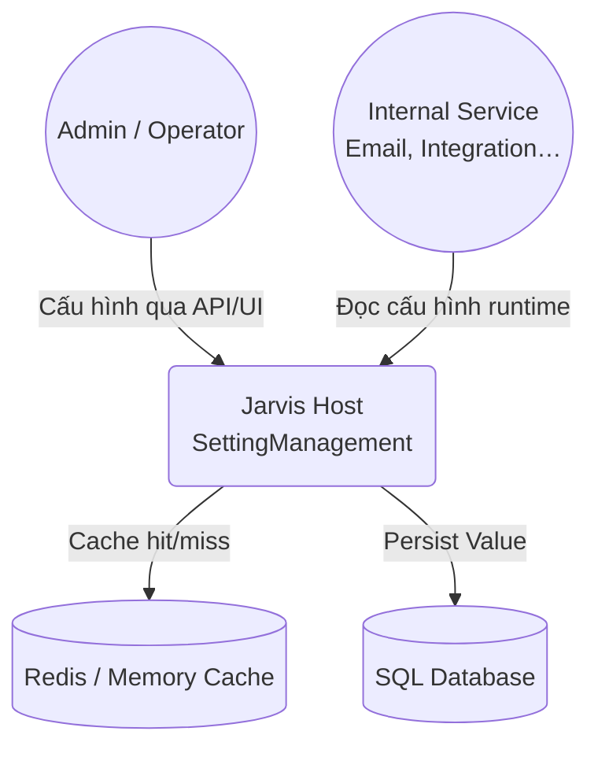
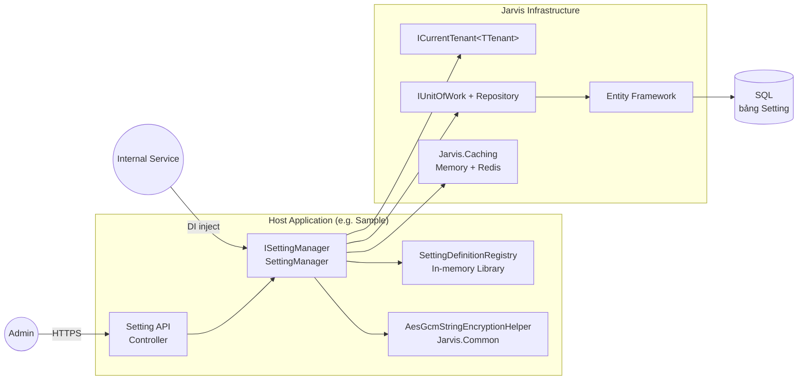
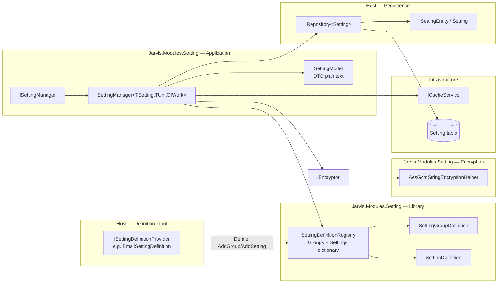
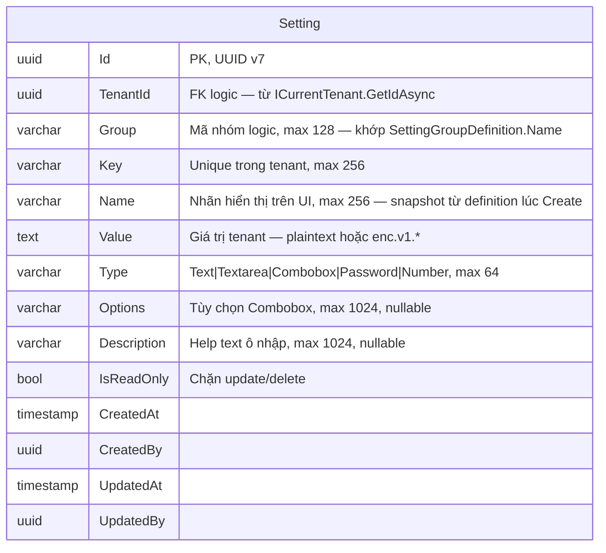

# SAD SettingManagement

## 1. Requirement

Hệ thống đa khách hàng (multi-tenant) cần một chức năng quản lý cấu hình tập trung (**SettingManagement**). Mỗi khách hàng (tenant) có thể lưu và thay đổi các thông số vận hành của mình — ví dụ cấu hình gửi email, kết nối hệ thống bên ngoài, tham số nghiệp vụ — mà không phụ thuộc vào cấu hình cứng của toàn hệ thống.

Người quản trị cấu hình trên giao diện; các chức năng khác trong hệ thống (ví dụ gửi email) đọc lại các giá trị đã lưu để vận hành. Thông tin nhạy cảm (mật khẩu, khóa truy cập…) phải được bảo mật khi lưu trữ; khi hiển thị hoặc sử dụng thì người dùng / hệ thống nhận giá trị bình thường (đã giải mã). Danh mục cấu hình nào được phép dùng (nhóm, tên trường, kiểu nhập liệu, giá trị mặc định…) do đội phát triển khai báo sẵn theo sản phẩm; giá trị thực tế do từng khách hàng tự thiết lập khi vận hành.

Giả định:

1. Hệ thống phục vụ khoảng 1.000 khách hàng; mỗi khách hàng có khoảng 50–100 mục cấu hình đã được định nghĩa sẵn
2. Tổng số bản ghi cấu hình khoảng 50.000–100.000 (mỗi mục cấu hình của mỗi khách hàng là một bản ghi)
3. Mỗi ngày phát sinh khoảng 500 lần tạo/sửa cấu hình trên toàn hệ thống
4. Lúc cao điểm có khoảng 200 lần đọc cấu hình mỗi giây (từ màn hình quản trị và từ các chức năng nội bộ)
5. Lúc cao điểm có khoảng 20 lần ghi cấu hình mỗi giây
6. Phân quyền, xác định khách hàng đang thao tác, và ghi nhật ký thay đổi do các phần khác của hệ thống đảm nhiệm — SettingManagement chỉ tập trung vào định nghĩa danh mục và lưu/đọc giá trị cấu hình

Yêu cầu chức năng:

1. Hệ thống có danh mục cấu hình theo nhóm (ví dụ nhóm Email) và từng mục cấu hình (ví dụ Host, Port, Mật khẩu), kèm thông tin hiển thị trên form: tên nhãn, kiểu nhập, danh sách lựa chọn, giá trị mặc định, cho phép sửa hay không, có cần bảo mật hay không
2. Mỗi mục cấu hình của mỗi khách hàng được lưu thành một bản ghi riêng; không trùng mã cấu hình trong cùng một khách hàng
3. Người dùng / hệ thống có thể xem danh sách nhóm, xem danh sách mục cấu hình, đọc giá trị, tạo mới, cập nhật, xóa; nếu chưa có giá trị thì có thể tự tạo từ giá trị mặc định
4. Giá trị nhạy cảm được mã hóa khi lưu; khi đọc qua chức năng quản lý cấu hình thì nhận giá trị đã giải mã
5. Đọc cấu hình được hỗ trợ bộ nhớ đệm để tăng tốc; khi tạo/sửa/xóa thì bộ nhớ đệm được làm mới
6. Mục cấu hình đánh dấu chỉ đọc thì không cho sửa hoặc xóa
7. Thông tin danh mục (nhóm, nhãn, kiểu form…) lấy từ định nghĩa sẵn của sản phẩm, không phụ thuộc dữ liệu đã lưu của từng khách hàng
8. Việc tạo bảng/lưu trữ dữ liệu do ứng dụng triển khai tự quản lý; module SettingManagement không tự phát hành thay đổi cấu trúc dữ liệu
9. Password/setting mã hóa: giá trị rỗng hoặc chỉ whitespace không được persist và không được mã hóa (`98107`); client bỏ key khỏi payload SaveGroup nếu không đổi secret; setting thông thường vẫn cho phép lưu chuỗi rỗng
10. `GetOrCreateAsync` phải an toàn khi nhiều request cùng tạo một key: request thua unique race đọc và trả về bản ghi đã được request khác tạo

## 2. Decision

### 2.1. Kiến trúc

- **Atomic Module Pattern**: `Jarvis.Modules.Setting` là package độc lập, phụ thuộc `Jarvis.DDD.Domain` (contract), `Jarvis.Caching`, `Jarvis.DDD.Domain.Shared` (exception). Host cung cấp entity concrete + `IUnitOfWork`.
- **Tách Library và Persistence**:
  - **Library** (in-memory registry): catalog Group/Key + metadata — trả lời *"hệ thống có những cấu hình nào?"*
  - **Database**: giá trị runtime theo tenant — trả lời *"tenant này đang dùng giá trị gì?"*
- **Facade qua `ISettingManager`**: UI và service nghiệp vụ **không** query `DbSet<Setting>` trực tiếp; mọi đọc/ghi đi qua manager (cache, encrypt, validation).
- **Phạm vi giới hạn**: Module chỉ làm SettingManagement. Authorization, tenant resolution (R2), audit log nằm ở tầng host — manager đọc working tenant qua `ICurrentTenant<TTenant>` (không `IWorkContext`, không đọc TenantId từ UoW).

```text
  [Authorization]   [Multitenancy]   [Audit]   [UI]
         │                │             │        │
         └────── không nằm trong Jarvis.Modules.Setting ──────┘
                          │
                          ▼
                   ISettingManager
              (định nghĩa + lưu/đọc Value)
                          │
              ┌───────────┴───────────┐
              ▼                       ▼
        Library (RAM)            SQL Setting
        + Cache (Redis)          + Encrypt at rest
```

### 2.2. C4

#### Level 1: Context



`SettingManagement` (qua `ISettingManager`) đóng vai trò trung tâm cho mọi thao tác đọc/ghi cấu hình tenant-scoped. Admin cấu hình qua API host; service nội bộ (ví dụ loader SMTP) gọi `GetOrCreateAsync` mà không biết chi tiết DB hay mã hóa.

#### Level 2: Container



Host đăng ký `AddCurrentUser` + `AddCurrentTenant` (không `IWorkContext`), API (tùy chọn), `ISettingDefinitionProvider`, entity `Setting : ISettingEntity`. Module cung cấp manager, registry, encryptor.

#### Level 3: Component

`Jarvis.Modules.Setting` gồm các thành phần chính: **Library**, **Manager**, **Encryptor**, **DI Extensions**.



**Library (`SettingDefinitionRegistry`)**

- Khởi tạo lúc startup: gọi `Define()` trên mọi `ISettingDefinitionProvider` đã đăng ký
- Lưu `SettingGroupDefinition` và `SettingDefinition` trong dictionary in-memory
- API đọc: `GetGroups()`, `GetSettings(group?)`, `GetSetting(key)`
- Mặc định `Type = Password` → `IsEncrypted = true`

**Manager (`SettingManager<TSetting, TUnitOfWork, TTenant>`)**

- `GetAsync`: cache `Tenant+Key` → miss thì query DB → decrypt → trả `SettingModel`
- `GetByGroupAsync`: query DB theo `Group` (không cache theo group)
- `CreateAsync`: validate definition tồn tại → kiểm tra duplicate key → encrypt nếu cần → insert → invalidate cache. Nếu insert đồng thời thua unique `(TenantId, Key)`, lỗi persistence được chuẩn hóa thành `ConflictException` / `KeyAlreadyExists`
- `GetOrCreateAsync`: Get hoặc Create từ definition; nếu một request khác tạo cùng key trước, bắt conflict, đọc lại và trả về bản ghi thắng race thay vì báo lỗi cho caller
- `UpdateAsync`: yêu cầu definition trong Library; chặn `IsReadOnly` (entity hoặc definition); secret rỗng → `98107`; persist rồi invalidate cache
- `SaveGroupAsync`: partial upsert các key được gửi lên; chặn `IsReadOnly` (definition hoặc entity); secret rỗng → `98107`
- `DeleteAsync`: chặn `IsReadOnly` (entity hoặc definition) → xóa DB → invalidate cache
- `RequireTenantIdAsync`: `ICurrentTenant<TTenant>.GetIdAsync()` (ambient / R2) — thiếu tenant → `TenantRequired`

**Quy ước secret**

```text
Password / IsEncrypted:
- Ghi: chỉ Encrypt khi plaintext non-empty; rỗng/whitespace → 98107 (không lưu)
- Đọc: Decrypt → trả plaintext cho caller
- Muốn giữ secret cũ khi SaveGroup: bỏ key khỏi payload (partial upsert)
```

**Kiểm soát race trong `GetOrCreateAsync`**

```text
Request A: Get → missing ─┐
                          ├─ Create cùng (TenantId, Key)
Request B: Get → missing ─┘

Request thắng  → insert + trả bản ghi mới
Request thua   → unique conflict → Get lại → trả cùng bản ghi
```

Unique index `(TenantId, Key)` tại database vẫn là hàng rào cuối cùng. Kiểm tra `AnyAsync` trước insert chỉ tối ưu thông báo lỗi, không thay thế unique constraint.

**Encryptor (`AesGcmStringEncryptionHelper` — `Jarvis.Common`)**

- Encrypt: random nonce 12 byte + AES-GCM tag 16 byte → prefix `enc.v1.`
- Decrypt: nhận diện prefix hoặc definition `IsEncrypted` / type `Password`
- Key từ `EncryptionOptions.DataEncryptionKey` (section `Encryption`) — helper static, không DI

**DI (`JarvisSettingExtensions`)**

```csharp
builder.AddCurrentTenant<CurrentTenantInfo>(); // + store host
builder.AddJarvisCaching();
builder.AddCoreSetting()
    .UseEntityFramework<IMasterUnitOfWork, CurrentTenantInfo>()
    .AddProvider<EmailSettingDefinition>();
```

### 2.3. Metadata hiển thị UI

Metadata phục vụ dựng form cấu hình chia **hai cấp**: Group (nhóm) và Key (từng ô cấu hình). UI đọc metadata qua `GetGroups()` / `GetDefinitions()` (Library) và giá trị qua `GetAsync` / `GetByGroupAsync` (DB).

#### Cấp Group — chỉ trong Library (`SettingGroupDefinition`)

| Thuộc tính | Ý nghĩa trên UI | Lưu DB? |
|------------|-----------------|---------|
| `Name` | Mã nhóm logic (vd. `Email`); khớp cột `Setting.Group` khi persist row | Chỉ lưu `Group` (string), **không** lưu metadata nhóm |
| `DisplayName` | Nhãn hiển thị nhóm: tiêu đề section, tab, mục menu (vd. *"Email"*, *"Cấu hình SMTP"*) | **Không** |
| `Order` | Thứ tự sắp xếp khi liệt kê nhiều nhóm (`GetGroups()` sort theo `Order` rồi `Name`) | **Không** |
| `Description` | Mô tả ngắn / tooltip cho cả nhóm cấu hình | **Không** |

**Vì sao `DisplayName`, `Order`, `Description` không lưu DB:**

1. **Dùng chung mọi tenant** — nhãn và thứ tự nhóm giống nhau trên toàn hệ thống; không có giá trị riêng theo tenant.
2. **Code-first, version cùng codebase** — thay đổi nhãn nhóm đi kèm deploy provider; review qua PR, không cần migration DB.
3. **Tránh trùng lặp** — nếu lưu DB sẽ duplicate cùng một bộ metadata trên mọi row thuộc group, hoặc cần thêm bảng `SettingGroup` chỉ để hiển thị.
4. **Rebuild lúc startup** — `SettingDefinitionRegistry` nạp lại từ `ISettingDefinitionProvider` mỗi lần khởi động; `GetGroups()` không query DB.

DB chỉ cần cột `Group` (mã logic) để gom row và `GetByGroupAsync`; UI lấy `DisplayName` / `Order` / `Description` từ `GetGroups()` khi vẽ khung form.

#### Cấp Key — Library + snapshot vào DB khi tạo row

| Thuộc tính | Ý nghĩa trên UI | Nguồn khi vẽ form |
|------------|-----------------|-------------------|
| `Name` | **Nhãn hiển thị bên cạnh ô nhập** (vd. *"Host"*, *"Mật khẩu"*) — đây là cột user nhìn thấy trên UI, không phải `Key` | Library (`SettingDefinition.Name`); khi đã có row thì đọc từ `SettingModel.Name` / `ISettingEntity.Name` |
| `Type` | Kiểu control: Text, Number, Password, Combobox… | Tương tự — definition hoặc snapshot trên row |
| `Options` | Danh sách lựa chọn Combobox (`true:Yes\|false:No`) | Tương tự |
| `Description` | Gợi ý / help text dưới ô nhập | Tương tự |
| `Key` | Định danh kỹ thuật (`Email.Host`) — dùng API, **không** hiển thị làm label chính | Library + DB |
| `Value` | Giá trị tenant đang cấu hình | Chỉ DB (qua Manager) |

Khi `CreateAsync`, Manager **copy** `Name`, `Type`, `Options`, `Description`, `IsReadOnly` từ `SettingDefinition` sang row DB — snapshot tại thời điểm tạo. Nhờ đó `GetByGroupAsync` trả đủ thông tin vẽ form mà không phải join lại Library cho từng key; đổi definition sau deploy chỉ ảnh hưởng row **mới tạo** (row cũ giữ snapshot cũ).

```text
  UI — màn hình cấu hình Email
  ┌─ DisplayName: "Email"          ← SettingGroupDefinition (Library)
  │  Description: "SMTP…"          ← SettingGroupDefinition (Library)
  │
  │  Name: "Host"        [smtp…]     ← Setting.Name (DB) + Value
  │  Name: "Port"        [587]       ← Setting.Name (DB) + Value
  │  Name: "Password"    [••••]      ← Setting.Name (DB) + Value
  └─
```

### 2.4. ERD

Bảng `Setting` lưu **giá trị runtime** và **snapshot metadata cấp Key** (`Name`, `Type`, `Options`, `Description`). Metadata cấp Group (`DisplayName`, `Order`, `Description` của nhóm) **không** có trong ERD.



**Ràng buộc (do host map EF):**

- Unique index: `(TenantId, Key)`
- Index: `(TenantId, Group)` — hỗ trợ `GetByGroupAsync`
- `Value` required; ciphertext khi `IsEncrypted` hoặc type `Password`

**Luồng dữ liệu Library vs DB:**

```text
  LIBRARY (dùng chung mọi tenant)          DATABASE (theo tenant)
  ─────────────────────────────           ──────────────────────
  Group Email: DisplayName, Order, Desc     Group = "Email" (chỉ mã logic)
  Email.Host | Name=Host | Type=Text        Tenant A: Name=Host, Value=smtp.a.com
  Email.Password | Name=Password | enc      Tenant A: Name=Password, Value=enc.v1.xxx
  Email.EnableSsl | Options=true:Yes|…      Tenant B: cùng Key, Value khác nhau
```

## 3. Consequences

### 3.1. Pros

- Tách bạch metadata (code-first Library) và giá trị runtime (DB) — dễ version definition qua deploy, giá trị độc lập theo tenant
- `ISettingManager` là single entry point — cache, encrypt, validation tập trung; consumer không lộ logic DB
- Mã hóa at rest cho field nhạy cảm; API trả plaintext có kiểm soát (chỉ caller đã auth ở host)
- Form có thể để trống password đã tồn tại mà không vô tình ghi đè secret
- `GetOrCreateAsync` hội tụ về một bản ghi khi có concurrent create, dựa trên unique constraint của host
- Cache theo key giảm tải DB cho đọc lặp lại (SMTP host, port…)
- Module atomic, tái sử dụng trên nhiều host; host tự chọn DB và schema migration
- `IsReadOnly` bảo vệ cấu hình hệ thống khỏi ghi nhầm
- UUID v7 thân thiện index/time-order

### 3.2. Cons

- Definition thay đổi cần **deploy code** (provider mới) — không dynamic runtime group/key
- `GetByGroupAsync` không cache — nhiều key trong group = nhiều round-trip DB hoặc decrypt
- Host phải tự implement entity, EF config, API, auth — module không “plug-and-play” full stack
- Không validate giá trị theo `Type`/`Options` ở Phase 0 — có thể lưu giá trị không hợp lệ
- Rotation `DataEncryptionKey` chưa hỗ trợ — đổi key cần re-encrypt thủ công
- Group metadata mất khi restart (chỉ RAM) — acceptable vì rebuild từ code mỗi startup

### 3.3. TechDebt

- Unit test: encrypt roundtrip, cache invalidate, `IsReadOnly`, duplicate key
- Unit test cho secret blank semantics trên `UpdateAsync` / `SaveGroupAsync` (existing vs create mới)
- Integration test concurrent `GetOrCreateAsync` với unique index thật
- Validate `Value` theo `Type` và `Options` khi Create/Update
- `Bulk GetOrCreate` theo Group — giảm round-trip runtime
- Rotation / multi-key `DataEncryptionKey` cho vận hành production
- Thêm `SettingValueTypes`: DateTime, DateRange, Toggle…
- Import/Export cấu hình JSON theo group
- Event khi Setting đổi (consumer tự invalidate dependency)
- Dynamic Group runtime (nếu product yêu cầu — hiện code-first)
- Metric/log: cache hit ratio, encrypt errors, latency per operation
- HTTP API trong Sample chưa có authorization demo — host production phải bảo vệ endpoint settings

## 4. Options considered

**Phương án đã chọn: Code-first Library + 1 Key = 1 row**

Definition trong `ISettingDefinitionProvider`; giá trị runtime trong bảng `Setting` (1 key = 1 row / tenant); mọi đọc/ghi qua facade `ISettingManager`.

- **Pros:**
  - Definition versioned cùng codebase; review qua PR
  - Giá trị tenant độc lập, query đơn giản (key lookup)
  - Tách rõ catalog (Library) vs giá trị (DB); encrypt/cache tại manager
  - Metadata Group (`DisplayName`, `Order`, `Description`) gọn trong RAM — không duplicate trên DB
  - `Name` cấp Key snapshot vào row — UI đọc label trực tiếp khi hiển thị form
  - Khớp pattern atomic module Jarvis
- **Cons:**
  - Thêm key mới cần deploy provider
  - Host phải wiring entity + UoW + cache config
  - Đổi `Name`/Type trên definition không tự cập nhật row đã tạo trước đó
